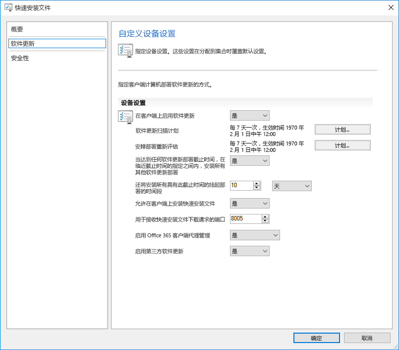
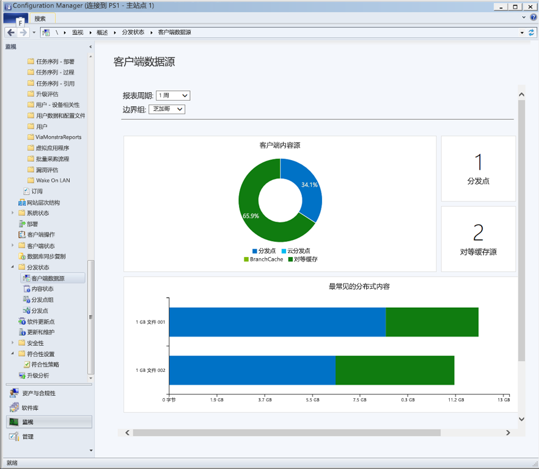
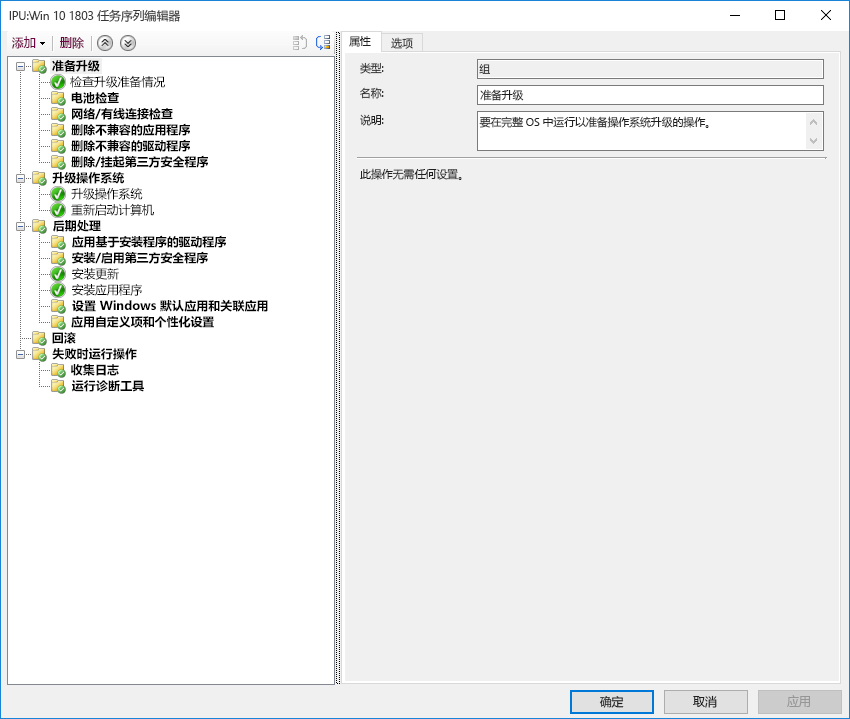

# 步骤 7：Windows 和 Office 服务

<table>
<thead>
<td></td>
<td>
<strong>步骤 7：Windows 和 Office 服务</strong>

Both Windows 10 and Microsoft 365 Apps for enterprise continually add new capabilities to keep bringing user experiences and security forward with the latest innovations. Learn how to stay current with semi-annual and monthly updates, how the new servicing model works and the tools and options you have.
</td>
<td></td>
</thead>
</table>

>[!NOTE]
>Windows 和 Office 服务是我们建议部署过程轮的第七步，其中涉及正在计划的准备半年功能更新的各个方面。。 若要查看的完整桌面部署过程，请访问[桌面部署中心](https://aka.ms/HowToShift)。
>

Windows 10 和 Microsoft 365 企业应用版都引入了新的服务选项、支持模型和更新时间线。 这些更改简化了保持最新功能的过程。 除了这些更新之外，还提供了新的配置选项，以支持满足你需求的服务计划。 了解如何准备半年频道更新，它们在 Windows 10 和 Microsoft 365 企业应用版中提供新特性和功能，并利用 Microsoft Endpoint Configuration Manager（当前分支）中的新功能。

[帮助客户过渡到 Windows 10 和 Microsoft 365 企业应用版](https://www.microsoft.com/microsoft-365/blog/2018/09/06/helping-customers-shift-to-a-modern-desktop/)

## 更新类型

更新分为两个主要类别：功能更新，然后是质量和安全更新，其中包含累积安全性、可靠性和 bug 修复。 在频率方面，Windows 和 Office 都提供了一个半年频道，在每年的 3 月和 9 月发布两次新功能，而质量和安全更新则是每月发布一次。 此外，Office 365 应用的独特之处在于，我们提供完全支持的当前频道选项，其中的更新同时包含新功能和质量更新。

如果你习惯了桌面 OS 和应用更新之间的更长的周期，你可能会思考；

  - 更新是否兼容？

  - 我需要继续对用户进行重新培训吗？

  - 有哪些风险？

为了回答这些问题以及更频繁地交付新功能的基本原理，我们将阐明此方法的一些优点

### 功能更新优势

First, we’ve moved away from the model of the past that would introduce huge waves of change around every three years to now incremental smaller changes with feature updates twice per year. Why? With technology trends moving so fast in addition to rapidly evolving security threats, this keeps experiences and protections current. Some of the security related updates for example can’t just be delivered by monthly security updates or antivirus signature files; they may be low-level changes platform, like virtualization-based security.

[Windows 即服务的快速指南](https://docs.microsoft.com/windows/deployment/update/waas-quick-start)

[通过使用 Windows 10 安全功能来缓解威胁](https://docs.microsoft.com/windows/security/threat-protection/overview-of-threat-mitigations-in-windows-10%20%20)

### 累积更新模型优势

Second delivering quality and security updates as a cumulative update package corrects many of the issues of the past. It used to be that you might pick and choose sometimes from a dozen updates or more each month for both Windows and Office. As you can imagine, this creates a nearly impossible set of test matrices for support. Also, if you install a version of Windows or Office that is a year or more old, it might take hours or sometimes days to apply all updates delivered since that version was released.

With the cumulative model, you’re always one update away from being current and in doing so the number of monthly updates that you need to deploy is reduced. Each update builds upon updates from previous months and contains all of the fixes that you need to get current. Cumulative updates are especially helpful when PCs has been turned off for several months because they are in storage waiting to be reassigned to a different user.

### 扩展更新验证

另一个优点是，在我们推出更新以实现广泛部署之前，我们会首先通过 [Office](https://products.office.com/office-insider?tab=Windows-Desktop) 和 [Windows](https://insider.windows.com/) 的预览体验计划发布内部版本，这让我们可以在广泛发布更新之前收集诊断数据和反馈。 目前，预览体验计划对所有人开放，这样可以预先了解更新。 当发布更新时，我们将从上百万个配置中接收诊断数据，因此当我们推出更新时，质量更易于预测

还有一点，由于 Microsoft 365 企业应用版预览体验计划内部版本反映了每月频道更新，因此如果针对 Office 使用半年频道来提供每年两次的功能更新（Windows 同样如此），则也可以使用半年企业频道（预览）版本来提前验证这些内部版本。

### 支持管理工具

We've also thought through how to make the deployment of updates seamless to you. Configuration Manager (Current Branch) is updated frequently to support the roll-out of these updates to Windows and Office and any new capabilities.

[使用 Configuration Manager 部署 Windows 10 更新](https://docs.microsoft.com/windows/deployment/update/waas-manage-updates-configuration-manager)

[使用 Configuration Manager 来管理 Microsoft 365 企业应用版](https://docs.microsoft.com/mem/configmgr/sum/deploy-use/manage-office-365-proplus-updates)

## Windows 和 Office 频道概述

Windows 10 提供三个服务频道：

- [**Windows 预览体验计划**](https://docs.microsoft.com/windows/deployment/update/waas-overview#windows-insider)适合于组织用于对下一次功能更新中所含的功能进行测试和提供反馈
- **半年度频道**每年提供两次的功能更新发布提供新功能
- **长期服务频道**专用于需要更长服务选项的特殊设备

Microsoft 365 提供 4 个服务频道：

- [**Office 预览体验计划**](https://products.office.com/office-insider)适合于组织用于对仍在开发中的最新 Office 特性和功能进行测试并提供反馈
- **当前频道**用于在最新 Office 功能推出后立即将其提供给用户
- **半年企业频道**每年只提供两次新功能和新特性
- **半年企业频道（预览）** 是 Office 的完全支持内部版本，支持试点用户和应用程序兼容性测试人员测试和验证下一个半年企业频道

有关 Windows 和 Office 服务频道的详细信息，请查阅以下文档：

- [Windows 即服务概述](https://docs.microsoft.com/windows/deployment/update/waas-overview#servicing-channels)
- [Microsoft 365 应用版更新通道概述](https://docs.microsoft.com/DeployOffice/overview-update-channels#BKMK_SAC)

## 分阶段部署更新

Now let’s shift gears to how you will roll out these updates. For any release, we recommend at least three deployment phases for IT – validation, piloting and broad production deployment. Once you’re up and running on Windows 10 and Microsoft 365 Apps for enterprise, you'll use monthly servicing to stay current with critical security and quality updates, then you’ll move to semi-annual servicing for new features.

### 每月更新

The service model is designed so you can choose to limit the roll-out of new features to twice per year, and if needed you can even skip a semi-annual update and continue receiving quality and security updates. As mentioned, the cumulative nature of monthly updates means each will increase in size per month.

#### 快速更新

Using a technology called "Express Updates" in Windows and Binary Delta Compression in Office, we can reduce the download size significantly. In both approaches, the update engines compare what’s on the PC and finds only the differentials needed to update what’s there.

[Windows 10 质量更新说明和增量更新结语](https://techcommunity.microsoft.com/t5/Windows-IT-Pro-Blog/Windows-10-quality-updates-explained-amp-the-end-of-delta/ba-p/214426)

适用于企业的 Windows 更新和 Windows Server Update Services 长期以来支持快速更新，但我们现在已将该支持扩展到 Microsoft Endpoint Configuration Manager（当前分支版本），这样它也可以使用快速更新。

#### 二进制增量压缩

只有在从 Microsoft 365 企业应用版的最新版本进行更新时，才能在 Office 中使用二进制增量压缩。因此，要使用这种方法，需要从之前的版本进行更新，而且不能跳过更新。

Windows and Office update channels can be managed via Configuration Manager using the standard approval and targeting process. Additionally, you can use policy settings in Office and Windows to enforce update channels used, as well as related settings.

### 半年更新

以上便是每月更新的注意事项，现在让我们继续讨论更大规模的半年更新。

正如我们在“设备和应用就绪情况”中所介绍的，你将希望使用我们在“部署过程轮”步骤 1 中设置的相同准备工具开始准备这些更大的更新。

As for tooling, you can use policy settings with Windows Update for Business, software update management via Microsoft Endpoint Configuration Manager (Current Branch), Windows Server Update Services (WSUS), or update policies set by Microsoft Intune. If you are concerned about network bandwidth, see Step 2: Directory and Network Readiness, to learn about your options to reduce network traffic via Delivery Optimization and other peer to peer caching technologies.

[Windows 半年频道](https://docs.microsoft.com/windows/deployment/update/waas-overview#semi-annual-channel)

[Microsoft 365 应用版的半年企业频道](https://docs.microsoft.com/DeployOffice/overview-update-channels#BKMK_SAC)

#### 升级任务序列

通过标准软件更新管理例程来安装更大的功能更新是受支持的选项，但是许多组织将会选择使用 Microsoft Endpoint Configuration Manager（当前分支版本）中的升级任务序列或 Microsoft Deployment Toolkit。

可通过任务序列在安装功能更新之前创建自定义检查或任务，并且可以在更新安装本身完成之后执行自定义任务 – 更新后任务可能包括更新期间暂停服务（如果需要）、驱动程序安装和更换、应用程序升级或任务栏和 Windows 10“开始”菜单的个性化设置。

If you’re already using task sequences to migrate your Windows 7 machines to Windows 10 and are well-versed with those tools, this is a great place to start and provides ultimate control. While you can use a single task sequence for the entire upgrade, it is quite common that organizations use two task sequences. One task sequence for making sure the machines are ready for the upgrade, that silently pre-stages all the required setup files on target computers, and one to do the actual upgrade. This approach ensures that your user productivity is less impacted.

[在 Configuration Manager 中创建升级 OS 的任务序列](https://docs.microsoft.com/mem/configmgr/osd/deploy-use/create-a-task-sequence-to-upgrade-an-operating-system)

#### 对功能更新的半年频道支持

[如 2018 年 9 月所宣布](https://www.microsoft.com/microsoft-365/blog/2018/09/06/helping-customers-shift-to-a-modern-desktop/)，半年频道更新的支持时间线将使用以下模型。

  - 从版本 1607 开始，所有目前支持的 Windows 10 企业版和教育版功能更新将自初始发布之日起提供 30 个月的支持。

  - 从 1809 开始，所有目标定在 9 月的未来功能更新将自发布之日起提供 30 个月的支持。

  - 从 1903 开始，所有目标定在 3 月的未来功能更新将自发布之日起继续提供 18 个月的支持。

  - Microsoft 365 企业应用版的半年更新可持续 18 个月

#### 任务序列之外的其他安装自动化选项

如果不使用升级任务序列，现在可以在预安装阶段（在安装程序运行其兼容性检查之前）或者在预提交阶段（在应用升级之前），在功能更新期间运行自定义操作或应用驱动程序文件。

[Windows 10 安装版本 1803 中的新增功能](https://docs.microsoft.com/windows/whats-new/whats-new-windows-10-version-1803%23windows-setup)

## 后续步骤 

## [步骤 8：用户通信和培训](https://aka.ms/mdd8)

## 上一步 

## [步骤 6：OS 部署和功能更新](https://aka.ms/mdd6)
