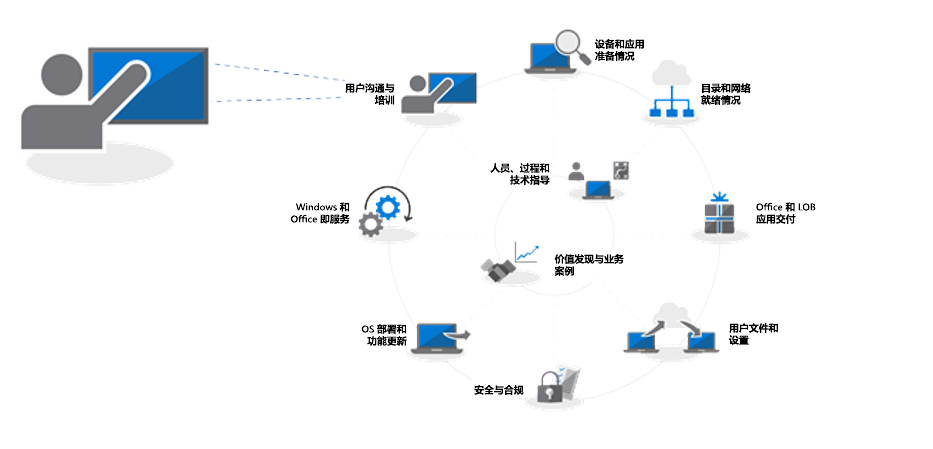
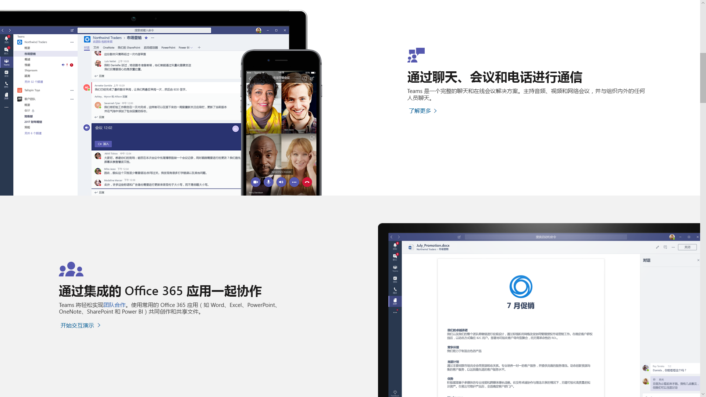
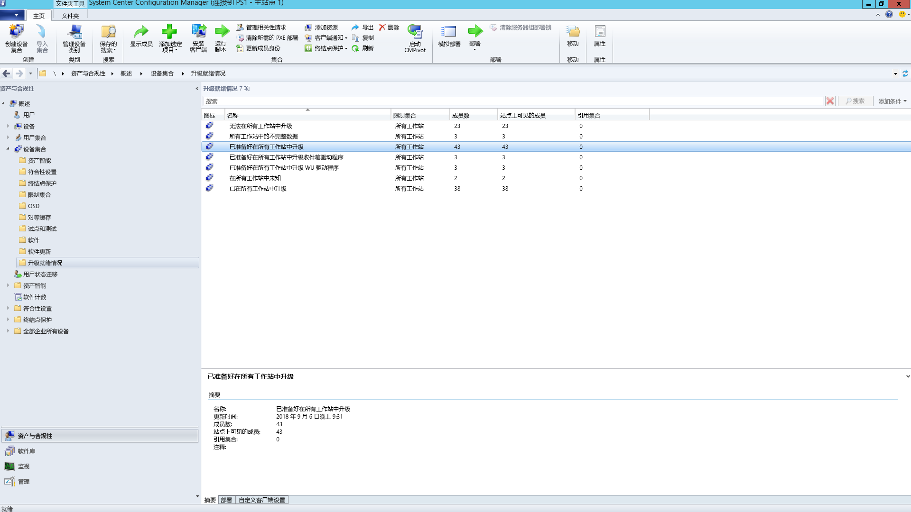

# 步骤 8：用户通信和培训Step 8: User Communications and Training

<table>
<thead>
<td></td>
<td>
<strong>步骤 8：用户通信和培训</strong><strong>Step 8: User Communication and Training</strong>

在将你的电脑切换至 Windows 10 和 Office 365 专业增强版后，确保你的用户了解新体验和新的工作方式。请了解如何利用用户采用帮助（通过 Microsoft FastTrack）、培训材料和通信模板，以及如何通过新方法来监控用户的接受和使用情况。Make sure your users are informed about new experiences and new ways of working as you shift your PCs to Windows 10 and Office 365 ProPlus. Learn how to take advantage of user adoption assistance with Microsoft FastTrack, training materials and communication templates, as well as new ways to monitor user acceptance and usage.
</td>
<td></td>
</thead>
</table>

>[!NOTE]
>用户通信和培训是我们建议的部署过程轮的第八步，它涵盖了通知用户并让其做好准备的提示和建议。User Communications and Training is the eighth step in our recommended deployment process wheel by covering tips and recommendations to inform and prepare users. 若要查看的完整桌面部署过程，请访问[桌面部署中心](https://aka.ms/HowToShift)。To see the full desktop deployment process, visit the [Desktop Deployment Center](https://aka.ms/HowToShift).
>

通知你的用户并让他们为跨 Office 365、Windows 10 和含有 Azure Active Directory 的新安全和和合规性控件的新式工作区体验做好准备，对于推动采用非常重要。Informing and preparing your users for modern workplace experiences spanning Office 365, Windows 10, and new security and compliance controls with Azure Active Directory is critical to driving adoption. 此处的诀窍在于，当某些用户可能担心更新会影响其工作效率或造成工作流的更改，或当他们必须学习新知识时，如何向他们介绍更新。The trick here is to figure out how to introduce updates -- when some users may fear disruptions to their productivity or changes in their workflow, or if they have to learn new things.

好消息是，如果你是从 Windows 7 和 Office 2010 或 Office 2013 更新，则会有许多人熟悉 Windows 10 和在其个人设备上运行的更高版本的 Office，所有这些都有助于减少更改所造成的影响。The good news is if you are moving from Windows 7 and Office 2010 or Office 2013, there will be a lot of people familiar with Windows 10 and newer versions of Office running on their personal devices, and all this will help reduce the impact of change.

## 准备好迎接新体验Getting ready for new experiences

从 Office 开始，如果你第一次部署 Office 365 专业增强版，你可以说明登录到 Office 应用和将文件保存到 OneDrive 或 SharePoint 位置以使共享变得更为简单、减少文件分支并启用实时共同创作的优势。Starting with Office, if you’re deploying Office 365 ProPlus for the first time, this is when you can communicate the benefits of signing in to Office apps and saving files to OneDrive or SharePoint locations to enable easier sharing, reduce file branching and enable real-time co-authoring.

为这些应用和其他本地或基于浏览器的应用（例如 Teams 和 Planner）提供了详细的通信和培训模板。Detailed communication and training templates are available for these and other local or browser-based apps, like Teams and Planner.

我们还提供有关新的应用内功能的指南，例如，在 Outlook 中附加 OneDrive 链接文件，或使用 PowerPoint 中的新平滑幻灯片切换和设计器功能。We also give guidance for new in-app capabilities like attaching OneDrive linked files in Outlook or using the new Morph slide transitions and Designer features in PowerPoint.

对于 Windows 10，我们通过可选和默认功能来帮助你熟悉你的用户，例如，使用生物识别进行安全登录的 Windows Hello、个性化你的 Windows 体验的“开始”更新、轻松返回到你正在处理的工作的时间线、Cortana 和更多功能。For Windows 10, we help you to familiarize your users with optional and default capabilities like Windows Hello to log in securely using biometrics, Start updates to personalize your Windows experience, Timeline to easily get back to what you were working on, Cortana and more.

还提供可能向用户公开的可见的安全性和合规性控件。企业移动性 + 安全性由 Azure AD 和 Microsoft Intune 组成，它将其他功能与 Windows 10 和 Office 365 集成，可用于桌面升级。There are also visible security and compliance controls that your users may be exposed to. Enterprise Mobility + Security which comprises Azure AD and Microsoft Intune, integrates additional capabilities with Windows 10 and Office 365 that you can target for your desktop upgrade.

[Microsoft 企业移动性 + 安全性Microsoft Enterprise Mobility + Security](https://www.microsoft.com/en-us/cloud-platform/enterprise-mobility-security)

例如，如果你启用了多重身份验证，这会使用 Azure AD，并通过利用手机应用或 PIN 来保护用户登录到资源，以安全地访问服务。Azure 信息保护使用户能够轻松地分类和标记文档。For example, if you've enabled Multi-factor Authentication, this uses Azure AD --and protects user sign-in to resources by leveraging a phone app or PIN to securely access services. And Azure Information Protection makes it easy for users to classify and label documents.

  [为 Office 365 用户设置多重身份验证](https://support.office.com/zh-CN/article/set-up-multi-factor-authentication-for-office-365-users-8f0454b2-f51a-4d9c-bcde-2c48e41621c6)[Set up multi-factor authentication for Office 365 users](https://support.office.com/en-us/article/set-up-multi-factor-authentication-for-office-365-users-8f0454b2-f51a-4d9c-bcde-2c48e41621c6)

这些只是你的用户将要体验的几个新功能，其中的某些功能可能会另他们感到吃惊（正面的或不那么正面的），尤其是在他们更改了正常工作流时，这可能会为你或你的支持人员带来更多的工作。These are just a handful of new capabilities that will be experienced by your users and some may catch them by surprise – either in a positive or less positive way. And these surprises – especially if they alter the normal work flow – can result in more calls and tickets for you or your helpdesk.

## 主动准备和有规则的推出Proactive Preparation and Measured Roll-outs

为了帮助最大程度地降低与用户体验更改关联的风险，我们建议使用两种补充方法：To help minimize the risk associated with changes in the user experience, we recommend two complementary approaches:

  - 主动与用户通信，让他们知道预期的功能Proactive communication to your users so they know what to expect

  - 使用部署圈控制部署速度Use of deployment rings to control the rate of deployment

### 分阶段部署Phased Deployment

使用部署圈的分阶段部署的概念是先从小型组部署开始，然后随时间的推移以有规则的方式扩展部署规模。通常情况下，在起草通信和培训计划时，这些部署圈及其成员应已形成。这样一来，在继续打开部署阀时，你可以减少潜在风险并验证你的方法，或在需要时暂停活动（例如，当你发现收到了比预期更多的帮助台呼叫时）。Phased deployment using deployment rings is the concept of starting with small groups then broadened deployment scale in a measured way over time. Normally by the time a communication and training plan is drafted, these rings and their members should be formed. This way, you can reduce potential risk and validate your approach as you continually open the deployment valve, or pause activities if needed, for example, when you see more helpdesk calls come in than expected.

在创建部署圈时，最好是与业务部门及其管理人员一起协作。你需要了解在部署或进行更改时应避免的关键日期和时间。如果没有精心的规划和来自利益干系人的认可，将很难让用户参与体验以及习惯即将推出的更改。Deployment rings are best created in cooperation with business units and their managers. You’ll want an understanding of critical dates and times to avoid when deploying or making changes. Without careful planning and buy-in from stakeholders, it will be difficult to get users on-board and comfortable with any changes coming their way.

### 第 1 阶段：IT 团队和早期采用者预览体验成员Phase 1: The IT Team and Early Adopter Insiders 

通常来说，最好先对 IT 团队和具有浓厚兴趣的早期采用者（自愿试用的人员）开始你的部署。通过这些“预览体验成员”，可以测试你的通信、更改的影响、以及你的通信和培训的有效性。在此阶段，IT 人员运行小型试点、学习疑难解答和自动化技术，以在更广泛的部署阶段提供帮助。It’s usually best to begin your deployment with the IT team and enthusiastic early adopters, who volunteer for early access. With these “insiders” you can test your communications, the impacts of change and the effectiveness of your communications and training. During this phase, IT runs small pilots, learns troubleshooting and automation techniques to help during broader deployment phases.

在初始试点阶段有参与成员很重要，这可确保他们记录其观察结果并对过程提供反馈。此外，最好还有 IT 团队以外的支持者，以帮助推荐和宣传新功能，且当用户在后期阶段需要帮助时，他们往往能够第一时间提供支持。It’s important to have engaged members in the initial pilot phase, to make sure they are documenting their observations and feeding back to the process. Also, it’s good to have champions outside the IT team that help extend organic, word-of-mouth communication of new capabilities, and they’ll often be first line of support when users in later phases need help.

### 第 2 阶段：试点Phase 2: Pilot 

一旦你对第一阶段的结果感到满意，就可以面向更大的一组用户，作为你的第二个试点阶段。这一阶段应包含用户角色、设备类型、Windows 应用和 Office 加载项这些具有代表性的混合。从这些组返回的数据将通过 Analytics 使用，以面向第 3 阶段（更广泛的部署）的初始波动。Once you feel good about the first phase, you can target a larger set of users for your second, pilot phase. This should comprise a representative mix of user roles, device types, Windows apps and Office add-ins. The data returning from these groups will be used via Analytics to target the initial waves for phase 3, the broader deployment.

请记住，此阶段和未来阶段所使用的所有电脑都应登录到 Analytics 服务，以便你能够收集有关设备的应用运行状况的诊断数据，以及通过传递优化节省的带宽和 Windows Hello 登录的使用。Remember, all PCs in this phase and future phases should be logging up to the Analytics service, so you can collect diagnostic data about device and app health as well as bandwidth savings from Delivery Optimization and use of Windows Hello login.

在这一阶段，通信更改并帮助用户利用新功能尤为重要。用户经常将来自 IT 团队的电子邮件或其他通信视为非优先级或忽略它们。因此，这有助于与管理层沟通，以获取其在通信更改方面的帮助，并推动新工具和技术的使用。For this phase it is especially important to communicate changes and help users take advantage of new capabilities. Users can often de-prioritize or ignore email or other communications coming from IT – so it helps to meet with management to get their help in communicating change and drive adoption of new tools and technology.

你也需要了解他们对要避免的时间范围的要求，以便你可以最大程度地减少用户中断，例如，财务团队可能尤为注意财政季度末，产品开发团队尤为注意产品上市期间。You’ll also need their input on timeframes to avoid, so you can minimize user disruption – for example the finance team may be particularly sensitive at the end of fiscal quarters or product development teams during a product launch.

在对设备、用户、部门和时间进行计划的同时，可以开始构建你的通信和培训计划，以及开始编译内容或参考外部资源以帮助培训用户。In parallel to planning for devices, users, departments and timing, you can start to build your communication and training plans, as well as begin compiling content or engaging outside resources to help train users.

#### Microsoft FastTrackMicrosoft FastTrack 

为了帮助你整理培训内容，你可以访问一组全面的基于短视频的培训，其中包括有关 Microsoft FastTrack 生产力库的分步说明指导。To help your effort in pulling together training content, you can access a comprehensive set of short, video-based training with step-by-step instructional guidance on the Microsoft FastTrack Productivity Library.

[Microsoft FastTrack 生产力库Microsoft FastTrack Productivity Library](https://www.microsoft.com/en-us/microsoft-365/success/?rtc=2)

基于你组织的重要内容，提供数以百计的主题，其中包括：创建更有影响力的内容、共享网站和内容、转换团队合作和使用新式设备释放生产力。There are hundreds of topics, based on what’s important to your organization, including: creating more impactful content, sharing sites and content, transforming teamwork and unlocking productivity with modern devices.

此外，如果你使用的是 Microsoft 365 或 Office 365，那么你可能会有机会获取通过 Microsoft 的 FastTrack 服务推动用户使用新功能的帮助。代表将指导你在使用 Microsoft 365（Windows、Office 和 EMS）推出过程时采用最佳做法。Also, if you are using Microsoft 365 or Office 365, there is good chance that you’re eligible for help with driving user adoption via Microsoft’s FastTrack service. Representatives guide you through adoption best practices as you go through the Microsoft 365 – Windows, Office and EMS – rollout process.

#### Microsoft IT 展示Microsoft IT Showcase 

Microsoft 的 IT 展示系列是与 Windows 10 部署相关的内容的另一个极好的资源。它包括时间线和日程安排、数字推广模板、电子邮件模板和 Intranet 内容。这些是基于用于 Microsoft 自身的 Windows 10 部署的材料，并针对要使用的任何组织进行了修改。Microsoft’s IT Showcase series is another great resource for Windows 10 deployment-related content. It includes timelines and schedules, digital promotion templates, email templates and Intranet content. These are based on materials used for Microsoft’s own deployment of Windows 10 and has been modified for any organization to use.

[为组织准备 Windows 10 无缝部署Preparing your organization for a seamless Windows 10 deployment](https://www.microsoft.com/itshowcase/windows10deployment)

这些组件和服务可以在试点阶段进行调整。当你开始意识到用户共同关注的培训内容、通过 Analytics 要面向的设备、以及要避免或延迟的设备或用户组时，你就可以开始使用数据和体验驱动的方法在后续阶段扩展你的部署。These components and services together can be fine-tuned during the pilot phase. And as you start to realize what’s resonating with users on the training side of things, which devices to target and via Analytics and which devices or user groups to avoid or delay, you can begin to broaden your deployment in later phases using a data- and experience-driven approach.

随着你的试点的扩展，你将希望记录和发布常见问题解答和自助服务内容，以帮助主动减少支持票证和支持人员活动。As your pilot expands, you’ll want to document and publish frequently asked questions and self-service content to help proactively reduce support tickets and helpdesk activities.

### 第 3 阶段和之后：广泛的产品部署Phase 3 and beyond: Broad Production deployment 

在进入广泛部署阶段时，你已优化你的流程、通信、培训和自助服务工具。By the time you reach broad deployment phases, you’ll have refined your processes, communication, training and self-service tools. 现在，可以使用通过收集的诊断数据来面向越来越多的电脑。Now you can use the diagnostic data collected to target more and more PCs.

以可以管理的速率部署到你的 IT 部门、支持人员、用户和网络容量。你可以随时返回到部署过程轮中的步骤 2，以优化你的网络，甚至进一步使用对等缓存、LEDBAT 和其他技术来推动更快传输部署相关的数据。Deploy at a rate that is manageable to your IT department, help desk, users and network capacity. You can always go back to Step 2 in the deployment process wheel to optimize your network even further using peer to peer cache, LEDBAT and other techniques to facilitate faster transfer of deployment-related data.

除了通过分析工具监控的诊断数据外，你还可以精确监控 Office 365 和 Microsoft 365 服务使用情况，按管理中心的工作负载并通过 Power BI 使用管理仪表板提供详细使用报告。In addition to the diagnostic data that you monitor via the analytics tools, you can also monitor Office 365 and Microsoft 365 service usage in a granular way with detailed usage reports in by workload in the admin center and using the admin dashboards via Power BI. 这些都是很出色的工具，帮助你在推出新的团队协作工具（如 Microsoft 团队）或共享文件的新方法（如 OneDrive）时设置和跟踪目标。These are great tools to help set and track goals as you roll-out new tools for working together – like Microsoft Teams – or new ways to share files – like OneDrive.

在组织中的每台电脑安装了 Windows 10 和 Office 365 专业增强版后的很长一段时间内，新技术的接受和采用都将持续。如果未投入时间来通知和培训用户有关新功能的使用，他们将不会更改他们的工作方式。最后，新的服务模型为 Windows 的半年日程安排提供新功能，（可选）并为 Office 提供月度日程安排，通信将持续进行。New technology acceptance and adoption will go on long after every PC in your organization has Windows 10 and Office 365 ProPlus installed. And users won’t necessarily change how they work – without taking the time to inform and train them of new capabilities. Finally, with the new servicing models providing new capabilities on an ongoing semi-annual schedule for Windows and optionally a monthly schedule for Office, communication will be continual.

## 上一步Previous Step 

## [步骤 7：Windows 和 Office 服务Step 7: Windows and Office Servicing](https://aka.ms/mdd7)