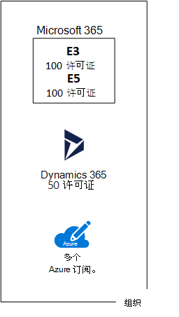

# 针对 Microsoft 云产品/服务的订阅、许可证、帐户和租户

为确保跨其云产品/服务使用一致的身份和帐单，Microsoft 提供了组织、订阅、许可证和用户帐户的层次结构：
  
- Microsoft 365 和 Microsoft Office 365
- Microsoft Azure
- Microsoft Dynamics 365

## 层次结构的元素

以下是层次结构的元素：
  
### 组织

组织表示使用 Microsoft 云产品/服务的业务实体，通常由一个或多个公共域名系统 (DNS) 域名（如 contoso.com）标识。组织是订阅的容器。
  
### 订阅

订阅是与 Microsoft 就使用一个或多个 Microsoft 云平台或服务签订的协议，其费用基于每个用户许可证费用或云资源使用累计。 

- Microsoft 基于软件即服务 (SaaS) 的云服务（Microsoft 365 和 Dynamics 365）按用户收取许可证费用。 
- Microsoft 的平台即服务 (PaaS) 和基础设施即服务 (IaaS) 云服务 (Azure) 根据云资源使用量收取费用。
 
你也可以使用试用版订阅，此订阅会在一定时间后或使用费用后过期。你可以将试用版订阅转换为付费订阅。
  
组织可订阅多个 Micrososft 云服务。图 1 显示了一个具有多个 Microsoft 365 订阅、一个 Dynamics 365 订阅和多个 Azure 订阅的单一组织。

**图 1：组织的多个订阅示例**

  
### 许可证

对于 Microsoft 的 SaaS 云服务，许可证允许特定用户帐户使用云产品的服务。作为订阅的一部分，你可以每月支付固定的费用。管理员将许可证分配给订阅中的各个用户帐户。对于图 2 中的示例，Contoso 公司订阅了具有 100 个许可证的 Office 365 E5，允许最多 100 个单个用户帐户使用 Microsoft 365 E5 的功能和服务。
  
**图 2：组织基于 SaaS 的订阅内的许可证**

>[!Note]
>安全最佳做法是使用为管理功能分配了特定角色的单独用户帐户。 无需为这些专用管理员帐户分配其管理的云服务的许可证。 例如，无需为 SharePoint 管理员帐户分配 Microsoft 365 许可证。
>

对于基于 Azure PaaS 的云服务，软件许可证是服务定价的一部分。
  
对于基于 Azure IaaS 的虚拟机，使用在虚拟机映像上安装的软件或应用程序可能需要其他许可证。某些虚拟机映像安装了授权版软件，并且成本包括在服务器的每分钟费率中。例如，SQL Server 2014 和 SQL Server 2016 的虚拟机映像。 
  
某些虚拟机映像安装了试用版应用程序，在试用期过后需要其他软件应用程序许可证。例如，SharePoint Server 2016 试用版虚拟机映像包括预安装的试用版 SharePoint Server 2016。若要在试用版过期后继续使用 SharePoint Server 2016，你必须从 Microsoft 购买 SharePoint Server 2016 许可证和客户端许可证。这些费用与 Azure 订阅是分开的，而运行虚拟机的每分钟费率仍然适用。
  
### 用户帐户

所有 Microsoft 云服务的用户帐户均存储在 Active Directory (Azure AD) 租户中，其中包含用户帐户和组。通过使用基于 Windows 服务器服务的 Azure AD Connect，Azure AD 租户可与你现有的 Active Directory 域服务 (AD DS) 帐户同步。这叫做目录同步。
  
图 3 显示了某个组织使用包含组织帐户的常见 Azure AD 租户进行多个订阅的示例。
  
**图 3：组织使用同一 Azure AD 租户进行的多个订阅**

  
### 租户

对于 SaaS 云服务，租户是承载提供云服务的服务器的区域位置。例如，Contoso 公司选择欧洲地区为其巴黎总部的 15,000 名工作人员托管其 Microsoft 365、EMS 和 Dynamics 365 订阅。
  
Azure PaaS 服务和在 Azure IaaS 中托管的基于虚拟机的工作负荷可以在世界范围内的任何 Azure 数据中心拥有租户。在创建 Azure PaaS 应用或服务或 IaaS 工作负荷的元素时，应指定 Azure 数据中心（称为位置）。
  
Azure AD 租户是包含帐户和组的 Azure AD 的特定实例。Microsoft 365 或 Dynamics 365 的付费或试用版订阅包括免费的 Azure AD 租户。此 Azure AD 租户不包括其他 Azure 服务，且与 Azure 试用版或付费订阅不同。
  
### 层次结构的摘要

以下是快速回顾：
  
- 组织可进行多个订阅
    
  - 订阅可具有多个许可证
    
  - 许可证可分配给各个用户帐户
    
  - 用户帐户存储在 Azure AD 租户中
    
此处为一个有关组织、订阅、许可证和用户帐户关系的示例。
  
- 该组织由其公共域名识别。
    
  - 带用户许可证的 Microsoft 365 E3 订阅。
    
    带用户许可证的 Microsoft 365 E5 订阅。
    
    具有用户许可证的 Dynamics 365 订阅。
    
    多个 Azure 订阅。
    
  - 常见 Azure AD 租户中的组织的用户帐户。
    
多个 Microsoft 云服务订阅可使用同一 Azure AD 租户作为通用标识提供程序。包含本地 AD DS 的同步帐户的中心 Azure AD 租户可为组织提供基于云的标识即服务 (IDaaS)。 
  
**图 4：适用于组织的同步本地帐户和 IDaaS**

  
图 4 显示了如何将常见的 Azure AD 租户用于 Microsoft 的 SaaS 云产品、Azure PaaS 应用以及 Azure IaaS 中使用 Azure AD 域服务的虚拟机。Azure AD Connect 将本地 AD DS 林与 Azure AD 租户同步。
  
## 合并多个 Microsoft 云服务的订阅

下表介绍了如果已经订阅一种类型的云服务（标签在第一列下），而要添加其他云服务的订阅（跨列），如何合并多个 Microsoft 服务。
  
||**Microsoft 365**|**Azure**|**Dynamics 365**|
|:-----|:-----|:-----|:-----|:-----|
|**Microsoft 365**   |不适用    |从 Azure 门户向你的组织添加 Azure 订阅。    |从 Microsoft 365 管理中心向你的组织添加 Dynamics 365 订阅。    |
|**Azure**   |向你的组织添加 Microsoft 365 订阅。    |不适用    |向你的组织添加 Dynamics 365 订阅。    |
|**Dynamics 365**   |向你的组织添加 Microsoft 365 订阅。    |从 Azure 门户向你的组织添加 Azure 订阅。    |不适用    |
   
为组织添加基于 Microsoft SaaS 的服务订阅的简便方法是通过管理中心来完成：
  
1. ，使用你的 **用户管理员** 或 **全局管理员** 账户登录 Microsoft 365 管理中心（[https://admin.microsoft.com](https://admin.microsoft.com)）。
    
2. 从“管理中心”主页的左侧导航栏，依次单击“帐单”和“购买服务”。
    
3. 在“购买服务”页上，购买你的新订阅。
    
管理中心将 Microsoft 365 订阅的组织和 Azure AD 租户分配到基于 SaaS 的云产品的新订阅。
  
使用与你的 Microsoft 365 订阅相同的组织和 Azure AD 租户添加 Azure 订阅：
  
1. 使用你的 Microsoft 365 **Azure AD DC 管理员** 或 **全局管理员** 账户登录 Azure 门户（[https://portal.azure.com](https://portal.azure.com)）。
    
2. 在左侧导航栏中，单击“订阅”，然后单击“添加”。
    
3. 在“添加订阅”页上，选择一项服务并完成付款信息和协议。
    
如果分别购买 Azure 和Microsoft 365 订阅并且希望从 Azure 订阅访问 Microsoft 365 Azure AD 租户，请参阅[将现有 Azure 订阅添加到 Azure Active Directory 租户](/azure/active-directory/fundamentals/active-directory-how-subscriptions-associated-directory)中的说明。
 
## 另请参阅

[面向企业架构师的 Microsoft 云图解](../solutions/cloud-architecture-models.md)
  
[SharePoint、Exchange、Skype for Business 和 Lync 的体系结构模型](architectural-models-for-sharepoint-exchange-skype-for-business-and-lync.md)
  
[混合解决方案](hybrid-solutions.md)

## 后续步骤

[评估 Microsoft 365 网络连接](assessing-network-connectivity.md)
