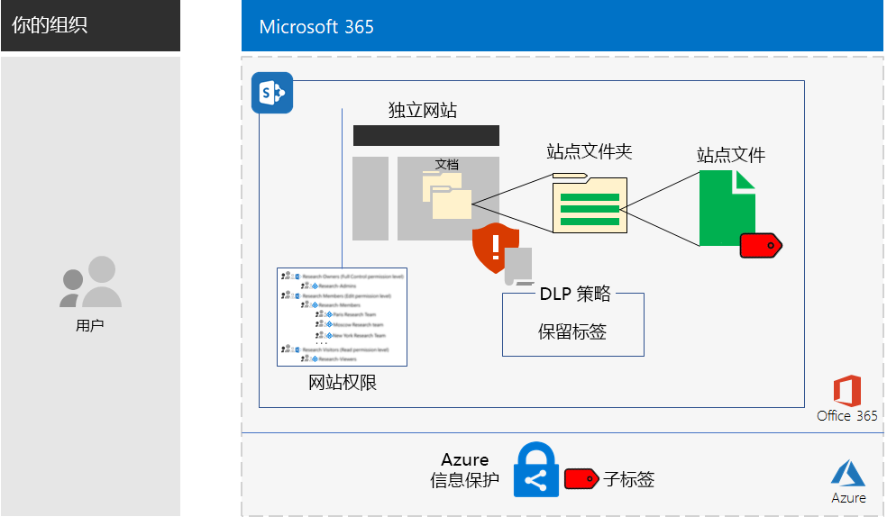
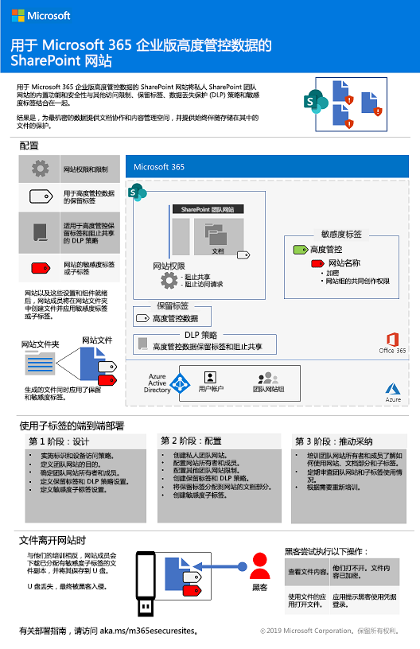
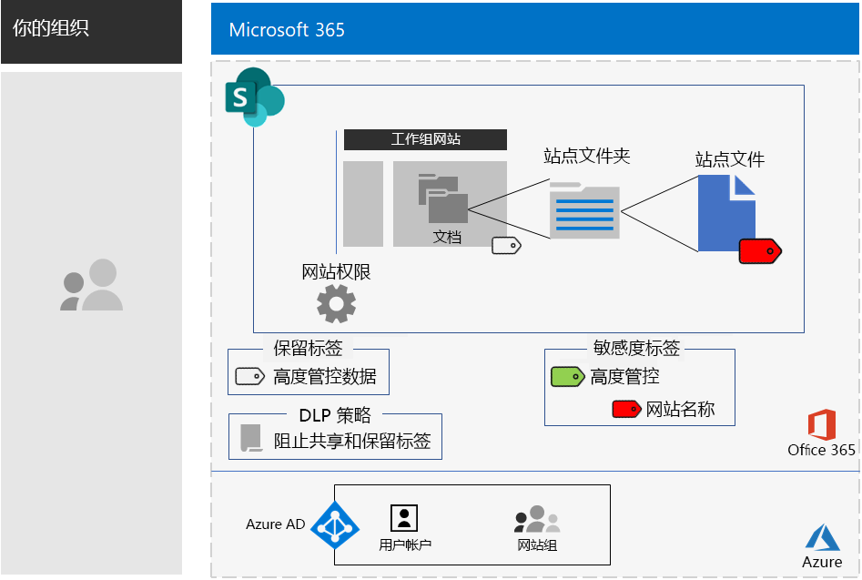

# 用于高度管控数据的 SharePoint 网站

*此方案适用于 Microsoft 365 企业版的 E3 和 E5 版本*

Microsoft 365 企业版包含一整套基于云的服务，使用户可以创建、存储、保护和管理文件中存储的高度管控数据。这包括符合以下条件的数据：

- 受地区法规约束。
- 组织最有价值的数据，例如商业机密、财务或人力资源信息以及组织策略。

>[!Note]
> [此处](secure-teams-highly-regulated-data-scenario.md)是使用 Microsoft Teams 的一个类似方案。
>

满足此业务需求的 Microsoft 365 企业版基于云的方案要求用户执行以下操作：

- 在 SharePoint 团队网站中存储文件（文档、幻灯片和电子表格等）。
- 锁定网站以防止：
  - 对不是网站 Office 365 组成员的用户进行访问。
  - 网站成员向其他用户授予访问权限。
  - 非网站成员请求访问网站。
- 为 SharePoint 网站配置 Office 365 保留标签，作为阻止用户将文件发送到组织外部的默认方法。
- 使用随文件一起传输的加密信息对网站中最敏感的文件进行加密。
- 添加对最敏感的文件的权限，这样，即使它们在网站外共享，打开文件仍需要具有权限的用户帐户提供有效凭据。

下表将此方案的要求映射到 Microsoft 365 企业版的功能。

|||
|:-------|:-----|
| **要求** | **Microsoft 365 企业版 功能** |
| 存储文件 | SharePoint 团队网站 |
| 锁定网站 | Office 365 组和 SharePoint 团队网站权限 |
| 标记网站中的文件 | Office 365 保留标签 |
| 阻止向组织外发送文件的用户 | Office 365 中的数据丢失防护 (DLP) 策略 |
| 加密网站中的所有文件 | Office 365 敏感度标签或子标签 |
| 添加网站文件的权限 | Office 365 敏感度标签或子标签 |
|||

以下是安全的 SharePoint 网站的示例配置。

此方案要求已经部署：

- [标识](identity-infrastructure.md)以及基础架构的[信息保护](infoprotect-infrastructure.md)阶段的步骤 1 和 2。 
- [SharePoint](sharepoint-online-onedrive-workload.md)。

以下各阶段将指导你完成用于高度管控数据的 SharePoint 网站的设计、配置和驱动采用。

 有关这种情况的 1 页摘要，请参阅[针对高度管控数据海报的 SharePoint 网站](./media/teams-sharepoint-online-sites-highly-regulated-data/SharePointSitesHighlyRegulatedData.pdf)。

还可以下载 [PDF](https://github.com/MicrosoftDocs/microsoft-365-docs/raw/public/microsoft-365/enterprise/media/teams-sharepoint-online-sites-highly-regulated-data/SharePointSitesHighlyRegulatedData.pdf) 或 [PowerPoint](https://github.com/MicrosoftDocs/microsoft-365-docs/raw/public/microsoft-365/enterprise/media/teams-sharepoint-online-sites-highly-regulated-data/SharePoint-Sites-Highly-Regulated-Data.pptx) 格式的海报，并按 letter、legal 或 tabloid (11 x 17) 大小的纸张打印。

## 标识和设备访问先决条件

若要保护对 SharePoint 网站的访问，请确保已配置[标识和设备访问策略](identity-access-policies.md)以及[建议的 SharePoint 访问策略](sharepoint-file-access-policies.md)。

## 第 1 阶段：设计

若要创建用于高度管控数据的 SharePoint 网站，必须首先确定其用途。 例如，制造组织的研发部需要一个 SharePoint 网站来存储现有产品的当前设计规范，并需要一个协作处理新产品的位置。 仅允许研发部和选定的管理人员访问该网站。

该目的将推动基本配置项的确定，例如：

- 要分配给网站“文档”部分的 Office 365 保留标签以及该标签的 DLP 策略
- 由用户应用于网站中存储的高度敏感文件的 Office 365 敏感度子标签的设置

确定后，使用这些设置在第 2 阶段中配置网站。 

### 步骤 1：Office 365 保留标签和 DLP 策略

应用于 SharePoint 团队网站的“文档”部分时，Office 365 保留标签提供对存储在网站上的所有文件进行分类的默认方法。
 
对于用于高度管控数据的 SharePoint 网站，需要确定要使用的 Office 365 保留标签。

有关 Office 365 标签的设计注意事项，请参阅 [Office 365 分类和标签](https://docs.microsoft.com/office365/securitycompliance/secure-sharepoint-online-sites-and-files#office-365-retention-labels)。

为保护敏感信息并防止意外或故意泄露，可以使用 DLP 策略。有关详细信息，请参阅此[概述](https://docs.microsoft.com/office365/securitycompliance/data-loss-prevention-policies)。

对于 SharePoint 网站，必须为分配给网站的 Office 365 保留标签配置 DLP 策略，在用户尝试与外部用户共享文件时进行阻止。 

### 步骤 2：Office 365 灵敏度子标签

若要对最敏感的文件提供加密和一组权限，用户必须应用 Office 365 敏感度标签或子标签。 子标签存在于现有标签下。 

如果需要将少量标签应用于全局和各个私人团队，请使用敏感度标签。 如果你拥有大量标签，或者希望在高度管控标签下整理安全网站的标签，请使用敏感度子标签。 

已应用标签或子标签的设置会随文件一起移动。 即使文件泄露到网站外，也只有拥有权限并经过身份验证的用户帐户才可以将其打开。

### 设计结果

已确定以下内容：

- 适当的 Office 365 保留标签以及与标签关联的 DLP 策略
- 包含加密和权限的 Office 365 敏感度子标签设置

## 第 2 阶段：配置

此阶段将使用并实施第 1 阶段中确定的设置，为高度管控的数据创建 SharePoint 网站。

### 步骤 1：创建专用 SharePoint 团队网站，使其包含相应 Office 365 组的所有者和成员

请遵循[这些说明]( https://support.office.com/article/create-a-site-in-sharepoint-online-4d1e11bf-8ddc-499d-b889-2b48d10b1ce8)创建专用的 SharePoint 团队网站。

### 步骤 2：配置 SharePoint 团队网站的其他权限设置

在 SharePoint 网站中配置以下权限设置。

1. 在工具栏中，依次单击设置图标和“**网站权限**”。
2. 在“**网站权限**”窗格的“**共享设置**”下方，单击“**更改共享设置**”。
3. 在“**共享权限**”下方，选择“**仅网站所有者可以共享文件、文件夹和网站**”。
4. 关闭“**允许访问请求**”，然后单击“**保存**”。

使用这些设置可以禁止网站用户组成员与其他成员共享网站以及非成员访问网站。

### 步骤 3：为网站配置 Office 365 保留标签

按照[使用 Office 365 标签和 DLP 保护 SharePoint 文件](https://docs.microsoft.com/office365/enterprise/protect-sharepoint-online-files-with-office-365-labels-and-dlp)中的说明执行以下操作：

1. 创建并发布高度管控数据的保留标签（如果需要）。
2. 为网站配置步骤 1 中创建的保留标签。
3. 为高度管控数据创建 DLP 策略以使用步骤 2 中创建的保留标签并阻止用户将文件发送到组织外部

#### 步骤 4：为网站创建 Office 365 敏感度子标签

与可由任何人应用于任何文件的高度管控数据敏感度标签不同，安全网站需要其自己的子标签，使分配了子标签的文件：

- 启用加密，并且加密信息将与文件一起移动。
- 包含自定义权限，以便只有网站用户组的成员能打开文件。

要以这种方式为网站中存储的文件实现更高的安全级别，必须为高度管控文件配置新的敏感度标签或常规标签的子标签。 只有网站的用户组成员才能在高度管控标签的子标签列表中看到该子标签。

请按照[此处](https://docs.microsoft.com/microsoft-365/compliance/encryption-sensitivity-labels)的说明，使用以下设置来配置用于高度管控文件的标签或标签的子标签：

- 标签或子标签的名称包含网站的名称，以便在将标签或子标签分配给文件时实现轻松关联。
- 启用加密。
- 网站用户组具有共同创作权限。

### 配置结果

已配置了以下内容：

- SharePoint 网站上具有更严格的权限设置
- 将 Office 365 保留标签分配给 SharePoint 网站的“文档”部分
- Office 365 保留标签的 DLP 策略
- 可由用户应用于网站中存储的最敏感文件的 Office 365 敏感度标签或子标签，用于对文件加密并仅允许团队网站用户组中的成员进行“共同创作”访问 

下面是使用高管控标签的子标签生成的配置。

下面是对网站中存储的文件应用了子标签的用户示例。

## 第 3 阶段：驱动用户采用

用于高度管控数据的 SharePoint 网站对这些数据进行保护的前提是该网站一直用于存储和访问敏感文件。 此阶段依赖于用户改变其习惯和喜好，因此是最困难的阶段。 

例如，习惯于在 USB 驱动器或基于云的个人存储解决方案中存储敏感文件的员工现在必须将这些文件专门存储在用于高度管控数据的 SharePoint 网站中。

### 步骤 1：培训用户

完成配置后，对作为网站成员的一组用户培训以下内容：

- 有关使用新网站保护重要文件的重要性以及高度管控数据泄露的后果，例如法律后果、监管罚款、勒索软件或失去竞争优势。
- 如何访问网站及其文件。
- 如何在网站上创建新文件和上传本地存储的新文件。
- DLP 策略如何阻止它们在外部共享文件。
- 如何使用网站的标签或子标签来标记最敏感的文件。
- 标签或子标签如何保护文件（即使文件泄露到网站外部）。

此培训应包括实践练习，让用户可以体验这些操作及其结果。

### 步骤 2：定期审查使用情况和文件

在培训后的几周内，SharePoint 网站的 SharePoint 管理员可以执行以下操作：

- 分析网站的使用情况，并将其与预期使用情况进行比较。
- 验证是否使用敏感度标签或子标签正确标记了高度敏感的文件。

  通过查看 SharePoint 中的文件夹并使用“**添加列**”的“**显示/隐藏列**”选项添加“**敏感度**”列，可以查看为哪些文件分配了标签。

根据需要重新培训用户。

### 用户采用结果

高度管控的文件专门存储在用于高度管控数据的 SharePoint 网站上，并且最敏感的文件应用了网站的敏感度标签或子标签。

## Contoso Corporation 如何使用针对高度管控数据的 SharePoint 网站

Contoso Corporation 是一家虚构但具代表性的全球大型制企业。 了解 Contoso 如何设计、配置并推动其在巴黎、莫斯科、纽约、北京和班加罗尔的研究团队采用[安全的 SharePoint 网站](contoso-sharepoint-online-site-for-highly-confidential-assets.md)。 

## 另请参阅

[用于高度管控数据的 Teams](secure-teams-highly-regulated-data-scenario.md)

[Microsoft 365 企业版工作负载和方案](deploy-workloads.md)

[Microsoft 365 工作效率库](https://aka.ms/productivitylibrary) https://aka.ms/productivitylibrary)

[部署指南](deploy-microsoft-365-enterprise.md)
