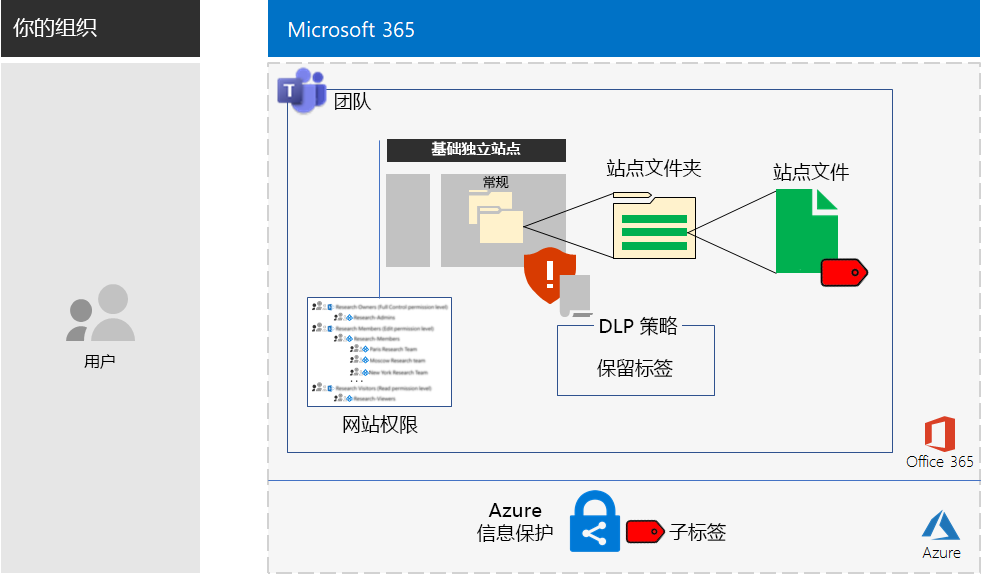

# 针对高度管控数据的 Microsoft Teams 和 SharePoint Online 网站Microsoft Teams and SharePoint Online sites for highly regulated data

*此方案适用于 Microsoft 365 企业版的 E3 和 E5 版本**This scenario applies to both the E3 and E5 versions of Microsoft 365 Enterprise*

Microsoft 365 企业版包含一整套基于云的服务，使用户可以创建、存储和保护高度管控的数据。这包括符合以下条件的数据：Microsoft 365 Enterprise includes a full suite of cloud-based services so that you can create, store, and secure your highly regulated data. This includes data that is:

- 受地区法规约束。Subject to regional regulations.
- 组织最有价值的数据，例如商业机密、财务或人力资源信息以及组织策略。The most valuable data for your organization, such as trade secrets, financial or human resources information, and organization strategy.

满足此业务需求的 Microsoft 365 企业版基于云的方案要求用户执行以下操作：A Microsoft 365 Enterprise cloud-based solution that meets this business need requires that you:

- 在 SharePoint Online 团队网站或 Microsoft Teams 团队的“文件”\*\*\*\* 选项卡中存储数字资产（文档、幻灯片组、电子表格等）。Store digital assets (documents, slide decks, spreadsheets, etc.) in a SharePoint Online team site or in the **Files** tab of a Microsoft Teams team.
- 锁定网站或团队以防止：Lock down the site or team to prevent:
   - 通过组成员身份仅访问特定用户帐户组之外的所有用户帐户，其中包括可以访问 SharePoint Online 团队网站以及拥有权限级别的用户帐户以及可以管理它的用户帐户。Access to only a specific set of user accounts through group membership, which includes those who can access the SharePoint Online team site and at what level of permission, and those who can administer it.
   - 网站成员向其他用户授予访问权限。Members of the site from granting access to others.
   - 非网站成员请求访问网站。Non-members of the site from requesting access to the site.
- 为 SharePoint Online 网站或团队配置 Office 365 保留标签，将此作为在站点或团队中的文档上定义保留策略的默认方式。Configure an Office 365 retention label for your SharePoint Online sites or teams as a default way to define retention policies on the documents in the site or team.
- 阻止用户向组织外发送文件。Block users from sending files outside the organization.
- 加密网站或团队中最敏感的数字资产。Encrypt the most sensitive digital assets of the site or team.
- 添加对最敏感的数字资产的权限，这样，即使它们在网站外共享，打开资产仍需要具有权限的用户帐户的有效凭据。Add permissions to the most sensitive digital assets so that if even if they get shared outside of the site, opening the asset still requires the valid credentials of a user account that has permission.

下表将此方案的要求映射到 Microsoft 365 企业版的功能。The following table maps the requirements of this solution to a feature of Microsoft 365 Enterprise.

|||
|:-------|:-----|
| **要求****Requirement** | **Microsoft 365 企业版 功能****Microsoft 365 Enterprise feature** |
| 存储数字资产Store digital assets | SharePoint Online 团队网站和 Office 365 团队SharePoint Online team sites and teams in Office 365 |
| 锁定网站Lock down the site | Azure AD 组和 SharePoint Online 团队网站权限Azure AD groups and SharePoint Online team site permissions |
| 标记网站的数字资产Label the digital assets of the site | Office 365 保留标签Office 365 retention labels |
| 阻止向组织外发送文件的用户Block users when sending files outside the organization | Office 365 中的数据丢失防护 (DLP) 策略Data Loss Prevention (DLP) policies in Office 365 |
| 加密网站的所有数字资产Encrypt all of the digital assets of the site | 企业移动性 + 安全性 (EMS) 中的 Azure 信息保护子标签Azure Information Protection sub-labels in Enterprise Mobility + Security (EMS) |
| 向网站的数字资产添加权限Add permissions to the digital assets of the site | EMS 中的 Azure 信息保护子标签Azure Information Protection sub-labels in EMS |
|||

以下是针对 SharePoint Online 网站的配置。Here is the configuration for a SharePoint Online site.

此方案要求已经部署：This solution requires that you have already deployed:

- [标识](identity-infrastructure.md)以及基础架构的[信息保护](infoprotect-infrastructure.md)阶段的步骤 1 和 2。The [Identity](identity-infrastructure.md) phase and steps 1 and 2 of the [Information protection](infoprotect-infrastructure.md) phase of the foundation infrastructure. 
- 对于 SharePoint Online 团队网站中的高度管控数据：[SharePoint Online](sharepoint-online-onedrive-workload.md)。For highly regulated data in SharePoint Online team sites, [SharePoint Online](sharepoint-online-onedrive-workload.md).
- 对于 Microsoft Teams 团队中的高度管控数据：[Microsoft Teams](teams-workload.md)。For highly regulated data in Microsoft Teams teams, [Microsoft Teams](teams-workload.md).

以下各阶段将指导你完成针对高度管控数据的 SharePoint Online 网站和团队的设计、配置和驱动采用。The following phases step you through the design, configuration, and driving adoption for SharePoint Online sites and teams for highly regulated data.

若要了解 Contoso Corporation（虚构但具代表性的跨国组织）如何为其研究团队设计 SharePoint Online 网站，请参阅此[示例配置](contoso-sharepoint-online-site-for-highly-confidential-assets.md)。To see how the Contoso Corporation, a fictional but representative multi-national organization, designed a SharePoint Online site for its research teams, see this [example configuration](contoso-sharepoint-online-site-for-highly-confidential-assets.md).

高度管控数据的团队要求首先为高度管控数据创建一个 SharePoint Online 团队网站。然后，创建一个使用 SharePoint Online 团队网站的 Office 365 组的新团队。有关详细信息，请参阅第 2 阶段的步骤 4。A team for highly regulated data requires that you first create a SharePoint Online team site for highly regulated data. You then create a new team that uses the Office 365 group of the SharePoint Online team site. See Phase 2, Step 4 for more information.

以下是针对团队的配置。Here is the configuration for a team.

## 身份识别和设备访问先决条件Identity and device access prerequisites

若要保护对团队或 SharePoint Online 网站的访问，请确保已配置[身份识别和设备访问策略](identity-access-policies.md)以及[建议的 SharePoint Online 访问策略](sharepoint-file-access-policies.md)。To protect access to the team or SharePoint Online site, ensure that you have configured [identity and device access policies](identity-access-policies.md) and the [recommended SharePoint Online access policies](sharepoint-file-access-policies.md).

## 第 1 阶段：设计Phase 1: Design

若要针对高度管控数据创建 SharePoint Online 网站或团队，必须首先确定其用途。例如，制造业组织的研发部门需要 SharePoint Online 网站来存储现有产品的当前设计规范，以及需要一个用于协作研发新产品的位置。只允许研发部门的成员和选定的管理人员访问该网站。To create a SharePoint Online site or team for highly regulated data, you must first identify its purpose. For example, the research and development department of a manufacturing organization needs a SharePoint Online site to store current design specifications for existing products and a place to collaborate on new products. Only members of the Research & Development department and selected executives will be allowed to access the site.

该目的将推动基本配置项的确定，例如：That purpose will drive the determination of essential configuration items such as:

- SharePoint Online 权限集和 SharePoint 组的集合The set of SharePoint Online permission sets and SharePoint groups
- 访问组、Azure AD 安全组及其要添加到 SharePoint 组的成员的集合The set of access groups, the Azure AD security groups and their members to add to the SharePoint groups
- 要分配到网站的 Office 365 保留标签以及标签的 DLP 策略集合The Office 365 retention label to assign to the site and the set of DLP policies for the label
- 用户应用到网站中存储的高度敏感数据资产的 Azure 信息保护子标签的设置The settings of an Azure Information Protection sub-label that users apply to highly sensitive digital assets stored in the site

确定后，使用这些设置在第 2 阶段中配置网站。Once determined, you use these settings to configure the site in Phase 2. 

### 步骤 1：独立 SharePoint Online 网站Step 1: An isolated SharePoint Online site

SharePoint Online 团队网站的锁定版本称为独立网站。与私有团队网站的默认设置不同，独立网站配置为阻止：The locked-down version of a SharePoint Online team site is known as an isolated site. Unlike the default settings of private team sites, isolated sites are configured to prevent:

- 访问非指定组成员。Access to those who are not members of specified groups.
- 请求访问权限。The requesting of access.
- 未经授权向指定组的当前成员授予访问权限。The unauthorized granting of access by current members of specified groups.
- 访问组成员管理网站。Administration of the site by access group members.

除非由网站的 SharePoint 管理员操作，否则包含高度管控资产的 SharePoint Online 团队网站的安全性不会改变。The security of SharePoint Online team sites that contain highly regulated assets do not change unless done by a SharePoint administrator for the site.

请参阅[设计独立的 SharePoint Online 团队网站](https://docs.microsoft.com/office365/enterprise/design-an-isolated-sharepoint-online-team-site)，详细了解如何确定权限级别、SharePoint 组、访问组和组成员的集合。See [Design an isolated SharePoint Online team site](https://docs.microsoft.com/office365/enterprise/design-an-isolated-sharepoint-online-team-site) for the details to determine the set of permission levels, SharePoint groups, access groups, and group members.

### 步骤 2：Office 365 保留标签和 DLP 策略Step 2: Office 365 retention labels and DLP policies

应用于 SharePoint Online 团队网站时，Office 365 保留标签提供对存储在网站上的所有数字资产进行分类的默认方法。When applied to a SharePoint Online team site, Office 365 retention labels provide a default method of classifying all digital assets stored on the site.
 
对于针对高度管控数据的 SharePoint Online，需要确定要使用的 Office 365 保留标签。For SharePoint Online sites for highly regulated data, you need to determine which Office 365 retention label to use.

有关 Office 365 标签的设计注意事项，请参阅 [Office 365 分类和标签](https://docs.microsoft.com/office365/securitycompliance/secure-sharepoint-online-sites-and-files#office-365-retention-labels)。For the design considerations of Office 365 labels, see [Office 365 classification and labels](https://docs.microsoft.com/office365/securitycompliance/secure-sharepoint-online-sites-and-files#office-365-retention-labels).

为保护敏感信息并防止意外或故意泄露，可以使用 DLP 策略。有关详细信息，请参阅此[概述](https://docs.microsoft.com/office365/securitycompliance/data-loss-prevention-policies)。To protect sensitive information and prevent its accidental or intentional disclosure, you use DLP policies. For more information, see this [overview](https://docs.microsoft.com/office365/securitycompliance/data-loss-prevention-policies).

对于针对高度管控数据的 SharePoint Online 网站，必须为分配给网站的 Office 365 保留标签配置 DLP 策略，在用户尝试与外部用户共享数字资产时进行阻止。For SharePoint Online sites for highly regulated data, you must configure a DLP policy for the Office 365 retention label assigned to the site to block users when they attempt to share digital assets with external users. 

### 步骤 3：Azure 信息保护子标签Step 3: Your Azure Information Protection sub-label

若要为最敏感的数字资产提供加密和一组权限，用户必须使用 Azure 信息保护客户端来应用 Azure 信息保护标签。若要为针对高度管控数据的 SharePoint Online 网站使用 Azure 信息保护标签，必须在范围策略中配置 Azure 信息保护子标签。To provide encryption and a set of permissions to your most sensitive digital assets, users must apply an Azure Information Protection label using the Azure Information Protection client. To use Azure Information Protection labels for SharePoint Online sites for highly regulated data, you must configure an Azure Information Protection sub-label in a scoped policy. 

子标签位于现有标签下。例如，可以在“高度机密”标签下创建一个“研发”子标签。范围策略是仅适用于用户子集的策略。对于针对高度管控数据的 SharePoint Online 网站，该范围是作为网站访问组的成员的用户集。A sub-label exists under an existing label. For example, you can create a Research & Development sub-label under the Highly Confidential label. A scoped policy is one that applies only to a subset of users. For SharePoint Online sites for highly regulated data, the scope is the set of users that are members of the access groups for the site.

应用的子标签的设置随资产一起移动。即使在网站外部下载和共享，也只有具有权限的经过身份验证的用户帐户才能打开它。The settings of the applied sub-label travel with the asset. Even if it is downloaded and shared outside the site, only authenticated user accounts that have permissions can open it.

### 设计结果Design results

已确定以下内容：You have determined the following:

- SharePoint 组集及权限级别The set of SharePoint groups and permission levels
- 每个权限级别的访问组及其成员集The set of access groups and their members for each permission level
- 与标签关联的相应的 Office 365 保留标签和 DLP 策略The appropriate Office 365 retention label and the DLP policy that is associated with the label
- 包含加密和权限的 Azure 信息保护子标签设置The settings of the Azure Information Protection sub-label that include encryption and permissions

## 第 2 阶段：配置Phase 2: Configure

在此阶段中，将执行第 1 阶段中确定的设置并实现这些设置，以针对高度管控的数据创建 SharePoint Online 网站。In this phase, you take the settings determined in Phase 1 and implement them to create a SharePoint Online site for highly regulated data.

### 步骤 1：创建和配置独立的 SharePoint Online 团队网站Step 1: Create and configure an isolated SharePoint Online team site

使用[部署独立的 SharePoint Online 团队网站](https://docs.microsoft.com/office365/enterprise/deploy-an-isolated-sharepoint-online-team-site)中的说明执行以下操作：Use the instructions in [Deploy an isolated SharePoint Online team site](https://docs.microsoft.com/office365/enterprise/deploy-an-isolated-sharepoint-online-team-site) to:

- 为网站中使用的每个 SharePoint 权限级别创建并填充访问组。Create and populate the access groups for each SharePoint permission level used on the site.
- 创建并配置独立的团队网站。Create and configure the isolated team site.

### 步骤 2：针对 Office 365 保留标签配置网站Step 2: Configure the site for an Office 365 retention label DLP policy

按照[使用 Office 365 标签和 DLP 保护 SharePoint Online 文件](https://docs.microsoft.com/office365/enterprise/protect-sharepoint-online-files-with-office-365-labels-and-dlp)中的说明执行以下操作：Use the instructions in [Protect SharePoint Online files with Office 365 labels and DLP](https://docs.microsoft.com/office365/enterprise/protect-sharepoint-online-files-with-office-365-labels-and-dlp) to:

- 识别或创建 Office 365 保留标签，然后将其应用到独立的 SharePoint Online 网站。Identify or create the Office 365 retention label and apply it to your isolated SharePoint Online site.
- 创建并配置 DLP 策略，用于在用户尝试于组织外部的 SharePoint Online 网站上共享数字资产时阻止用户。Create and configure the DLP policy that blocks users when they attempt to share a digital asset on your SharePoint Online site outside the organization.

### 步骤 3：创建网站的 Azure 信息保护子标签Step 3: Create an Azure Information Protection sub-label for the site

按照[使用 Azure 信息保护来保护 SharePoint Online 文件](https://docs.microsoft.com/office365/enterprise/protect-sharepoint-online-files-with-azure-information-protection)中的说明执行以下操作：Use the instructions in [Protect SharePoint Online files with Azure Information Protection](https://docs.microsoft.com/office365/enterprise/protect-sharepoint-online-files-with-azure-information-protection) to: 

- 在范围策略中创建并配置 Azure 信息保护子标签。Create and configure an Azure Information Protection sub-label in a scoped policy.
- 将 Azure 信息保护客户端部署到用户计算机。Deploy the Azure Information Protection client to user computers.

### 步骤 4（可选）：针对高度管控数据创建团队Step 4 (optional): Create a team for the highly regulated data

如果需要针对高度管控数据的团队，可以首先针对高度管控数据创建一个 SharePoint Online。创建初始私有 SharePoint Online 团队网站时，需要指定一个 Office 365 组名。If you want a team for highly regulated data, you first create a SharePoint Online site for highly regulated data. When you create the initial private SharePoint Online team site, you specify an Office 365 group name.

完全配置了针对高度管控数据的 SharePoint Online 网站后，使用以下步骤将其转换为针对高度管控数据的团队：After the SharePoint Online site for highly regulated data is fully configured, use these steps to convert it into a team for highly regulated data:

1. 登录 Office 365。Sign in to Office 365.
2. 在“Microsoft Office 主页”\*\*\*\* 选项卡上，单击“Teams”\*\*\*\*。From the **Microsoft Office Home** tab, click **Teams**.
3. 从“Microsoft Teams”\*\*\*\* 选项卡上的“加入或创建团队”\*\*\*\* 窗格中，单击“创建团队”\*\*\*\*。From the **Microsoft Teams** tab, in the **Join or create a team** pane, click **Create team**.
4. 在“创建团队”\*\*\*\* 窗格中，单击“从现有 Office 365 组创建团队”\*\*\*\*。In the **Create your team** pane, click **Create a team from an existing Office 365 group**.
5. 在 Office 365 组的列表中，选择针对高度管控数据的 SharePoint Online 网站对应的 Office 365 组的名称，然后单击“选择团队”\*\*\*\*。In the list of Office 365 groups, select the name of the Office 365 group corresponding to the SharePoint Online site for highly regulated data, and then click **Choose team**.

新团队的“文件”\*\*\*\* 选项卡列出了相应的 SharePoint Online 网站“文档”\*\*\*\* 区域的“常规”\*\*\*\* 文件夹的内容。若要查看团队的 SharePoint Online 网站的其余资源，请单击省略号，然后单击“在 SharePoint 中打开”\*\*\*\*。The **Files** tab of the new team lists the contents of the **General** folder of the **Documents** area of the corresponding SharePoint Online site. To see the rest of the resources of the SharePoint Online site for the team, click the ellipsis, and then click **Open in SharePoint**.

### 配置结果Configuration results

已配置了以下内容：You have configured the following:

- SharePoint Online 独立网站A SharePoint Online isolated site
- 分配给 SharePoint Online 独立网站的 Office 365 保留标签An Office 365 retention label assigned to the SharePoint Online isolated site
- Office 365 保留标签的 DLP 策略A DLP policy for the Office 365 retention label
- 用户可以应用到加密资产和强制执行权限的网站中存储的最敏感数字资产的范围策略的 Azure 信息保护子标签An Azure Information Protection sub-label of a scoped policy that users can apply to the most sensitive digital assets stored in the site that encrypts the asset and enforces permissions
- 基于 SharePoint Online 网站的针对高度管控数据的团队（如果需要）If needed, a team for highly regulated data based on the SharePoint Online site

## 第 3 阶段：驱动用户采用Phase 3: Drive user adoption

针对高度管控数据的 SharePoint Online 网站或团队只有在始终用于存储和访问敏感数字资产的情况下才能保护该数据。这是最困难的一个阶段，因为它依赖于用户改变他们的方式。A SharePoint Online site or team for highly regulated data can only protect that data if it is consistently used for storage and access of sensitive digital assets. This is the hardest phase because it relies on users changing their ways. 

例如，用于在 USB 驱动器或基于云的个人存储解决方案上存储敏感文件的管理人员现在必须将它们专门存储在针对高度管控数据的 SharePoint Online 网站或团队中。For example, executives that are used to storing sensitive files on USB drives or on personal cloud-based storage solutions will now have to store them exclusively in a SharePoint Online site or team for highly regulated data.

### 步骤 1：培训用户Step 1: Train your users

完成配置后，对作为网站访问组成员的一组用户培训以下内容：After completing your configuration, train the set of users who are members of the site access groups:

- 有关使用新网站或团队保护重要资产的重要性以及高度管控数据泄露的后果，例如法律后果、管制罚款、勒索软件或失去竞争优势。On the importance of using the new site or team to protect valuable assets and the consequences of a highly regulated data leak, such as legal ramifications, regulatory fines, ransomware, or loss of competitive advantage.
- 如何访问网站及其资产。How to access the site and its assets.
- 如何在网站上创建新文件和上传本地存储的新文件。How to create new files on the site and upload new files stored locally.
- DLP 策略如何阻止它们在外部共享文件。How the DLP policy blocks them from sharing files externally.
- 如何使用 Azure 信息保护客户端对最敏感的数字资产标记已配置的子标签。How to use the Azure Information Protection client to label the most sensitive digital assets with the configured sub-label.
- 如果资产从网站或团队中泄露，Azure 信息保护子标签如何保护资产。How the Azure Information Protection sub-label protects an asset even when it is leaked off the site or team.

此培训应包括实践练习，让用户可以体验这些操作及其结果。This training should include hands-on exercises so that the users can experience these operations and their results.

### 步骤 2：定期审查使用情况和文件Step 2: Conduct periodic reviews of usage and files

在培训后的几周内，SharePoint Online 网站或团队的 SharePoint 管理员可以执行以下操作：In the weeks after training, the SharePoint administrator for the SharePoint Online site or team can:

- 分析网站或团队的使用情况，并将其与预期使用情况进行比较。Analyze usage for the site or team and compare it with usage expectations.
- 验证是否使用 Azure 信息保护子标签正确标记了高度敏感的文件。Verify that highly sensitive files have been properly labeled with the Azure Information Protection sub-label.

根据需要重新培训用户。Retrain your users as needed.

### 用户采用结果User adoption results

敏感数字资产专门存储在针对高度管控数据的 SharePoint Online 网站或团队中，并且已对最敏感的资产应用了已配置的 Azure 信息保护子标签。Sensitive digital assets are stored exclusively on SharePoint Online sites or teams for highly regulated data and that the most sensitive assets have the configured Azure Information Protection sub-label applied.

## Contoso Corporation 如何部署 Microsoft 365 企业版How the Contoso Corporation deployed Microsoft 365 Enterprise

Contoso Corporation 是一家虚构但具代表性的全球大型制企业，总部设在法国巴黎。The Contoso Corporation is a fictional but representative global manufacturing conglomerate with its headquarters in Paris, France. 了解 Contoso 是如何设计、配置并推动其在巴黎、莫斯科、纽约、北京和班加罗尔的研究团队采用[安全的 SharePoint Online 网站](contoso-sharepoint-online-site-for-highly-confidential-assets.md)的。See how Contoso designed, configured, and then drove the adoption of a [secure SharePoint Online site](contoso-sharepoint-online-site-for-highly-confidential-assets.md) for their research teams in Paris, Moscow, New York, Beijing, and Bangalore. 

## 另请参阅See also

[部署指南Deployment guide](deploy-microsoft-365-enterprise.md)

[测试实验室指南Test lab guides](m365-enterprise-test-lab-guides.md)

[保护开发/测试环境中的 SharePoint Online 网站安全Secure SharePoint Online sites in a dev/test environment](https://docs.microsoft.com/office365/enterprise/secure-sharepoint-online-sites-in-a-dev-test-environment)
