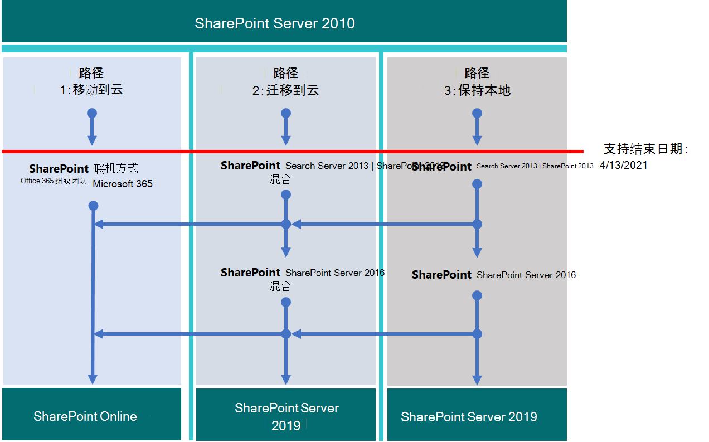

# 升级自 SharePoint 2010

*此文章适用于 Microsoft 365 企业版和 Office 365 企业版。* 

Microsoft SharePoint 2010 和 SharePoint Server 2010 将于 **2021** 年 4 月 13 日停止提供支持。 本文提供的资源可帮助您将现有 SharePoint Server 2010 数据迁移到 Microsoft 365 中的 SharePoint Online 或升级本地 SharePoint Server 2010 环境。

## 停止 *提供支持的是什么*？

大多数 Microsoft 产品都有一个支持生命周期，在此期间它们获取新功能、Bug 修复、安全修补程序等。 在支持终止日期后，产品不会停止工作，但 Microsoft 不再提供：

- 针对可能会出现的问题的技术支持。

- 对可能会影响服务器稳定性和可用性的问题进行 Bug 修复。

- 针对可能导致服务器易受安全漏洞的漏洞进行安全修复。

- 时区更新。

这意味着不会为产品服务提供进一步的更新、修补程序或修补程序 (包括安全修补程序/修补程序) 。 Microsoft 支持将完全将支持工作转移到更新版本。

随着对 SharePoint Server 2010 方法的支持结束，在升级产品并迁移重要数据之前，请删除不再需要的数据。

> [!NOTE]
> 软件生命周期通常自初始版本起持续 10 年。 [Microsoft 解决方案](https://go.microsoft.com/fwlink/?linkid=841249)提供商可以帮助你升级到软件的下一个版本，或迁移到 Microsoft 365 迁移 (或两) 。 确保你了解关键基础技术的支持终止日期，尤其是要与 Microsoft SQL Server 一SharePoint。 有关详细信息，请参阅固定 [生命周期策略](https://support.microsoft.com/help/14085)。

## 提前规划

检查产品生命周期网站上 [支持结束日期](https://support.microsoft.com/lifecycle/search?alpha=SharePoint%20Server%202010)。 请牢记这些日期，规划升级或迁移。 请记住， *产品不会在列出的日期* 停止工作。 但是，由于该日期之后将不再修补安装，因此你需要计划顺利过渡到产品的下一个版本。

此矩阵可帮助在迁移选项之间绘制课程：

|停止提供支持产品|较好 |最好|
|---|---|---|
|SharePoint Server 2010|SharePoint服务器 2013 (本地) |SharePoint Online|
||SharePointServer 2013 与 SharePoint Online 的混合|SharePoint服务器 2016 (本地) |
|||SharePoint云混合搜索|

如果您选择规模较低的选项 (良好) ，则需要在从 SharePoint Server 2010 迁移后立即开始规划其他升级。

以下是避免停止支持 SharePoint Server 2010 的三个途径。

> [!NOTE]
> 对 SharePoint Server 2010 和 SharePoint Foundation 2010 的支持将于 2021 年 4 月 13 日结束。 但请务必查看产品 [生命周期网站中的](https://support.microsoft.com/lifecycle) 最新日期。

## 下一步做什么？

SharePoint服务器 2013 和 SharePoint Foundation 2013 可以本地安装在您自己的服务器上。 或者，可以使用 SharePoint Online，这是一种联机服务，属于 Microsoft 365。 可选择:

- 迁移到 SharePoint Online。

- 在本地SharePoint SharePoint Server 或 SharePoint Foundation。

- 执行上述两项。

- 实现SharePoint[混合](/sharepoint/hybrid/hybrid)解决方案。

考虑维护服务器场的隐藏成本，包括维护或迁移自定义项以及升级硬件。 如果你已考虑到这些因素，本地升级将更容易。 如果在不进行大量自定义的旧版 SharePoint 服务器上运行服务器场，则从计划迁移到 SharePoint Online 会受益。 对于本地 SharePoint Server 环境，还可以考虑在 SharePoint Online 中移动一些数据，以减少硬件管理开销。

> [!NOTE]
> SharePoint管理员可以创建 Microsoft 365 订阅，设置新的 SharePoint Online 网站，然后完全离开 SharePoint Server 2010，仅将基本文档提交到新的网站。 然后，可以将其余的任何数据从 SharePoint Server 2010 网站排入本地存档。

|SharePoint Online|SharePoint服务器本地|
|---|---|
|计划/执行/验证 (时间成本高) |计划/执行/验证 (时间成本高) |
|资金成本更低 (无需购买硬件) |资金和硬件 (成本更高) |
|迁移中的一次成本|每次未来迁移重复一次成本|
|较低的总拥有/维护成本|高总拥有/维护成本|

一次移动到云Microsoft 365在组织数据并决定对云采取哪些操作以及留下哪些信息时成本较高。 但在迁移数据后，未来升级将自动进行，因为您不再需要管理硬件和软件更新。 服务器场的启动时间将受 SLA (Microsoft 服务级别协议[) 。 ](/office365/servicedescriptions/office-365-platform-service-description/service-level-agreement)

### 迁移到 SharePoint Online

请确保SharePoint Online 提供您所需的全部功能。 请参阅[SharePoint服务说明](/office365/servicedescriptions/sharepoint-online-service-description/sharepoint-online-service-description)。

不能直接从 SharePoint Server 2010 (SharePoint Foundation 2010) 迁移到 SharePoint Online。 许多迁移工作都是手动的。 但此阶段让你有机会在移动之前删除不再需要的数据和网站。 可以将其他数据存档到存储中。 

请记住，SharePoint Server 2010 和 SharePoint Foundation 2010 不会在停止提供支持时停止工作。 因此，如果客户忘记移动SharePoint，管理员可能会有一段时间仍在运行。

如果升级到 SharePoint Server 2013 或 SharePoint Server 2016 并决定将数据放入 SharePoint Online，可以使用 SharePoint 迁移[API](https://support.office.com/article/Upload-on-premises-content-to-SharePoint-Online-using-PowerShell-cmdlets-555049c6-15ef-45a6-9a1f-a1ef673b867c?ui=en-US&amp;rs=en-US&amp;ad=US)将信息迁移到 OneDrive for Business。

|SharePoint在线优势|SharePoint联机缺点|
|---|---|
|Microsoft 提供 SPO 硬件以及所有硬件管理。|本地服务器和 SPO SharePoint可用功能可能不同。|
|你是订阅的 Sharepoint 管理员或全局管理员，并且可以将管理员分配到 SPO 网站。|SharePoint Server 内部部署中的服务器场管理员可用的某些操作在 () 管理员角色中不存在SharePoint也Microsoft 365。 但是SharePoint、网站集管理和网站所有权是组织的本地用户。|
|Microsoft 对基础硬件和软件（包括运行 SQL Online 的 SharePoint 服务器）应用修补程序、修补程序和更新。|由于服务中无法访问基础文件系统，因此自定义受到限制。|
|Microsoft 发布 [服务级别协议并](/office365/servicedescriptions/office-365-platform-service-description/service-level-agreement) 快速移动以解决服务级别事件。|备份和还原以及其他恢复选项由 SharePoint Online 中的服务自动执行。 如果未使用，则覆盖备份。|
|Microsoft 在服务中持续执行安全测试和服务器性能调整。|对用户界面和其他SharePoint的更改由服务安装，可能需要打开或关闭。|
|Microsoft 365符合许多行业标准[：Microsoft 合规性产品/服务](/compliance/regulatory/offering-home)。|[FastTrack](https://go.microsoft.com/fwlink/?linkid=518597)迁移的帮助有限。    大部分升级是手动的，或通过 SharePoint Online 和 OneDrive Migration Content Roadmap 中所述的 SPO[迁移 API。](/sharepointmigration/upload-on-premises-content-to-sharepoint-online-using-powershell-cmdlets)|
|Microsoft 支持工程师和数据中心员工对订阅没有不受限制的管理员访问权限。|如果需要升级硬件基础结构以支持较新版本的 SharePoint或者升级需要辅助服务器场，则可能会增加额外的成本。|
|解决方案提供商可帮助完成将数据迁移到 SharePoint Online 的一SharePoint作业。|并非对 SharePoint Online 的所有更改都在你的控制范围内。 迁移后，菜单、库和其他功能中的设计差异可能会暂时影响可用性。|
|联机产品会在整个服务中自动更新。 功能可能会弃用，但支持生命周期没有真正结束。|SharePoint Server 或 SharePoint Foundation 以及基础 SQL 生命周期结束。|

如果你已决定新建一个Microsoft 365网站，并根据需要手动将数据迁移到该网站，请检查你的Microsoft 365[选项](https://www.microsoft.com/microsoft-365/)。

### 在本地SharePoint服务器升级

自SharePoint Server 2019起，升级必须 *串行进行*。 无法直接从 SharePoint Server 2010 升级到 SharePoint Server 2016 SharePoint 2019。 串行升级路径：

- SharePointServer 2010 \> SharePoint Server 2013 \> SharePoint Server 2016

从 2010 年 10 月到 SharePoint Server 2016 SharePoint需要时间和计划。 升级涉及硬件硬件 (SQL服务器的成本也必须) 、软件和管理。 此外，可能需要升级自定义项，甚至放弃自定义项。 在升级服务器场之前，请确保记录SharePoint自定义项。

> [!NOTE]
> 可以维护支持终止的 SharePoint 2010 服务器场，将 SharePoint Server 2016 场安装在新硬件 (上，以便单独的服务器场并行运行) ，然后计划并执行内容 (的手动迁移以下载和重新上载内容，例如) 。 但是，这些手动移动有一些潜在的错误，例如自 2010 年开始的文档具有一个当前上次修改的帐户，其别名为执行手动移动的帐户。 而且某些工作必须提前完成，例如重新创建网站、子网站、权限和列表结构。 请确保在升级之前清理环境。 请考虑可以移动到存储中或不再需要哪些数据。 这可以减少迁移的影响。 在升级之前，确保现有服务器场正常运行， (停用) 一定要运行！

请记住查看 *受支持和不受支持的升级路径*：

- [SharePoint Server 2010](/previous-versions/office/sharepoint-2007-products-and-technologies/cc262747(v=office.12))

- [SharePoint Server 2013](/SharePoint/upgrade-and-update/review-supported-editions-and-products-for-upgrading-to-sharepoint-2013)

如果有 *自定义项*，则规划迁移路径中的每个步骤至关重要：

- [SharePoint Server 2010](/previous-versions/office/sharepoint-server-2010/cc263203(v=office.14))

- [SharePoint Server 2013](/SharePoint/upgrade-and-update/create-a-communication-plan-for-the-upgrade-to-sharepoint-2013)

|本地优势|本地缺点|
|---|---|
|从服务器硬件上SharePoint服务器场 (及其SQL) 的完全控制。|所有中断和修复都由你的公司负责。 但是，如果你的产品未停止提供支持，你可以参与付费 Microsoft 支持。|
|本地 SharePoint 服务器的完整功能集，通过混合将本地服务器场连接到 SharePoint Online 订阅的选项。|升级、修补程序、安全修补程序、硬件升级以及 SharePoint Server 及其 SQL 的所有维护在本地进行管理。|
|与使用 SharePoint Online 的完全访问权限SharePoint。|[必须在本地](/compliance/regulatory/offering-home) 手动配置 Microsoft 合规性产品/服务。|
|安全测试和服务器性能调整在本地由你控制。|Microsoft 365可能会向 SharePoint Online 提供不与本地 SharePoint 服务器互操作的功能。|
|解决方案提供商可帮助将数据迁移到下一版本的 SharePoint Server (及) 。|您的 SharePoint Server 网站不会自动使用[SSL/TLS](/SharePoint/security-for-sharepoint-server/enable-tls-1-1-and-tls-1-2-support-in-sharepoint-server-2016)证书，如 SharePoint Online 中所见。|
|完全控制命名约定、备份和还原以及 SharePoint Server 内部部署中的其他恢复选项。|SharePoint本地服务器对产品生命周期很敏感。|

### 升级资源

首先比较硬件和软件要求。 如果当前环境不满足基本要求，可能需要首先升级服务器场中的硬件或SQL服务器。 

你可能会决定将一些网站移动到 SharePoint Online 的"常青"硬件。 完成评估后，请遵循受支持的升级路径和方法。

- *针对：的硬件/软件要求：*

    [SharePoint Server 2010](/previous-versions/office/sharepoint-server-2010/cc262485(v=office.14))  | [SharePoint Server 2013](/SharePoint/install/hardware-and-software-requirements-0)  | [SharePoint Server 2016](/SharePoint/install/hardware-and-software-requirements)

- *针对： 的软件边界和限制：*

    [SharePoint Server 2010](/previous-versions/office/sharepoint-server-2010/cc262787(v=office.14))  | [SharePoint Server 2013](/SharePoint/install/software-boundaries-and-limits)  | [SharePoint Server 2016](/SharePoint/install/software-boundaries-and-limits-0)

- *以下的升级过程概述：*

    [SharePoint Server 2010](/previous-versions/office/sharepoint-server-2010/cc303420(v=office.14))  | [SharePoint Server 2013](/SharePoint/upgrade-and-update/upgrade-to-sharepoint-server-2016)  | [SharePoint Server 2016](/SharePoint/upgrade-and-update/upgrade-to-sharepoint-server-2016)

### 在本地使用 SharePoint Online 和 SharePoint Server 创建混合解决方案

混合设置可提供最佳本地和联机功能以满足一些迁移需求。 可以将 SharePoint Server 2013、2016 或 2019 场连接到 SharePoint Online，以创建 SharePoint 混合：了解 SharePoint[混合](https://support.office.com/article/4c89a95a-a58c-4fc1-974a-389d4f195383.aspx)解决方案。

如果您的迁移SharePoint服务器场是一个混合服务器场，请确定要联机移动的网站和用户以及需要保留在本地的网站和用户。 将SharePoint服务器场内容分级为对公司影响大、中或低有助于做出此决定。 可能只需要与 SharePoint Online 共享登录和 SharePoint Server 搜索索引。 但是，在查看网站的使用方式之前，此因素可能不明确。 如果你的公司稍后决定将所有内容迁移到 SharePoint Online，你可以联机移动所有剩余的帐户和数据并停止使用你的本地服务器场。 此时，服务器场的管理SharePoint通过Microsoft 365控制台完成。

请务必熟悉 SharePoint现有的混合类型，以及如何在本地服务器场和 Microsoft 365 订阅之间配置连接。

|选项|说明|
|---|---|
|[Microsoft 合规性产品/服务](/compliance/regulatory/offering-home)。|[FastTrack](https://www.microsoft.com/fasttrack/microsoft-365)迁移的帮助有限。   大部分升级是手动的，或通过 SharePoint Online 和 OneDrive Migration Content Roadmap 中所述的 SPO[迁移 API。](/sharepointmigration/upload-on-premises-content-to-sharepoint-online-using-powershell-cmdlets)|
|Microsoft 支持工程师和数据中心员工对订阅没有不受限制的管理员访问权限。|如果需要升级硬件基础结构以支持较新版本的 SharePoint，或者需要辅助服务器场，则可能会增加额外的成本。|
|合作伙伴可帮助完成将数据迁移到 SharePoint Online 的一SharePoint作业。||
|联机产品会在整个服务中自动更新。 功能可能会弃用，但没有真正停止提供支持。||

如果你已决定新建一个Microsoft 365网站并根据需要手动将数据迁移到该网站，请检查你的Microsoft 365[选项](https://www.microsoft.com/microsoft-365/)。

### 在本地SharePoint服务器升级

在升级中无法跳过SharePoint版本。 这意味着升级将串行进行：

- SharePoint 2007 \> SharePoint Server 2010 \> SharePoint Server 2013 \> SharePoint Server 2016

从 SharePoint 2007 到 SharePoint Server 2016 的整个路径意味着需要大量时间投入，并且涉及硬件 (SQL 服务器还必须升级) 、软件和管理成本。 自定义项将需要根据功能的关键性进行升级或放弃。

> [!NOTE]
> 可以维护生命周期结束的 SharePoint 2007 场，将 SharePoint Server 2016 场安装在新硬件 (上，以便单独的服务器场并行运行) ，然后计划并执行内容 (的手动迁移以下载和重新上载内容，例如) 。 但是，这些手动移动有一些缺点，例如将文档移动替换为执行手动移动的帐户的别名替换上次修改的帐户。 而且必须提前完成许多工作，例如重新创建网站、子网站、权限和列表结构。 在任何情况下，请考虑可以移动到存储中或不再需要减少迁移影响的数据。

请确保在升级之前清理环境。 在升级之前，一定要确保现有服务器场正常运行，并且一定在停用之前运行！

请记住查看 *受支持和不受支持的升级路径*：

- [SharePoint Server 2007](/previous-versions/office/sharepoint-2007-products-and-technologies/cc262747(v=office.12))

- [SharePoint Server 2010](/previous-versions/office/sharepoint-2007-products-and-technologies/cc262747(v=office.12))

- [SharePoint Server 2013](/SharePoint/upgrade-and-update/review-supported-editions-and-products-for-upgrading-to-sharepoint-2013)

如果有 *自定义项*，则针对迁移路径中的每个步骤规划升级至关重要：

- [SharePoint 2007](/previous-versions/office/sharepoint-2007-products-and-technologies/cc263203(v=office.12))

- [SharePoint Server 2010](/previous-versions/office/sharepoint-server-2010/cc263203(v=office.14))

- [SharePoint Server 2013](/SharePoint/upgrade-and-update/create-a-communication-plan-for-the-upgrade-to-sharepoint-2013)

|本地专业人员|本地 con|
|---|---|
|从服务器硬件上SharePoint对服务器场的所有方面进行完全控制。|所有中断和修复都由你的公司负责。  (但是，如果你的产品未停止提供支持，你可以参与付费 Microsoft 支持。) |
|本地 SharePoint 服务器的完整功能集，通过混合将本地服务器场连接到 SharePoint Online 订阅的选项。|升级、修补程序、安全修补程序以及本地托管的 SharePoint Server 的所有维护。|
|可进行更大自定义的完全访问权限。|[必须在本地](/compliance/regulatory/offering-home) 手动配置 Microsoft 合规性产品/服务。|
|安全测试和服务器性能调整将在本地进行，由你控制。|Microsoft 365可能会向 SharePoint Online 提供不与本地 SharePoint 交互的功能。|
|合作伙伴可帮助将数据迁移到下一版本的 SharePoint Server (及) 。|您的 SharePoint Server 网站不会自动使用[SSL/TLS](/SharePoint/security-for-sharepoint-server/enable-tls-1-1-and-tls-1-2-support-in-sharepoint-server-2016)证书，如 SharePoint Online 中所见。|
|完全控制命名约定、备份和还原以及 SharePoint Server 内部部署中的其他恢复选项。|SharePoint本地服务器对产品生命周期很敏感。|

### 升级资源

首先了解您满足硬件和软件要求，然后遵循支持的升级方法。

- *的硬件/软件要求*：

    [SharePoint Server 2010](/previous-versions/office/sharepoint-server-2010/cc262485(v=office.14))  | [SharePoint Server 2010](/previous-versions/office/sharepoint-server-2010/cc262485(v=office.14))  | [SharePoint Server 2013](/SharePoint/install/hardware-and-software-requirements-0)  | [SharePoint Server 2016](/SharePoint/install/hardware-and-software-requirements)

- *的软件边界和限制*：

    [SharePoint Server 2007](/previous-versions/office/sharepoint-2007-products-and-technologies/cc262787(v=office.12))  | [SharePoint Server 2010](/previous-versions/office/sharepoint-server-2010/cc262787(v=office.14))  | [SharePoint Server 2013](/SharePoint/install/software-boundaries-and-limits)  | [SharePoint Server 2016](/SharePoint/install/software-boundaries-and-limits-0)

- *的升级过程概述*：

    [SharePoint Server 2007](/previous-versions/office/sharepoint-2007-products-and-technologies/cc303420(v=office.12))  | [SharePoint Server 2010](/previous-versions/office/sharepoint-server-2010/cc303420(v=office.14))  | [SharePoint Server 2013](/SharePoint/upgrade-and-update/upgrade-to-sharepoint-server-2016)  | [SharePoint Server 2016](/SharePoint/upgrade-and-update/upgrade-to-sharepoint-server-2016)

### 在 SharePoint Online 和本地SharePoint混合解决方案

如果您的迁移需求答案介于本地提供的控制和 SharePoint Online 提供的所有权的较低成本之间，您可以通过混合将 SharePoint Server 2013 或 2016 场连接到 SharePoint Online。 [了解混合SharePoint解决方案](https://support.office.com/article/4c89a95a-a58c-4fc1-974a-389d4f195383.aspx)

如果您确定混合 SharePoint Server 服务器场将有利于您的业务，请熟悉现有的混合类型以及如何在本地 SharePoint 服务器场和 Microsoft 365 订阅之间配置连接。

你可能想要创建一个Microsoft 365/测试环境，可以使用测试实验室指南[进行设置](m365-enterprise-test-lab-guides.md)。 获取试用版或购买Microsoft 365订阅后，可以在 SharePoint Online 中创建网站集、Web 和文档库，可以将数据迁移到其中。 可以使用迁移 API 手动迁移，或者，如果要将"我的网站"内容迁移到OneDrive for Business向导进行迁移。

> [!NOTE]
> 若要使用混合选项，您的 SharePoint Server 2010 场必须先在本地升级到 SharePoint Server 2013 或 2016。 SharePointFoundation 2010 和 SharePoint Foundation 2013 不支持与 SharePoint Online 的混合连接。

## Office 2010 客户端和服务器以及 Windows 7 的选项摘要

有关 Office 2010 客户端和服务器以及 Windows 7 的升级、迁移和移动到云选项的直观摘要，请参阅[终止支持海报](../downloads/Office2010Windows7EndOfSupport.pdf)。

本海报说明了避免 Office 2010 客户端和服务器产品和 Windows 7 停止提供支持的各种途径，并突出显示了 Microsoft 365 企业版 支持。

您还可以 [下载此海报](https://github.com/MicrosoftDocs/microsoft-365-docs/raw/public/microsoft-365/downloads/Office2010Windows7EndOfSupport.pdf) ，以 11 x 17 格式的信件、 (或) 打印。

## 相关文章

[帮助你从 2007 Office 2010 服务器和客户端升级的资源](upgrade-from-office-2010-servers-and-products.md)

[从 SharePoint 2010 到 SharePoint 2013 的升级过程概述](/SharePoint/upgrade-and-update/overview-of-the-upgrade-process-from-sharepoint-2010-to-sharepoint-2013)

[从 SharePoint 2010 升级到 SharePoint 2013 的最佳做法](/SharePoint/upgrade-and-update/best-practices-for-upgrading-from-sharepoint-2010-to-sharepoint-2013)

[在 SharePoint 2013 中解决数据库升级问题](/SharePoint/upgrade-and-update/troubleshoot-database-upgrade-issues-in-sharepoint-2013)

[搜索 Microsoft 解决方案提供商以帮助进行升级](https://go.microsoft.com/fwlink/?linkid=841249)

[SharePoint 2013 的更新产品服务策略](/SharePoint/product-servicing-policy/updated-product-servicing-policy-for-sharepoint-2013)

[SharePoint Server 2016 的更新产品服务策略](/SharePoint/product-servicing-policy/updated-product-servicing-policy-for-sharepoint-server-2016)
