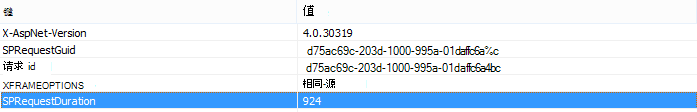
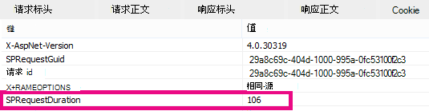

# 使用内容搜索Web 部件而不是内容Web 部件来改进 SharePoint Online 中的性能

本文介绍如何在 SharePoint Server 2013 和 SharePoint Online 中将内容查询Web 部件替换为内容搜索Web 部件来提高性能。
  
SharePoint Server 2013 和 SharePoint Online 最强大的新功能之一是内容搜索 Web 部件 (CSWP) 。 This Web 部件 uses the search index to quickly retrieve results which are shown to the user. 在页面中Web 部件内容搜索Web 部件 (CQWP) 内容查询功能，为用户提高性能。
  
通过内容查询Web 部件内容搜索Web 部件几乎总是可以显著提高 SharePoint Online 上的页面加载性能。 有一些额外的配置可获取正确的查询，但奖励是改进性能和提高用户业绩。
  
## 比较使用内容搜索功能而非内容Web 部件性能提升Web 部件

以下示例显示使用内容搜索服务（而不是内容查询搜索Web 部件可能会获得的相对性能Web 部件。 使用复杂的网站结构和非常广泛的内容查询，效果会更为明显。
  
此示例网站具有以下特征：
  
- 8 级子网站。
    
- 使用自定义"菜"内容类型的列表。
    
- 在Web 部件中，内容查询很广泛，返回内容类型为"结果"的所有项。
    
- 此示例在 8 个网站中仅使用 50 个项目。 对于内容更多的网站，效果将更加明显。
    
下面是内容查询查询结果的屏幕截图Web 部件。
  

  
在Internet Explorer中，使用 F12 开发人员工具的"网络"选项卡查看响应标头的详细信息。  在下面的屏幕截图中， **此页面加载的 SPRequestDuration** 的值为 924 毫秒。 
  

  
 **SPRequestDuration** 指示服务器上为准备页面而完成的工作量。 通过按查询Web 部件内容与搜索功能Web 部件可大大减少呈现页面所花的时间。 相比之下，具有等效内容搜索Web 部件返回相同数量的结果的页面的 **SPRequestDuration** 值为 106 毫秒，如以下屏幕截图中所示： 
  

  
## 在 SharePoint Online 中添加Web 部件搜索服务

添加内容搜索Web 部件与常规内容查询查询Web 部件。 请参阅 Configure a Content Web 部件 *Search Web 部件* in SharePoint 中的"添加内容搜索 [SharePoint。](https://support.office.com/article/Configure-a-Content-Search-Web-Part-in-SharePoint-0dc16de1-dbe4-462b-babb-bf8338c36c9a)
  
## 为内容搜索服务创建正确的搜索Web 部件

添加内容搜索Web 部件，您可以优化搜索并返回您需要的项目。 有关如何执行此操作的详细说明，请参阅在 SharePoint 中配置内容搜索服务中的"在内容搜索 *Web 部件* 中配置高级查询Web 部件 [内容SharePoint。](https://support.office.com/article/Configure-a-Content-Search-Web-Part-in-SharePoint-0dc16de1-dbe4-462b-babb-bf8338c36c9a)
  
## 查询生成和测试工具

有关生成和测试复杂查询的工具，请参阅 Codeplex 上的 [搜索查询](https://sp2013searchtool.codeplex.com/) 工具。 
  

