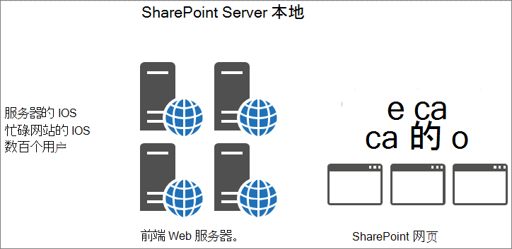

# 在 SharePoint Online 中使用对象缓存

本文介绍了在 SharePoint Server 2013 本地部署和 SharePoint Online 中使用对象缓存的区别。
  
在 SharePoint Online 部署中依赖对象缓存SharePoint负面影响。 对 SharePoint Online 中对象缓存的任何依赖都将降低页面的可靠性。 
  
## SharePoint Online 和 SharePoint Server 2013 对象缓存的工作原理

当 SharePoint Server 2013 在本地托管时，客户具有承载对象缓存的专用前端 Web 服务器。 这意味着缓存专用于一个客户，并且仅受可用内存量和分配给对象缓存的内存量限制。 由于在本地方案中仅提供一个客户，因此前端 Web 服务器通常让用户不断向同一网站提出请求。 这意味着缓存会快速已满，并保留完整的列表查询结果SharePoint用户定期请求的对象。
  

  
因此，用户第二次访问页面时，页面加载时间会改进。 同一页面至少加载四次后，该页面将缓存在所有前端 Web 服务器上。
  
相比之下，在 SharePoint Online 中，服务器更多，站点也更多。 每个用户可能连接到未填充缓存的不同前端 Web 服务器。 或者，缓存可能确实为服务器填充，但该前端 Web 服务器的下一个用户从另一个网站请求页面。 或者，即使下一位用户请求与上次访问时相同的页面，他们也可以负载平衡到缓存中没有该页面的不同前端 Web 服务器。 在上一种情况下，缓存对用户没有帮助。
  
在下图中，每个点表示用户正在请求的页面及其缓存位置。 不同的颜色表示共享使用 SaaS 基础结构的不同客户。
  

  
从图中可以看到，任何给定用户点击具有其页面缓存版本的服务器的可能性都是有希望的。 此外，由于吞吐量较大，并且服务器在许多网站之间共享，缓存不会持续很长时间，因为缓存的空间不足，
  
出于所有这些原因，依赖用户获取缓存对象不是确保 SharePoint Online 中用户体验和页面加载时间质量的有效方法。
  
## 如果无法依赖对象缓存来提高 SharePoint Online 中的性能，我们改为使用什么？

由于不应依赖 SharePoint Online 中的缓存，因此，您应评估使用对象缓存SharePoint自定义项的替代设计方法。 这意味着使用不依赖于对象缓存的性能问题的方法，以便为用户提供良好的结果。 本系列的一些其他文章中对此进行了介绍，其中包括：
  
- [SharePoint Online 的导航选项](navigation-options-for-sharepoint-online.md)
    
- [SharePoint Online 中的缩小和捆绑](minification-and-bundling-in-sharepoint-online.md)
    
- [结合使用 Office 365 内容分发网络和 SharePoint Online](use-microsoft-365-cdn-with-spo.md)
    
- [在 SharePoint Online 中延迟加载图像和 JavaScript](delay-loading-images-and-javascript-in-sharepoint-online.md)
    