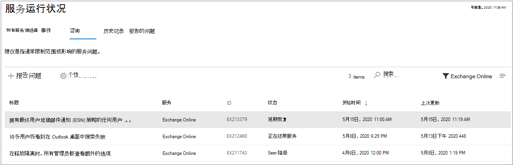

# 如何检查 Microsoft 365 服务运行状况

可在 [Microsoft 365 管理中心](https://go.microsoft.com/fwlink/p/?linkid=2024339)的 **服务运行状况** 页面上查看 Microsoft 服务的运行状况，包括 Office 网页版、Yammer、Microsoft Dynamics CRM 和移动设备管理云服务。 If you are experiencing problems with a cloud service, you can check the service health to determine whether this is a known issue with a resolution in progress before you call support or spend time troubleshooting.

如果无法登录到管理中心，可以使用[服务状态页](https://status.office365.com)检查阻止登录到租户的已知问题。  也请注册 Twitter 并关注我们 [@MSFT365status](https://twitter.com/MSFT365Status) 以查看事件信息。

## 如何查看服务运行状况

1. 在 [https://admin.microsoft.com](https://go.microsoft.com/fwlink/p/?linkid=2024339) 转到 Microsoft 365 管理中心，并使用管理员帐户登录。

    > [!NOTE]
    > 分配为全局管理员或服务支持管理员的人员可以查看服务运行状况。 若要允许 Exchange、SharePoint 和 Skype for Business 管理员查看服务运行状况，必须向他们分配服务管理员角色。 有关可以查看服务运行状况的角色的详细信息，请参阅[关于管理角色](../admin/add-users/about-admin-roles.md?preserve-view=true&view=o365-worldwide#commonly-used-microsoft-365-admin-center-roles)。

2. 要查看服务运行状况，请在管理中心中转到“**运行状况**” > >“**服务运行状况**”，或单击 **主页仪表板** 上的“**服务运行状况**”卡片。 仪表板卡片指示是否存在未解决的服务问题，并提供指向 **服务运行状况** 详细信息页的链接。

3. 在 **服务运行状况** 页上，每个云服务的健康状态以表格格式显示。

   

“**所有服务**”选项卡（默认视图）显示所有服务、其当前运行状况以及任何活动事件或公告。 “**运行状况**”列中的图标和状态指示每个服务的状态。

如果存在服务的活动事件或公告，它们将直接列在嵌套表中的服务名称下。 通过单击服务名称左侧的 V 形图标，可以折叠嵌套表以隐藏此视图中的事件或公告。   

要筛选视图以仅显示所有待解决的事件，请选择页面顶部的“**事件**”选项卡。 选择“**公告**”选项卡将仅显示所有已发布的可用公告。

“**历史记录**”选项卡显示过去 7 天或 30 天内已解决的所有事件和公告。

如果在使用 Microsoft 365 服务时遇到问题，但在“**服务运行状况**”页上未看到该问题，请通过选择“**报告问题**”并填写简短表单来告诉我们。 我们将查看来自其他组织的相关数据和报告，看看这个问题的广泛性及其是否起源于我们的服务。 如果是这样，我们会将其添加为 **服务运行状况** 页上的新事件或公告，你可以在该处跟进其解决方案。 “**报告的问题**”页面将显示租户在此表单中报告的所有问题以及状态。

要自定义显示在仪表板上的服务的视图，请选择“**首选项**” > “**自定义视图**”，然后清除要从服务运行状况仪表板视图中筛选出来的服务的复选框。 请确保已选择要监视的每个服务的复选框。

要注册会影响租户和活动事件状态更改的新事件电子邮件通知，请选择“**首选项**” > “**电子邮件**”，单击“**在电子邮件中向我发送服务运行状态通知**”，然后指定：

- 最多两个电子邮件地址。
- 无论需要事件通知还是公告
- 需要通知的服务

还可以订阅单个事件的电子邮件通知，而非服务的每个事件。 若要这么做，请选择要接收电子邮件通知更新的活动问题，选择“**管理此问题的通知**”，然后指定： 
- 最多两个电子邮件地址。

> [!NOTE]
> 每个管理员可以有自己的偏好设置，每个管理员帐户的上限两个电子邮件地址。

> [!TIP]
> 你也可以在移动设备上使用 [Microsoft 365 管理应用](https://go.microsoft.com/fwlink/p/?linkid=627216)查看服务运行状况，这是一种通过推送通知随时获取最新消息的好方法。

### 查看已发布服务的运行状况详细信息

在“**所有服务**”视图中，选择问题标题以查看问题详细信息页面，该页面显示有关问题的更多信息，包括在处理解决方案时发布的所有消息的提要。 

公告或事件摘要提供以下信息：

- **标题** - 问题的摘要。
- **ID** - 问题的数字标识符。
- **服务** - 受影响服务的名称。
- **上次更新** - 上次更新服务运行状况消息的时间。
- **预计开始时间** - 问题开始的预计时间。
- **状态** - 此问题如何影响服务。
- **对用户的影响** - 简要描述此问题对最终用户的影响。
- **所有更新** - 我们会经常发布消息，说明我们在应用解决方案时取得的进展。

### 翻译服务运行状况详细信息

我们使用机器翻译自动以首选语言显示信息。 有关如何设置语言的详细信息，请阅读 [服务运行状况仪表板的语言翻译](lang-service-health.md)。

### 定义

在大多数情况下，服务正常运行且没有进一步的信息。服务出现问题时，该问题会标识为公告或事件，并显示当前状态。

> [!TIP]
> 服务运行状况中不会显示计划内维护事件。 可以通过" **消息中心**"随时了解最新消息，从而跟踪计划内维护事件。 筛选出分类为"更改计划"的消息，了解发生更改的时间、其影响以及如何做好相应准备。 请参阅 [Microsoft 365 中的消息中心](https://support.office.com/article/38fb3333-bfcc-4340-a37b-deda509c2093)获取更多详细信息。

### 事件和公告

| 图标 | 说明 |
|:-----|:-----|
||如果服务显示公告，这意味着某问题正在影响一些用户，但该服务仍然可用。公告中通常存在针对该问题的变通方法，并且该问题可能是间歇性的，或其作用范围和对用户的影响有限。    |
||如果服务显示遇到活动事件，则说明遇到关键问题，且服务或其主要功能目前不可用。例如，用户可能无法发送和接收电子邮件，或无法登录。事件会对用户产生显著影响。对于正在进行的事件，我们会在服务运行状况仪表板中提供有关调查、缓解措施和解决方法确认的更新。    |

### 状态定义

| 状态 | 定义 |
|:-----|:-----|
|**正在调查** | 我们已发现存在潜在问题，我们正在收集有关情况和影响范围的详细信息。 |
|**服务降级** | 我们已确认存在可能影响服务或功能使用的问题。例如，如果服务的执行速度比平常慢、存在间歇性中断或某功能运行不正常，则可能看到此状态。 |
|**服务中断** | 如果我们确定某问题影响用户访问服务的能力，则你将看到此状态。在本例中，问题十分重大且可持续重现。 |
|**正在还原服务** | 我们已确定问题成因，知晓需要采取的纠正措施，并正在将服务恢复到正常状态。 |
|**延期恢复** | 此状态表示正在执行纠正措施，为大多数用户恢复服务，但恢复所有受影响的系统仍需一些时间。如果我们为了减轻影响，而在实施永久解决措施前实施临时措施，你也可能看到此状态。 |
|**调查暂停** | 如果对潜在问题的详细调查需要请求客户提供其他信息，以便进行进一步的调查，则你将看到此状态。如果我们需要你的参与，我们会告知你所需的数据或日志。 |
|**已还原服务** | 我们确认纠正措施已解决基础问题，且服务已还原到正常状态。若要了解出了什么问题，请查看问题详细信息。 |
|**误报** | 经过详细的调查，我们已经确认该服务正常并运行良好。 未观察到对服务的任何影响，或事件的原因源自服务之外。 |
|**已发布事后报告** | 我们已发布了有关特定问题的文章事件报告, 其中包含根本原因信息和后续步骤, 确保不再发生类似的问题。 |

### 消息发布

| 类型类型 | 定义 |
|:-----|:-----|
|**快速更新** | 对影响广泛的事件进行简短而频繁的增量更新，可供所有客户使用。 |
|**其他详细信息** | 这些其他文章将提供更丰富的技术和解决方法详细信息，以便你更深入地了解事件的处理情况。 这适用于满足 [Exchange Online 监视](/microsoft-365/enterprise/microsoft-365-exchange-monitoring?view=o365-worldwide#requirements)的相同要求的租户， |

### 历史记录

可通过“服务运行状况”查看当前运行状况，并查看过去 30 天内影响租户的任何服务公告和事件的历史记录。 要查看所有服务过去的运行状况，请选择“**历史记录**”视图。

有关我们对运行时间的承诺的详细信息，请参阅 [Microsoft 365 透明操作](/office365/servicedescriptions/office-365-platform-service-description/service-health-and-continuity)。

## 相关主题

[Microsoft 365 管理中心中的活动报告](https://support.office.com/article/0d6dfb17-8582-4172-a9a9-aed798150263)

[消息中心首选项](../admin/manage/message-center.md?preserve-view=true&view=o365-worldwide#preferences)

[如何在管理中心检查 Windows 版本运行状况](/windows/deployment/update/check-release-health)
