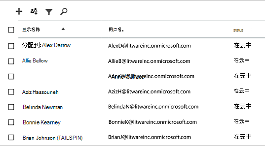
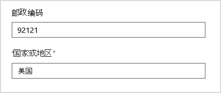
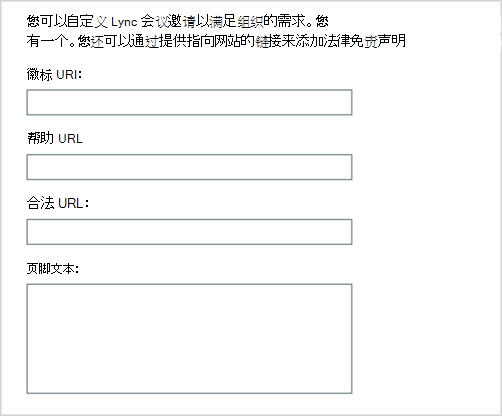
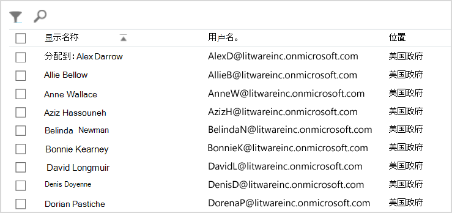
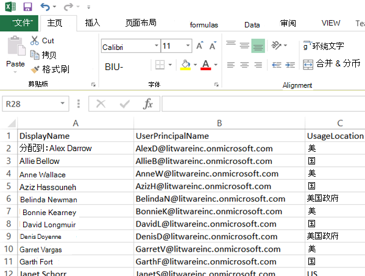

# <a name="why-you-need-to-use-powershell-for-microsoft-365"></a>为什么需要使用 PowerShell for Microsoft 365

*此文章适用于 Microsoft 365 企业版和 Office 365 企业版。* 

使用Microsoft 365 管理中心，你可以管理Microsoft 365用户帐户和许可证。 还可以管理 Microsoft 365 服务，如 Exchange Online、Teams 和 SharePoint Online。 如果您改为使用 PowerShell 来管理这些服务，您可以利用命令行和脚本语言环境实现速度、自动化和其他功能。

本文演示如何使用 PowerShell 管理Microsoft 365：

- 显示你在"管理"中看不到的其他Microsoft 365 管理中心

- 仅能使用 PowerShell 配置功能和设置

- 执行批量操作

- 筛选数据

- 打印或保存数据

- 跨服务管理

请记住，PowerShell for Microsoft 365 是一组用于 Windows PowerShell 的模块，它是基于 Windows 服务和平台的命令行环境。 此环境创建一种命令行管理程序语言，该语言可以使用其他模块进行扩展。 它提供了一种执行简单或复杂的命令或脚本的方法。 例如，为模块安装 PowerShell Microsoft 365并连接到 Microsoft 365 订阅后，可以运行以下命令列出 Microsoft Exchange Online：

```powershell
Get-Mailbox
```

您还可以使用 Microsoft 365 管理中心获取邮箱列表，但计算所有 Web 应用的所有网站的所有列表中的项目并不简单。

PowerShell for Microsoft 365 旨在帮助您管理Microsoft 365，而不是替换Microsoft 365 管理中心。 管理员需要能够使用 PowerShell 进行Microsoft 365因为某些配置过程只能通过 PowerShell 执行Microsoft 365命令。 在这些情况下，您需要了解如何：

- 安装 PowerShell Microsoft 365模块 (每个管理员计算机安装一次) 。

- 连接 PowerShell 会话Microsoft 365， (一次订阅订阅) 。

- 收集运行所需 PowerShell 以运行命令Microsoft 365的信息。

- 运行 PowerShell 以Microsoft 365命令。

了解这些基本技能后，不必使用 **Get-Mailbox** 命令列出邮箱用户。 您也不必了解如何创建与前面引用的命令一样的新命令，以计算所有 Web 应用的所有网站的所有列表中的所有项数。 Microsoft 和管理员社区可根据需要帮助你完成此类任务。

## <a name="powershell-for-microsoft-365-can-reveal-information-that-you-cant-see-with-the-microsoft-365-admin-center"></a>PowerShell for Microsoft 365可以显示你无法通过 Microsoft 365 管理中心

该Microsoft 365 管理中心显示许多有用的信息。 但它不会显示用户、Microsoft 365邮箱和网站的所有可能信息。 下面是用户和组中 *用户* 和Microsoft 365 管理中心：



此视图提供在许多情况下您需要的信息。 但是，有时你需要了解更多。 例如，Microsoft 365许可 (以及Microsoft 365用户可用的) 功能部分取决于用户的地理位置。 可以扩展到居住在美国的用户的策略和功能可能与可以扩展到印度或比利时的用户的策略和功能不同。 请按照以下Microsoft 365 管理中心确定用户的地理位置：

1. 双击用户的"显示名称"。

2. 在用户属性显示窗格中， **选择详细信息**。

3. 在详细信息显示中，选择 **其他详细信息**。

4. 滚动，直到找到标题 **"国家/地区"：**

     

5. 在一张纸上记下用户的显示名称和位置，或将其复制并粘贴至记事本中。

您必须为每个用户重复此过程。 如果您有很多用户，此过程可能很繁琐。 通过 PowerShell for Microsoft 365，您可以使用以下命令为所有用户显示此信息：

```powershell
Get-AzureADUser | Select DisplayName, UsageLocation
```


>[!Note]
>PowerShell Core 不支持 Microsoft Azure Active Directory 模块Windows PowerShell名称中具有 *Msol* 的 cmdlet。 您必须从应用程序运行这些 cmdlet Windows PowerShell。
>

下面是一个结果示例：

```powershell
DisplayName                               UsageLocation
-----------                               -------------
Bonnie Kearney                            GB
Fabrice Canel                             BR
Brian Johnson (TAILSPIN)                  US
Anne Wallace                              US
Alex Darrow                               US
David Longmuir                            BR
```

此 PowerShell 命令的解释是：获取当前 Microsoft 365 订阅 (**Get-AzureADUser**) 中的所有用户，但仅显示每个用户的名称和位置 (**Select DisplayName， UsageLocation**) 。

因为 PowerShell for Microsoft 365支持命令行管理程序语言，所以可以进一步操作 **Get-AzureADUser** 命令获取的信息。 例如，也许你想按用户的位置对这些用户进行排序，将所有巴西用户分组在一起，将所有的美国用户组合在一起，等等。 下面是命令：

```powershell
Get-AzureADUser | Select DisplayName, UsageLocation | Sort UsageLocation, DisplayName
```

下面是一个结果示例：

```powershell
DisplayName                                 UsageLocation
-----------                                 -------------
David Longmuir                              BR
Fabrice Canel                               BR
Bonnie Kearney                              GB
Alex Darrow                                 US
Anne Wallace                                US
Brian Johnson (TAILSPIN)                    US
```

此 PowerShell 命令的解释是：获取当前 Microsoft 365 订阅中的所有用户，但仅显示每个用户的名称和位置，然后按用户的位置排序，然后按其名称 (**Sort UsageLocation， DisplayName**) 。

您还可以使用其他筛选。 例如，如果您只想查看有关巴西用户的信息，请使用此命令：

```powershell
Get-AzureADUser | Where {$_.UsageLocation -eq "BR"} | Select DisplayName, UsageLocation
```

下面是一个结果示例：

```powershell
DisplayName                                           UsageLocation
-----------                                           -------------
David Longmuir                                        BR
Fabrice Canel                                         BR
```

此 PowerShell 命令的解释是：获取当前订阅Microsoft 365其位置为 Brazil (**Where {$ \_ 的所有用户。UsageLocation -eq "BR"}**) ，然后显示每个用户的名称和位置。

 **有关大型域的注释**

如果您有一个拥有数万个用户的大型域，尝试本文中介绍的一些示例可能会导致限制。 根据计算能力和可用网络带宽等因素，您可能尝试一次执行过多。 大型组织可能希望将其中一些 PowerShell 操作拆分为两个命令。

例如，以下命令返回所有用户帐户，并显示每个帐户的名称和位置：

```powershell
Get-AzureADUser | Select DisplayName, UsageLocation
```

这对于较小的域非常有用。 但在大型组织中，您可能需要将该操作拆分为两个命令：一个命令用于将用户帐户信息存储在变量中，另一个命令用于显示所需信息。 下面是一个示例：

```powershell
$x = Get-AzureADUser
$x | Select DisplayName, UsageLocation
```

这组 PowerShell 命令的解释是：
1. 获取当前订阅中的Microsoft 365，将信息存储在名为 $x (**$x = Get-AzureADUser**) 的变量中。
1.  显示变量的内容$x *，但* 仅包括每个用户的用户名和位置 **($x |选择 DisplayName、UsageLocation**) 。

## <a name="microsoft-365-has-features-that-you-can-only-configure-with-powershell-for-microsoft-365"></a>Microsoft 365只能使用 PowerShell 为用户配置Microsoft 365

此Microsoft 365 管理中心旨在提供对适用于大多数环境的常见、有用的管理任务的访问权限。 换句话说，设计Microsoft 365 管理中心，以便典型的管理员能够执行最常见的管理任务。 但是有些任务在管理中心中无法完成。

例如，Skype for Business Online 管理中心提供了一些创建自定义会议邀请的选项：



借助这些设置，您可以为会议邀请添加少许个性化和专业化。 但是，与仅创建自定义会议邀请一样，会议配置设置也更多。 例如，默认情况下，会议允许：

- 匿名用户获取自动参与每个会议的权限。

- 与会者记录会议。

- 您组织中的所有用户在加入会议时被指定为演示者。

这些设置不适用于 Skype for Business Online 管理中心。 你可以从 PowerShell 中控制Microsoft 365。 下面是一个禁用这三个设置的命令：

```powershell
Set-CsMeetingConfiguration -AdmitAnonymousUsersByDefault $False -AllowConferenceRecording $False -DesignateAsPresenter "None"
```

> [!NOTE]
> 若要运行此命令，必须安装 Skype for Business [Online PowerShell 模块](https://www.microsoft.com/download/details.aspx?id=39366)。

此 PowerShell 命令的解释为：

1. 在 **Set-CsMeetingConfigur) ation** (的新 Skype for Business Online 会议设置中，禁用允许匿名用户自动进入会议 (**-AdmitAnonymousUsersByDefault $False**) 。
2.  禁止与会者在会议记录 (**-AllowConferenceRecording** $False) 。
3. 不要将组织中所有用户指定为 **-DesignateAsPresenter ("None") 。**

若要还原这些默认设置 (启用选项) ，请运行以下命令：

```powershell
Set-CsMeetingConfiguration -AdmitAnonymousUsersByDefault $True -AllowConferenceRecording $True -DesignateAsPresenter "Company"
```

还有一些类似的方案，这就是管理员应知道如何运行 PowerShell 以运行命令Microsoft 365的原因。

## <a name="powershell-for-microsoft-365-is-great-for-bulk-operations"></a>PowerShell for Microsoft 365非常适用于批量操作

当您有一个Microsoft 365 管理中心操作时，visual interfaces（例如 Microsoft 365 管理中心）最有价值。 例如，如果需要禁用一个用户帐户，可以使用管理中心快速找到并清除复选框。 这可能比在 PowerShell 中执行类似的操作要容易。

但是，如果您必须更改一大组其他内容中的许多内容或某些选定内容，Microsoft 365 管理中心可能不是最佳工具。 例如，假设你必须更改数千个电话号码上的前缀，或者从你的所有联机网站中删除特定SharePoint Ken *Myer。* 如何在管理中Microsoft 365 管理中心？

对于最后一个示例，假设你拥有数百SharePoint Online 网站，而你不知道 Ken Meyer 是哪个网站的成员。 您必须从以下步骤Microsoft 365 管理中心，然后针对每个网站执行此过程：

1. 选择 **网站的 URL。**

2. 在 **"网站集属性"** 框中，选择" **网站地址** "链接以打开该网站。

3. 在网站中，选择"共享 **"。**

4. 在 **"共享** "对话框中，选择显示对网站具有权限的所有用户的链接：

     

5. 在"**共享对象"** 对话框中，选择"高级 **"。**

6. 向下滚动用户列表，查找并选择 Ken Myer (假定他拥有访问网站) ，然后选择"删除 **用户权限"。**

对于几百 *个网站，* 这可能需要很长时间。

另一个选择是在 PowerShell 中运行以下命令Microsoft 365从所有网站中删除 Ken Myer：

```powershell
Get-SPOSite | ForEach {Remove-SPOUser -Site $_.Url -LoginName "kenmyer@litwareinc.com"}
```

> [!NOTE]
> 此命令要求安装 SharePoint [Online PowerShell 模块](/powershell/sharepoint/sharepoint-online/connect-sharepoint-online)。

此 PowerShell 命令的解释是：在当前 Microsoft 365 订阅 (**Get-SPOSite**) 中获取所有 SharePoint 网站，并针对每个网站从可以访问它的用户列表中删除 Ken Meyer (**ForEach {Remove-SPOUser -Site $ \_ 。Url -LoginName "kenmyer \@ litwareinc.com"}) 。**

我们Microsoft 365从每个网站删除 Ken Meyer，包括他无法访问的网站。 因此，结果将显示他无法访问的网站的错误。 我们可以在此命令上使用附加条件，以仅从登录列表中具有 Ken Meyer 的站点中删除 Ken Meyer。 但返回的错误不会损害网站本身。 此命令可能需要几分钟才能针对数百个网站运行，而不是在运行 Microsoft 365 管理中心。

下面是另一个批量操作示例。 使用此命令将新管理员 *为SharePoint用户）* 添加到组织的所有网站：

```powershell
Get-SPOSite | ForEach {Add-SPOUser -Site $_.Url -LoginName "bkearney@litwareinc.com" -Group "Members"}
```

此 PowerShell 命令的解释是：在当前 Microsoft 365 订阅中获取所有 SharePoint 网站，并针对每个网站，通过将用户登录名添加到网站 (**ForEach {Add-SPOUser -Site $ 的 Members 组，允许其访问每个网站。 \_Url -LoginName "bkearney \@ litwareinc.com" -Group "Members"}**) 。

## <a name="powershell-for-microsoft-365-is-great-at-filtering-data"></a>PowerShell for Microsoft 365非常出色的筛选数据

The Microsoft 365 管理中心 provides several ways to filter your data to easily locate a targeted subset of information. 例如，可以通过 Exchange 轻松筛选用户邮箱的几乎所有属性。 例如，下面是居住在布卢明顿市的所有用户的邮箱列表：


Exchange 管理中心还允许您组合筛选条件。 例如，您可以查找居住在布卢明顿并工作于财务部门的所有用户的邮箱。

但是，在管理中心内可以执行Exchange限制。 例如，你无法轻松找到居住在布卢 *明顿或* 圣地亚哥的用户的邮箱，或者所有不居住在布卢明顿的用户的邮箱。

可以使用以下 PowerShell for Microsoft 365 命令获取居住在布卢明顿或圣地亚哥的所有用户的邮箱列表：

```powershell
Get-User | Where {$_.RecipientTypeDetails -eq "UserMailbox&quot; -and ($_.City -eq &quot;San Diego&quot; -or $_.City -eq &quot;Bloomington")} | Select DisplayName, City
```

下面是一个结果示例：

```powershell
DisplayName                              City
-----------                              ----
Alex Darrow                              San Diego
Bonnie Kearney                           San Diego
Julian Isla                              Bloomington
Rob Young                                Bloomington
```

此 PowerShell 命令的解释是：获取当前 Microsoft 365 订阅中在圣地亚哥或布卢明顿市拥有邮箱的所有用户 (**{$ \_ 。RecipientTypeDetails -eq "UserMailbox" -and ($ \_ .City -eq "San Diego" -or $ \_ .City -eq "Bloomington") }**) ，然后显示每个名称的名称和城市 (**选择 DisplayName， City**) 。

下面是为居住在布卢明顿以外的任何地方的用户列出所有邮箱的命令：

```powershell
Get-User | Where {$_.RecipientTypeDetails -eq "UserMailbox" -and $_.City -ne "Bloomington"} | Select DisplayName, City
```

下面是一个结果示例：

```powershell
DisplayName                               City
-----------                               ----
MOD Administrator                         Redmond
Alex Darrow                               San Diego
Allie Bellew                              Bellevue
Anne Wallace                              Louisville
Aziz Hassouneh                            Cairo
Belinda Newman                            Charlotte
Bonnie Kearney                            San Diego
David Longmuir                            Waukesha
Denis Dehenne                             Birmingham
Garret Vargas                             Seattle
Garth Fort                                Tulsa
Janet Schorr                              Bellevue
```

此 PowerShell 命令的解释是：获取当前 Microsoft 365 订阅中邮箱未位于布卢明顿市 (**{$ 的所有用户 \_ 。RecipientTypeDetails -eq "UserMailbox" -and $ \_ .City -ne "Bloomington"}**) ，然后显示每个名称和城市。

### <a name="use-wildcards"></a>使用通配符

您还可以在 PowerShell 筛选器中使用通配符来匹配部分名称。 例如，假设您要查找用户帐户。 你只记得用户的姓氏是 *Anderson，* 也可能是 *Henderson* 或 *Jorgenson*。

通过使用搜索工具并执行三Microsoft 365 管理中心搜索，可以在搜索工具中跟踪该用户：

- 一次是搜索  *Anderson*

- 一次是搜索  *Henderson*

- 一次是搜索  *Jorgenson*

由于所有这三个名称以"son"结尾，因此您可以告诉 PowerShell 显示其名称以"son"结尾的所有用户。 下面是命令：

```powershell
Get-User -Filter '{LastName -like "*son"}'
```

此 PowerShell 命令的解释是：获取当前 Microsoft 365 订阅中的所有用户，但使用仅列出姓氏以"son"结尾的用户的筛选器 (**-Filter '{LastName -like " \* son"}'**) 。 \*代表任意一组字符，这些字符是用户姓氏中的字母。

## <a name="powershell-for-microsoft-365-makes-it-easy-to-print-or-save-data"></a>PowerShell for Microsoft 365可以轻松打印或保存数据

The Microsoft 365 管理中心 lets you view lists of data. 下面是显示已启用 Skype for Business Online 的用户列表的 Skype for Business Online 管理中心的示例：



若要将该信息保存到文件中，必须将其粘贴到文档或Microsoft Excel工作表中。 这两种情况都可能需要其他格式。 此外，Microsoft 365 管理中心无法直接打印显示的列表。

幸运的是，您可以使用 PowerShell 不仅显示列表，还可以将其保存到可轻松导入到Excel。 下面的示例命令将 Skype for Business Online 用户数据保存到逗号分隔值 (CSV) 文件中，然后可以轻松地将其导入到 Excel 工作表中：

```powershell
Get-CsOnlineUser | Select DisplayName, UserPrincipalName, UsageLocation | Export-Csv -Path "C:\Logs\SfBUsers.csv" -NoTypeInformation
```

下面是一个结果示例：



此 PowerShell 命令的解释是：使用 **Get-CsOnlineUser** Skype for Business 获取当前 Microsoft 365 订阅 (所有) ;仅获取 Select **DisplayName、UserPrincipalName、UsageLocation** (用户名、UPN 和) ;然后将该信息保存在名为 C： LogsSfBUsers.csv (\\ \\ **Export-Csv -Path "C： Logs \\ \\SfBUsers.csv" -NoTypeInformation**) 。

您还可以使用选项将此列表另存为 XML 文件或 HTML 页。 事实上，通过其他 PowerShell 命令，您可以直接将其另存为Excel文件，并设置任何自定义格式。

还可以将显示列表的 PowerShell 命令的输出直接发送到 Windows。 下面是一个示例命令：

```powershell
Get-CsOnlineUser | Select DisplayName, UserPrincipalName, UsageLocation | Out-Printer
```

打印的文档如下所示：


此 PowerShell 命令的解释是：获取当前 Skype for Business 订阅中所有 Microsoft 365 Online 用户;仅获取用户名、UPN 和位置;然后将该信息发送到默认打印机Windows打印机 (**打印机**) 。

打印的文档的格式与 PowerShell 命令窗口中的显示格式相同。 若要获取硬拷贝， **只需添加|命令末尾** 的打印机输出。

## <a name="powershell-for-microsoft-365-lets-you-manage-across-server-products"></a>PowerShell for Microsoft 365允许你跨服务器产品进行管理

构成Microsoft 365旨在协同工作。 例如，假设您向用户Microsoft 365，并指定诸如用户的部门和电话号码这样的信息。 如果您访问以下任一服务中的用户信息，该信息Microsoft 365：Skype for Business Online、Exchange 或 SharePoint。

不过，此规则适用于跨产品套件的一般信息。 特定于产品的信息（如有关用户邮箱Exchange）通常无法跨套件使用。 例如，有关用户邮箱是否已启用的信息仅在管理中心Exchange可用。

假设您要为您的所有用户生成显示以下信息的报告：

- 用户的显示名称

- 用户是否获得许可证Microsoft 365

- 用户的 Exchange 邮箱是否已启用

- 用户是否已启用 Skype for Business Online

您无法轻松地在报告生成此类Microsoft 365 管理中心。 相反，您必须创建单独的文档来存储信息，如Excel工作表。 然后，从 Microsoft 365 管理中心 获取所有用户名和许可信息，从 Exchange 管理中心获取邮箱信息，从 Skype for Business Online 管理中心获取 Skype for Business Online 信息，然后合并该信息。

替代方法是使用 PowerShell 脚本来编译报告。

以下示例脚本比到目前为止在本文看到的命令更复杂。 但是，它显示了使用 PowerShell 创建难以通过其他方式获取的信息视图的可能性。 下面是编译和显示所需的列表的脚本：

```powershell
$x = Get-AzureADUser

foreach ($i in $x)
    {
      $y = Get-Mailbox -Identity $i.UserPrincipalName
      $i | Add-Member -MemberType NoteProperty -Name IsMailboxEnabled -Value $y.IsMailboxEnabled

      $y = Get-CsOnlineUser -Identity $i.UserPrincipalName
      $i | Add-Member -MemberType NoteProperty -Name EnabledForSfB -Value $y.Enabled
    }

$x | Select DisplayName, IsLicensed, IsMailboxEnabled, EnabledforSfB
```

下面是一个结果示例：

```powershell
DisplayName             IsLicensed   IsMailboxEnabled   EnabledForSfB
-----------             ----------   ----------------   --------------
Bonnie Kearney          True         True               True
Fabrice Canel           True         True               True
Brian Johnson           False        True               False
Anne Wallace            True         True               True
Alex Darrow             True         True               True
David Longmuir          True         True               True
Katy Jordan             False        True               False
Molly Dempsey           False        True               False
```

此 PowerShell 脚本的解释为：

1. 获取当前 Microsoft 365 订阅中的所有用户，将信息存储在名为 *$x* (**$x = Get-AzureADUser**) 的变量中。
1. 启动一个循环，该循环在 $x) $x (**foreach** ($i 中$x) ) 。
1. 定义一个名为 *$y* 的变量， ($y **= Get-Mailbox -Identity $i.UserPrincipalName) 。**
1. 向名为 *IsMailBoxEnabled* 的用户信息添加新属性。 将此属性设置为用户邮箱 ($i | Add-Member **-MemberType NoteProperty -Name IsMailboxEnabled -Value $y.IsMailboxEnabled) 的 IsMailBoxEnabled** 属性的值。
1. 定义一个名为 *$y* 的变量， ($y **= Get-CsOnlineUser -Identity $i.UserPrincipalName**) 中存储用户的 Skype for Business Online 信息。
1. 向名为 *EnabledForSfB* 的用户信息添加新属性。 将此属性设置为用户的 Skype for Business Online 信息 (**$i | Add-Member -MemberType NoteProperty -Name EnabledForSfB -Value $y.Enabled**) 属性的值。
1. 显示用户列表，但仅包括其姓名、是否获得许可以及指示其邮箱是否已启用以及是否已启用 Skype for Business Online ($x | **选择 DisplayName、IsLicensed、IsMailboxEnabled、EnabledforSfB**) 。

## <a name="see-also"></a>另请参阅

[PowerShell for Microsoft 365 入门](getting-started-with-microsoft-365-powershell.md)

[使用 PowerShell 管理 Microsoft 365 用户帐户、许可证和组](manage-user-accounts-and-licenses-with-microsoft-365-powershell.md)

[使用 Windows PowerShell 在 Microsoft 365 中创建报告](use-windows-powershell-to-create-reports-in-microsoft-365.md)