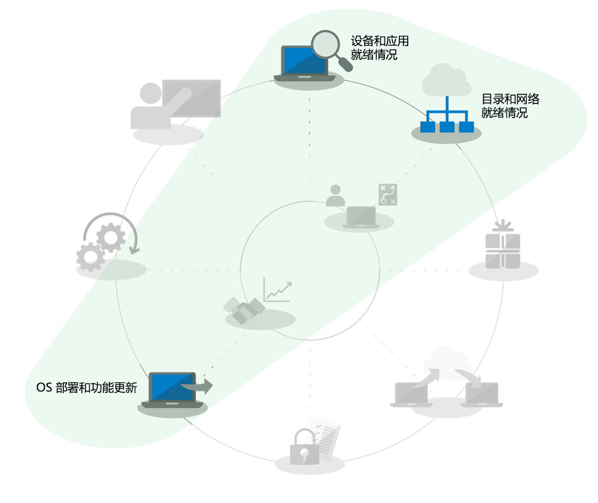
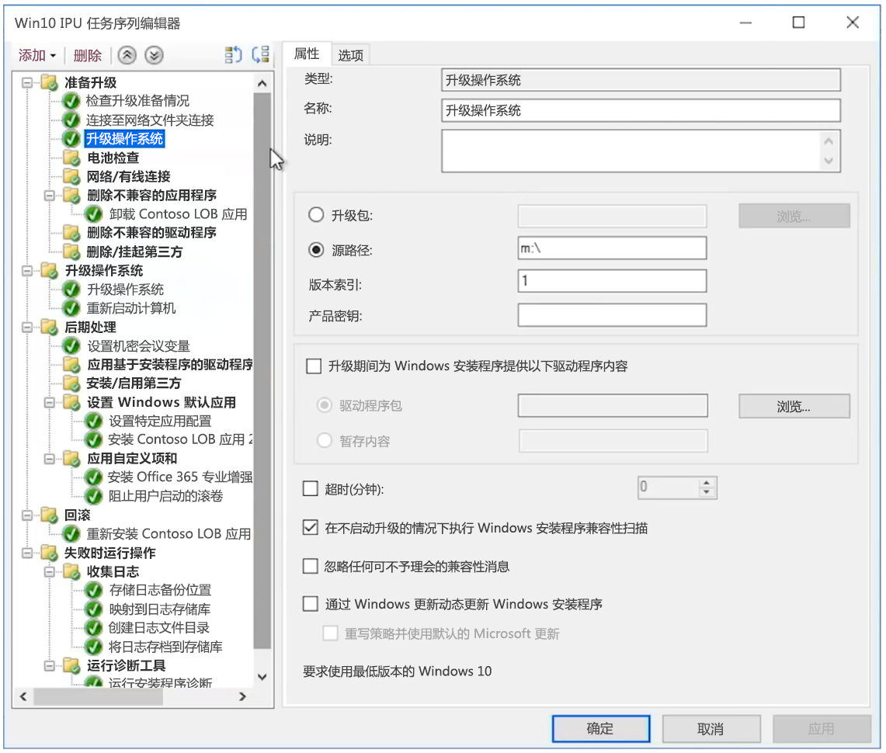

# 适用于大型组织的 windows 7 到 Windows 10 自动就地升级

从2020年1月14日开始, 将不再为运行 Windows 7 的电脑提供安全更新或支持。 从 Windows 7 升级至 Windows 10 仅一个月之遥, 部署升级有多种方法，IT 社区中的一个常见问题是, "从 Windows 7 升级到 Windows 10 最快的方法是什么？" 简单的回答是, 对现有电脑进行就地升级, 因为这样的话，你在桌面部署过程中就不必面面俱到。

使用就地升级, 许多桌面部署过程因此而简化, 尤其是:

  - **应用程序包**及本行业所需应用程序的再安装 – Windows 7 环境中已有这些

  - **文件迁移**及基本用户设置 – 当用户保留设备时, 也保留了最近一次的安装

上面的部署过程环形图中的灰显任务不可完全忽略，但为了节省时间，我们假定你将保留安全配置，以及将在部署后更改软件更新过程，我们将假设你的用户主要在家中接受 Windows 组件的用户培训，因为自 2012 年以来私人购买的 Windows 计算机在大多数情况下没有预加载 Windows 7，自 2015 年 Windows 10 发布以来，大多数 Windows 7 家庭系统也已升级到 Windows 10。

## 就地升级的可靠性、安全措施和规模

就地升级到 Windows 10 是一种可靠的方法, 可将运行 Windows 7 或更高版本的现有设备升级到 Windows 10, 而无需文件迁移或应用程序重新安装。 就地升级后, 用户的文件、设置和可用的应用与先前的 Windows 7 安装是一致的。 你可能希望利用此机会来清理现有应用或设置, 但实际上，越是接近 2020 年 1 月 Windows 7 的支持结束日，你越是没有时间做升级以外的事。 类似体系结构（32 位到 32 位或 64 位到 64 位）和类似版本的 Windows（专业版到专业版或企业版到企业版）之间的升级也可以。

默认情况下, 升级过程会备份以前的 Windows 安装, 以便在升级失败时或者设备或应用程序升级后不能正常运行时, 计算机可以回滚到 Windows 7。 默认情况下, 已升级的电脑有10天的时间可在必要时手动回滚到 Windows 7。

可使用操作系统部署工具（[Microsoft Endpoint Configuration Manager](https://docs.microsoft.com/configmgr/osd/deploy-use/create-a-task-sequence-to-upgrade-an-operating-system) 或 [Microsoft Deployment Toolkit](https://docs.microsoft.com/windows/deployment/upgrade/upgrade-to-windows-10-with-the-microsoft-deployment-toolkit)）自动化就地升级。 本文重点介绍了自动化和优化的方法, 并提供了指向相关资源的链接以给予更多帮助。

## 升级少量计算机

对于一台或几台计算机, 较之更自动化的方法，手动升级方法通常是最佳选择。 如果你有批量许可，则可在 [Microsoft 商店](https://go.microsoft.com/fwlink/p/?LinkId=808282)、其他软件零售商或[批量许可服务中心](https://www.microsoft.com/licensing/servicecenter/default.aspx)找到所需的软件和许可证。 有关将单台电脑升级到 windows 10 以及升级后还原选项的详细指南, 请参阅[windows 7 到 windows 10 手动升级分步指南](https://docs.microsoft.com/microsoft-365/enterprise/windows-7-to-windows-10-upgrade)。

## 如何升级大批计算机

如果管理几十或数千台计算机, 则最佳选择是使用 Microsoft Endpoint Configuration Manager 或 Microsoft Deployment Toolkit 的任务序列自动化来执行就地升级。 虽然在大多数情况下, 此过程非常可靠, 但根据要升级的计算机数量，仍有必要进行测试和控制, 以确保大规模的成功。

这意味着你可以跳过目录就绪或与 Azure Active Directory、Office 和行业应用程序安装、打包及用户文件迁移相关的任务, 因为这些在升级过程中依然保留，非常安全。 这些方面均可随着时间的推移而提高。

"升级部署" 选项将在[操作系统部署和功能更新](https://www.aka.ms/mdd6)中讲述, 虽然你可以轻松构建脚本化解决方案（在无管理员参与或管理员参与最少的情况下，自动化运行 Windows 10 设置），但是任务序列将赋予你更进一步的控制权：

  - 执行预部署检查，

  - 升级前管理驱动器加密状态，

  - 升级前卸载已知的有问题的驱动程序和应用程序，

  - 升级后安装其他驱动程序和应用，

  - 升级后管理驱动器加密状态，

  - 在升级失败的情况下，将电脑还原到先前的状态 – 重新安装卸载的应用或驱动程序，

  - 以及需要配置以进入业务就绪状态的其他任务

升级可能无法完成或不可能升级的最常见原因包括以下方面:

  - 旧版的设备驱动程序

  - 第三方磁盘加密

  - 低水平代码解决方案, 如反恶意软件、VPN 或虚拟化

[升级任务序列](https://docs.microsoft.com/configmgr/osd/deploy-use/create-a-task-sequence-to-upgrade-an-operating-system)模板内置于 Microsoft Endpoint Configuration Manager（当前分支版本）中，可用于多个版本。 在最新版本中，Configuration Manager 的技术得到显著的增强，使以下过程更高效：确定设备和 Office 兼容性准备情况，减少网络拥堵及配置 OneDrive 备份之类的新选项。 观看此[Microsoft 技术展](https://youtu.be/CYRnAmCD7ls)，进一步了解 Configuration Manager 操作系统部署的最新更新。

如果未使用 Microsoft Endpoint Configuration Manager，则可以使用 Microsoft Deployment Toolkit 来构建和执行升级部署任务序列。

## 预缓存任务序列升级

配置管理器部署任务序列的[预缓存选项](https://docs.microsoft.com/configmgr/osd/deploy-use/create-a-task-sequence-to-upgrade-an-operating-system#configure-pre-cache-content)允许客户端在任务序列对操作系统进行升级之前下载相关的操作系统 升级程序包。 以前, 启动任务序列将启动程序包下载。 通过预缓存内容, 客户端可选择仅在收到部署后立即下载适用的 操作系统 升级包和所有其他参考内容。

结合兼容性扫描的预缓存任务序列

除了节省升级包下载时间之外, 还可以预缓存升级包, 及使用 Windows 安装程序评估就地升级是否会在执行实际的 Windows 升级之前完成。 下面的命令行语法可用于以无提示方式执行兼容性扫描, 及了解 Windows 安装程序是否将设备评估为升级准备就绪。

然后, 日志将被发送到已指定的服务器路径, Windows 安装程序不会显示给用户, 并且无需用户交互即可关闭。

日志将显示如下:

1.  如果安装程序没有发现任何兼容性问题, 且电脑满足所有要求，则将返回 MOSETUP\_E\_COMPAT\_SCANONLY (0xC1900210)

2.  如果安装程序发现可解决的兼容性问题（如应用程序已知兼容性问题），则将返回 MOSETUP\_E\_COMPAT\_INSTALLREQ\_BLOCK (0xC1900208)

3.  如果安装程序发现电脑不符合 Windows 10 的要求, 则将返回 MOSETUP\_E\_COMPAT\_SYSREQ\_BLOCK (0xC1900200)

4.  如果安装程序发现电脑没有足够的可用空间供安装, 则将返回 MOSETUP\_E\_INSTALLDISKSPACE\_BLOCK (0xC190020E)

使用兼容性扫描对大批电脑部署了预缓存序列后, 可开始分析日志文件以获取设备准备情况。 使用上面列出的输出, \#1 (0xC1900210) 即为“准备部署”, 而\#4 (0xC190020E) 可通过释放磁盘空间来解决。 你将谨慎考虑想要删除的内容，可以从 Windows 更新清理、回收站和“临时文件”入手, 许多情况下清理这些内容将提供足够的空间来完成升级。 你可以根据需要随时运行兼容性扫描, 直至发现电脑已准备好进行就地升级。 有关 Windows 安装程序命令行选项的详细信息, 请参阅 <https://aka.ms/setupswitches>

## [桌面部署中心](https://aka.ms/howtoshift)
