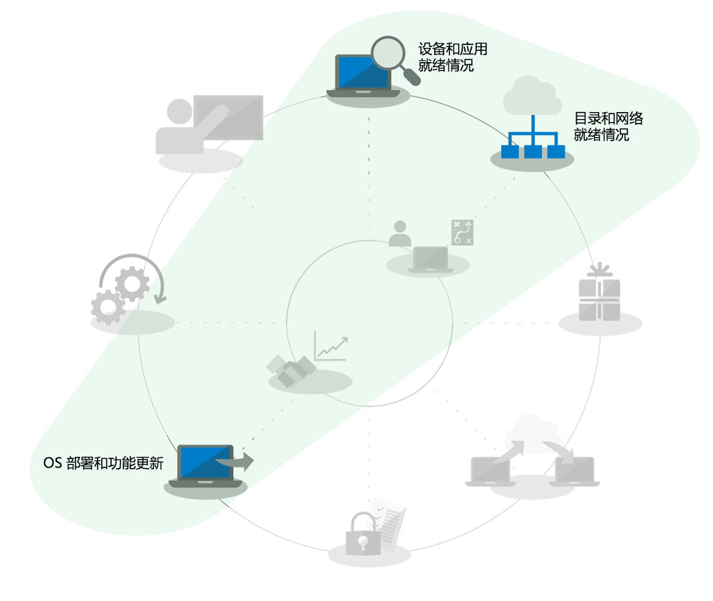
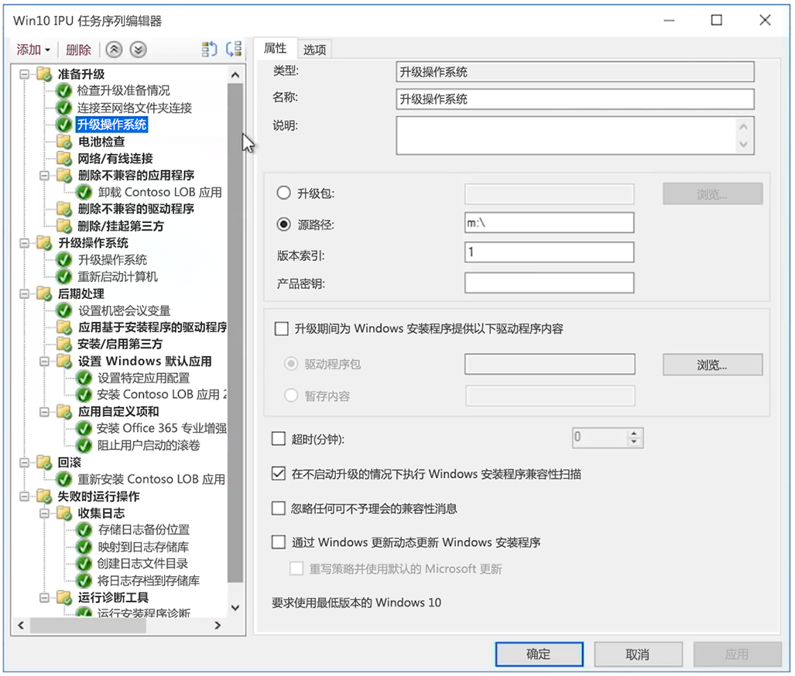

# 适用于大型组织的 windows 7 到 Windows 10 自动就地升级Windows 7 to Windows 10 automated in-place upgrades for large organizations

从2020年1月14日开始, 将不再为运行 Windows 7 的电脑提供安全更新或支持。Starting January 14, 2020, security updates or support for PCs running Windows 7 will no longer be provided. 从 Windows 7 升级至 Windows 10 仅一个月之遥, 部署升级有多种方法，IT 社区中的一个常见问题是, "从 Windows 7 升级到 Windows 10 最快的方法是什么？"With just a months left to shift from Windows 7 to Windows 10 and multiple options to deploy, a common question in the IT community is, “What’s the fastest way to move from Windows 7 to Windows 10?” 简单的回答是, 对现有电脑进行就地升级, 因为这样的话，你在桌面部署过程中就不必面面俱到。The short answer is to perform in-place upgrades for existing PCs and in doing that you can reduce focus on several aspects of the desktop deployment process.

使用就地升级, 许多桌面部署过程因此而简化, 尤其是:Using in-place upgrades, several desktop deployment processes get reduced dramatically in scope, especially:

  - **应用程序包**及本行业所需应用程序的再安装 – Windows 7 环境中已有这些**Application packaging** and redelivery of required line-of-business apps – these are simply carried forward from the Windows 7 environment

  - **文件迁移**及基本用户设置 – 当用户保留设备时, 也保留了最近一次的安装**File migration** and basic user settings – these are also carried forward from the previous install when the same user retains the device

上面的部署过程环形图中的灰显任务不可完全忽略，但为了节省时间，我们假定你将保留安全配置，以及将在部署后更改软件更新过程，我们将假设你的用户主要在家中接受 Windows 组件的用户培训，因为自 2012 年以来私人购买的 Windows 计算机在大多数情况下没有预加载 Windows 7，自 2015 年 Windows 10 发布以来，大多数 Windows 7 家庭系统也已升级到 Windows 10。The grayed-out tasks in the deployment process wheel graphic above are not items that you can completely ignore, but to save time this assumes that you’ll bring forward your security configuration, change software update processes post-deployment, and we’ll assume that your user training for the Windows component has largely happened at home for your users, as privately purchased Windows computers since 2012 for most part have not had Windows 7 pre-loaded and since the release of Windows 10 in 2015, the majority of Windows 7 home systems have also been upgraded to Windows 10.

## 就地升级的可靠性、安全措施和规模In-place upgrade reliability, safeguards, and scale

就地升级到 Windows 10 是一种可靠的方法, 可将运行 Windows 7 或更高版本的现有设备升级到 Windows 10, 而无需文件迁移或应用程序重新安装。In-place upgrades to Windows 10 are a reliable approach for moving an existing device running Windows 7 or newer to Windows 10, without requiring file migration or application reinstallation. 就地升级后, 用户的文件、设置和可用的应用与先前的 Windows 7 安装是一致的。After an in-place upgrade, the user’s files, settings and available apps are consistent with their previous Windows 7 installation. 你可能希望利用此机会来清理现有应用或设置, 但实际上，越是接近 2020 年 1 月 Windows 7 的支持结束日，你越是没有时间做升级以外的事。While you might want to take this opportunity to clean-up existing apps or settings, realistically as we get closer to the Windows 7 end of support date in January 2020, time is running out to pursue other options. 类似体系结构（32 位到 32 位或 64 位到 64 位）和类似版本的 Windows（专业版到专业版或企业版到企业版）之间的升级也可以。Upgrades also work when moving from like-to-like architectures (32-bit to 32-bit or 64-bit to 64-bit) and like-to-like editions of Windows (Professional to Pro or Enterprise to Enterprise).

默认情况下, 升级过程会备份以前的 Windows 安装, 以便在升级失败时或者设备或应用程序升级后不能正常运行时, 计算机可以回滚到 Windows 7。The upgrade process by default backs-up your previous Windows installation as part of upgrade, so that in the event of an upgrade failure or if a device or application doesn’t function properly post-upgrade, the computer can roll back to Windows 7. 默认情况下, 已升级的电脑有10天的时间可在必要时手动回滚到 Windows 7。Upgraded PCs by default have 10 days so you can manually initiate a roll back to Windows 7 if necessary.

可使用操作系统部署工具（[系统中心配置管理器](https://docs.microsoft.com/zh-CN/sccm/osd/deploy-use/create-a-task-sequence-to-upgrade-an-operating-system)或[Microsoft 部署工具包](https://docs.microsoft.com/zh-CN/windows/deployment/upgrade/upgrade-to-windows-10-with-the-microsoft-deployment-toolkit)）自动化就地升级。In-place upgrades can be automated using operating system deployment tools like [System Center Configuration Manager](https://docs.microsoft.com/en-us/sccm/osd/deploy-use/create-a-task-sequence-to-upgrade-an-operating-system) or the [Microsoft Deployment Toolkit](https://docs.microsoft.com/en-us/windows/deployment/upgrade/upgrade-to-windows-10-with-the-microsoft-deployment-toolkit). 本文重点介绍了自动化和优化的方法, 并提供了指向相关资源的链接以给予更多帮助。This article highlights the automated approaches and optimizations along with links to related resources for additional help.

## 升级少量计算机Upgrading a small number of computers

对于一台或几台计算机, 较之更自动化的方法，手动升级方法通常是最佳选择。For a single computer or a handful of computers, the manual approach to upgrade is usually the best option compared to more automated approaches. 如果你有批量许可，则可在 [Microsoft 商店](http://go.microsoft.com/fwlink/p/?LinkId=808282)、其他软件零售商或[批量许可服务中心](https://www.microsoft.com/licensing/servicecenter/default.aspx)找到所需的软件和许可证。You can find the necessary software and licenses at the [Microsoft Store](http://go.microsoft.com/fwlink/p/?LinkId=808282), other software retailers, or at the [Volume Licensing Service Center](https://www.microsoft.com/licensing/servicecenter/default.aspx) if you have volume licensing. 有关将单台电脑升级到 windows 10 以及升级后还原选项的详细指南, 请参阅[windows 7 到 windows 10 手动升级分步指南](https://docs.microsoft.com/zh-CN/microsoft-365/enterprise/windows-7-to-windows-10-upgrade)。For detailed guidance to upgrade a single PC to Windows 10 as well as post-upgrade restore options, see the [Windows 7 to Windows 10 manual upgrade step-by-step guide](https://docs.microsoft.com/en-us/microsoft-365/enterprise/windows-7-to-windows-10-upgrade).

## 如何升级大批计算机How to upgrade many computers

如果管理几十或数千台计算机, 则最佳选择是使用系统中心配置管理器或 Microsoft 部署工具包的任务序列自动化来执行就地升级。If you manage dozens or thousands of computers, then your best option is to perform in-place upgrades using task sequence automation with System Center Configuration Manager or the Microsoft Deployment Toolkit. 虽然在大多数情况下, 此过程非常可靠, 但根据要升级的计算机数量，仍有必要进行测试和控制, 以确保大规模的成功。While the process is very reliable in most situations, depending on the number of PCs you are upgrading, it still makes sense to have the necessary testing and controls in place to ensure success at scale.

这意味着你可以跳过目录就绪或与 Azure Active Directory、Office 和行业应用程序安装、打包及用户文件迁移相关的任务, 因为这些在升级过程中依然保留，非常安全。This means that you may skip directory readiness or tasks associated with Azure Active Directory, Office and line of business app delivery and packaging and user file migration since those aspects are retained as part of upgrade, and security should be at minimum carried forward. 这些方面均可随着时间的推移而提高。These areas can all be enhanced over time.

"升级部署" 选项将在[操作系统部署和功能更新](http://www.aka.ms/mdd6)中讲述, 虽然你可以轻松构建脚本化解决方案（在无管理员参与或管理员参与最少的情况下，自动化运行 Windows 10 设置），但是任务序列将赋予你更进一步的控制权：The upgrade deployment option is covered in [OS Deployment and Feature Updates](http://www.aka.ms/mdd6) and although you can easily build scripted solutions that will run Windows 10 setup in an automated way with minimal or no admin interaction, a task sequence will give you more granular control to:

  - 执行预部署检查，Perform pre-deployment checks,

  - 升级前管理驱动器加密状态，Manage drive encryption state pre-upgrade,

  - 升级前卸载已知的有问题的驱动程序和应用程序，Uninstall known problematic drivers and apps pre-upgrade,

  - 升级后安装其他驱动程序和应用，Install additional drivers and apps post-upgrade,

  - 升级后管理驱动器加密状态，Manage drive encryption state post-upgrade,

  - 在升级失败的情况下，将电脑还原到先前的状态 – 重新安装卸载的应用或驱动程序，Restore a PC to a previous state – where uninstalled apps or drivers are reinstalled – in the event of a failed upgrade,

  - 以及需要配置以进入业务就绪状态的其他任务Along with anything else you need to configure to achieve a business ready state

升级可能无法完成或不可能升级的最常见原因包括以下方面:The most common reasons upgrades may not complete or are not possible include challenges with:

  - 旧版的设备驱动程序Outdated device drivers

  - 第三方磁盘加密3rd party disk encryption

  - 低水平代码解决方案, 如反恶意软件、VPN 或虚拟化Low level code solutions, such as anti-malware, VPN or virtualization

  [升级任务序列](https://docs.microsoft.com/zh-CN/sccm/osd/deploy-use/create-a-task-sequence-to-upgrade-an-operating-system)模板内置于“系统中心配置管理器”目前的分支中, 可用于多个版本。[Upgrade task sequence](https://docs.microsoft.com/en-us/sccm/osd/deploy-use/create-a-task-sequence-to-upgrade-an-operating-system) templates are built into System Center Configuration Manager current branch and have been available for several releases. 在最新版本中, 系统中心配置管理器的技术得到显著的增强, 使以下过程更高效：确定设备和 Office 兼容性准备情况, 减少网络拥堵及配置 OneDrive 备份之类的新选项。In recent releases, there have been significant technology enhancements to System Center Configuration Manager that make the process even more efficient for determining device and Office compatibility readiness, reducing network traffic, and configuring new options such as OneDrive backup. 观看此[Microsoft 技术展](https://youtu.be/CYRnAmCD7ls) , 进一步了解“系统中心配置管理器”操作系统部署的最新更新。Watch this [Microsoft Mechanics show](https://youtu.be/CYRnAmCD7ls) to learn more about recent updates to System Center Configuration Manager OS deployment.

如果未使用系统中心配置管理器, 则可以使用 Microsoft 部署工具包来构建和执行升级部署任务序列。If you do not use System Center Configuration Manager, you can use the Microsoft Deployment Toolkit to build and execute upgrade deployment task sequences.

## 预缓存任务序列升级Pre-cache task sequence upgrades

配置管理器部署任务序列的[预缓存选项](https://docs.microsoft.com/zh-CN/sccm/osd/deploy-use/create-a-task-sequence-to-upgrade-an-operating-system#configure-pre-cache-content)允许客户端在任务序列对操作系统进行升级之前下载相关的操作系统 升级程序包。The [pre-cache option](https://docs.microsoft.com/en-us/sccm/osd/deploy-use/create-a-task-sequence-to-upgrade-an-operating-system#configure-pre-cache-content) for Configuration Manager deployment task sequence allows clients to download relevant OS upgrade package content before the task sequence upgrades the operating system. 以前, 启动任务序列将启动程序包下载。Previously, initiating the task sequence would initiate the download of package content. 通过预缓存内容, 客户端可选择仅在收到部署后立即下载适用的 操作系统 升级包和所有其他参考内容。Pre-cache content also gives you the option for the client to only download the applicable OS upgrade package and all other referenced content as soon as it receives the deployment.

结合兼容性扫描的预缓存任务序列Pre-cache task sequences combined with compatibility scans

除了节省升级包下载时间之外, 还可以预缓存升级包, 及使用 Windows 安装程序评估就地升级是否会在执行实际的 Windows 升级之前完成。In addition to saving time for the package download, you can pre-cache the upgrade package and use Windows setup to assess whether the in-place upgrade will succeed prior to executing the actual Windows upgrade. 下面的命令行语法可用于以无提示方式执行兼容性扫描, 及了解 Windows 安装程序是否将设备评估为升级准备就绪。The following command line syntax can be used to silently execute a compatibility scan and find out whether or not Windows Setup assesses the device as ready for upgrade.

然后, 日志将被发送到已指定的服务器路径, Windows 安装程序不会显示给用户, 并且无需用户交互即可关闭。Logs will then be sent to your defined server path and Windows Setup will not show itself to the user and close without user interaction.

日志将显示如下:The results of the logs themselves will be:

1.  如果安装程序没有发现任何兼容性问题, 且电脑满足所有要求，则将返回 MOSETUP\_E\_COMPAT\_SCANONLY (0xC1900210)If Setup does not find any compatibility issue and the PC appears to meet all requirements, it will return MOSETUP\_E\_COMPAT\_SCANONLY (0xC1900210)

2.  如果安装程序发现可解决的兼容性问题（如应用程序已知兼容性问题），则将返回 MOSETUP\_E\_COMPAT\_INSTALLREQ\_BLOCK (0xC1900208)If Setup finds actionable compatibility issues, like apps known incompatible, it will return MOSETUP\_E\_COMPAT\_INSTALLREQ\_BLOCK (0xC1900208)

3.  如果安装程序发现电脑不符合 Windows 10 的要求, 则将返回 MOSETUP\_E\_COMPAT\_SYSREQ\_BLOCK (0xC1900200)If Setup finds the PC is not eligible for Windows 10, it will return MOSETUP\_E\_COMPAT\_SYSREQ\_BLOCK (0xC1900200)

4.  如果安装程序发现电脑没有足够的可用空间供安装, 则将返回 MOSETUP\_E\_INSTALLDISKSPACE\_BLOCK (0xC190020E)If Setup finds that PC does not have enough free space to install, it will return MOSETUP\_E\_INSTALLDISKSPACE\_BLOCK (0xC190020E)

使用兼容性扫描对大批电脑部署了预缓存序列后, 可开始分析日志文件以获取设备准备情况。Once you’ve deployed pre-cache sequences with compatibility scans to a large number of PCs in a collection, you can begin to parse the log files for device readiness. 使用上面列出的输出, \#1 (0xC1900210) 即为“准备部署”, 而\#4 (0xC190020E) 可通过释放磁盘空间来解决。Using the outputs listed above, \#1 (0xC1900210) can be actioned as “ready to deploy” and \#4 (0xC190020E) can be actioned by freeing up disk space. 你将谨慎考虑想要删除的内容，可以从 Windows 更新清理、回收站和“临时文件”入手, 许多情况下清理这些内容将提供足够的空间来完成升级。Here, you’ll want to be careful about what to delete, but Windows Update Cleanup, Recycle Bin, and Temporary Files are places to start and many cases will provide enough space for the upgrade to succeed. 你可以根据需要随时运行兼容性扫描, 直至发现电脑已准备好进行就地升级。Can you run the compat scan as often as needed until the PC is found ready for the in-place upgrade. 有关 Windows 安装程序命令行选项的详细信息, 请参阅 <https://aka.ms/setupswitches>You can find more information about Windows Setup command line options at <https://aka.ms/setupswitches>

## [桌面部署中心Desktop Deployment Center](https://aka.ms/howtoshift)
