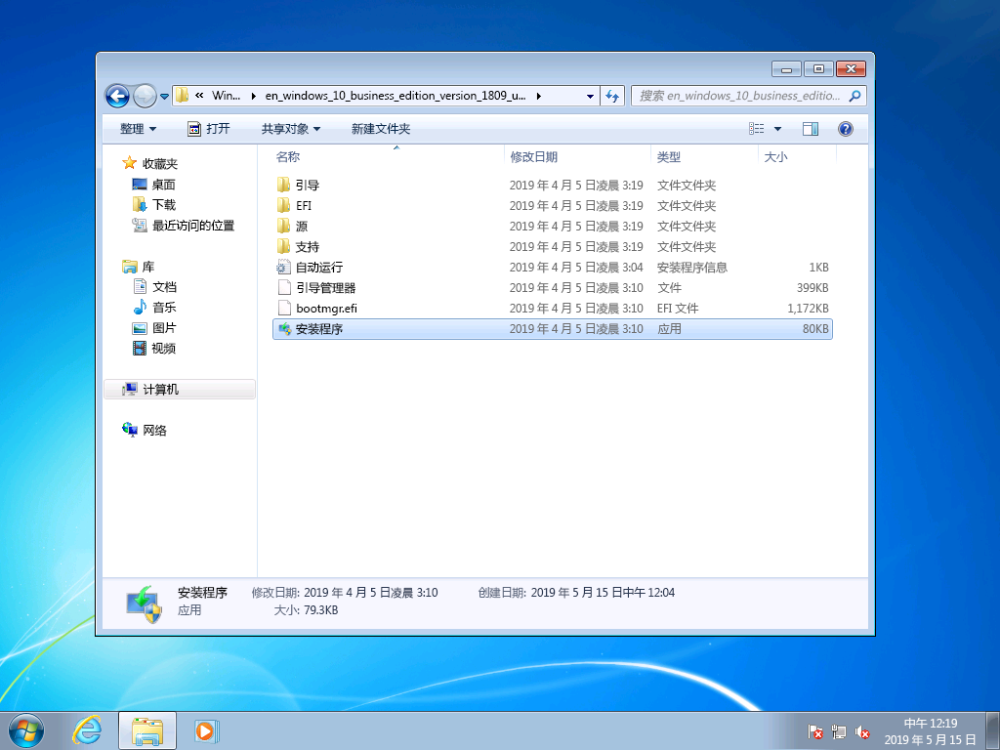
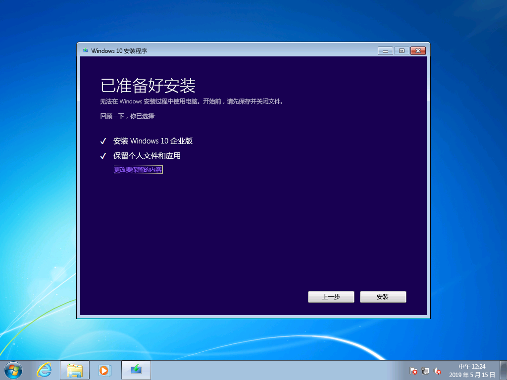
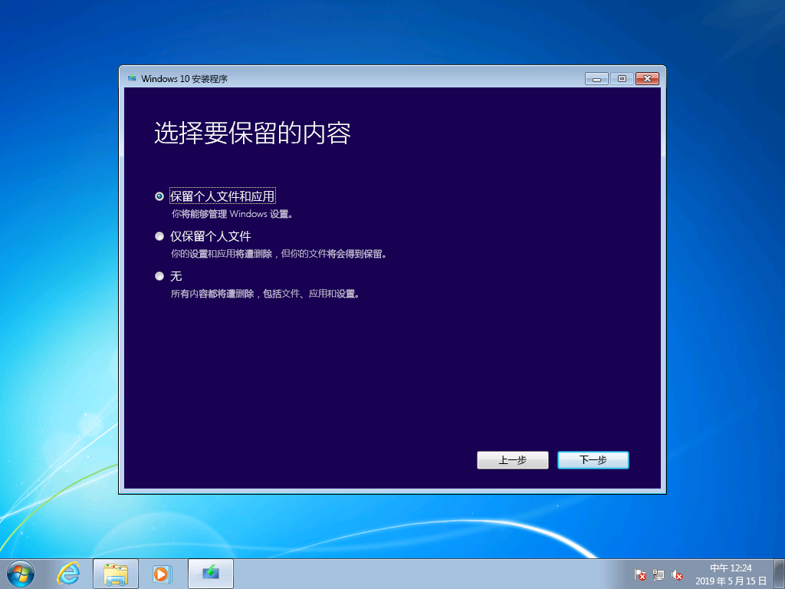
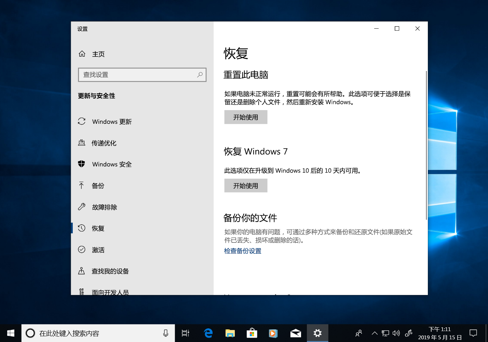
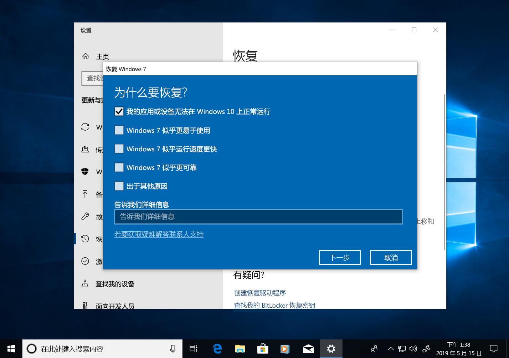
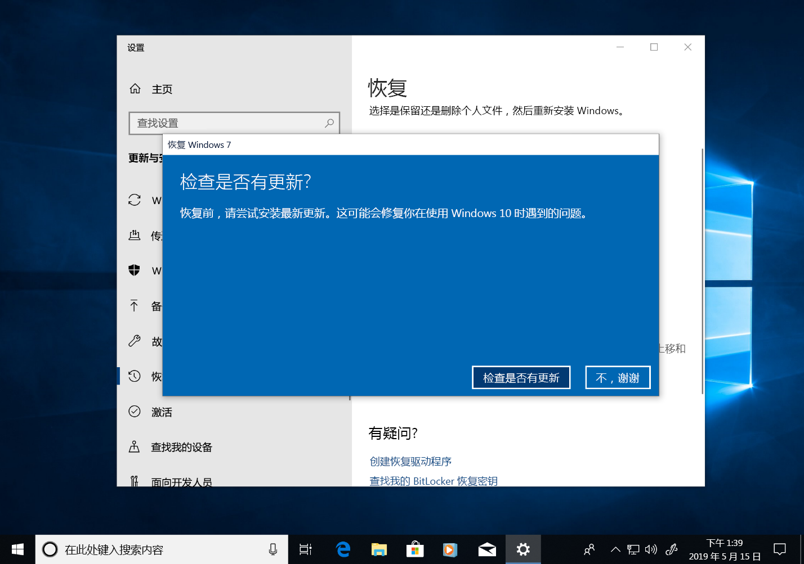
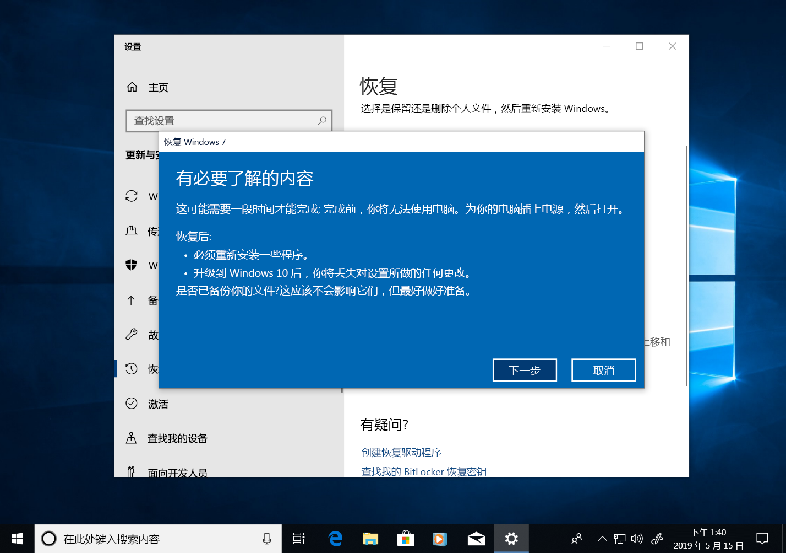

# Windows 7 到 Windows 10 手动升级分步指南Windows 7 to Windows 10 manual upgrade step-by-step guide

本文介绍将 Windows 7 企业版电脑手动升级到 Windows 10 企业版的过程。This article describes the process to manually upgrade a Windows 7 Enterprise PC to Windows 10 Enterprise. 对于其他 Windows 7 版本（如家庭版和专业版），该过程非常类似，但你也可以选择直接使用媒体创建工具进行升级。For other Windows 7 editions, such as Home and Professional, the process is very similar, but you also have the option to upgrade directly using the media creation tool. 将 Windows 7 的任何版本升级到 Windows 10 将需要有效的产品密钥以及匹配的或更高版本的 Windows，例如 Windows 7 专业版可以升级到 Windows 10 专业版，但无法升级到 Windows 10 家庭版。Upgrades for any edition of Windows 7 to Windows 10 will require a valid product key and matching or higher edition of Windows, for example Windows 7 Professional can upgrade to Windows 10 Pro, but cannot be upgraded to Windows 10 Home. Windows 7 旗舰版将需要升级到 Windows 10 专业版。Windows 7 Ultimate will need to be upgraded to Windows 10 Pro.

## 使用媒体创建工具或 ISO 文件进行的 Windows 10 升级Windows 10 upgrades using the media creation tool or ISO files

可使用[媒体创建工具](https://www.microsoft.com/en-us/software-download/windows10ISO)直接升级到 Windows 10，或使用该工具将 Windows 10 下载为 ISO 文件。You can upgrade to Windows 10 directly using the [media creation tool](https://www.microsoft.com/en-us/software-download/windows10ISO) or use it to download Windows 10 as an ISO file. 需要注意当前系统是 32 位还是 64 位、系统的默认语言以及 Windows 7 版本（例如家庭版、专业版还是企业版）。You’ll need to note whether your current system is 32 or 64-bit, your system’s default language and edition of Windows 7 (e.g. Home, Professional, or Enterprise). 在 Windows 7 中，此信息位于“控制面板”\>“系统和安全”\>“系统”中。In Windows 7, this information is located in the Control Panel \> System and Security \> System. 媒体创建工具不支持 Windows 10 企业版的升级、创建安装媒体和下载 ISO 文件。The media creation tool does not support Windows 10 Enterprise for upgrades, creating installation media or downloading ISO files. 如果要从 Windows 7 企业版升级，则需要 Windows 10 企业版。Windows 10 Enterprise is required if you are upgrading from Windows 7 Enterprise.

从 Windows 7 企业版升级到 Windows 10 企业版时，需要从[批量许可服务中心](https://www.microsoft.com/licensing/servicecenter/default.aspx)下载你的语言和体系结构（32 位或 64 位）所对应的 ISO 文件。When upgrading from Windows 7 Enterprise to Windows 10 Enterprise, you’ll need to download the ISO file for your language and architecture (32-bit or 64-bit) from the [Volume Licensing Service Center](https://www.microsoft.com/licensing/servicecenter/default.aspx).

如果计划使用 ISO 文件执行升级，则需要将 ISO 中的文件提取到本地文件系统、可移动驱动器或者也可将 ISO 文件刻录到 DVD。If you plan to perform the upgrade using an ISO file, you will need to extract the files within the ISO to either your local file system, to a removable drive, or you can burn the ISO file to a DVD. 可使用 Windows 8 或更高版本的电脑提取 ISO 中的安装文件，并将这些文件保存到可移动 USB 存储设备，或使用应用程序（例如 [7zip](https://www.7-zip.org/)）将 ISO 文件的内容提取到 Windows 7 系统本地驱动器上的文件夹中。You can extract the installation files within the ISO using a Windows 8 or newer PC and save these files to removable USB storage or use an application such as [7zip](https://www.7-zip.org/) to extract the contents of your ISO file to a folder on your local drive within Windows 7.

安装媒体在 Windows 7 中可用后，可通过如下所示的方式运行 setup.exe 来启动升级。Once you have the install media available in Windows 7, you can initiate the upgrade by running setup.exe as shown below.

**重要提示：对于就地升级（将应用程序和数据迁移到 Window 10），需要从正在运行的 Windows 7 会话中启动该过程。从 DVD 或 USB 驱动器启动到安装媒体不会提供保留应用和文件的选项，而是执行 Windows 10 的全新安装。****Important tip: For an in-place upgrade where applications and your data are migrated to Window 10, you’ll need to initiate the process from within a running Windows 7 session. Booting to install media from a DVD or USB drive will not give you the option to keep your apps and files, instead it will perform a clean install of Windows 10.**

在 Windows 10 安装程序中将引导你完成安装过程，第一个屏幕会提供下载更新、驱动程序和可选功能的选项。Within Windows 10 Setup, you will be guided through the installation process and the first screen provides an option to download updates, drivers and optional features. 为帮助确保升级成功，建议执行此操作This is recommended to help ensure success with the upgrade

应用更新后，Windows 10 安装程序将进入下一阶段：选择映像。Once updates have been applied, Windows 10 Setup will move to the next phase, Select Image. 在阶段，你需要选择 Windows 版本。Here, you will need to select your edition of Windows. 在此情况下，由于电脑安装了 Windows 7 企业版，因此应选择 Windows 10 企业版。In this case, since the PC has Windows 7 Enterprise installed, you would select Windows 10 Enterprise.

在 Windows 10 程序的下一个屏幕中将显示适用的通知和许可条款。In the next screen in Windows 10 Setup, you’re presented with applicable notices and license terms. 阅读并理解通知和条款后，单击“接受”继续，或单击“拒绝”取消。Once you have read and understand the notices and terms, click “Accept” to continue or “Decline” to cancel.

现在，Windows 10 安装程序将查找其他更新。Now Windows 10 Setup will look for additional updates.

完成后，Windows 10 安装程序即准备好执行安装，默认情况下配置为安装 Windows 10 并保留你的个人文件和应用。Once complete, Windows 10 Setup is ready to install and by default is configured to install Windows 10 and keep your personal files and apps installed. 这是推荐的选项。This is the recommended option. 单击“更改要保留的内容”可发现其他选项。By clicking, “Change what to keep,” you’ll find additional options. 否则，单击“安装”。Otherwise, click “Install.”

如果选择“更改要保留的内容”，则会显示以下选项：If you select “Change what to keep”, you’ll be presented with these options:

“仅保留个人文件”不会将已安装的应用或设置从 Windows 7 移动到 Windows 10。“Keep personal files only” will not move your installed apps or settings from Windows 7 to Windows 10. 只会将文件和用户帐户移动到 Windows。Instead it will only move your files and user accounts to Windows. 如果使用此选项，稍后将需要重新安装应用。Apps will need to be reinstalled later with this option. 仅当你确信自己可以在安装 Windows 后重新安装和配置所需的应用程序，才应使用此选项，否则请保留默认的“保留个人文件和应用”选项。Only use this option if you are confident you can reinstall and configure the apps you will need after Windows is installed, otherwise stick with the default “Keep personal files and apps” option.

“无”将删除文件、应用和设置，并执行 Windows 全新安装。“Nothing” will delete your files, apps and settings and perform a clean install of Windows. 仅当你事先备份了想要保留的数据并能重新安装应用时，才应使用此选项。Use this option only if you have previously backed up the data you want to keep and you are able to reinstall your apps.

现在，Windows 10 安装程序将根据上一个屏幕中的选择再次获取更新。Now Windows 10 Setup will get updates again based on what you selected in the previous screen.

现在，Windows 10 将安装几分钟时间，如果你选择了保留你的个人文件和应用，则所有内容都将位于相同的文件位置，并且你的应用现在将在 Windows 10 中可用。Now Windows 10 will install for several minutes and if you chose to keep your personal files and apps, everything will be in the same file locations and your apps will now be available in Windows 10.

## 

## Windows 10 中的恢复Recovery in Windows 10

安装 Windows 10 之后，Windows 10 中的恢复选项为你提供长达 10 天的时间，在这段时间内允许你恢复到 Windows 7。After Windows 10 is installed, the Recovery option in Windows 10 gives you up to 10 days to go back to Windows 7. 如果系统上的设备或应用无法正常工作，而需要回退到以前的 Windows 7 安装，这将非常有用。This is useful if a device or app on your system does not function properly and you need to go back to your previous Windows 7 installation. 10 天过后，默认情况下，Windows 10 将释放硬盘上由 Windows 7 恢复文件所占用的空间，并从以前的安装中删除文件。After 10 days, by default Windows 10 will free up the space consumed by your Windows 7 recovery files on your hard drive and delete files from the previous installation. 虽然此时间过后会删除 Windows 7，并且不能还原 Windows 7，但你的应用和个人文件将保留在 Windows 10 中。Although Windows 7 after this time is deleted and you won’t be able to revert Windows 7, your apps and personal files will remain in Windows 10.

若要启动“回退到 Windows 7”过程，请导航到“设置”\>“更新和安全”\>“恢复”。To start the Go back to Windows 7 process, navigate to Settings \> Update & Security \> Recovery. 在“回退到 Windows 7”下，选择“开始”。Under Go back to Windows 7, select “Get started.”

现在，Windows 10 将询问你回退的原因。Now, Windows 10 will ask why you are going back. 如果有技术方面的原因，为了帮助推动该问题的解决并确保其他人可以从你的体验中获益，填写此信息会很有用。If there is a technical reason, this is useful to fill out in order to help drive resolution and ensure others can benefit from your experience.

在许多情况下，你的 Windows 10 版本已发布更新，这可能会解决技术问题。In many cases, your version of Windows 10 will have had updates issued, which may resolve technical issues. 建议检查更新，如果找到并安装更新，请检查是否修复了所遇到的问题。It is encouraged that you check for updates and if found and installed, then check if that fixes the problems you have experienced.

如果更新未能解决问题，并确实需要还原到以前的 Windows 7 安装，则有可能需要重新安装某些应用（例如在运行 Windows 10 的时间内安装的任何应用），且某些设置可能丢失。If the updates do not resolve issues and you do need to revert to your previous installation of Windows 7, there is a chance that some apps will need to be reinstalled – such as any app that installed during the time you were running Windows 10 – and some settings may be lost. 重要的是，你在使用 Windows 10 时保存在本地的文件和文档将保留，并在回退到 Windows 7 后可供你使用。Importantly, files and docs you’ve saved locally while using Windows 10 will remain and be available for you once you’re back in Windows 7. 

在开始之前，请确保已准备好先前 Windows 7 安装中的本地或域帐户和密码。Before you get started, make sure you have a local or domain account and password ready from the previous Windows 7 installation.

此后即可启动回退到 Windows 7 的过程。From here you can initiate the process to go back to Windows 7. 几分钟后，电脑将启动到恢复后的 Windows 7，并拥有升级到 Windows 10 之前的相同体验。After a few minutes, your PC will boot back into Windows 7 with the same experience prior to upgrading to Windows 10.

## 移动到新电脑上的 Windows 10Moving to Windows 10 on a new PC

另一个建议的选择是移动新电脑上的 Windows 10。Another recommended option is to move to Windows 10 on a new PC. 如果这是你的首选项，你可以使用 [OneDrive](https://support.office.com/article/b5e918be-0fd4-4095-98da-bceed57f8e0c?ocid=MoveToWindows10) 备份、[Windows 中内置的“备份和还原”](https://support.microsoft.com/help/4469209?ocid=MoveToWindows10)、使用[外部存储设备](https://support.microsoft.com/en-us/help/4465814/windows-7-move-files-off-pc-with-an-external-storage-device?ocid=MoveToWindows10)以手动操作方式或类似 [Laplink 的 PCmover Express](https://www.microsoft.com/en-us/windows/transfer-your-data) 之类的工具从旧计算机传送文件。If this is your preference, you can transfer your files from your old computer using [OneDrive](https://support.office.com/article/b5e918be-0fd4-4095-98da-bceed57f8e0c?ocid=MoveToWindows10) backup, [Backup and Restore built into Windows](https://support.microsoft.com/help/4469209?ocid=MoveToWindows10), manually using an [external storage device](https://support.microsoft.com/en-us/help/4465814/windows-7-move-files-off-pc-with-an-external-storage-device?ocid=MoveToWindows10), or tools like [Laplink’s PCmover Express](https://www.microsoft.com/en-us/windows/transfer-your-data). 无论使用哪种方法，仍然需要重新安装未包含在 Windows 10 中的任何所需的应用程序。With any of these options, you will still need to re-install any required applications not included with Windows 10. 若要深入了解以手动方式从运行 Windows 7 的现有电脑移动到运行 Windows 10 的新电脑时可用的选项，请参阅 Windows 支持中的[移动到 Windows 10 电脑](https://support.microsoft.com/en-us/help/4229823?ocid=MoveToWindows10)。To learn more about your options for manually moving from an existing PC running Windows 7 to a new PC with Windows 10, see [Moving to a Windows 10 PC](https://support.microsoft.com/en-us/help/4229823?ocid=MoveToWindows10) in Windows Support.

## [桌面部署中心Desktop Deployment Center](https://aka.ms/howtoshift)