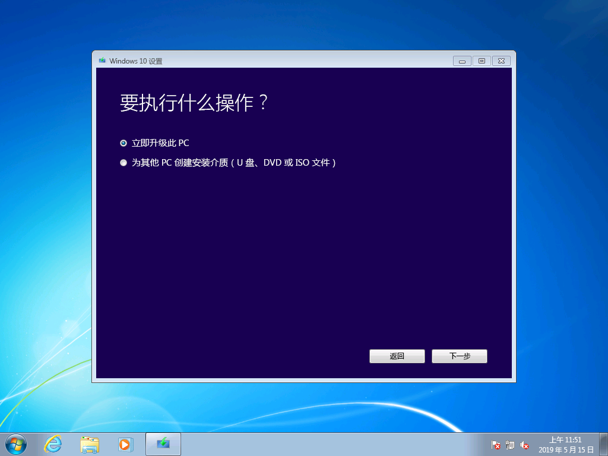
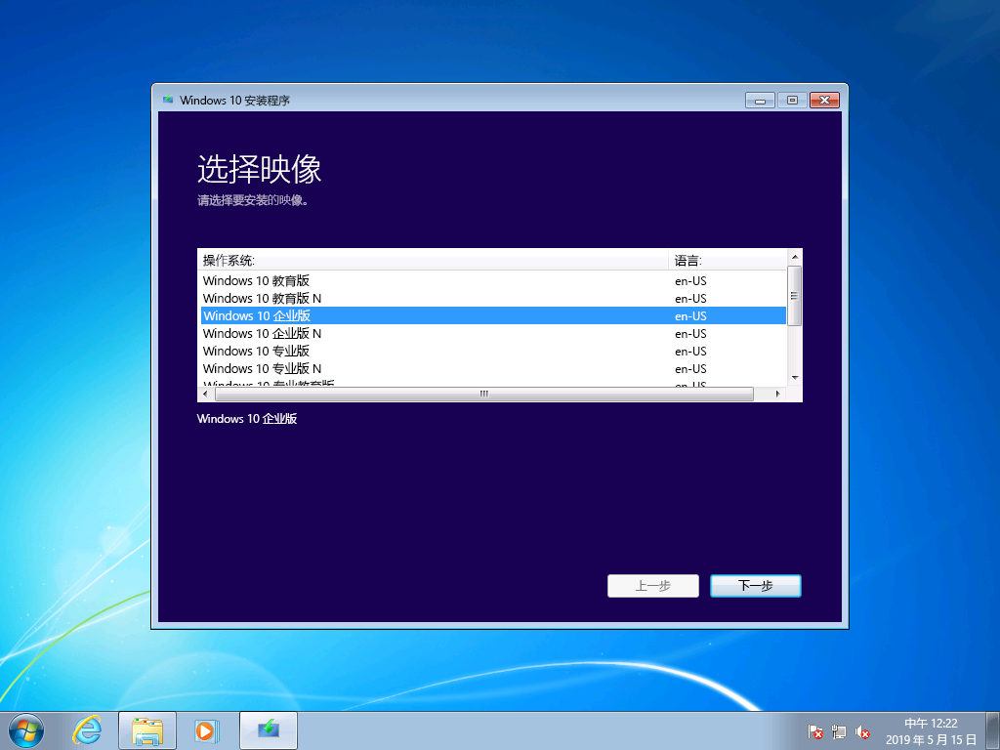
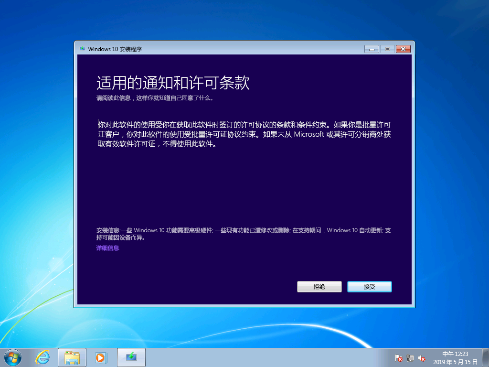
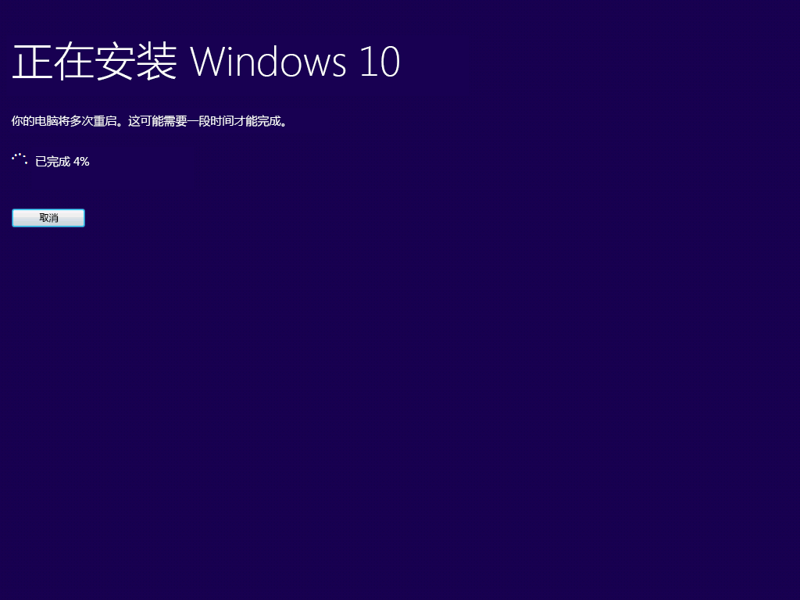

# Windows 7 到 Windows 10 手动升级分步指南

本文介绍将 Windows 7 企业版电脑手动升级到 Windows 10 企业版的过程。 对于其他 Windows 7 版本（如家庭版和专业版），该过程非常类似，但你也可以选择直接使用媒体创建工具进行升级。 将 Windows 7 的任何版本升级到 Windows 10 将需要有效的产品密钥以及匹配的或更高版本的 Windows，例如 Windows 7 专业版可以升级到 Windows 10 专业版，但无法升级到 Windows 10 家庭版。 Windows 7 旗舰版将需要升级到 Windows 10 专业版。

## 使用媒体创建工具或 ISO 文件进行的 Windows 10 升级

可使用[媒体创建工具](https://www.microsoft.com/software-download/windows10ISO)直接升级到 Windows 10，或使用该工具将 Windows 10 下载为 ISO 文件。 需要注意当前系统是 32 位还是 64 位、系统的默认语言以及 Windows 7 版本（例如家庭版、专业版还是企业版）。 在 Windows 7 中，此信息位于“控制面板”\>“系统和安全”\>“系统”中。 媒体创建工具不支持 Windows 10 企业版的升级、创建安装媒体和下载 ISO 文件。 如果要从 Windows 7 企业版升级，则需要 Windows 10 企业版。

从 Windows 7 企业版升级到 Windows 10 企业版时，需要从[批量许可服务中心](https://www.microsoft.com/licensing/servicecenter/default.aspx)下载你的语言和体系结构（32 位或 64 位）所对应的 ISO 文件。

如果计划使用 ISO 文件执行升级，则需要将 ISO 中的文件提取到本地文件系统、可移动驱动器或者也可将 ISO 文件刻录到 DVD。 可使用 Windows 8 或更高版本的电脑提取 ISO 中的安装文件，并将这些文件保存到可移动 USB 存储设备，或使用应用程序（例如 [7zip](https://www.7-zip.org/)）将 ISO 文件的内容提取到 Windows 7 系统本地驱动器上的文件夹中。

安装媒体在 Windows 7 中可用后，可通过如下所示的方式运行 setup.exe 来启动升级。

**重要提示：对于就地升级（将应用程序和数据迁移到 Window 10），需要从正在运行的 Windows 7 会话中启动该过程。从 DVD 或 USB 驱动器启动到安装媒体不会提供保留应用和文件的选项，而是执行 Windows 10 的全新安装。**

在 Windows 10 安装程序中将引导你完成安装过程，第一个屏幕会提供下载更新、驱动程序和可选功能的选项。 为帮助确保升级成功，建议执行此操作

应用更新后，Windows 10 安装程序将进入下一阶段：选择映像。 在阶段，你需要选择 Windows 版本。 在此情况下，由于电脑安装了 Windows 7 企业版，因此应选择 Windows 10 企业版。

在 Windows 10 程序的下一个屏幕中将显示适用的通知和许可条款。 阅读并理解通知和条款后，单击“接受”继续，或单击“拒绝”取消。

现在，Windows 10 安装程序将查找其他更新。

完成后，Windows 10 安装程序即准备好执行安装，默认情况下配置为安装 Windows 10 并保留你的个人文件和应用。 这是推荐的选项。 单击“更改要保留的内容”可发现其他选项。 否则，单击“安装”。

如果选择“更改要保留的内容”，则会显示以下选项：

“仅保留个人文件”不会将已安装的应用或设置从 Windows 7 移动到 Windows 10。 只会将文件和用户帐户移动到 Windows。 如果使用此选项，稍后将需要重新安装应用。 仅当你确信自己可以在安装 Windows 后重新安装和配置所需的应用程序，才应使用此选项，否则请保留默认的“保留个人文件和应用”选项。

“无”将删除文件、应用和设置，并执行 Windows 全新安装。 仅当你事先备份了想要保留的数据并能重新安装应用时，才应使用此选项。

现在，Windows 10 安装程序将根据上一个屏幕中的选择再次获取更新。

现在，Windows 10 将安装几分钟时间，如果你选择了保留你的个人文件和应用，则所有内容都将位于相同的文件位置，并且你的应用现在将在 Windows 10 中可用。

## 

## Windows 10 中的恢复

安装 Windows 10 之后，Windows 10 中的恢复选项为你提供长达 10 天的时间，在这段时间内允许你恢复到 Windows 7。 如果系统上的设备或应用无法正常工作，而需要回退到以前的 Windows 7 安装，这将非常有用。 10 天过后，默认情况下，Windows 10 将释放硬盘上由 Windows 7 恢复文件所占用的空间，并从以前的安装中删除文件。 虽然此时间过后会删除 Windows 7，并且不能还原 Windows 7，但你的应用和个人文件将保留在 Windows 10 中。

若要启动“回退到 Windows 7”过程，请导航到“设置”\>“更新和安全”\>“恢复”。 在“回退到 Windows 7”下，选择“开始”。

现在，Windows 10 将询问你回退的原因。 如果有技术方面的原因，为了帮助推动该问题的解决并确保其他人可以从你的体验中获益，填写此信息会很有用。

在许多情况下，你的 Windows 10 版本已发布更新，这可能会解决技术问题。 建议检查更新，如果找到并安装更新，请检查是否修复了所遇到的问题。

如果更新未能解决问题，并确实需要还原到以前的 Windows 7 安装，则有可能需要重新安装某些应用（例如在运行 Windows 10 的时间内安装的任何应用），且某些设置可能丢失。 重要的是，你在使用 Windows 10 时保存在本地的文件和文档将保留，并在回退到 Windows 7 后可供你使用。 

在开始之前，请确保已准备好先前 Windows 7 安装中的本地或域帐户和密码。

此后即可启动回退到 Windows 7 的过程。 几分钟后，电脑将启动到恢复后的 Windows 7，并拥有升级到 Windows 10 之前的相同体验。

## 移动到新电脑上的 Windows 10

另一个建议的选择是移动新电脑上的 Windows 10。 如果这是你的首选项，你可以使用 [OneDrive](https://support.office.com/article/b5e918be-0fd4-4095-98da-bceed57f8e0c?ocid=MoveToWindows10) 备份、[Windows 中内置的“备份和还原”](https://support.microsoft.com/help/4469209?ocid=MoveToWindows10)、使用[外部存储设备](https://support.microsoft.com/help/4465814/windows-7-move-files-off-pc-with-an-external-storage-device?ocid=MoveToWindows10)以手动操作方式或类似 Laplink 的 PCmover Express 之类的工具从旧计算机传送文件。 无论使用哪种方法，仍然需要重新安装未包含在 Windows 10 中的任何所需的应用程序。 若要深入了解以手动方式从运行 Windows 7 的现有电脑移动到运行 Windows 10 的新电脑时可用的选项，请参阅 Windows 支持中的[移动到 Windows 10 电脑](https://support.microsoft.com/help/4229823?ocid=MoveToWindows10)。

## [桌面部署中心](https://aka.ms/howtoshift)
