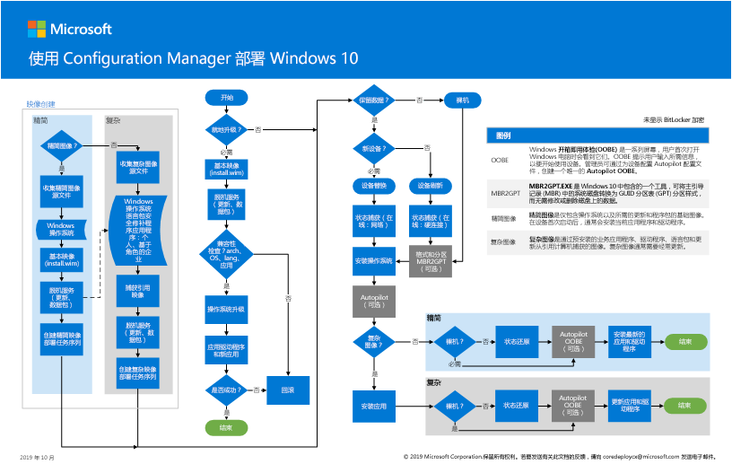

# 步骤2：将现有设备的 Windows 10 企业版部署为就地升级

*本文适用于 Microsoft 365 企业版的 E3 和 E5 版本*

将当前运行 Windows 7 或 Windows 8.1 的电脑升级到 Windows 10 的最简单途径是通过就地升级。 您可以使用 System Center Configuration Manager （配置管理器）任务序列来完全自动执行该过程。 

如果你的现有计算机运行的是 Windows 7 或 Windows 8.1，我们建议你在你的组织部署 Windows 10 时使用此路径。 这利用 Windows 安装程序（setup.exe）执行就地升级，这将自动保留现有操作系统版本中的所有数据、设置、应用程序和驱动程序。 这需要最少的 IT 工作，因为不需要任何复杂的部署基础结构。

按照这些步骤操作，使用 Configuration Manager 将 Windows 10 企业版映像配置和部署为就地升级。

## 使用 System Center Configuration Manager 海报部署 Windows 10

Configuration Manager 海报是横向模式（17x11）中的一页。 单击下面的图像以在浏览器中查看 PDF。 

也可以下载 [PDF](https://github.com/MicrosoftDocs/windows-itpro-docs/raw/public/windows/deployment/media/Windows10DeploymentConfigManager.pdf) 或 [Visio](https://github.com/MicrosoftDocs/windows-itpro-docs/raw/public/windows/deployment/media/Windows10DeploymentConfigManager.vsdx) 格式的海报。

## 第1部分：验证是否已准备好升级 Windows

首先，使用 Windows Analytics 的升级准备情况功能为组织中的计算机、应用程序和驱动程序提供强大的见解和建议，无需额外付费，也无需额外的基础结构要求。 此新服务将指导您使用基于 Microsoft 推荐做法的工作流升级和功能更新项目。 最新的清单数据使您能够在升级项目中平衡成本和风险。

请参阅[使用升级准备管理 Windows 升级](https://docs.microsoft.com/windows/deployment/upgrade/manage-windows-upgrades-with-upgrade-readiness)，了解详细信息、入门、使用和疑难解答升级准备情况。

接下来，按照指南操作，使用 System Center Configuration Manager （Current Branch）将 Windows 7 或更高版本的操作系统升级到 Windows 10。 与任何高风险部署一样，我们建议您先备份用户数据，然后再继续。 OneDrive 云存储准备就绪，可用于许可的 Microsoft 365 用户，并可用于安全地存储文件。 有关详细信息，请参阅[OneDrive 快速入门指南](https://aka.ms/ODfBquickstartguide)。 若要访问此页面，必须在 Office 365 或 Microsoft 365 租户中以租户管理员或全局管理员身份登录。

有关配置管理器版本和受支持的相应 Windows 10 客户端版本的列表，请参阅[Support For System Center Configuration Manager 的 windows 10](https://aka.ms/supportforwin10sccm)。

**验证是否已准备好升级 Windows**

在启动 Windows 10 部署之前，请查看以下要求：

- **符合升级条件的 windows 版本**-您的设备必须运行可升级到 Windows 10 企业版的 windows 7 或 windows 8.1 版本。 有关受支持的版本的列表，请参阅[Windows 10 升级路径](https://aka.ms/win10upgradepaths)。 
- **受支持的设备**-大多数与 windows 8.1 兼容的计算机将与 windows 10 兼容。 您可能需要在 Windows 10 中安装更新的驱动程序，设备才能正常运行。 有关详细信息，请参阅[Windows 10 规范](https://aka.ms/windows10specifications)。
- **部署准备**-在开始配置部署之前，请确保您具有以下内容：
    - Windows 10 安装介质-安装介质必须位于单独的驱动器上，且已安装了 ISO。 您可以从[MSDN 订户下载](https://aka.ms/msdn-subscriber-downloads)或[批量许可服务中心](https://aka.ms/mvlsc)获取 ISO。
    - 用户数据的备份-尽管在升级中将迁移用户数据，但最佳做法是配置备份方案。 例如，将所有用户数据导出到 OneDrive 帐户，将 BitLocker 导出到加密的 USB 闪存驱动器或网络文件服务器。 有关详细信息，请参阅[在 Windows 中备份或传输数据](https://aka.ms/backuptransferdatawindows)。
- **环境准备**-您将使用现有的 Configuration Manager 服务器结构来准备操作系统部署。 除了基本设置外，还应在 Configuration Manager 环境中进行以下配置：
    1. [扩展 Active Directory 架构](https://aka.ms/extendadschema)并[创建系统管理容器](https://aka.ms/createsysmancontainer)。
    2. 启用 Active Directory 林发现和 Active Directory 系统发现。 有关详细信息，请参阅[Configure discovery 方法 For System Center Configuration Manager](https://aka.ms/configurediscoverymethods)。
    3. 为内容和网站分配创建 IP 范围边界和边界组。 有关详细信息，请参阅[为 System Center Configuration Manager 定义网站边界和边界组](https://aka.ms/definesiteboundaries)。
    4. 添加和配置 Configuration Manager reporting services 点角色。 有关详细信息，请参阅[配置管理器中的配置报告](https://aka.ms/configurereporting)。
    5. 为程序包创建文件系统文件夹结构。
    6. 为程序包创建 Configuration Manager 控制台文件夹结构。
    7. 安装 System Center Configuration Manager （当前分支）更新和任何其他 Windows 10 先决条件。

## 第2部分：使用 Configuration Manager 添加 Windows 10 OS 映像
现在，你需要创建包含完整 Windows 10 安装媒体的操作系统升级程序包。 在下面的步骤中，您将使用 Configuration Manager 为 Windows 10 企业版 x64 创建升级包。

**使用配置管理器添加 Windows 10 OS 映像**

1. 使用 Configuration Manager 控制台，在**软件库**工作区中，右键单击 "**操作系统升级包**" 节点，然后选择 "**添加操作系统升级包**"。
2. 在 "**数据源**" 页上，指定 Windows 10 企业版 x64 媒体的 UNC 路径，然后选择 "**下一步**"。
3. 在 "**常规**" 页面上，指定**Windows 10 企业版 x64 升级**，然后选择 "**下一步**"。 
4. 在 "**摘要**" 页上，选择 "**下一步**"，然后选择 "**关闭**"。 
5. 右键单击创建的**Windows 10 Enterprise X64 更新**包，然后选择 "**分发内容**"。 
6. 选择你的分发点。

## 第3部分：配置部署设置
在此步骤中，将配置包含 Windows 10 升级的设置的升级任务序列。 然后，确定要升级的设备，然后将任务序列部署到这些设备。

### 创建任务序列
若要创建升级任务序列，请执行以下步骤：
  
1. 在 Configuration Manager 控制台中的 "**软件库**" 工作区中，展开 "**操作系统**"。 
2. 右键单击 "**任务序列**" 节点，然后选择 "**创建任务序列**"。
3. 在 "**创建新的任务序列**" 页上，选择 "**从升级程序包升级操作系统**"，然后选择 "**下一步**"。
4. 在 "**任务序列信息**" 页上，指定**Windows 10 企业版 x64 升级**，然后选择 "**下一步**"。
5. 在 "**升级 Windows 操作系统**" 页面上，选择 "**浏览**" 并选择**Windows 10 企业版 x64 升级操作系统升级包**，选择 **"确定**"，然后选择 "**下一步**"。
6. 继续执行其余向导页，然后选择 "**关闭**"。

### 创建设备集合
创建升级任务序列后，需要创建包含要升级的设备的集合。

> [!NOTE]
> 使用以下设置测试单个设备上的部署。 准备就绪后，可以使用不同的成员身份规则来包含设备组。 有关详细信息，请参阅[如何在 System Center Configuration Manager 中创建集合](https://aka.ms/sccm-create-collections)。

1. 在 Configuration Manager 控制台中的 "**资产和合规性**" 工作区中，右键单击 "**设备集合**"，然后选择 "**创建设备集合**"。 
2. 在 "创建设备集合" 向导中的 "**常规**" 页面上，输入以下设置，然后选择 "**下一步**"：
    - 名称： Windows 10 企业版 x64 升级
    - 限制集合：所有系统
3. 在 "**成员身份规则**" 页上，选择 "**添加规则** > **直接规则**" 以启动 "创建直接成员身份规则" 向导。
4. 在 "创建直接成员身份规则" 向导的 "**欢迎**" 页上，选择 "**下一步**"。
5. 在 "**搜索资源**" 页上，输入以下设置，将占位符**值**文本替换为要升级的设备的名称： 
    - 资源类：系统资源
    - 属性名称： Name
    - 值： *PC0003*
6. 在 "**选择资源**" 页上，选择您的设备，然后选择 "**下一步**"。
7. 完成 "创建直接成员身份规则" 向导和 "创建设备集合" 向导。  
8. 查看 Windows 10 企业版 x64 升级集。 在您看到在集合中添加的计算机之前，不会继续。

### 创建操作系统部署
按照以下步骤为任务序列创建部署。

1. 在 Configuration Manager 控制台中的 "**软件库**" 工作区中，右键单击您在上一步中创建的任务序列，然后选择 "**部署**"。
2. 在 "**常规**" 页上，选择 " **Windows 10 企业版 x64 升级**" 集合，然后选择 "**下一步**"。
3. 在**内容**页上，选择 "**下一步**"。
4. 在 "**部署设置**" 页上，选择以下设置，然后选择 "**下一步**"：

    > [!NOTE]
    > 对于此测试部署，你将设置**可用**的目的，这需要用户干预才能启动部署。 在生产环境中，您可能希望使用所需的目的自动执行部署，其中包括配置其他选项（例如，在运行部署时进行计划）。 

    - 操作：安装
    - 用途：可用

5. 在 "**计划**" 页上，接受默认设置，然后选择 "**下一步**"。
6. 在 "**用户体验**" 页上，接受默认设置，然后选择 "**下一步**"。
7. 在 "**通知**" 页面上，接受默认设置，然后选择 "**下一步**"。
8. 在 "**摘要**" 页上，选择 "**下一步**"，然后选择 "**关闭**"。

## 第4部分：启动 Windows 10 升级任务序列
按照以下步骤在要升级的设备上启动 Windows 10 升级任务序列。
 
1. 登录到 Windows 计算机并启动**软件中心**。
2. 选择您在上一步中创建的任务序列，然后选择 "**安装**"。
3. 任务序列开始时，它会自动启动就地升级过程，方法是通过调用 Windows 安装程序（setup.exe）并使用必要的命令行参数来执行自动升级，这将保留所有数据、设置、应用程序和设备.
4. 任务序列成功完成后，计算机将完全升级到 Windows 10。

如果在企业环境中使用 Windows 10 时遇到问题，可以参阅[主要 Microsoft 支持解决方案，了解最常见的问题](https://docs.microsoft.com/windows/client-management/windows-10-support-solutions)。 这些资源包括知识库文章、更新和库文章。

在整个组织中部署更新的过程中，使用 Windows Analytics 的更新合规性功能来提供对 Windows 10 设备的操作系统更新合规性、更新部署进度和故障排除的整体视图。 此新服务使用诊断数据（包括安装进度、Windows Update 配置和其他信息）来提供此类见解，无需额外付费，也无需额外的基础结构要求。 无论它是与 Windows Update for Business 或其他管理工具一起使用，您都可以确信您的设备已正确更新。

请参阅[监视 Windows 更新和具有更新合规性的 Windows Defender 防病毒](https://docs.microsoft.com/windows/deployment/update/update-compliance-monitor)，了解详细信息、入门知识和使用更新合规性。

作为临时检查点，请查看对应于此步骤的[退出条件](windows10-exit-criteria.md#crit-windows10-step2)。

## 后续步骤

|||
|:-------|:-----|
|| [使用 Windows Autopilot 为新设备部署 Windows 10 企业版](windows10-deploy-autopilot.md) |
