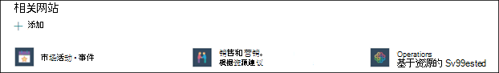
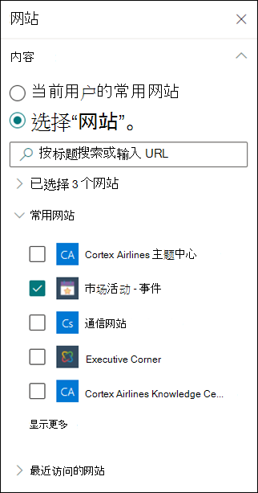

# 在"主题"Microsoft Viva主题

在 Viva 主题中，如果尚未通过索引发现一个主题，或者 AI 技术没有找到足够证据来将它确定为主题，你可以创建新主题。

> [!Note] 
> 虽然 AI 收集的主题中的信息是经过安全修整的，但请注意，手动创建的主题中的主题说明和人员信息对有权查看该主题的所有用户可见。 

## 要求

若要创建新主题，您需要：
- 拥有 Viva 主题许可证。
- 具有创建或 [**Who主题的权限**](./topic-experiences-user-permissions.md)。 知识管理员可以在 Viva Topics 主题权限设置中向用户授予此权限。 

> [!Note] 
> 具有在主题中心管理主题的权限的用户 (知识) 已拥有创建和编辑主题的权限。

## 创建主题

可以从两个位置创建新主题：

- 主题中心主页：具有 **Who** 的任何许可用户可以创建或编辑主题权限 (参与者) 可以通过选择"新建"菜单并选择"主题"页面，从主题中心创建新 **主题**。  

      

- 管理主题页面：任何具有 Who的许可用户都可以管理主题权限 (knowledge managers) 可以通过选择"新建主题"页从主题中心中的"管理主题"页创建新 **主题**。 

      

### 要创建新主题，请：

1. 请从“管理主题”页上的功能区中选择选项，以创建 新主题页。

2.  在“**为本主题命名**”部分，键入新主题的名称。

      

3. 在“**备用名**”部分，键入提及此主题时可使用的任何其他名称。 

      

4. 在 **"说明** "部分，键入几个描述该主题的句子。 

    

4. 在 **"固定人员** "部分中，你可以"固定"一个人，以表明他们连接到主题 (例如，已连接资源的所有者) 。 首先在“**添加新用户**”框中键入他们的姓名或电子邮件地址，然后从搜索结果中选择要添加的用户。 您还可以通过选择用户卡片上的"从列表中删除" **图标来** "取消固定"它们。 您还可以将该人员拖动到列表中的其他位置。
 
    

5. 在“**固定的文件和页面**”部分中，可以添加或“固定”与该主题关联的文件或 SharePoint 网站页面。

   
 
    若要添加新文件，请选择"添加"，SharePoint"常用或关注的网站"中选择"网站"，然后从网站的文档库中选择该文件。

    还可使用“**来自链接**”选项，以通过提供 URL 来添加文件或页面。 

    > [!Note] 
    > 你添加的文件和页面必须位于同一个Microsoft 365租户中。 如果要在主题中添加指向外部资源的链接，可以通过步骤 8 中的画布图标添加该链接。

6.  “**相关网站**”部分显示具有主题相关信息的网站。 

    

    您可以通过选择"添加"，然后搜索网站或从"常用"或"最近"网站列表中选择来添加相关网站。
    
    

7. " **相关主题** "部分显示主题之间的连接。 您可以通过选择"与相关主题的 连接"按钮，然后键入相关主题的名称，然后从搜索结果中选择它，来添加与其他主题的连接。 

     

    然后，您可以对主题的相关情况进行说明，然后选择"更新 **"。**

    

   所添加的相关主题将显示为已连接的主题。

    

   若要删除相关主题，请选择要删除的主题，然后选择" **删除主题"** 图标。
 
     

   然后选择"**删除"。**

    

8. 您还可以通过选择画布图标（可在简短说明下方找到 (，将静态项目添加到页面) ，如文本、图像或链接。 选择它将打开SharePoint工具箱，您可以从中选择要添加到页面的项。

    

9. 选择“**发布**”以保存所做的更改。 

发布页面后，将向查看主题的所有许可用户显示主题名称、备用名称、说明和固定的人员。 只有在查看者对项目具有 Office 365 权限的情况下，特定文件、页面和网站才会显示在主题页上。 

## 另请参阅

