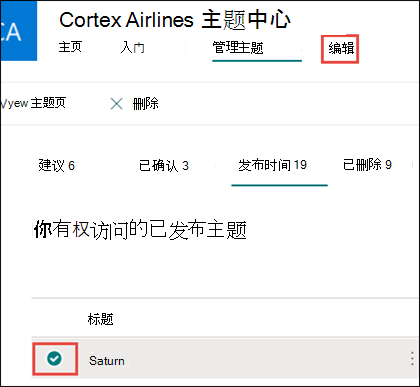
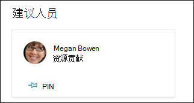
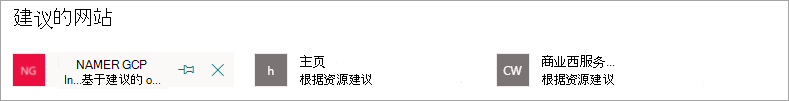

# 编辑现有主题中的Microsoft Viva主题 

 

> [!VIDEO https://www.microsoft.com/videoplayer/embed/RE4LA4n]  

 

在 Viva 主题中，可以编辑现有主题。 如果要更正或向现有主题页添加其他信息，可能需要这样做。 

> [!Note] 
> 虽然 AI 收集的主题信息经过安全修整，但有权查看主题的所有用户都可以看到在编辑现有主题时手动添加的主题说明和人员信息。 

## 要求

若要编辑现有主题，您需要：
- 拥有 Viva 主题许可证。
- 具有创建 [或编辑主题的权限](./topic-experiences-user-permissions.md)。 知识管理员可以在 Viva Topics 主题权限设置中向用户授予此权限。 

> [!Note] 
> 具有在主题中心管理主题的权限的用户 (知识) 已拥有创建和编辑主题的权限。

## 如何编辑主题页面

具有 *"Who"* 权限的用户可以通过从主题突出显示中打开主题页面，然后选择主题页面右上方的"编辑"按钮来编辑主题。  还可以从主题中心主页打开主题页面，您可以在其中找到已连接到的所有主题。

      

知识管理员还可以直接从"管理主题"页编辑主题，选择该主题，然后在工具栏 **中选择**"编辑"。

   

### 编辑主题页面

1. 在主题页面上，选择"编辑 **"。** 通过此操作，可根据需要更改主题页面。

     

2. 在 **"备用名称** "部分，键入本主题可能引用的其他任何名称。 

    

3. 在“**描述**”部分，键入一些描述主题的句子。 或者，如果已有说明，请根据需要进行更新。

     

4. 在“**已固定的人员**”部分，可“固定”人员以将其显示为具有到该主题的连接（例如，已连接资源的所有者）。 首先，在"添加新用户"框中键入用户的姓名或电子邮件地址，然后从搜索结果中选择要添加的用户。 您还可以通过选择用户卡片上的"从列表中删除" **图标来** "取消固定"它们。
 
     

    “**建议的人员**”部分显示用户认为 AI 根据其与主题相关资源的连接认为可能与该主题相关的用户。 可通过选择用户卡上的固定图标将其状态从“建议”更改为“已固定”。

   

5. 在“**固定的文件和页面**”部分中，可以添加或“固定”与该主题关联的文件或 SharePoint 网站页面。

   
 
    若要添加新文件，请选择"添加"，从SharePoint"或"关注的网站"中选择"网站"，然后从网站的文档库中选择该文件。

    还可使用“**来自链接**”选项，以通过提供 URL 来添加文件或页面。 

   > [!Note] 
   > 你添加的文件和页面必须位于同一个Microsoft 365租户中。 如果要在主题中添加指向外部资源的链接，可以通过步骤 9 中的画布图标添加该链接。

6. 建议 **的文件和页面** 部分显示 AI 建议与主题关联的文件和页面。

   

    可以通过选择已固定图标将建议的文件或页面更改为已固定文件或页面。

7.  在 **"固定的网站"** 部分，可以添加或"固定"与主题关联的网站。 

    

    若要添加新网站，请选择"添加"，然后搜索该网站，或者从"常用"或"最近访问"站点列表中选择该网站。
    
    

8. " **建议的网站** "部分显示 AI 建议与主题关联的网站。 

     

    可以通过选择固定图标将建议的网站更改为固定的网站。

9. 您还可以通过选择画布图标（可在简短说明下方找到）将静态项目（如文本、图像或链接）添加到页面。 选择它将打开SharePoint工具箱，您可以从中选择要添加到页面的项。

   

10. 选择“**发布**”或“**重新发布**”以保存更改。 **如果主题** 之前已发布，则重新发布将成为可用选项。

