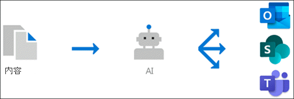

# 知识管理概述 (预览) 

> [!Note] 
> 本文中的内容适用于 Project Cortex 私人预览。 [了解更多关于 Project Cortex的信息](https://aka.ms/projectcortex)。

知识管理使用 Microsoft AI 技术、Microsoft 365、Delve、搜索以及其他组件和服务在 Microsoft 365 环境中构建一个知识网络。 

      

其目标是将信息传递给用户日常使用的应用程序中的用户，如 Outlook、团队和 SharePoint。

例如，用户可以在其电子邮件、SharePoint 网站或团队对话中看到不熟悉的术语，他们希望了解更多相关信息。 知识管理使用 AI 自动搜索和标识这些主题，并编译有关这些 **主题** 的信息，如简短说明、主题的主题专家以及与之相关的网站、文件和页面。 您可以根据需要选择更新主题信息。 然后，您可以让这些主题对您的用户可用，这意味着对于在 Outlook、团队和 SharePoint 等应用程序中显示的每个主题实例，都会突出显示该文本。 用户可以选择通过主题详细信息来详细了解主题。

## 主题索引

知识管理使用 Microsoft AI 技术来识别 Office 365 环境中的 **主题** 。

主题是非常重要或重要的短语或术语。 它具有对组织的特定含义，并具有与之相关的资源，可帮助用户了解其内容并查找有关它的详细信息。

在标识主题时，将为其创建一个 **主题页面** ，其中包含通过主题索引收集的信息，例如：

- 替代名称和/或首字母缩写词。
- 主题的简短说明。
- 可能熟悉主题的用户。
- 与主题相关的文件、页面和网站。

## 主题发现
当 SharePoint 新闻和页面上的内容中提到主题时，您会看到它突出显示。 从突出显示内容中打开主题摘要。 从摘要的标题中打开主题详细信息。 <!--(msg for Efren: not sure if I should use discovery for this; we use discovered in-product for indexing?)--> 可以自动识别提到的主题，也可以通过页面作者直接引用主题的方式将其添加到页面中。

您还可以通过 Microsoft Search 发现主题。

## 主题管理

主题管理是在组织的 **主题中心** 完成的。 主题中心网站是在安装过程中创建的，可充当贵组织的知识中心。 它将包含在您的环境中发现的所有主题的列表，以及为这些主题创建的所有主题页面。 

提供正确权限的用户将能够在主题中心中执行以下操作：

- 确认或拒绝在租户中发现的主题。
- 根据需要手动创建新主题 (例如，如果未提供足够的信息，则无法通过 AI) 发现它。
- 编辑现有主题页面。 

有关详细信息，请参阅 [主题 center 中的使用主题一主题](work-with-topics.md) 。  

## 管理控件

Microsoft 365 管理中心中的管理员控件允许您管理您的知识网络。 它们允许 Microsoft 365 全局或 SharePoint 管理员执行以下操作：

- 控制允许组织中的哪些用户查看其客户端应用程序或 SharePoint 搜索结果中的主题。
- 控制将对哪些 SharePoint 网站进行爬网以搜索主题。
- 将主题发现配置为排除您不想成为主题的特定术语。
- 控制哪些用户可以确认或拒绝主题中心中的主题。
- 控制哪些用户可以在主题中心创建和编辑主题。

有关详细信息，请参阅 [管理您的知识网络](manage-knowledge-network.md) 。 

## 主题 curation & 反馈

在环境中发生更改时，AI 将持续提供有关改进主题的建议。

允许 access 查看其日常工作中的主题的用户可以提出改进这些主题的建议。 例如，如果用户查看主题页面并查看不正确或需要添加的信息，主题页面上的链接使他们能够直接编辑信息。 另一个示例是，如果用户在 SharePoint 新闻页面上查看突出显示项，则会发现询问是否突出显示或建议的主题是否适用于您的组织的问题。 您的回答将帮助您确定主题摘要和主题详细信息中显示的内容。

此外，具有适当权限的用户可以标记与主题相关的 Yammer 对话等项目，并将其添加到特定主题中。 <!--(msg for Efren: changed to Yammer, because we will not have shipped Teams yet)-->

## 另请参阅
[设置知识管理](set-up-knowledge-network.md) 
[主题中心概述](topic-center-overview.md)
