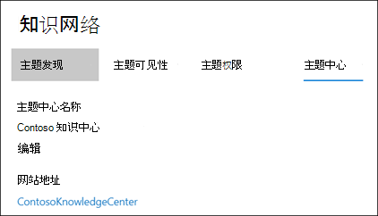
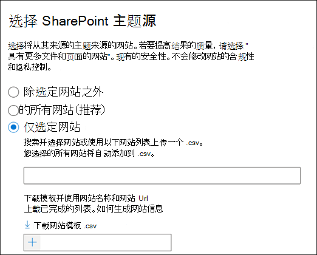
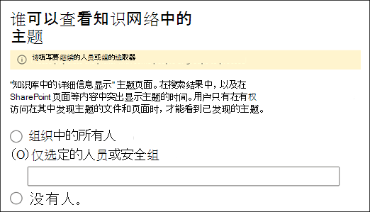
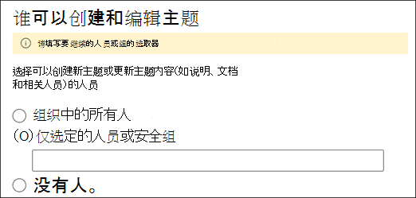
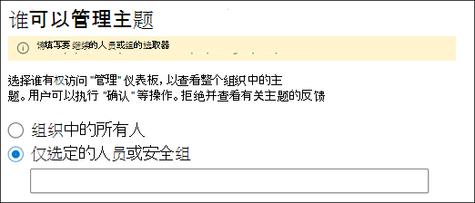
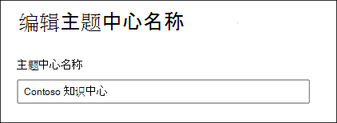

# 管理您的知识管理网络 (预览) Manage your knowledge management network (Preview)

> [!Note] 
> 本文中的内容适用于 Project Cortex 私人预览。The content in this article is for Project Cortex Private Preview. 了解[有关 Project Cortex 的详细信息](https://aka.ms/projectcortex)。[Find out more about Project Cortex](https://aka.ms/projectcortex).

在 [设置知识管理](set-up-knowledge-network.md)之后，在任何时间之后，管理员都可以通过 Microsoft 365 管理中心对您的配置设置进行调整。After you [set up knowledge management](set-up-knowledge-network.md), at any time afterwards an admin can make adjustments to your configuration settings through the Microsoft 365 admin center.

例如，您可能需要调整以下任一项的设置：For example, you may need to adjust your settings for any of the following:
- 将新的 SharePoint 源代码添加到 "我的应用" 主题。Add new SharePoint sources to mine topics.
- 更改哪些用户将有权访问主题。Change which users will have access to topics.
- 更改哪些用户具有在主题中心执行任务的权限。Change which users have permissions to do tasks on the topic center.
- 更改你的主题中心的名称Change the name of your topic center

## RequirementsRequirements 
您必须具有全局管理员或 SharePoint 管理员权限才能访问 Microsoft 365 管理中心并管理组织知识任务。You must have Global Admin or SharePoint admin permissions to be able to access the Microsoft 365 admin center and manage Organizational knowledge tasks.

## 若要访问知识管理设置，请执行以下操作：To access knowledge management settings:

1. 在 Microsoft 365 管理中心，选择 " **设置**"，然后查看 " **组织知识库** " 部分。In the Microsoft 365 admin center, select **Setup**, and then view the **Organizational Knowledge** section.
2. 在 " **组织知识** " 部分，单击 " **将人员连接到知识**"。In the **Organizational Knowledge** section, click **Connect people to knowledge**. 

      

3. 在 " **将用户连接到知识** " 页上，选择 " **管理** " 以打开 " **知识网络设置** " 窗格。On the **Connect people to knowledge** page, select **Manage** to open the **Knowledge network settings** pane. 

      

## 更改知识网络查找主题的方式Change how the knowledge network can find topics

如果要为 SharePoint 主题源更新您的选择，请选择 " **主题发现** " 选项卡。Select the **Topic discovery** tab if you want to update your choices for  for SharePoint topic sources. 通过此设置，可以选择租户中将对主题进行爬网和挖掘的 SharePoint 网站。This setting let you select the SharePoint sites in your tenant that will be crawled and mined for topics.

1. 在 " **主题发现** " 选项卡上的 " **选择 SharePoint 主题源**" 下，选择 " **编辑**"。On the **Topic discovery** tab, under **Select SharePoint topic sources**, select **Edit**.
2. 在 " **选择 SharePoint 主题源** " 页上，选择要在发现过程中将哪些 SharePoint 网站作为主题的源进行爬网。On the **Select SharePoint topic sources** page, select which SharePoint sites will be crawled as sources for your topics during discovery. 这包括：This includes: 
    a.a. **所有网站**：租户中的所有 SharePoint 网站。**All sites**: All SharePoint sites in your tenant. 这将捕获当前和未来的网站。This captures current and future sites. 
    b.b. **所有（选定网站除外）**：键入要排除的网站的名称。**All, except selected sites**: Type the names of the sites you want to exclude.  您还可以上载要从发现中退出的网站列表。You can also upload a list of sites you want to opt out from discovery. 将来创建的网站将作为主题发现的源包括在内。Sites created in the future will be included as sources for topic discovery.  
    c.c. **仅选定网站**：键入要包含的网站的名称。**Only selected sites**: Type the names of the sites you want to include. 您还可以上载网站列表。You can also upload a list of sites. 将来创建的网站不会作为主题发现的源包括在内。Sites created in the future will not be included as sources for topic discovery.  

      
   
    如果您有大量要排除的网站 (如果选择 **"全部" （选择的网站除外**) 或包含 (）（如果只选择 **了 "选定网站**) "，则可以选择使用网站名称和 url 上传 CSV 文件。If you have a number of sites that you want to exclude (if you select **All, except selected sites**) or include (if you selected **Only selected sites**), you can choose to upload a CSV file with the site names and URLs. 如果要使用 CSV 模板文件，则可以选择 "**下载网站模板 .csv"。**You can select **Download site template .csv** if you want to use the CSV template file.

3. 选择“**保存**”。Select **Save**.

##  更改可以查看组织中的主题的用户Change who can see topics in your organization

如果要更新组织中的哪些用户可以在搜索结果中查看发现的主题以及在 SharePoint 页面等内容中突出显示主题，请选择 " **主题发现** " 选项卡。Select the **Topic discovery** tab if you want to update who in your organization can see discovered topics in search results and when topics are highlighted in content like SharePoint pages.

1. 在 " **主题发现** " 选项卡上，在 " **谁可以查看知识网络中的主题**" 下，选择 " **编辑**"。On the **Topic discovery** tab, under **Who can see topics in the knowledge network**, select **Edit**.
2. 在 " **知识库中可以查看主题** " 页中，选择谁将有权访问主题详细信息，如突出显示的主题、主题卡片、搜索中的主题答案和主题页面。On the **Who can see topics in the knowledge network** page, you choose who will have access to topic details, such as highlighted topics, topic cards, topic answers in search, and topic pages. 可以选择：You can select: 
    a.a. **组织中的所有人****Everyone in your organization** 
    b.b. **仅选定的人员或安全组****Only selected people or security groups** 
    c.c. **没人****No one** 

       
3. 选择“**保存**”。Select **Save**.  
 
> [!Note] 
> 虽然此设置允许您选择组织中的任何用户，但只有分配有知识管理许可证的用户才能查看主题。While this setting allows you to select any user in your organization, only users who have knowledge management licenses assigned to them will be able to view topics.

## 更改有权在主题中心执行任务的谁Change who has permissions to do tasks on the topic center

如果要在 "主题中心" 页中更新有权执行以下操作的用户，请选择 " **主题权限** " 选项卡：Select the **Topic permissions** tab if you want to update who has permissions to do the following in the topic center page:

- 哪些用户可以创建和编辑主题：创建在发现或编辑现有主题页面详细信息时找不到的新主题。Which users can create and edit topics: Create new topics that were not found during discovery or edit existing topic page details.
- 哪些用户可以管理主题：确认或拒绝已发现的主题。Which users can manage topics: Confirm or reject discovered topics.

若要更新有权创建和编辑主题的人士，请执行以下操作：To update who has permissions to create and edit topics:

1. 在 " **主题权限** " 选项卡上，在 " **哪些人员可以创建和编辑主题**" 中，选择 " **编辑**"。On the **Topic permissions** tab, under **Who can create and edit topics**, select **Edit**. 
2. 在 " **可以创建和编辑主题的用户** " 页上，您可以选择：On the **Who can create and edit topics** page, you can select: 
    a.a. **组织中的所有人****Everyone in your organization** 
    b.b. **仅选定的人员或安全组****Only selected people or security groups** 

       

3. 选择“**保存**”。Select **Save**. 

若要更新谁有权管理主题，请执行以下操作：To update who has permissions to manage topics:

1. 在 " **主题权限** " 选项卡上，在 " **谁可以管理主题**" 中，选择 " **编辑**"。On the **Topic permissions** tab, under **Who can manage topics**, select **Edit**. 
2. 在 " **谁可以管理主题** " 页上，您可以选择：On the **Who can manage topics** page, you can select: 
    a.a. **组织中的所有人****Everyone in your organization** 
    b.b. **选定的人员或安全组****Selected people or security groups** 

       

3. 选择“**保存**”。Select **Save**. 

##  更新你的主题中心名称Update your topic center name

如果要更新您的主题中心的名称，请选择 " **主题中心** " 选项卡。Select the **Topic center** tab if you want to update the name of your topic center. 

1. 在 " **主题中心** " 选项卡上的 " **主题中心名称**" 下，选择 " **编辑**"。On the **Topic center** tab, under **Topic center name**, select **Edit**.
2. 在 " **编辑主题中心名称** " 页上的 " **主题居中名称** " 框中，键入您的主题中心的新名称。On the **Edit topic center name** page, in the **Topic center name** box, type the new name for your topic center.
3. 选择“**保存**”Select **Save**

       

## 另请参阅See also

  

