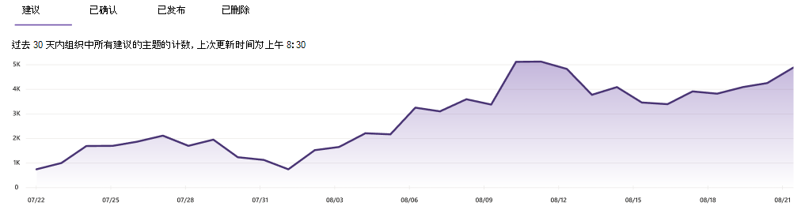

# 管理主题中心中的主题Microsoft Viva主题

 

> [!VIDEO https://www.microsoft.com/videoplayer/embed/RE4LxDx]  

 

在 Viva 主题中心，知识管理员可以查看"管理主题"页，以查看在知识管理员指定的源位置中标识的主题。  

     

## 主题阶段

知识管理器可帮助指导发现的主题完成各个主题生命周期阶段 **：Suggested、Confirmed、Published** 和 **Removed**。 

    

- **建议**: 主题已由 AI 标识，且具有足够的支持资源、连接和属性。  (**UI.)**

- **Confirmed：AI** 已发现并经过验证的主题。 当出现两种情况之一时，将进行主题验证：

   - 知识经理确认主题。 知识经理 [在"管理主题"页上](manage-topics.md#confirmed-topics)**确认主题**。

   - 多个用户确认主题。 对于使用主题卡片上的反馈机制进行投票的用户，必须获得两个肯定的投票。 例如，如果一个用户对特定主题的投票是肯定的，而一个用户投了负，则你仍然需要另外两个积极投票来确认该主题。
 
- **已发布**：已选择的主题。 已进行手动编辑以改进其质量，或者已由用户创建。

- **已删除**：主题已被拒绝，不再对查看者可见。 可以在建议、确认或发布主题 (状态删除主题) 。 当出现两种情况之一时，将删除主题：

   - 知识经理会删除一个主题。 知识经理删除"管理主题" **页上的主题** 。

   - 多个用户在主题卡片上使用反馈机制投了负票。 若要删除主题，必须存在从用户收到的两个负数投票。 例如，如果一个用户对特定主题投了负票，而一个用户对特定主题投了肯定票，你仍然需要另外两个否定的投票来删除该主题。

  删除已发布主题后，需要通过主题中心的"页面"库手动删除包含特用详细信息的页面。

> [!Note] 
> 在 **"管理主题** "页上，每个知识经理只能查看他们有权访问连接到该主题的基础文件和页面的主题。 此权限修整将反映在"建议"选项卡、"已确认"选项卡、"**已发布**"和"已删除"选项卡 **上的主题** 列表中。  但是，主题计数会显示组织中所有权限的总计数。

## 要求

若要在主题中心管理主题，需要：
- 拥有 Viva 主题许可证。

- 拥有 [**Who主题权限**](./topic-experiences-user-permissions.md)。 知识管理员可以在 Viva Topics 主题权限设置中向用户授予此权限。 

除非您具有管理主题的权限，否则将无法在主题中心Who **管理主题** 页面。

在主题中心中，知识经理可以审阅在指定的源位置中标识的主题，并可以确认或删除这些主题。 如果主题发现中未找到新主题页，知识管理员还可以创建和发布新主题页，或者编辑现有主题页（如果需要更新）。

## 建议的主题

在"**管理主题**"页上，在指定的源SharePoint发现的主题将列在"建议 **"选项卡上**。如果需要，知识经理可以审阅未确认的主题，并选择确认或删除它们。

    

查看建议的主题：

1. 在" **管理主题"** 页上，选择" **建议"选项卡** ，然后选择主题以打开主题页面。

2. 在主题页面上，查看主题页面，如果需要对页面做出任何更改，请选择"编辑"。 发布任何编辑将本主题移至"已发布 **"** 选项卡。

3. 查看主题后，返回到"管理 **主题"** 页。 对于已选择的主题，可以：

   - 选择复选标记以确认主题。
    
   - 如果要删除主题，请选择 **x。**

    已确认的主题将从"建议 **"** 列表中删除，现在显示在"已确认 **"** 列表中。

    已删除的主题将从"建议"列表中 **删除，** 现在显示在"已删除" **选项卡** 中。

### 质量分数

"建议的主题" **页上显示的每个** 主题都分配有质量分数。 质量分数反映了普通用户将看到有关该主题的信息的信息量，同时请记住，每个用户可能会看到更多或更少的信息，因为他们可能拥有或可能不会查看主题信息的权限。 

质量分数可帮助深入了解包含最多信息的主题，并且可用于查找可能需要手动编辑的主题。 例如，质量分数较低的主题可能是某些用户没有对SHAREPOINT相关文件或网站（AI 已包含在主题中）的权限的结果。 然后，参与者可编辑该主题以包含该信息 (在适当的时候)，然后所有可查看该主题的用户都可以查看。

### 展现量

" **印象** "列显示向最终用户显示主题次数。 这包括通过搜索中的主题答案卡和主题突出显示的视图。 它并不反映这些主题的点击率，但已显示该主题。 The **Impressions** column will show for topics in the **Suggested**， **Confirmed，** **Published，** and **Removed** tabs on the **Manage topics** page.

## 已确认主题

在"管理主题"页上，在指定的 SharePoint 源位置中发现并已被知识经理确认或"众源"确认的主题 (通过卡片反馈机制平衡负用户投票与正用户投票) 将在"已确认"选项卡中列出。 如果需要，具有管理主题权限的用户可以审阅已确认的主题，并选择拒绝它们。

要查看已确认的主题，请：

1. 在“**已确认**”选项卡上，选择主题以打开主题页面。

2. 在主题页面上，查看主题页面，如果需要对页面做出任何更改，请选择"编辑"。

请注意，您仍可以选择拒绝已确认的主题。 为此，请转到"已确认"选项卡上的所选主题，如果要拒绝该主题，请选择 **"x"。**

## 已发布的主题

在"**管理主题**"页上，在指定的源SharePoint中发现的主题将列在"已发布"**选项卡** 上。已发布的主题已经过编辑，以便始终向遇到页面的任何人显示特定信息。 手动创建的主题也会在此列出。

   

## 已删除的主题

在"**管理主题**"页上，在指定的源SharePoint中发现的主题将列在"已删除"**选项卡** 上。根据最终用户在主题中心中对主题卡的投票，可在此处显示一些建议的主题。

如果需要，稍后可以将已删除的主题添加回可查看的主题。 如果要将已删除的主题添加回可查看的主题：

1. 在" **已删除"** 选项卡上，选择主题。

2. 选择 **"审阅并发布"。**

   

## 主题计数仪表板

通过仪表板视图中的此图表，可以查看 Viva 主题主题中心中的主题数量。 该图显示了每个主题生命周期阶段的主题计数，还显示了主题计数如何随着时间的推移而呈趋势。 知识管理人员可以直观地监视 AI 发现新主题的速率，以及知识管理器或用户操作确认或发布主题的速率。

知识管理员在"管理主题"页上的主题列表中看到的主题数量可能与在仪表板中显示的主题数不同。 这是因为知识管理员可能无法访问所有主题。 在应用权限修整之前，会执行仪表板视图中呈现的计数。 

   
