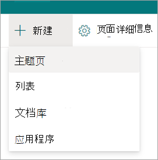
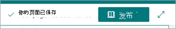

# 在"主题"中将主题另存为Microsoft Viva草稿

您可以将正在处理的新主题或修订的主题另存为草稿，但尚未准备好发布。

## 将新主题另存为草稿

1. 从主题中心，选择"**新建**  >  **主题页面"。**
 
   

2. 在编辑新主题时，会自动保存草稿。
  
   

3. 完成当前编辑但不准备发布时，请选择"另 **存为草稿** "以保存更改。 您的受众在发布之前不会在页面上看到编辑内容。 只有具有主题编辑权限的用户才能查看草稿。 

   

4. 选择“**发布**”以保存所做的更改。 发布页面后，主题名称、备用名称说明和固定人员将显示给可以查看该主题的用户。 如果查看者对主题具有权限，则特定文件、页面和网站将只出现在主题页面上。
 
## 将修订的主题另存为草稿

1. 打开主题页进行编辑。

2. 在编辑主题页面时，会自动保存草稿。
  
   

3. 完成当前编辑但不准备发布时，请选择"另存为草稿"以保存更改并关闭编辑模式。

   

4. 当你准备好让用户看到你的更改时，你将看到"发布"或"**重新发布"按钮**。  

    - **当** 主题仅包含 AI 发现的内容并且你第一次编辑时，发布可用。 发布时，对主题名称、备用名称、说明或固定人员进行编辑时，将会向可以查看主题的用户显示。 特定文件、页面、网站、AI 发现的备用名称和人员仍将仅对具有这些资源权限的用户可见。

    - **重新发布** 意味着你要编辑以前发布的主题。
 
## 草稿页的生命周期
 
1. 当您将主题另存为草稿并关闭页面时，该主题会作为次要版本签入，并变为"共享"草稿。 这意味着具有编辑权限的用户 (或网站所有者) 现在可以看到草稿并对其进行编辑。

2. 草稿在编辑时自动保存。

3.  具有编辑权限 (或网站所有者) 打开草稿状态的主题页面时，他们将被直接提交到已保存的草稿。 将显示一条消息，告知您这是草稿页以及保存最后一个草稿时。
  
    

4.  关闭编辑模式后，可以通过返回到主题页面返回到草稿：
    - 对于用户：
         - 从主题 **Web** 部件上的"已确认主题"部分
         - 通过搜索主题并打开主题答案

    - 对于知识经理：
         - 从" **管理主题"** 页
         - 在"网站页面"库中
         - 从主题页面的直接链接
 
## 一个人一次编辑

两个人不能同时编辑同一页面，无论它是草稿还是草稿。 如果一个人打开了一个页面进行编辑，而另一个人试图编辑该页面，则用户将显示一条消息，指出该页面正由其他人编辑。
  
   
 
可以通过保存和关闭、放弃更改或发布来要求打开页面进行编辑的人"释放"页面。 但是，如果页面在 5 分钟内没有活动，编辑会话将自动退出，并且页面将"解锁"，除非某人在 5 分钟内关闭浏览器。

