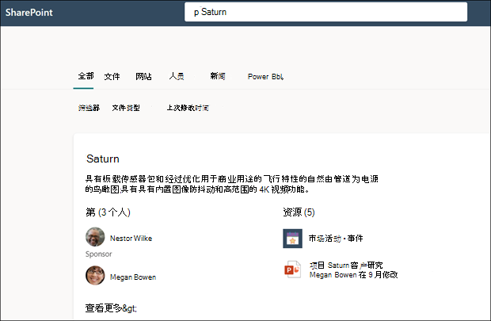

# 使用Microsoft 搜索在主题中查找Microsoft Viva主题

Viva 主题用户可以通过其网站中的主题要点查找主题SharePoint，但用户也可以通过网站Microsoft 搜索。 

## 主题答案

当您从 SharePoint 起始页、Office.com 或已范围为您的组织的 SharePoint 网站搜索特定主题时，如果主题存在且找到，它将以主题应答建议格式显示结果。

主题答案将显示：

- 主题名称
- 备用名称：主题的备用名称或首字母缩略词。
- 定义：由 AI 提供或个人手动添加的主题说明。
- 建议或固定的人：AI 建议或用户固定到主题的人
- 建议或固定的资源：AI 建议的文件、页面或网站，或用户固定到主题的文件、页面或网站。 

    

主题页面可以显示在搜索结果中，即使主题答案卡片未显示。

Word、word、PowerPoint、Outlook 和 Excel 中的搜索结果还将在找到主题答案时显示主题答案。

## 首字母缩略词

在 Viva 主题中，可以手动编辑主题，以包含用作备用名称的首字母 *缩写。* 这样一来，仅通过主题首字母缩写词进行搜索的用户可以通过查找Microsoft 搜索。

[首字母缩写词"答案](/microsoftsearch/manage-acronyms)"是一项通过"Microsoft 搜索"功能，它独立于 Viva 主题进行管理。

## 书签和主题

书签是一项Microsoft 搜索功能，它可以帮助用户通过搜索工具快速查找重要网站和工具 (例如，在 Microsoft 365 租户外部的外部网站上使用旅行预订) 。 它们由搜索管理员在搜索Microsoft 365 管理中心。 

对于要查找有关预订出差信息的用户：

- 如果某些用户知道旅行工具 (例如，"Concur") ，则创建书签以直接转到外部网站会更容易。

- 对于通常搜索"旅行"的用户，请创建一个"旅行"主题，该主题包含他们希望看到的信息。 请考虑在主题的说明中添加指向 Concur 外部站点的链接。 如果链接改为指向托管在 Microsoft 365 租户上的内部旅行预订网站，你可以将其添加到"固定的资源"。
 
### 搜索结果优先级 

在用户的搜索体验中，当用户搜索"travel"等字词时，如果书签可用，则将显示书签来表示主题。

## 另请参阅

[Viva 主题概述](topic-experiences-overview.md)
