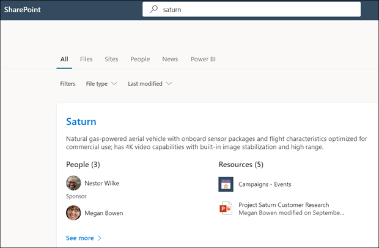

# 使用 Microsoft 搜索查找 Microsoft Viva 主题中的主题Use Microsoft Search to find topics in Microsoft Viva Topics

虽然 Viva 主题用户可以通过 SharePoint 网站中的主题突出显示查找主题，但也可通过 Microsoft 搜索找到主题。While Viva Topics users can find topics through topic highlights in their SharePoint sites, they can also find them through Microsoft Search. 

## 主题答案Topic Answer

在 Microsoft 搜索服务中搜索特定主题 (例如，"Saturn") ，如果主题存在且找到，它将以答案建议格式显示结果。When you search for a specific topic in Microsoft Search (for example, "Saturn"), if a topic exists and is found, it will display the result in the Answers suggestion format.

主题答案将显示：The topic answer will display:
- 主题名称Topic name
- 备用名称：主题的备用名称或缩写。Alternate names: Alternate names or acronyms for the topic.
- 定义：AI 提供或由人员手动添加的主题的说明。Definition: Description of the topic provided by AI or manually added by a person.
- 建议或固定的人：AI 建议或用户固定到主题的人Suggested or Pinned people: People suggested by AI or pinned to the topic by a person
- 建议或固定的资源：AI 建议的文件、页面或网站，或用户固定到主题的文件、页面或网站。Suggested or Pinned resources: Files, pages, or sites either suggested by AI or pinned to the topic by a person. 

    

主题页面可以显示在搜索结果中，即使主题答案卡未显示。The topic page can display in the search results even if the topic answer card doesn't appear.

## 首字母缩略词Acronyms

在 Viva 主题中，可以手动编辑主题，以包含用作备用名称的首字母<b>缩写。</b>In Viva Topics, you can manually edit a topic to include an acronym for it as an <b>Alternate Name</b>. 这使仅通过主题首字母缩写词进行搜索的用户可以通过 Microsoft 搜索找到主题答案。This allows a user who is searching by only the topic's acronym to find the topic answer through Microsoft Search.

[首字母缩写词"答案](/microsoftsearch/manage-acronyms) "是 Microsoft 搜索提供的一项功能，独立于 Viva 主题进行管理。[Acronym Answers](/microsoftsearch/manage-acronyms) is a feature provided though Microsoft Search and is managed separately from Viva Topics.

## 书签和主题Bookmarks and topics

书签是一项 Microsoft 搜索功能，它可以帮助用户通过搜索工具快速查找重要网站和工具 (例如，Microsoft 365 租户网站外部的外部站点上的旅行预订) 。[Bookmarks](/microsoftsearch/manage-bookmarks) are a Microsoft Search feature that help people quickly find important sites and tools with just a search (for example, a travel booking tool on an external site outside of their Microsoft 365 tenant). 它们由 Microsoft 365 管理中心中的搜索管理员创建。They're created by search admins in the Microsoft 365 admin center. 

对于要查找有关预订出差信息的用户：For users who are looking for information about booking a trip for work:

- 如果某些用户知道旅行工具 (例如，"Concur") ，则创建书签以直接转到外部网站会更容易。If some users know the travel tool name (for example, "Concur"), it's easier to create a bookmark to go directly to the external site.
- 对于通常搜索"旅行"的用户，在"旅行"上创建一个主题，该主题包含他们希望看到的信息。For users who search generally for "travel", create a topic on "Travel" that has the information they expect to see. 请考虑在主题的说明中添加指向 Concur 外部站点的链接。Consider adding a link to the Concur external site in the description of the topic. 如果链接改为指向 Microsoft 365 租户上托管的内部旅行预订网站，你可以将其添加到"固定的资源"。If the link is instead to an internal travel booking site hosted on the Microsoft 365 tenant, you can add it to the “Pinned Resources”.
 
### 搜索结果优先级Search results priority 
 
在用户搜索体验中，当用户搜索类似"旅行"的字词时，搜索结果将在 Microsoft 搜索中按以下优先级显示In the users search experience, when a user searches for a term like “travel”, search results will display in the following priority in Microsoft Search
1. 已发布或已确认的主题Published or Confirmed topics 
2. 书签Bookmarks
3. 建议的主题Suggested topics