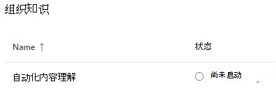
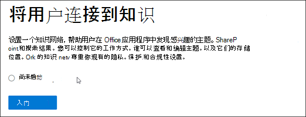
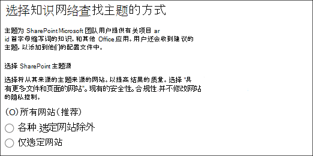
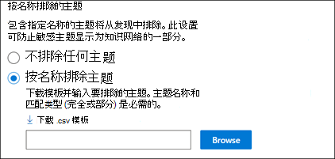
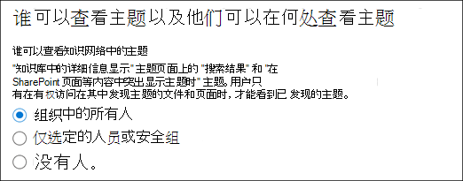
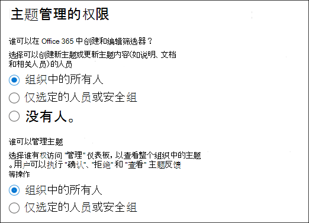
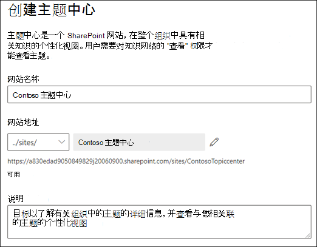
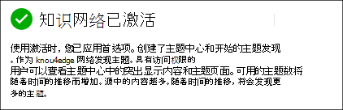
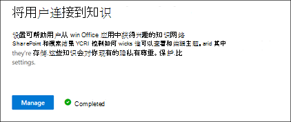

# 设置知识管理 (预览) 

> [!Note] 
> 本文中的内容适用于 Project Cortex 私人预览。 [了解更多关于 Project Cortex的信息](https://aka.ms/projectcortex)。

您可以使用 Microsoft 365 管理中心来设置和配置 [知识管理](knowledge-management-overview.md)。 

> [!Important]
> 在您的环境中规划设置和配置知识管理的最佳方式是非常重要的。 例如，你将需要考虑以下事项：
- 要分析主题的 SharePoint 网站。
- 您想让主题对哪些用户可见。
- 您要授予其权限以管理主题中心中的主题的用户。
- 要授予在主题中心创建或编辑主题的权限的用户。
- 要为你的主题中心提供的名称。

> [!Note]
> 您可能会发现，创建安全组以向用户分配查看主题、管理主题以及创建和编辑主题所需的权限非常有用。

管理员还可以在安装程序完成 Microsoft 365 管理中心中的知识管理设置 [后随时更改所选的设置](topic-experiences-discovery.md) 。

## Requirements 
您必须具有全局管理员或 SharePoint 管理员权限才能访问 Microsoft 365 管理中心并设置组织知识任务。

## 设置你的知识网络

设置您的知识网络可指导您完成以下操作：

- 主题发现：选择要从发现中排除的主题源和主题。
- 主题可见性：选择在 "搜索" 和 "主题" 页中可查看主题为突出显示的内容。
- 主题权限：选择谁可以创建、编辑和管理主题。
- 主题中心：创建你的主题中心。
- 查看：检查并应用你的设置。

若要设置您的知识网络，请执行以下操作：

1. 在 Microsoft 365 管理中心 (admin.microsoft.com) 中，选择 " **设置** "，然后查看 " **组织知识库** " 部分。
2. 在 " **组织知识** " 部分，单击 " **将人员连接到知识** "。 

      

3. 在 " **将用户连接到知识** " 页上，单击 " **入门** " 以引导您完成设置过程。 

      

4. 在 " **选择知识网络如何查找主题** " 页上，您将配置主题发现。 在 " **选择 SharePoint 主题源** " 部分，选择要在发现过程中将哪些 SharePoint 网站作为主题的源进行爬网。 这包括： 
    a. **所有网站** ：租户中的所有 SharePoint 网站。 这将捕获当前和未来的网站。 
    b. **所有（选定网站除外）** ：键入要排除的网站的名称。  您还可以上载要从发现中退出的网站列表。 在将来创建的网站将作为主题发现的源包括在内。  
    c. **仅选定网站** ：键入要包含的网站的名称。 您还可以上载网站列表。 将来创建的网站不会作为主题发现的源包括在内。  

      
   
5. 在 " **按名称排除主题** " 部分，您可以选择包括您不想在已发现的结果中的主题的名称。 使用此设置可防止将敏感主题作为知识网络的一部分包括在内。 您的选项包括： 
    a. **不排除任何主题**  
    b. **按名称排除主题** ：如果您有不希望用户作为知识网络的一部分向用户显示的主题。 

      

    #### 如何按名称排除主题    

    如果您需要排除主题，请在 **按名称选择排除主题** 后，选择 " **下载 .csv 模板"** 。 使用 Excel。CSV 模板，以包含要从发现结果中排除的主题的列表。

      

    在 CSV 模板中，输入以下有关要排除的主题的信息：

    - **名称** ：键入要排除的主题的名称。 可通过 2 种方法执行此操作： 
        - 完全匹配：可以包含确切的名称或首字母缩写词 (例如， *Contoso* 或 *ATL* ) 。 
        - 部分匹配：您可以排除包含特定字词的所有主题。  例如， *arc* 将排除其中的单词 *弧* 的所有主题，如 *arc 圆* 、 *等离子弧形焊接* 或 *定型弧* 。请注意，它不会排除在其中包含作为单词的一部分的文本的主题，如 *体系结构* 。 
    - **扩展 (可选)** ：如果要排除首字母缩略词，请键入首字母缩略词代表的词语。 
    - **MatchType-exact/partial** ：键入您输入的名称是否是 *确切* 的或 *部分* 匹配的类型。 

    完成并保存 CSV 模板文件后，选择 " **浏览** " 以找到并选中它。
    
    选择 **下一步** 。 

6. 在 " **哪些用户可以查看主题及其在哪里可以看到它们** " 页上，您将配置主题可见性。 在 " **了解网络中的主题** " 设置中，选择谁将有权访问主题详细信息，如突出显示的主题、主题卡片、搜索中的主题答案和主题页面。 可以选择： 
    a. **组织中的所有人** 
    b. **仅选定的人员或安全组** 
    c. **没人** 

       

 > [!Note] 
 > 虽然此设置允许您选择组织中的任何用户，但只有分配有知识管理许可证的用户才能查看主题。 

7. 在 " **主题管理权限** " 页中，选择能够创建、编辑或管理主题的用户。 在 " **可以创建和编辑主题的用户** " 部分，您可以选择： 
    a. **组织中的所有人** 
    b. **仅选定的人员或安全组** 
8. 在 " **谁可以管理主题** " 部分，您可以选择： 
    a. **组织中的所有人** 
    b. **选定的人员或安全组** 

      

    选择 **下一步** 。 
9. 在 " **创建主题中心** " 页上，您可以创建您的主题中心网站，在该网站中可以查看主题页面，并且可以管理主题。  在 " **主题中心名称** " 框中，键入您的主题中心的名称。 您可以选择在 " **网站说明** " 框中键入简短说明。  

选择 **下一步** 。 

      

10. 在 **审查并完成** 页面上，可查看所选设置并选择进行更改。 如果对你的选择感到满意，请选择 **激活** 。

       

11. 将显示 " **知识网络已激活** " 页，确认系统将立即开始分析您选择的网站，了解主题并创建知识中心网站。 选择“ **完成** ”。 

       

12. 你将返回到 " **将人员连接到知识** " 页面。 在此页面中，可选择 **管理** ，对配置设置进行任何更改。 

         

> [!Note]
> 安装完成后，管理员可以通过返回此页面随时 [更改所选的知识管理设置](topic-experiences-discovery.md) 。

## 另请参阅

  

