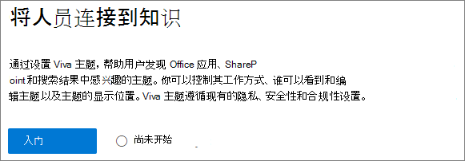
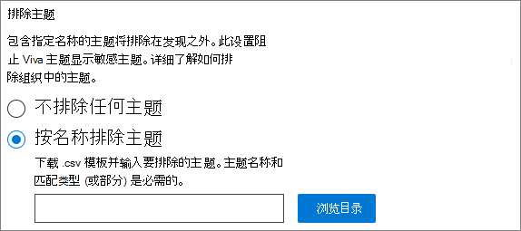
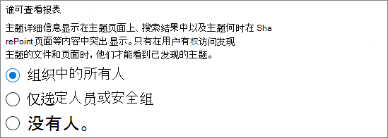
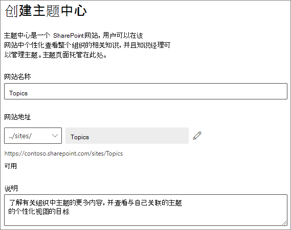
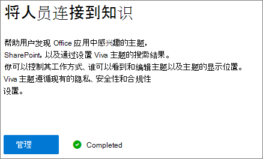

# 设置Microsoft Viva主题

可以使用自定义Microsoft 365 管理中心设置和配置[主题](topic-experiences-overview.md)。 

规划在环境中设置和配置主题的最佳方法非常重要。 在开始本文中[的过程之前，请务必](plan-topic-experiences.md)阅读规划Microsoft Viva主题。

您必须订阅[Viva 主题](https://www.microsoft.com/microsoft-viva/topics)，并且必须是全局管理员或 SharePoint管理员才能访问 Microsoft 365 管理中心设置主题。

> [!IMPORTANT]
> 如果你已配置SharePoint托管设备，则必须从托管设备设置主题。

## 视频演示

此视频演示在 Microsoft 365 中设置主题的过程。

 

> [!VIDEO https://www.microsoft.com/videoplayer/embed/RE4Li0E]  

 

## 分配许可证

必须为使用主题的用户分配许可证。 只有具有许可证的用户才可以查看有关主题的信息，包括突出显示、主题卡片、主题页面和主题中心。 

以分配许可证：

1. 在Microsoft 365 管理中心中，在 **用户** 下，点击 **活动用户**。

2. 选择要许可的用户，然后单击"许可证 **和应用"。**

3. 在 **"许可证"** 下，**选择"Viva 主题"。**

4. 在 **"应用"** 下，确保Graph索引连接器搜索 **("Viva** 主题) "和 **"Viva** 主题"。

   > [!div class="mx-imgBorder"]
   > 

5. 单击“**保存更改**”。

分配许可证后，用户可能需要一小时才能访问主题。

## 设置主题

> [!Note]
> 首次启用主题发现时，可能需要两周才能在"管理主题"视图中显示所有建议的主题。 主题发现将在新内容或内容更新时继续。 当 Viva Topics 评估新信息时，组织中建议主题数量出现波动是正常现象。

设置主题
1. 在 ["Microsoft 365 管理中心](https://admin.microsoft.com)中，选择 **"设置"，** 然后查看"**文件和内容"** 部分。
2. 在"**文件和内容"** 部分，单击连接 **人员了解知识"。**

     

3. 在 **"连接人员到知识"页上**，单击"开始"以完成设置过程。

     

4. 在" **选择 Viva 主题如何查找** 主题"页上，您将配置主题发现。 在"**选择SharePoint** 源"部分，选择将在发现SharePoint哪些网站作为主题的源进行爬网。 从以下项中进行选择：
    - **所有网站**：组织内的所有 SharePoint 网站。 这其中包括当前和未来的网站。
    - **全部，所选网站除外**：键入要排除的网站的名称。  还可以上载想要从发现中退出的网站列表。 将来创建的网站将包含为主题发现源。 
    - **仅选定网站**：键入要包含的网站的名称。 您还可以上载网站列表。 将不包含未来创建的网站作为发现源。
    - **无网站**：不包含任何 SharePoint 网站。

     
   
5. 在" **按名称排除** 主题"部分，可以添加要从主题发现中排除的主题的名称。 使用此设置可防止敏感信息作为主题包含在内。 选项包括：
    - **不排除任何主题** 
    - **按名称排除主题**

     

     (发现后，知识管理员还可以排除主题中心) 

    #### 如何按名称排除主题    

    如果需要排除主题，在选择"按名称排除主题"后，下载 .csv 模板，然后使用要从发现结果中排除的主题列表更新该模板。

     

    在 CSV 模板中，输入与要排除的主题相关的以下信息：

    - **名称**：键入要排除的主题的名称。 可以通过两种方式来执行此操作：
        - 完全匹配：可以包括确切的名称或缩写 (例如 *Contoso* 或 *ATL*) 。
        - 部分匹配：可以排除其中包含特定单词的所有主题。  例如 *，arc 将* 排除包含单词 *arc* 的所有主题，如弧 *形圆*、*弧* 形圆或 *培训弧*。请注意，它将不会排除将文本作为单词的一部分包含的主题，例如体系结构 *。*
    - **代表 (可选**) ：如果要排除首字母缩写词，请键入首字母缩写词代表的单词。
    - **MatchType-Exact/Partial**：键入您输入 *的名称是精确* 匹配类型还是 *部分* 匹配类型。

    完成并保存文件后，.csv **浏览** 找到并选择它。
    
    选择“**下一步**”。

6. 在Who **主题及其** 可在何处看到这些主题页面，您将配置主题可见性。 在Who **主题** 设置中，可以选择谁有权访问主题详细信息，例如突出显示的主题、主题卡片、搜索中的主题答案和主题页面。 可以选择：
    - **我的组织中的每个人**
    - **仅选定人员或安全组**
    - **没人**

      

    > [!Note] 
    > 虽然此设置允许你选择组织的任何用户，但只有分配了主题体验许可证的用户才能查看主题。

7. 在" **主题管理的权限** "页中，选择能够创建、编辑或管理主题的用户。 在 **"Who主题"部分**，可以选择：
    - **我的组织中的每个人**
    - **仅选定人员或安全组**
    - **没人**

     

8. 在 **"Who主题"部分中**，可以选择：
    - **我的组织中的每个人**
    - **仅选定人员或安全组**

     

    选择“**下一步**”。

9. 在 **"创建主题中心** "页上，可以创建主题中心网站，可在其中查看主题页面并管理主题。 在" **网站名称"** 框中，键入主题中心的名称。 如果要更改 URL，可以单击铅笔图标。 （可选）在"说明"框中键入 **简短** 说明。 

   > [!Important]
   > 您可以稍后更改网站名称，但在完成向导后不能更改 URL。

   选择“**下一步**”。

     

10. 在 **审查并完成** 页面上，可查看所选设置并选择进行更改。 如果对你的选择感到满意，请选择 **激活**。

11. 将显示 **"Viva 主题已激活** "页，确认系统现在开始分析所选主题网站并创建主题中心网站。 选择“**完成**”。

12. 你将返回到你的连接 **人员到知识** 页面。 在此页面中，可选择 **管理**，对配置设置进行任何更改。 

        

## 管理主题体验

设置主题后，可以在"设置"中更改在设置[过程中Microsoft 365 管理中心。](https://admin.microsoft.com/AdminPortal#/featureexplorer/csi/KnowledgeManagement) 请参阅以下参考：

- [管理主题主题Microsoft Viva主题](topic-experiences-discovery.md)
- [管理主题主题Microsoft Viva可见性](topic-experiences-knowledge-rules.md)
- [管理主题主题Microsoft Viva主题](topic-experiences-user-permissions.md)
- [在"主题"中更改Microsoft Viva中心的名称](topic-experiences-administration.md)

## 另请参阅

[主题体验概述](topic-experiences-overview.md)
