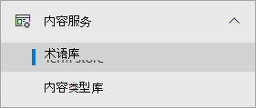
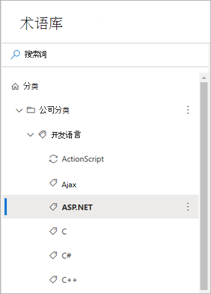
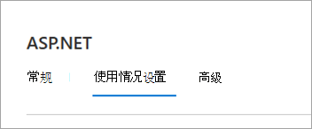
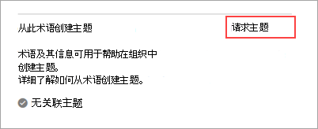
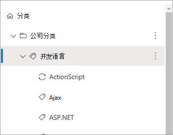
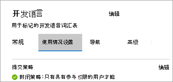
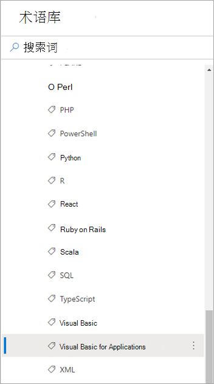
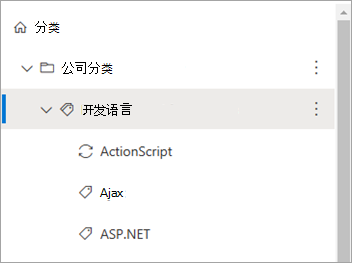
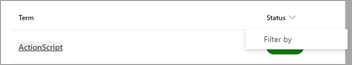

# 使用SharePoint分类术语在"主题"Microsoft Viva主题

> [!Note] 
> 此功能当前仅适用于早期采用者计划的参与者。 此功能将在以后向世界各地的用户提供。

可以使用分类SharePoint帮助指导人工智能 (AI) 创建 Viva 主题中的主题。 分类SharePoint分类服务提供了可用于所有网站的全局术语。 用户可以创建与表示为术语的概念相对应的主题。 

您必须对要用于执行这些任务的全局术语具有编辑权限。

<!---
> [!Note]
> This feature is available only for users who are licensed for Viva Topics.
--->

## 如何工作

当有人请求从术语创建主题时，分类服务将有关该术语的信息中继到 Viva 主题以创建相应主题。 此信息包括以下内容：

- 默认 (名称) 
- 同义词
- 说明
- 用术语标记的文件

创建的主题使用术语中的原始名称，将同义词作为主题的备用名称，并使用术语中的说明作为主题说明。 在主题中，用分类术语标记的文件被视为"建议"文件。 然后，AI 继续发现该主题的其他内容。

> [!Note]
> 若要成功创建主题，分类术语必须至少具有一个标记的文件。 如果没有，系统将拒绝请求。

从术语创建主题后，术语将继续存在于术语SharePoint且不受主题创建的影响。 你将继续能够在列表和库中SharePoint它。

如果删除某个术语，则删除操作不会自动删除该主题。 如果 Viva 主题标识了与主题相关的内容，而这些内容并非仅来自术语及其标记内容，则主题仍然存在。

如果术语的默认标签或说明发生更改，Viva 主题将评估更改，并更新主题信息（如果确定更改适用）。 使用术语标记的内容也会定期传递到 Viva 主题。 如果不再有任何用术语标记的内容，并且 Viva 主题未标识与该主题关联的任何其他内容，则可能会删除该主题。

对主题的更新不会影响原始术语。

## 启动主题创建请求

您可以请求一个术语或一个术语集的多个术语。 在新式术语库内启动主题SharePoint请求。 可以编辑术语集的用户有权启动请求。 这些用户包括术语库管理员、组管理员和参与者。

### 请求单个术语

1. In the SharePoint admin center， in the left navigation， select **Term store**.

     

2. 在 **"术语库"** 页上，搜索并选择想要使用的术语。

    

3. 在术语页上，选择" **使用设置"** 选项卡。

    

4. 在"**从此术语创建主题"部分，** 选择"**请求主题"。**

    

### 请求术语集的多个术语

1. In the SharePoint admin center， in the left navigation， select **Term store**.

     

2. 在 **"术语库"** 页上，搜索并选择您想要使用的术语集。

    

3. 在术语页上，选择" **使用设置"** 选项卡。

    

4. 在"**从术语创建主题"部分**，选择 **"开始使用"。** 如果过去引发了请求，则出现的选项是"**创建用于创建的术语"。**

    

    在"**从术语创建主题"部分**，选择"**请求主题"。**

    

    1. 在 **"选择要创建主题的** 术语"页上，可以选择此术语集内的术语层次结构。

        

    2. 若要选择特定术语，请单独选择每个术语。

    3. 还可以选择层次结构中节点的所有直接子级。 

5. 选择要创建主题的术语后，选择"提交 **"。**

    Viva 主题创建请求并排队等待处理。 Viva 主题评估术语及其关联资源，并创建新主题或与现有主题合并。 初始请求后，将在 24 小时内创建主题。

## 查看主题创建请求的状态

从分类术语创建主题的请求分为三种状态之一：已请求、成功或已拒绝。

- **已请求** – 指示请求已排队，服务正在收集所有必需的术语信息。 新请求可能在移动到两个最终状态之一之前，在请求状态中保留几小时。

- **Success** – 指示请求已成功中继到包含所有必要的术语信息的 Viva 主题。 Viva 主题将创建接下来 24 小时内的相应主题。

- **已** 拒绝 – 指示无法处理请求，因为没有任何使用术语标记的文件。 应至少有一个文件标记，请求才能成功。 如果文件稍后使用术语进行标记，您可以手动为术语创建新请求。

在术语库中，您可以通过以下项查看请求的状态：

- 访问单个术语。
- 查看特定术语集的所有请求。

### 查看单个术语的状态

1. 在 **"术语库** "页上，搜索并选择要查看其状态的术语。

    

2. 在术语页上，选择" **使用设置"** 选项卡。

    

3. 在 **"从此术语创建主题** "部分，查看请求的状态。

    

### 查看术语集内多个术语的状态

1. 在 **"术语库** "页上，搜索并选择要查看其状态的术语集。

    

2. 在术语页上，选择" **使用设置"** 选项卡。

    

    在 **"从术语创建** 主题"部分，可以看到请求总数、链接到主题的数量以及拒绝的请求数。

3. 选择 **"查看所有请求"。**

4. 在" **主题创建的所有请求** 的术语"面板上，查看术语请求的状态。

    

5. 如果有很多请求，请选择"加载 **更多** "以继续加载其他项。

    

6. To review requests that are in a particular state， on the **Status** column， select **Filter by**.

    

     选择要按以下条件筛选的状态： **已** 拒绝、 **成功** 或 **已请求**。

    

<!---

## Identify topics created from terms (feature not ready yet)

After Viva Topics processes a request and creates a topic, you can see a topic card when you hover over a term name in the list of requests for the term set.

    

Also, if you go to individual terms, and select the **Usage settings** tab, the **Create topic from this term** section shows a topic card when you hover over the name.

    

Topic pages also indicate that the taxonomy is one of the sources for the topic.

**--Insert screenshot from final UX - source string in topic page--**

--->
