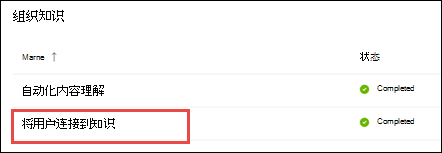

# 主题中心概述 (预览) Topic center overview (Preview)

> [!Note] 
> 本文中的内容适用于 Project Cortex 私人预览。The content in this article is for Project Cortex Private Preview. [了解更多关于 Project Cortex的信息](https://aka.ms/projectcortex)。[Find out more about Project Cortex](https://aka.ms/projectcortex).

主题 center 是一个新式 SharePoint 网站，用作组织的知识中心。The topic center is a Modern SharePoint site that serves as a center of knowledge for your organization. 它是在 Microsoft 365 管理中心内的 [知识管理安装](set-up-knowledge-network.md) 过程中创建的。It is created during [Knowledge Management setup](set-up-knowledge-network.md) in the Microsoft 365 admin center.

主题中心具有一个默认主页，您可以在其中查看已连接或建议连接的主题。The topic center has a default home page where you can see the topics to which you have been connected or suggested to be connected. 具有适当权限的用户还可以：Users with the proper permissions can also:

- 创建新的主题页面Create a new topic page
- 确认或拒绝建议的主题Confirm or reject suggested topics
- 编辑并发布对主题页面所做的更改Edit and publish changes to a topic page

> [!Note] 
> 您可以在 [与主题中心](work-with-topics.md)中的主题一起了解有关每个任务的详细信息。You can learn more about each task in [Work with topics in the topic center](work-with-topics.md).

## 主题中心在哪里Where is the topic center

您的主题中心是在知识管理安装过程中创建的。Your topic center is created during Knowledge Management setup. 安装程序完成后，管理员可以在 " [知识中心管理" 页](manage-knowledge-network.md)上找到该 URL。After setup completes, an admin can find the URL on the [knowledge center management page](manage-knowledge-network.md).

1. 在 Microsoft 365 管理中心中，在导航窗格中选择 " **安装程序** "，然后在 " **组织知识** " 部分选择 " **将人员连接到知识** "。In the Microsoft 365 admin center, select **Setup** in the navigation pane, and in the **Organizational Knowledge** section, select **Connect people to knowledge**.

     

2. 在 " **将用户连接到知识** " 页上的 " **概览** " 部分，参阅网站 URL 的 **主题中心地址** 。On the **Connect people to knowledge** page, in the **At a glance** section, see **Topic center address** for the site URL.

## 主页Home page

若要查看主题中心，您需要具有查看主题和主题体验的权限。To see the topic center, you need to have permissions to view topics and the topic experiences. 在 [知识管理安装](set-up-knowledge-network.md)过程中，管理员可以将这些权限分配给用户，或者可以通过 Microsoft 365 管理中心将新用户添加到管理员 [之后](give-user-permissions-to-the-topic-center.md) 。Your admin can assign these permissions to users during [knowledge management setup](set-up-knowledge-network.md), or new users can be [added afterwards](give-user-permissions-to-the-topic-center.md) by an admin through the Microsoft 365 admin center.

在主页上On the home page 
- **查看主题** ：查看主题体验。**View topics** : view topic experiences. 因此，您可以查看组织中的主题，并提供有关已连接的主题的反馈：So you can see topics in the organization and give feedback on topics where you have been connected:
1. 建议的连接-这些是我的连接已建议的主题Suggested connections - these are topics where my connection has been suggested
2. 已确认的连接-这些主题是我在确认建议的连接时，我在主题中固定的主题或者我已确认我的连接主题将从 "建议进行确认" 部分移出。Confirmed connections - these are topics where I am pinned on the topic or I've confirmed my connection Topics will move from the suggested to confirmed section when I confirm a suggested connection.
固定后，可以对 "主题" 页面进行编辑，以 curate 我的连接。Once I'm pinned, edits to the topic page can be done to curate my connection.

- **创建和编辑主题** ：提供了新主题，并且可以编辑页面**Create and edit topics** : New topic is available and you can edit pages

## 使用 "管理主题功能" 主题中心的权限Permissions to use the Manage Topics capability topic center

若要在主题中心的 "管理主题" 部分中工作，您需要具有所需的权限。To work in the Manage Topics section of topic center, you need to have the required permissions. 在 [知识管理安装](set-up-knowledge-network.md)过程中，管理员可以将这些权限分配给用户，或者可以通过 Microsoft 365 管理中心将新用户添加到管理员 [之后](give-user-permissions-to-the-topic-center.md) 。Your admin can assign these permissions to users during [knowledge management setup](set-up-knowledge-network.md), or new users can be [added afterwards](give-user-permissions-to-the-topic-center.md) by an admin through the Microsoft 365 admin center.

可以向主题中心用户授予两组权限：Topic center users can be given two sets of permissions:

- **管理主题** ：使用主题仪表板查看整个组织中的主题。**Manage topics** : Use the topic dashboard to review topics across the organization. 用户可以执行诸如确认和拒绝未确认的主题等操作。Users can perform actions such as confirming and rejecting unconfirmed topics.

可以向用户授予这两组权限，如果需要，也可以只有一个。A user can be given both sets of permissions, or only one if needed. 

## 查看主题仪表板中的主题Reviewing topics in the topic dashboard

主题仪表板显示从指定源位置中挖掘的主题。The topic dashboard shows topics that were mined from your specified source locations. 每个主题将显示搜索主题的日期以及是否在其上提供了任何反馈。Each topic will show the date the topic was discovered and if any feedback has been provided on it. 分配了 " **管理主题** " 权限的用户可以查看未确认的主题，并选择执行以下操作：A user who was assigned **Manage topics** permissions can review the unconfirmed topics and choose to:
- 确认主题：突出显示对具有访问权限的用户的主题，并让他们看到关联的主题卡片和主题页面。Confirm the topic: Highlights the topic to users who have access and lets them see the associated topic card and topic page.
- 拒绝主题：使主题对用户不可用。Reject the topic: Makes the topic not available to users. 主题将移至 "已 **拒绝** " 选项卡，并在以后需要时进行确认。The topic is moved to the **Rejected** tab and can be confirmed later if needed.

## 创建或编辑主题Create or edit a topic

如果您具有 **创建和编辑主题** 权限，则可以选择执行以下操作：If you have **Create and edit topics** permissions, you can choose to:

- 编辑现有主题：您可以对通过发现创建的现有主题页面进行更改。Edit existing topics: You can make changes to existing topic pages that were created through discovery.
- 新建主题：您可以为未通过发现找到的用户创建新的主题，或者如果 AI 工具没有找到足够的证据来创建主题。Create new topics: You can create new topics for ones that were not found through discovery, or if AI tools did not find enough evidence to create a topic.

## 另请参阅See also

  

