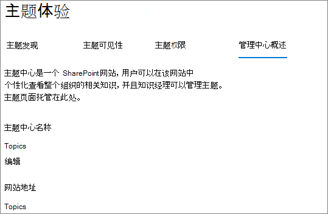

# Microsoft Viva 主题中的主题中心概述Topic center overview in Microsoft Viva Topics

在 Microsoft Viva 主题中，主题中心是一个新式 SharePoint 网站，它充当组织的一个知识中心。In Microsoft Viva Topics, the topic center is a modern SharePoint site that serves as a center of knowledge for your organization. 它在 Microsoft 365 管理中心的 [Viva](set-up-topic-experiences.md) 主题设置期间创建。It's created during [Viva Topics setup](set-up-topic-experiences.md) in the Microsoft 365 admin center.

主题中心具有一个包含主题 **Web** 部件的默认主页，所有许可用户都可以查看他们具有连接的主题。The topic center has a default home page with the **Topics** web part where all licensed users can see the topics to which they have a connection. 

虽然所有可以查看主题的许可用户都将有权访问主题中心，但知识管理人员也可通过"管理主题"页 **管理** 主题。While all licensed users who can view topics will have access to the topic center, knowledge managers can also manage topics through the **Manage topics** page. " **管理主题** "选项卡将仅显示给具有"管理主题"权限的用户。The **Manage topics** tab will only display to users who have the Manage topics permissions. 

## 我的主题中心在哪里Where is my topic center

主题中心在 Viva 主题设置期间创建。The topic center is created during Viva Topics setup. 设置完成后，管理员可以在主题中心管理页面上[找到 URL。](./topic-experiences-administration.md#to-access-topics-management-settings)After setup completes, an admin can find the URL on the [Topic center management page](./topic-experiences-administration.md#to-access-topics-management-settings).

1. 在 Microsoft 365 管理中心中，选择"设置 **"，** 然后选择"**组织设置"。**In the Microsoft 365 admin center, select **Settings**, and then select **Org settings**.
2. 在"**服务"** 选项卡上，选择"**主题体验"。**On the **Services** tab, select **Topic Experiences**.

      

3. 选择" **主题中心"** 选项卡。在 **"网站地址** "下是指向主题中心的链接。Select the **Topic center** tab. Under **Site address** is a link to your Topic center.

      

## 主页Home page

 

> [!VIDEO https://www.microsoft.com/videoplayer/embed/RE4LAhZ]  

 

在主题中心主页上，可以看到组织中已建立连接的主题。On the topic center home page, you can see the topics in your organization to which you have a connection.

- 建议的连接 - 你将看到"我们已在这些主题中列出你 **"下列出的主题。我们做对了吗？。**Suggested connections - You will see topics listed under **We've listed you on these topics. Did we get it right?**. 在这些主题中，你通过 AI 建议了与主题的连接。These are topics in which your connection to the topic has been suggested through AI. 例如，您可能是相关文件或网站的作者。For example, you might be an author of a related file or site. 系统要求你确认你应作为主题的相关人员继续列出。You are asked to confirm that you should stay listed as a related person for the topic.

     
 
- 已确认连接 - 这些是你固定在主题页面上或已确认与主题的建议连接的主题。Confirmed connections - These are topics in which you are pinned on the topic page or you've confirmed a suggested connection to the topic. 当您确认建议的连接时，主题将从建议移至已确认部分。Topics will move from the suggested to confirmed section when you confirm a suggested connection.
 
     

一旦用户确认其与主题的连接，用户就可以对主题页面进行编辑以修改其连接。Once a user confirms their connection to a topic, the user can make edits to the topic page to curate their connection. 例如，他们可以提供有关其与主题的连接的详细信息。For example, they can provide more information about their connection to the topic.

## "管理主题"页Manage topics page

若要在主题中心的"管理主题"部分工作，您需要具有知识管理器角色所需的"管理主题"权限。To work in the **Manage Topics** section of topic center, you need to have the required Manage Topic permissions needed for the knowledge manager role. 管理员可在知识管理设置期间向用户分配这些权限，或者管理员随后可通过 Microsoft 365 管理中心添加新用户。 Your admin can assign these permissions to users during [knowledge management setup](set-up-topic-experiences.md), or new users can be [added afterwards](topic-experiences-knowledge-rules.md) by an admin through the Microsoft 365 admin center.

在"管理主题"页上，主题仪表板显示您有权访问的所有主题（从指定的源位置标识）。On the Manage Topics page, the topic dashboard shows all the topics, you have access to, that were identified from your specified source locations. 每个主题将显示主题的发现日期。Each topic will show the date the topic was discovered. 分配了管理主题权限的用户可以查看未确认的主题，并选择：A user who was assigned Manage topics permissions can review the unconfirmed topics and choose to:
- 确认主题：向用户指示 AI 建议的主题已经过人工保护者验证。Confirm the topic: Indicates to users that an AI-suggested topic has been validated by a human curator. 
- 发布主题：编辑主题信息以提高最初确定的主题的质量，并突出显示给具有主题查看访问权限的所有用户。Publish the topic: Edit the topic information to improve the quality of the topic that was initially identified, and highlights the topic to all users who have view access to topics. 
- 拒绝主题：使最终用户无法发现该主题。Reject the topic: Makes the topic undiscoverable to end users. 该主题将移至" **已拒绝** "选项卡，稍后可以确认（如果需要）。The topic is moved to the **Rejected** tab and can be confirmed later if needed. 

> [!Note] 
> 有关 [管理主题](manage-topics.md) 页中管理主题的更多详细信息，请参阅管理主题。See [Manage topics](manage-topics.md) for more details about topic managing topics in the Manage topics page.

## 创建或编辑主题Create or edit a topic

如果您具有"创建和编辑主题"权限，您可以：If you have Create and edit topics permissions, you can:

- [编辑现有主题](edit-a-topic.md)：您可以更改通过发现创建的现有主题页面。[Edit existing topics](edit-a-topic.md): You can make changes to existing topic pages that were created through discovery.
- [创建新主题](create-a-topic.md)：你可以为发现时找不到的主题或 AI 工具找不到足够证据来创建主题。[Create new topics](create-a-topic.md): You can create new topics for ones that were not found through discovery, or if AI tools did not find enough evidence to create a topic.

## 另请参阅See also

[在主题中心管理主题Manage topics in the topic center](manage-topics.md)

