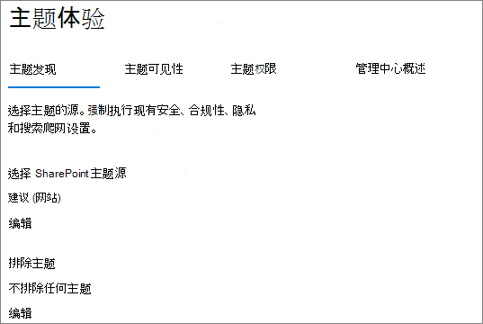

# <a name="manage-topic-discovery-in-microsoft-viva-topics"></a>在 Microsoft Viva 主题中管理主题发现

可以在管理中心 中管理Microsoft 365[发现设置](https://admin.microsoft.com)。 您必须是全局管理员或SharePoint才能执行这些任务。

## <a name="to-access-topics-management-settings"></a>若要访问主题管理设置：

1. 在管理Microsoft 365，单击"设置"，**然后单击"****组织设置"。**
2. 在"**服务"** 选项卡上，单击 **"主题体验"。**

     

3. 选择" **主题发现"** 选项卡。有关每个设置的信息，请参阅以下各节。

     

## <a name="select-sharepoint-topic-sources"></a>选择SharePoint主题源

您可以更改SharePoint主题的爬网网站。

如果要包含或排除特定的网站列表，可以使用以下.csv模板：

``` csv
Site name,URL
```

如果使用网站选取器添加网站，这些网站将添加到现有网站列表以包含或排除。 如果上传 .csv 文件，则会覆盖任何现有列表。 如果之前已包含或排除特定网站，则以文件.csv下载列表，进行更改，并上载新列表。

为主题发现选择站点

1. 在“**主题发现**”选项卡上，“**SharePoint 主题源**”下方，选择“**编辑**”。
2. 在"**选择SharePoint** 源"页上，选择将在发现SharePoint哪些网站作为主题源进行爬网。 这包括：
    - **所有网站**：SharePoint网站。 这将捕获当前和将来的网站。
    - **全部，所选网站除外**：键入要排除的网站的名称。  还可以上载要选择从发现中退出的网站列表。 将包含未来创建的网站作为主题发现源。 
    - **仅选定网站**：键入要包含的网站的名称。 您还可以上载网站列表。 将不包含未来创建的网站作为发现源。
    - **无网站**：主题不会自动生成或更新SharePoint内容。 现有主题保留在主题中心。

    
   
3. 单击“保存”。

## <a name="exclude-topics-by-name"></a>按名称排除主题

可以通过使用 .csv 文件上传列表，将主题从发现中排除。 如果之前排除过主题，可以下载 .csv、进行更改，然后再次上传。

1. 在“**主题**”选项卡上，“**排除主题**”下方，选择“**编辑**”。
2. 单击 **"按名称排除主题"。**
3. 如果需要创建列表，请下载 .csv 模板并添加要排除 (请参阅下面的使用 .csv *模板*) 。 文件准备就绪后，单击" **浏览** "并上载该文件。 如果存在现有列表，可以下载包含.csv的列表。
4. 单击“保存”。

    

### <a name="working-with-the-csv-template"></a>使用.csv模板

你可以复制下面的 csv 模板：

``` csv
Name (required),Expansion,MatchType- Exact/Partial (required)
```

在 CSV 模板中，输入与要排除的主题相关的以下信息：

- **名称**：键入要排除的主题的名称。 可以通过两种方式来执行此操作：
    - 完全匹配：可以排除确切的名称或缩写 (例如 *Contoso* 或 *ATL*) 。
    - 部分匹配：可以排除其中包含特定单词的所有主题。  例如 *，arc 将* 排除包含单词 *arc* 的所有主题，如弧 *形圆*、*弧* 形圆或 *培训弧*。请注意，它将不会排除将文本作为单词的一部分包含的主题，例如体系结构 *。*
- **代表 (可选**) ：如果要排除首字母缩写词，请键入首字母缩写词代表的单词。
- **MatchType-Exact/Partial**：键入您输入 *的名称是精确* 匹配类型还是 *部分* 匹配类型。

     

## <a name="see-also"></a>另请参阅

[管理主题在Microsoft 365](topic-experiences-knowledge-rules.md)

[管理主题权限Microsoft 365](topic-experiences-user-permissions.md)

[更改主题中心的名称Microsoft 365](topic-experiences-administration.md)
