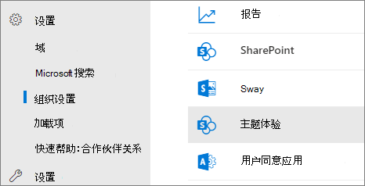
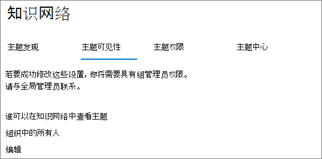
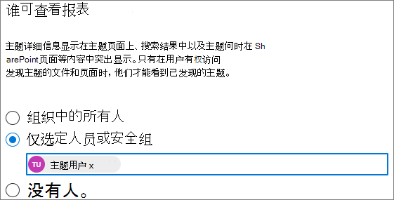

# 管理主题主题Microsoft Viva可见性

你可以管理哪些人可以看到主题突出显示、主题卡片和主题中心[，Microsoft 365 管理中心。](https://admin.microsoft.com) 您必须是全局管理员或SharePoint组管理员才能执行这些任务。

## 要访问主题管理设置，请执行以下操作：

1. 在"Microsoft 365 管理中心中，单击"设置"，**然后单击"****组织设置"。**
2. 在"**服务"** 选项卡上，单击 **"主题体验"。**

     

3. 选择" **主题可见性"** 选项卡。有关每个设置的信息，请参阅以下部分。

     

##  更改哪些人可以看到组织中的主题

可以更改可在组织中查看主题的用户。

1. 在"**主题可见性"** 选项卡上的"Who **可以看到主题"下，选择**"编辑 **"。**
2. On the **Who see topics** page， you choose who will have access to topic details， such as highlighted topics， topic cards， topic answers in search， and topic pages. 可以选择：
    - **组织中的所有人**
    - **仅选定人员或安全组**
    - **没人**

     

3. 选择“**保存**”。  
 
> [!Note] 
> 虽然此设置允许你选择组织的任何用户，但只有分配了主题体验许可证的用户才能查看主题。

## 另请参阅

[管理主题主题Microsoft Viva主题](topic-experiences-discovery.md)

[管理主题主题Microsoft Viva主题](topic-experiences-user-permissions.md)

[在"主题"中更改Microsoft Viva的名称](topic-experiences-administration.md)

