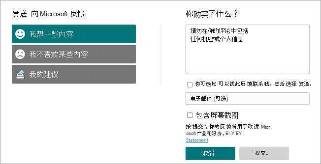

# Microsoft Viva 主题概述 

Viva 主题使用 Microsoft AI 技术、Microsoft 365、Microsoft Graph、搜索和其他组件和服务，从 SharePoint 新式页面、Microsoft 搜索 和 Word、PowerPoint、Outlook 和 Excel 中的搜索开始，向用户介绍他们日常使用的 Microsoft 365 应用中的知识。

 

> [!VIDEO https://www.microsoft.com/videoplayer/embed/RE4LhZP]  

 

Viva 主题可帮助解决许多公司中的一个关键业务问题 — 在用户需要时提供相关信息。 例如，新员工需要快速了解许多新信息，在浏览公司信息时遇到他们不知道的术语。 要了解更多信息，用户可能需要放下手头的工作并花费宝贵时间搜索详细信息，例如，有关术语含义的信息、组织中谁是某个主题方面的专家，以及可能与术语相关的网站和文档。

Viva Topics 使用 AI 自动搜索和识别组织中的 *主题*。 它会编译有关它们的信息，例如简短说明、处理主题的人员，以及与此相关的网站、文件和页面。 知识经理或撰稿人可以选择根据需要更新主题信息。 用户可以访问这些主题，这意味着，在新闻和页面中的新式 SharePoint 网站上将显示该主题的所有实例。 用户可以选择主题，以便通过主题详细信息深入了解该主题。 也可在 SharePoint 搜索中查找主题。

## 如何向用户显示主题

通过以下方式向用户显示主题：

- [在页面SharePoint](topic-experiences-overview.md#sharepoint-highlights)突出显示的主题
- 搜索结果中 [的主题答案](topic-experiences-overview.md#search-results)
- Office 应用程序中 [的搜索](topic-experiences-overview.md#office-application-search)
- [主题中心](topic-experiences-overview.md#topic-center) 主页

### SharePoint突出显示

当 SharePoint 新闻和页面上的内容中提及主题时，你将看到其突出显示。 你可以从突出显示中打开主题摘要。 打开摘要标题中的主题详细信息以查看整个主题页面。 提及的主题可以自动标识，也可以由页面作者直接引用。 

    

### 搜索结果

当您从 SharePoint起始页搜索、在 Office.com 上搜索或在您更改搜索范围以包含整个组织后从 SharePoint 网站搜索时，您可以在搜索结果中看到主题答案。 主题答案将显示在结果列表的主题中，并为您提供一组与本主题相关的简短信息。 

    

### Office应用程序搜索

在 Office 应用（如 Word、PowerPoint、Outlook 或 Excel）（通过搜索框或上下文菜单中的"搜索"）中使用搜索时，主题答案将显示在搜索结果中。

   

   

### 主题中心

用户可以在主题中心主页上查看其组织中已连接到 [的主题](topic-center-overview.md#home-page)。

## 知识索引

Viva Topics 使用 Microsoft AI 技术以识别 Microsoft 365 环境中的 *主题*。

主题是一个在组织方面具有重要意义的短语或术语。 它对于组织具有特定含义，而且具有相关资源，可帮助人们了解组织的含义并查找相关详细信息。 对组织来说，许多不同类型的主题都具有重要意义。 Microsoft AI 技术最初专注于以下类型：

- 项目
- 事件
- 组织
- 位置
- 产品
- 创意工作
- 研究领域

当识别了一个主题且 AI 确定其信息足够成为建议的主题时，*主题页面* 将显示通过主题索引收集的信息，例如：

- 备用名称和首字母缩略词。
- 主题的简要说明。
- 可能熟悉此主题的人。
- 与主题相关的文件、页面和网站。

知识管理员可选择对租户中所有 SharePoint 网站进行主题爬网，或仅选择特定内容。

有关详细信息，请参阅 [主题发现和库化](./topic-experiences-discovery-curation.md)。

## 角色

当你在 Microsoft 365 环境中使用 Viva Topics 时，你的用户将具有以下角色：

- 主题查看者：可以在其至少具有 *阅读* 权限的 SharePoint 新式网站上或 Microsoft 搜索中看到主题要点的用户。 他们可以选择主题要点以查看主题页面中的主题详细信息。 主题查看者可以提供有关主题的有用性的反馈。

- 撰稿人：有权限编辑现有主题或创建新主题的用户。 知识管理员通过 Microsoft 365 管理中心的 Viva Topics 设置为用户分配撰稿人权限。 请注意，还可选择授予所有主题查看者编辑和创建主题的权限，以便每个人都可以为他们看到的主题撰稿。

- 知识经理：在主题生命周期中指导主题的用户。 知识管理员使用主题中心中的"管理主题"页确认 AI 建议的主题、删除不再相关的主题，以及编辑现有主题或创建新主题，并且这些主题是唯一有权访问它的用户。 知识管理员通过 Microsoft 365 管理中心的 Viva Topics 管理设置为用户分配知识经理权限。 

- 知识管理员：管理员设置 Viva 主题，并通过管理员控件在 Microsoft 365 管理中心。 目前，Microsoft 365 全局管理员或 SharePoint 服务管理员可充当知识管理员。

有关详细信息，请参阅 [Viva 主题角色](topic-experiences-roles.md)。

## 主题管理

主题管理在组织 **主题中心的"** 管理主题" *页中完成*。 主题中心在设置过程中创建，并充当组织的知识中心。 

虽然所有许可用户都可以在主题中心查看他们连接的主题，但只有具有管理主题权限 (知识经理) 才能查看和使用"管理主题 **"页。**

知识经理可以：

- 确认或删除在租户中发现的主题。
- 根据需要手动创建新主题（例如，如果提供的信息不够充分，无法通过 AI 发现）。
- 编辑现有主题页面。

有关详细信息，请参阅主题 [中心 中的管理主题](manage-topics.md)。  

## 管理员控件

管理中心中的Microsoft 365 管理中心允许你管理 Viva 主题。 它们允许 Microsoft 365 全局管理员或 SharePoint 管理员：

- 控制允许你组织中的哪些用户查看 SharePoint 新式页面或 SharePoint 搜索结果中的主题。
- 控制将爬网哪些 SharePoint 网站以识别主题。
- 从找到的主题中排除特定主题。
- 控制哪些用户可以在主题中心管理主题。
- 控制哪些用户可以创建和编辑主题。
- 控制哪些用户可以查看主题。

有关管理员控件的详细信息，请参阅[分配用户权限](./plan-topic-experiences.md#user-permissions)、管理主题[可见性](./topic-experiences-knowledge-rules.md)[和管理主题发现](./topic-experiences-discovery.md)。

## 主题库和建议

AI 将持续工作，以便随环境变化提供建议，以改进主题。 

具有编辑或创建主题权限的用户可以直接在想要更正或添加其他信息时更新主题页面。 他们还可以添加新的 AI 无法识别的主题。 如果这些手动添加的主题有足够的信息，并且 AI 能够识别这种类型的主题，来自 AI 的其他建议可能会增强这些手动添加的主题。

系统可能会询问你允许其查看日常工作主题的用户该主题是否有用。 系统会查看这些回复，使用回复来改进主题要点，并可帮助确定主题摘要和主题详细信息中显示的内容。

有关详细信息，请参阅 [主题发现和库化](./topic-experiences-discovery-curation.md)。

## 向我们提供反馈

Microsoft 非常重视客户的反馈。 你为 Viva 主题提供的反馈将用于疑难解答、修复 Bug、增强现有功能以及开发新功能。 

可以直接从主题页面、管理主题和"我的主题"页面向Microsoft **发送** 反馈。 在页面的右下角查找此按钮。

   

在 **"向 Microsoft 发送** 反馈"页上，告诉我们您是否喜欢某些内容、您不喜欢某些内容或者您有什么建议。

   

当你提交反馈时，我们要求你不要包含敏感信息，例如电话号码、地址或高度个人文章。 请通过 Viva 主题提供有关你遇到的特定问题的信息，或提供有关 Viva 主题的一般体验的信息。 这将有助于我们在我们审阅时维护你的隐私，并根据你的反馈采取措施。

感谢你花时间与我们分享你的想法。 你的角度帮助我们改进现有功能并开发新功能。

## 另请参阅

[使用Microsoft 搜索在 Viva 主题中查找主题](./search.md)
