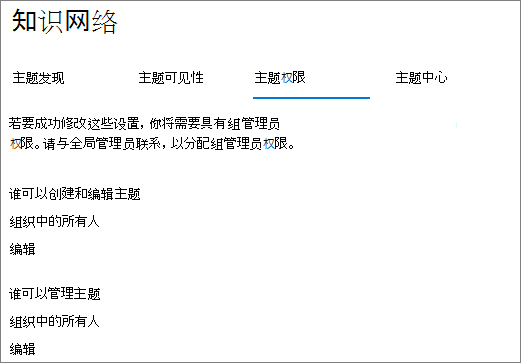
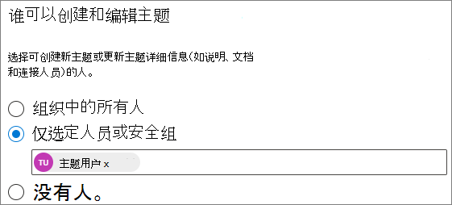
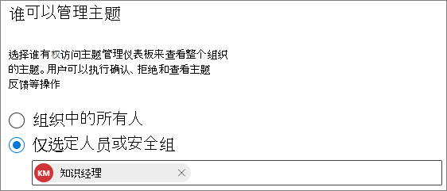

# 在 Microsoft Viva 主题中管理主题权限Manage topic permissions in Microsoft Viva Topics

可以在 [Microsoft 365](https://admin.microsoft.com)管理中心管理主题权限设置。You can manage topic permissions settings in the [Microsoft 365 admin center](https://admin.microsoft.com). 您必须是全局管理员或 SharePoint 管理员才能执行这些任务。You must be a global administrator or SharePoint administrator to perform these tasks.

使用主题权限设置，可以选择：With topic permissions settings you can choose:

- 哪些用户可以创建和编辑主题：创建发现期间找不到的新主题或编辑现有主题详细信息。Which users can create and edit topics: Create new topics that were not found during discovery or edit existing topic details.
- 哪些用户可以管理主题：访问主题管理中心，查看有关主题的反馈，以及移动整个生命周期的主题。Which users can manage topics: Access the topic management center and view feedback on topics as well as move topics through the lifecycle.

## 访问主题管理设置：To access topics management settings:

1. 在 Microsoft 365 管理中心中，单击"**设置**"，然后单击"**组织设置"。**In the Microsoft 365 admin center, click **Settings**, then **Org settings**.
2. 在"**服务"** 选项卡上，单击 **"主题体验"。**On the **Services** tab, click **Topic experiences**.

     

3. 选择 **"主题权限"** 选项卡。有关每个设置的信息，请参阅以下各节。Select the **Topic permissions** tab. See the following sections for information about each setting.

     

## 更改有权更新主题详细信息的用户Change who has permissions to update topic details

更新有权创建和编辑主题的用户：To update who has permissions to create and edit topics:

1. 在 **"主题权限"** 选项卡上的"**谁可以创建和编辑主题"** 下，选择"**编辑"。**On the **Topic permissions** tab, under **Who can create and edit topics**, select **Edit**.
2. 在" **谁可以创建和编辑主题** "页上，可以选择：On the **Who can create and edit topics** page, you can select:
    - **组织中的所有人****Everyone in your organization**
    - **仅选定人员或安全组****Only selected people or security groups**
    - **没人****No one**

      

3. 选择“**保存**”。Select **Save**.

更新有权管理主题的用户：To update who has permissions to manage topics:

1. 在 **"主题权限"** 选项卡上的 **"谁可以管理主题"** 下，选择"**编辑"。**On the **Topic permissions** tab, under **Who can manage topics**, select **Edit**.
2. 在" **谁可以管理主题** "页上，可以选择：On the **Who can manage topics** page, you can select:
    - **组织中的所有人****Everyone in your organization**
    - **选定的人员或安全组****Selected people or security groups**

      

3. 选择“**保存**”。Select **Save**.

## 另请参阅See also

[在 Microsoft Viva 主题中管理主题发现Manage topic discovery in Microsoft Viva Topics](topic-experiences-discovery.md)

[在 Microsoft Viva 主题中管理主题可见性Manage topic visibility in Microsoft Viva Topics](topic-experiences-knowledge-rules.md)

[在 Microsoft Viva 主题中更改主题中心的名称Change the name of the topic center in Microsoft Viva Topics](topic-experiences-administration.md)
