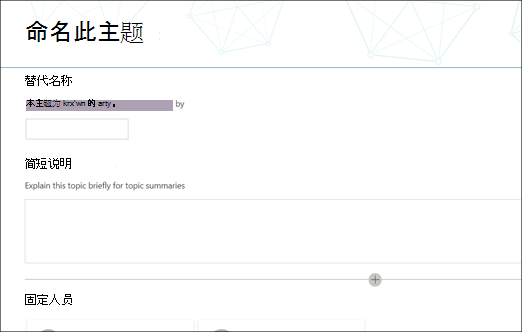
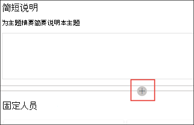

# 使用主题 center (Preview 中的主题) Work with topics in the topic center (Preview)

> [!Note] 
> 本文中的内容适用于 Project Cortex 私人预览。The content in this article is for Project Cortex Private Preview. 了解[有关 Project Cortex 的详细信息](https://aka.ms/projectcortex)。[Find out more about Project Cortex](https://aka.ms/projectcortex).

在主题中心中，知识管理者可以查看已在您指定的 SharePoint 源位置中挖掘和发现的主题，并可以确认或拒绝这些主题。In the topic center, a knowledge manager can review topics that have been mined and discovered in the SharePoint source locations you specified, and can either confirm or reject them. 如果未在主题发现中找到新的主题页面，还可以创建和发布新的主题页面，或者在需要更新时对现有主题页面进行编辑。A knowledge manager can also create and publish new topic pages if one was not found in topic discovery, or edit existing ones if they need to be updated.

## RequirementsRequirements

若要在主题中心中工作，您需要具有所需的权限。In order to work in the topic center, you need to have the required permissions. 你的管理员可以在[知识管理安装](set-up-knowledge-network.md)过程中添加你，也可以在[以后添加](give-user-permissions-to-the-topic-center.md)新用户。Your admin can add you during [knowledge management setup](set-up-knowledge-network.md), or new users can be [added afterwards](give-user-permissions-to-the-topic-center.md).

可以向主题中心用户授予两组权限：Topic center users can be given two sets of permissions:

- 创建和编辑主题：创建新的主题或更新主题内容，如说明、文档和相关人员Create and edit topics: Create new topics or update topic content such as the description, documents and associated persons
- 管理主题：使用主题管理仪表板查看整个组织中的主题。Manage topics: Use the Topic management dashboard to review topics across the organization. 用户可以执行 "确认" 和 "拒绝" 主题等操作Users can perform actions such as confirm and reject topics

## 查看未确认的主题Review unconfirmed topics

在主题中心主页上，在指定的 SharePoint 源位置中发现的主题将在 "未**确认**" 选项卡中列出。具有管理主题权限的用户可以查看未确认的主题，并选择确认或拒绝这些主题。On the topic center home page, topics that were discovered in your specified SharePoint source locations will be listed in the **Unconfirmed** tab. A user with permissions to manage topics can review unconfirmed topics and choose to confirm or reject them.

查看未确认的主题：To review an unconfirmed topic:

1. 在 "未**确认**" 选项卡上，选择要打开主题页面的主题。On the **Unconfirmed** tab, select the topic to open the topic page. 

2. 在 "主题" 页上，查看主题页面，如果需要对页面进行任何更改，请选择 "**编辑**"。On the topic page, review the topic page, and select **Edit** if you need to make any changes to the page.
3. 在知识中心主页上，对于选定的主题，您可以执行以下操作：On the Knowledge Center home page, for the selected topic, you can: 
    a.a. 选择 "检查" 以确认您要保留该主题。Select the check to confirm that you want to keep the topic. 
    b.b. 如果要拒绝主题，请选择**x** 。Select the **x** if you want to reject the topic. 

    已确认的主题将从未**确认**的列表中删除，现在将显示在 "已**确认**" 选项卡中。Confirmed topics will be removed from the **Unconfirmed** list and will now display in the **Confirmed** tab. 

    已拒绝的主题将从未**确认**列表中删除，现在将显示在 "已**拒绝" 或**"已排除" 选项卡中。Rejected topics will be removed from the **Unconfirmed** list and will now display in the **Rejected or Excluded** tab. 
    
   
## 新建主题Create a new topic

具有 "创建" 或 "编辑" 主题权限的用户如果需要，可以创建一个新主题。A user with create or edit topic permissions can create a new topic if needed. 如果找不到通过发现发现的主题，或者如果 AI 技术没有找到足够的证据来将其设置为主题，则可能需要执行此操作。You might need to do this if the topic was not discovered through discovery or if the AI technology did not find enough evidence to establish it as a topic.

若要创建新主题，请执行以下操作：To create a new topic:
1. 在 "主题中心" 页上，选择 "**新建**"，然后选择 "**主题页**"。On the topic center page, select **New**, then select **Topic Page**. 

      

2. 在 "新建主题" 页上，您可以填写新的主题模板上的信息：On the new topic page, you can fill in the information on the new topic template: 
    a.a. 在 "**此主题的名称**" 部分中，键入新主题的名称。In the **Name this topic** section, type the name of the new topic. 
    b.b. 在 "**备用名称**" 部分中，键入也用于引用主题的名称或首字母缩写词。In the **Alternate names** section, type names or acronyms that are also used to refer to the topic. 
    c.c. 在 "**简短说明**" 部分中，键入主题的一个或两个句子说明。In the **Short description** section, type a one or two sentence description of the topic. 此文本将用于关联的主题卡。This text will be used for the associated topic card. 
    d.d. 在 "**人员**" 部分中，键入主题的主题专家的姓名。In the **People** section, type the names of subject matter experts for the topic. 
    e.e. 在 "**文件和页面**" 部分中，选择 "**添加**"，然后在下一页上选择 "关联的 OneDrive 文件" 或 "SharePoint Online 页面"。In the **Files and pages** section, select **Add** and then on the next page you can select associated OneDrive files or SharePoint Online pages. 
    f.f. 在 "**网站**" 部分，选择 "**添加**"。In the **Sites** section, select **Add**. 在显示的 "**网站**" 窗格中，选择与该主题相关联的网站。In the  **Sites** pane that displays, select the sites that are associated to the topic. 

      
3. 如果需要将其他组件添加到页面中，如 text、images、webpart、links 等，请选择页面中间的画布图标以查找和添加它们。If you need to add other components to the page, such as text, images, webparts, links, etc., select the canvas icon in the middle of the page to locate and add them.
       

4. 完成后，请选择 "**发布**" 以发布主题页面。When you are done, select **Publish** to publish the topic page. 已发布的主题页面将显示在 "**页面**" 选项卡中。Published topic pages will display in the **Pages** tab.

> [!Note] 
> 新的主题页面由具有*知识网络意识*的 web 部件组成。The new topic page is made up of web parts that are *knowledge network aware*. 这意味着，作为 AI 收集有关主题的详细信息，这些 web 部件中的信息将会更新，以使页面对用户更有用。This means that as AI gathers more information on the topic, the information in these web parts will be updated with suggestions to make the page more useful to users.

## 编辑现有的主题页面Edit an existing topic page

现有的主题页面可在 "**页面**" 页面中找到。Existing topic pages can be found in the **Pages** page. 

1. 在 "主题中心" 页上，选择 "**页面**"。On the Topic Center page, select **Pages**. 
2. 在 "**页面**" 页面上，您将看到主题页面的列表。On the **Pages** page, you will see a list of topic pages. 使用搜索框查找要更新的主题页面。Use the Search box to find the topic page you want to update. 单击要编辑的主题页面的名称。Click on the name of the topic page that you want to edit. 
3. 在 "主题" 页上，选择 "**编辑**"。On the topic page, select **Edit**.  
4. 对页面进行所需的更改。Make the changes you need to the page. 这包括对以下字段的更新：This includes updates to the following fields: 
    a.a. 替代名称Alternate names 
    b.b. 说明Description 
    c.c. 人员People 
    d.d. 文件和页面Files and pages 
    e.e. 网站Sites 
    f.f. 您还可以通过选择画布图标将静态项添加到页面中，如文本、图像或链接。You can also add static items to the page - such as text, images, or link - by selecting the canvas icon. 

5. 选择 "重新**发布**" 以保存所做的更改。Select **Republish** to save your changes.

## 另请参阅See also

  

