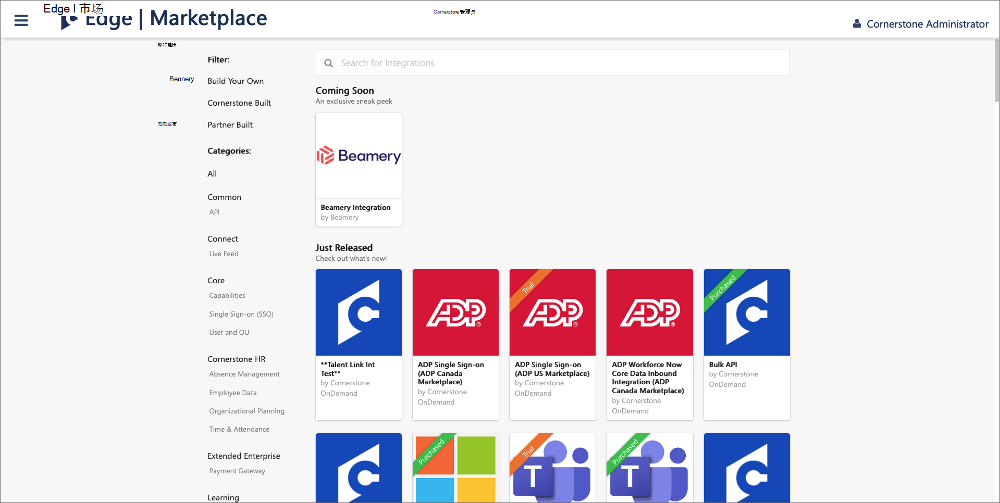
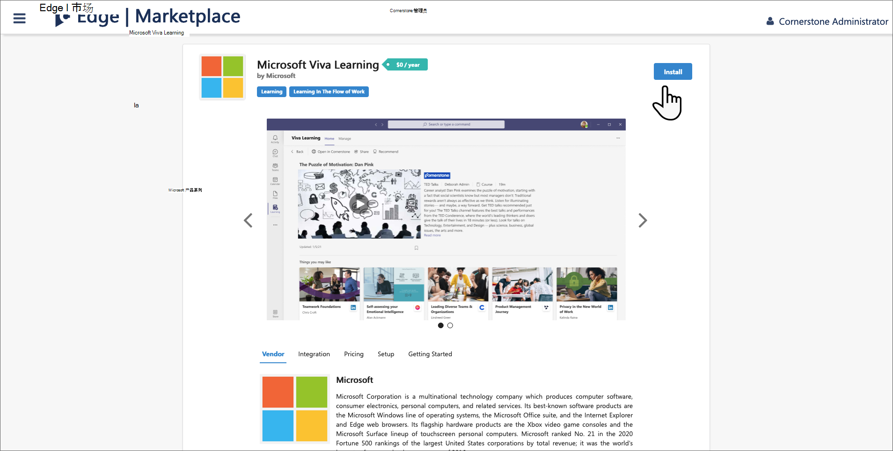
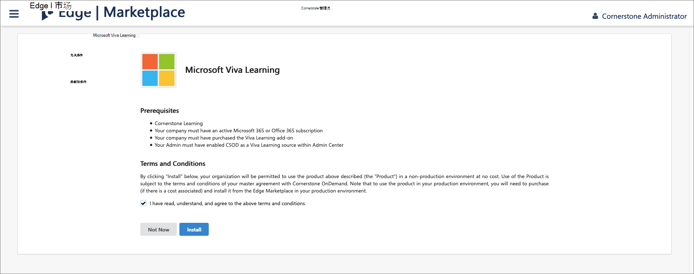
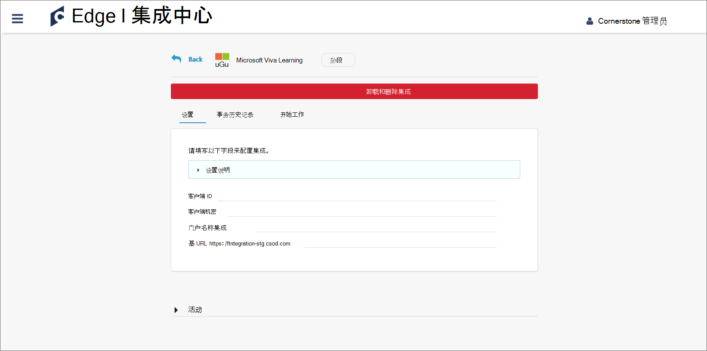
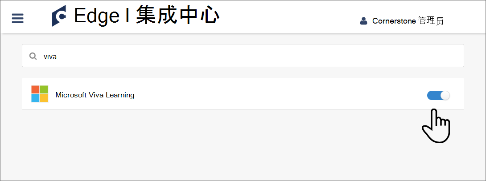

# 配置Demand OnDemand 作为内容源进行Microsoft Viva Learning

本文演示如何在 Viva Learning 中将一个Demand 配置为第三方学习内容Learning。 首先，你需要启用 Viva Learning，然后从你的门户获取你的详细信息。 然后，你需要在部署中完成Microsoft 365 管理中心。

>[!NOTE]
>通过 Viva Learning的内容受 Microsoft 产品条款外的其他条款所规定。 基元 OnDemand 内容和任何关联服务都受Demand的隐私和服务条款的约束。

## 在基础门户中配置

1. 以管理员角色登录到你的基础门户。

    

2. 选择"**边缘"。**

    

3. 转到" **市场"** 并搜索 Viva。

    

4. 选择"Viva Learning磁贴。

    

5. 选择" **安装**"。

    

6. 选中此框以确认你同意条款和条件，**然后选择安装。**

    

7. 选择"**现在配置"。**

    

8. 复制客户端 ID、密码、门户名称和基 URL。 然后返回并搜索 Viva。

    

9. 滑动切换以启用 Viva Learning集成。

    

## 在部署中Microsoft 365 管理中心

1. 登录到[你的Microsoft 365 管理中心。](https://admin.microsoft.com)
2. 导航到 **"设置"，** 再导航到"**组织设置"。** 选择 Viva Learning，然后启用面板中的"Demand"。
3. 填写从"基础门户"中检索到的配置详细信息。

    >[!NOTE]
    >the 显示名称 is the name of the carousel under which Under Which 所管理 learning content will appear for your organization in Viva Learning. 如果不输入名称，则会显示默认名称"Demand OnDemand"。

4. 选择 **"保存**"以激活 Viva Learning。 内容可能需要 24 小时才能显示在 Viva Learning应用中。

>[!NOTE]
>目前，组织内的所有用户都可以发现所有租户特定的课程，但他们只能使用他们有权访问的课程。 已针对将来版本规划基于角色和权限的用户特定内容发现。
