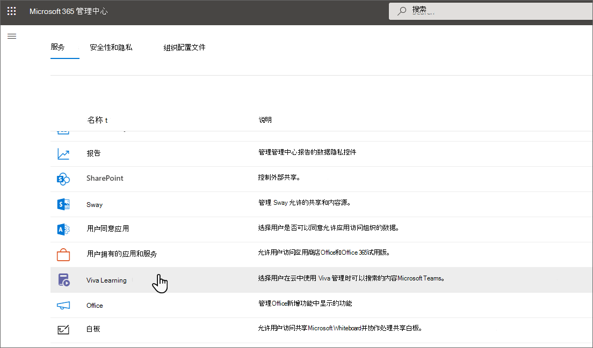

# 添加SharePoint作为网站的内容Microsoft Viva Learning

你可以将SharePoint配置为学习内容源，使组织自己的内容在 Viva Learning。

>[!NOTE]
> 通过 Viva Learning的内容受 Microsoft 产品条款外的其他条款所规定。 添加到 Viva Learning的内容（SharePoint托管的内容）都受与该内容关联的隐私和服务条款的约束。

## 概述

知识管理员 (全局管理员) 提供一个网站[URL，Learning 服务](configure-sharepoint-content-source.md#learning-service)可在其中创建一个空的集中位置，格式为结构化SharePoint列表。 此列表称为"Learning内容存储库"。 你的组织可以使用此列表来存储指向包含学习内容的跨公司SharePoint文件夹的链接。 管理员负责收集并创建文件夹的 URL 列表。 这些文件夹应仅包含可在 Viva Learning 中提供的内容。

Viva Learning支持以下文档类型：

- Word、PowerPoint、Excel、PDF
- 音频 (.m4a) 
- 视频 (.mov、.mp4、.avi) 

有关详细信息，请参阅SharePoint[限制](/office365/servicedescriptions/sharepoint-online-service-description/sharepoint-online-limits?redirectSourcePath=%252farticle%252fSharePoint-Online-limits-8f34ff47-b749-408b-abc0-b605e1f6d498)。

## 多地理位置

如果使用的是[Microsoft 365](/microsoft-365/enterprise/microsoft-365-multi-geo)多地理位置，知识管理员 (提供的网站 URL（Learning 应用程序内容存储库将位于) 需要属于最初预配 Microsoft 365 订阅的中心位置）。 存储库中链接到的文件夹也应属于中心位置。 Viva Learning添加了此限制，以符合数据驻留要求。

[Microsoft 365多地理位置](/microsoft-365/enterprise/microsoft-365-multi-geo)旨在满足数据驻留要求。 有关详细信息，请参阅[SharePoint Online 中的多地理位置功能](/microsoft-365/enterprise/multi-geo-capabilities-in-onedrive-and-sharepoint-online-in-microsoft-365)。

## Permissions

可以从组织的任何网站收集SharePoint文件夹 URL。 Viva Learning遵循所有现有内容权限。 因此，只有用户有权访问的内容才能在 Viva 网站中搜索Learning。 这些文件夹中的任何内容都可以搜索，但只能使用单个员工具有权限的内容。

目前不支持从组织存储库中删除内容。

若要删除无意中显示的内容，请按照以下步骤操作：

1. 若要限制对文档库的访问，请选择"显示 **操作**"选项，然后选择"**管理访问"。**

     

2. 删除文档库中的原始文档。

有关详细信息，请参阅[新式体验中的共享SharePoint权限](/sharepoint/modern-experience-sharing-permissions)。

## Learning 服务

Learning服务使用提供的文件夹 URL 从存储在这些文件夹中的所有内容获取元数据。 在集中式存储库中提供文件夹 URL 的 24 小时内，员工可以在 Viva Learning 中搜索和使用组织Learning。 对内容的所有更改（包括更新的元数据和权限）也将在 24 小时内Learning服务中应用。

## 将SharePoint配置为源

您必须是全局Microsoft 365管理员、SharePoint管理员或知识管理员才能执行这些任务。

若要将 SharePoint配置为 Viva Learning中的学习内容源，请按照以下步骤操作：

1. 在网站左侧导航栏中，Microsoft 365 管理中心"设置"  >  **组织设置"。**

2. 在"**组织设置"** 页上的"**服务"选项卡** 上，选择 **"Viva Learning"。**

     

3. 在 **Viva Learning** 面板的 SharePoint 下，提供要 Viva Learning创建集中式存储库的 SharePoint 网站的网站 URL。 如果SharePoint网站是新的，则需要在网站创建后等待 1 小时，以将其添加到此处。 您还必须是网站SharePoint所有者。

     

     如果你的组织使用[Microsoft 365地理位置，](/microsoft-365/enterprise/microsoft-365-multi-geo)可以在多地理位置可用性上找到Microsoft 365[或国家/地区](/microsoft-365/enterprise/microsoft-365-multi-geo#microsoft-365-multi-geo-availability)。 Viva **Learning** 面板也显示了此信息。

     

4. 将在SharePoint网站中自动创建SharePoint列表。

     在网站左侧导航栏中，SharePoint"网站内容Learning  >  **应用程序内容存储库"。**

     

5. 在 **"Learning内容** 存储库"页上，使用SharePoint内容文件夹的 URL 填充列表。

   1. 选择 **"新建** "以查看 **"新建项目"** 面板。

       

   2. 在 **"新建项目** "面板的" **标题** "字段中，添加你选择的目录名称。 在 **"文件夹 URL"** 字段中，将 URL 添加到学习内容文件夹。 选择 **“保存”**。 [了解如何创建文件夹 URL。](#folder-url-document-library-curation)

       

   3. The **Learning App Content Repository** page is updated with the new learning content.

       

   4. 如果你[的组织Microsoft 365多](/microsoft-365/enterprise/microsoft-365-multi-geo)地理位置，并且你尝试添加一个指向不属于中心位置的文件夹的链接，你将看到错误消息。 所有文件夹都需要属于中心位置。
       

  > [!NOTE]
  > 为了允许更广泛的访问 Learning 应用程序内容存储库，即将在 Viva Learning 界面中提供指向列表的链接，用户可以在这里请求访问并最终帮助填充列表。 网站所有者和全局管理员需要授予对列表的访问权限。 访问权限仅特定于列表，不适用于存储列表的网站。 有关详细信息，请参阅本文稍后 [介绍的提供您自己的](#provide-your-own-organizations-content) 组织的内容。

### 文件夹 URL 文档库库的库

创建一个文件夹来存储组织的学习内容。

1. 转到文档库，然后选择+ **新建**。

    

2. 选择 **"文件夹** "，然后输入文件夹名称。

    

3. 选择“**创建**”。 该文件夹现在会显示在文档库中。

    

4. Upload要发布为此文件夹中的学习内容的文件。
5. 若要获取文件夹 URL，请选择此文件夹，然后选择"**复制链接"。**

    

Microsoft (API 会自动将默认元数据 (，如修改日期、创建者、文档名称、内容类型和组织名称) 自动拉入 Viva Graph Learning Api。

若要改进内容的总体发现和搜索相关性，建议添加"说明 **"** 列。 如果已存在说明列，可以删除它，然后按照以下步骤添加新列。

若要将 **"说明"** 列添加到文档库页面，请按照以下步骤操作：

1. 在"**文档"** 页上，选择"**添加列"。**

2. 选择"**显示操作**"选项，然后选择"**单行文本"。**

    :::image type="content" alt-text="文档中的文档SharePoint显示突出显示单行文本的&quot;显示操作&quot;选项。" source="../media/learning/learning-sharepoint-curation1.png":::

3. 在 **"创建列"面板** 的"名称 **"字段中，** 添加列的描述性名称。 选择 **“保存”**。

    

4. 在" **文档** "页上的" **说明** "列中，添加每个项目的自定义说明。 如果未提供任何说明，Viva Learning将提供一条默认消息，突出显示内容来自您自己的SharePoint库。

     

### 提供你自己组织的内容

知识管理员可在 SharePoint 中访问其组织的 Learning 应用程序内容存储库，他们可在其中提供对跨组织文档库的引用。 然后，这些库中的内容将在 Viva Learning 中显示。

1. 在 Viva Learning中，选择省略号 (**...) ，** 然后选择 **"设置"。**

    
  
2. 在 **"设置"** 下，选择 **"权限"。**

    

3. 选择 **"检查** 访问权限"以连接到组织的集中式库。

## 后续步骤

[为 Viva 添加学习管理系统Learning](configure-lms.md)[或添加适用于 Microsoft Viva Learning 的其他内容提供程序](configure-other-content-sources.md)。
