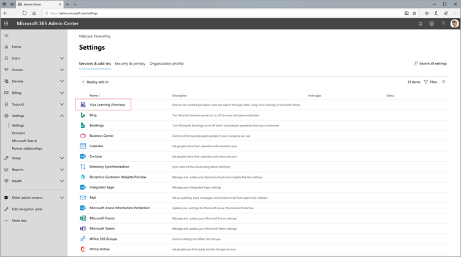

# 即将推出：将 SharePoint 配置为 Microsoft Viva Learning (Preview) Coming soon: Configure SharePoint as a learning content source for Microsoft Viva Learning (Preview)

> [!NOTE]
> 本文中的信息与在商业发行之前可能会进行重大修改的预览产品相关。The information in this article relates to a preview product that may be substantially modified before it's commercially released. 

您可以将 SharePoint 配置为学习内容源，使组织自己的内容在 Viva Learning (Preview) 。You can configure SharePoint as a learning content source to make your organization's own content available in Viva Learning (Preview).

## 概述Overview

知识管理员 (或全局管理员) 提供了一个网站 URL，学习服务可在其中创建一个空的集中位置（"学习应用程序内容存储库"，形式为结构化 SharePoint 列表）。The knowledge admin (or global administrator) provides a site URL to where the Learning Service can create an empty centralized location—the Learning App Content Repository—in the form of a structured SharePoint list. 您的组织可以使用此列表来存储指向包含学习内容的跨公司 SharePoint 文件夹的链接。This list can be used by your organization to house links to cross-company SharePoint folders that contain learning content. 管理员负责收集并创建文件夹的 URL 列表。Admins are responsible for collecting and curating a list of URLs for folders. 这些文件夹应仅包含可在 Viva Learning (Preview) 中提供的内容。These folders should only include content that can be made available in Viva Learning (Preview).

Viva Learning (Preview) 支持以下文档类型：Viva Learning (Preview) supports the following document types:

- Word、PowerPoint、Excel、PDFWord, PowerPoint, Excel, PDF
- Audio (.m4a) Audio (.m4a)
- 视频 (.mov、.mp4、.avi) Video (.mov, .mp4, .avi)

有关详细信息，请参阅 [SharePoint 限制](/office365/servicedescriptions/sharepoint-online-service-description/sharepoint-online-limits?redirectSourcePath=%252farticle%252fSharePoint-Online-limits-8f34ff47-b749-408b-abc0-b605e1f6d498)。For more information, see [SharePoint limits](/office365/servicedescriptions/sharepoint-online-service-description/sharepoint-online-limits?redirectSourcePath=%252farticle%252fSharePoint-Online-limits-8f34ff47-b749-408b-abc0-b605e1f6d498). 

## 权限Permissions

可以从组织的任何 SharePoint 网站收集文档库文件夹 URL。Document library folder URLs can be collected from any SharePoint site in the organization. Viva Learning (Preview) 遵循所有现有内容权限。Viva Learning (Preview) follows all existing content permissions. 因此，只有用户有权访问的内容才能在 Viva Learning (Preview) 中搜索和) 。Therefore, only content for which a user has permission to access is searchable and visible within Viva Learning (Preview). 这些文件夹中的任何内容都可以搜索，但只能使用单个员工具有权限的内容。Any content within these folders will be searchable, but only content to which the individual employee has permissions can be used.

目前不支持从组织存储库中删除内容。Content deletion from your organization’s repository is not currently supported.

若要删除无意中显示的内容，请按照以下步骤操作：To remove unintentionally surfaced content, follow these steps:

1.  若要限制对文档库的访问，请选择"**显示操作**"选项，然后选择"**管理访问"。**To restrict access to the document library, select the **Show actions** option, and then select **Manage access**.
     
     

2.  删除文档库中的原始文档。Delete the original document within the document library.

有关详细信息，请参阅 [SharePoint 新式体验中的共享和权限](/sharepoint/modern-experience-sharing-permissions)。For more information, see [Sharing and permissions in the SharePoint modern experience](/sharepoint/modern-experience-sharing-permissions). 

## 学习服务Learning Service

学习服务使用提供的文件夹 URL 从存储在这些文件夹中的所有内容获取元数据。The Learning Service uses the provided folder URLs to get metadata from all content stored in those folders. 在集中式存储库中提供文件夹 URL 的 24 小时内，员工可以在 Viva Learning (Preview) 中搜索和使用组织的内容。Within 24 hours of supplying the folder URL in the centralized repository, employees can search for and use your organization’s content within Viva Learning (Preview). 对内容的所有更改（包括更新的元数据和权限）也将在 24 小时内应用到学习服务中。All changes to content, including updated metadata and permissions, will also be applied in the Learning Service within 24 hours.

## 将 SharePoint 配置为源Configure SharePoint as a source

您必须是 Microsoft 365 全局管理员、SharePoint 管理员或知识管理员才能执行这些任务。You must be a Microsoft 365 global administrator, SharePoint administrator, or knowledge admin to perform these tasks.

若要在 Viva Learning (Preview) 中将 SharePoint 配置为学习内容源，请按照以下步骤操作：To configure SharePoint as a learning content sources in for Viva Learning (Preview), follow these steps:

1.  在 Microsoft 365 管理中心的左侧导航中，转到 **"设置**  >  **""组织设置"。**In the left navigation of the Microsoft 365 admin center, go to **Settings** > **Org settings**.
 
2.  在"**组织设置"** 页上的"服务 **"选项卡上**，选择 **"Viva Learning (Preview) "。**On the **Org settings** page, on the **Services** tab, select **Viva Learning (Preview)**.

     

3.  在 **Viva Learning (Preview)** 面板上的 SharePoint 下，提供您希望 Viva Learning (Preview) 创建集中式存储库的 SharePoint 网站的网站 URL。On the **Viva Learning (Preview)** panel, under SharePoint, provides the site URL to the SharePoint site where you want Viva Learning (Preview) to create a centralized repository.

     

4.  SharePoint 列表在提供的 SharePoint 网站中自动创建。A SharePoint list is created automatically within the provided SharePoint site.

     

     在 SharePoint 网站的左侧导航栏中，选择"网站 **内容**  >  **""学习应用程序内容存储库"。**In the left navigation of the SharePoint site, select **Site contents** > **Learning App Content Repository**. 

      

5. 在" **学习应用程序内容存储库"** 页上，使用学习内容文件夹的 URL 填充 SharePoint 列表。On the **Learning App Content Repository** page, populate the SharePoint list with URLs to the learning content folders.

   1. 选择 **"新建** "以查看 **"新建项目"** 面板。Select **New** to view the **New item** panel. 

       
 
   2. 在 **"新建项目** "面板的" **标题** "字段中，添加你选择的目录名称。On the **New item** panel, in the **Title** field, add a directory name of your choice. 在 **"文件夹 URL"** 字段中，将 URL 添加到学习内容文件夹。In the **Folder URL** field, add the URL to the learning content folder. 选择“**保存**”。Select **Save**.

       

   3. " **学习应用程序内容存储库"** 页使用新的学习内容进行更新。The **Learning App Content Repository** page is updated with the new learning content.

       

> [!NOTE]
> 为了允许更广泛的访问"学习应用程序内容存储库"，即将在 Viva Learning (Preview) 界面中提供指向列表的链接，用户可以在这里请求访问并最终帮助填充列表。To allow for broader access to the Learning App Content Repository, a link to the list soon will be available in the Viva Learning (Preview) interface where users can request access and ultimately help populate the list. 网站所有者和全局管理员需要授予对列表的访问权限。Site owners and global administrators will be required to grant access to the list. 访问权限仅特定于列表，不适用于存储列表的网站。Access is specific to the list only and does not apply to the site where the list is stored. 有关详细信息，请参阅本文稍后 [介绍的提供您自己的](#provide-your-own-organizations-content) 组织的内容。For more information, see [Provide your own organization's content](#provide-your-own-organizations-content) later in this article.

### 文件夹 URL 文档库库的库Folder URL document library curation

Microsoft Graph API (修改日期、创建者、文档名称、内容类型和组织名称) 等默认元数据将自动拉入 Viva Learning (Preview) 中。Default metadata (such as modified date, created by, document name, content type, and organization name) is automatically pulled into Viva Learning (Preview) by the Microsoft Graph API.
 
若要改进内容的总体发现和搜索相关性，建议添加"说明 **"** 列。To improve overall discovery and search relevance of the content, we recommend adding a **Description** column.

若要将 **"说明"** 列添加到文档库页面，请按照以下步骤操作：To add a **Description** column to the document library page, follow these steps:

1.  在"**文档"** 页上，选择"**添加列"。**On the **Documents** page, select **Add column**.

2. 选择"**显示操作**"选项，然后选择"**单行文本"。**Select the **Show actions** option, and then select **Single line of text**.

     

3. 在 **"创建列"面板** 的"名称 **"字段中，** 添加列的描述性名称。On the **Create a column** panel, in the **Name** field, add a descriptive name for the column. 选择“**保存**”。Select **Save**.

     
 
4. 在" **文档** "页上的" **说明** "列中，添加每个项目的自定义说明。On the **Documents** page, in the **Description** column, add custom descriptions for each item. 如果未提供任何说明，Viva Learning (Preview) 将提供一条默认消息，突出显示内容来自自己的 SharePoint 库。If no description is supplied, Viva Learning (Preview) will provide a default message that highlights the content as being from your own SharePoint library. 

     
 
### 提供你自己组织的内容Provide your own organization's content

知识管理员可在 SharePoint 中访问其组织的"学习应用程序内容存储库"，可在其中提供对跨组织文档库的引用。Knowledge admins can access their organization’s Learning App Content Repository in SharePoint, where they can provide references to cross-organization document libraries. 然后，这些库中的内容将在 Viva Learning (Preview) 中显示。Content within these libraries will be then surfaced as learning content in Viva Learning (Preview).

1. 在 Viva Learning (Preview) 中，选择"更多 **选项** (**...) "，** 然后选择"设置 **"。**In Viva Learning (Preview), select **More options** (**...**), and then select **Settings**.

     
     
2. 在 **"设置"** 下，**选择"权限"。**Under **Settings**, select **Permissions**.

     

3. 选择 **"检查** 访问权限"以连接到组织的集中式库。Select **Check access** to connect to your organization’s centralized library.
     
