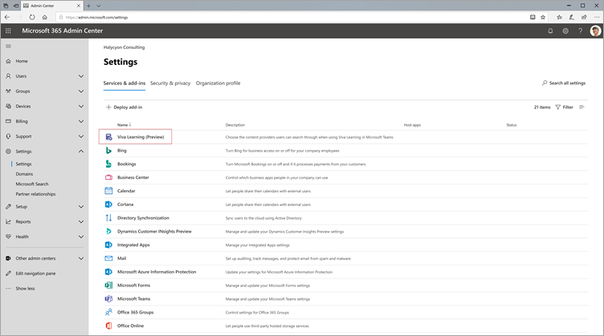
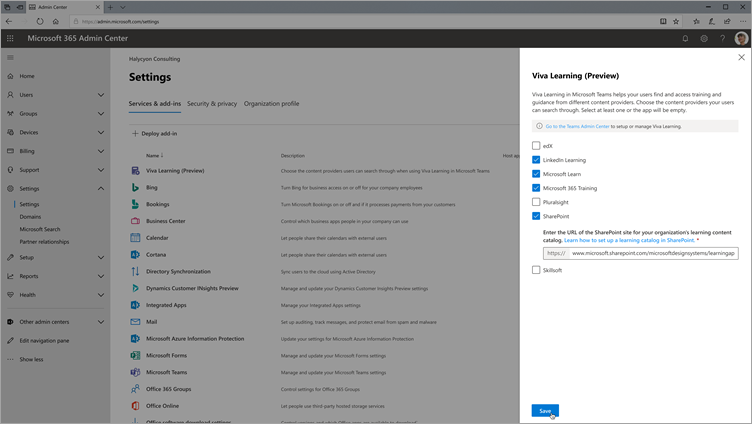

# 在管理中心中为 Microsoft Viva Learning (Preview) 配置Microsoft 365源

> [!NOTE]
> 本文中的信息与在商业发行之前可能会进行重大修改的预览产品相关。 

Microsoft 365 管理中心的管理员可以管理与 Viva Learning (Preview) 相关的设置，并可以配置学习内容源。

管理员选择哪些其他学习内容源 (例如，SharePoint或受支持的第三方内容提供程序源) 可供 Viva Learning (Preview) 用户使用。 然后，管理员配置这些源以确保内容可用于搜索和发现，并且可供使用 Viva Learning (Preview) 。

> [!NOTE]
>  用户登录到非 Microsoft 和 LinkedIn Learning Pro浏览器或嵌入式查看器中学习。 此配置的学习受组织和第三方之间的单独许可证、隐私和服务条款的约束，而不是 Viva Learning (Preview) 条款。 在选择这种类型的学习之前，请验证你已就组织和用户达成一致。

## 分配知识管理员角色 [可选]

您必须是全局Microsoft 365才能执行这些任务。

> [!TIP]
> 知识管理员应具有中等技术水平，并且具有SharePoint管理员凭据，最好是在组织的教育、学习、培训或员工体验方面表现良好的人员。

### 添加知识管理员

若要为 Viva Learning (Preview) 知识管理员，请按照以下步骤操作：

1.  在管理中心的左侧导航Microsoft 365，转到"角色 **"。**

2.  在"**角色"** 页上的 **"Azure AD"** 选项卡上，选择"**知识管理员"。**
 
3.  在"**知识管理员"** 面板上，选择"**分配的管理员**"，然后选择"添加 **"。**

     

3.  在 **"添加管理员"** 面板上，选择你为角色选择的人，然后选择"添加 **"。**

     

### 删除知识管理员

若要删除 Viva Learning (Preview) 知识管理员，请按照以下步骤操作：

1.  在管理中心的左侧导航Microsoft 365，转到"角色 **"。**

2.  在"**角色"** 页上的 **"Azure AD"** 选项卡上，然后选择"**知识管理员"。**
 
3.  在 **"知识管理员**"面板上的"**分配的** 管理员"选项卡上，选择"删除"，然后选择要从角色中删除的人。 若要确认，请选择"删除 **"。**

     

## 配置学习内容源的设置

您必须是全局Microsoft 365管理员或知识管理员才能执行这些任务。

若要在 Viva Learning 中配置用于学习内容源的设置，请按照以下步骤操作：

1.  在管理中心左侧导航Microsoft 365，**转到"设置**  >  **组织设置"。**

2.  在"**组织设置"** 页上的"服务 **"选项卡上**，选择"学习应用 (**预览) "。**

     

3.  在"学习 **(预览)** 面板中，选择要为组织配置的学习内容源，然后选择"保存 **"。**

     

在所有存在的学习源中，默认情况下将启用一些学习源。 这些学习源包括：

- LinkedIn Learning (免费内容) 
- Microsoft Learn
- Microsoft 365培训

> [!NOTE]
> LinkedIn 免费内容根据 LinkedIn 隐私策略和用户协议提供给用户。 LinkedIn 将接收用户的 IP 地址（以前由 LinkedIn 设置的任何 Cookie）并设置一个新的 Cookie 来跟踪免费内容的使用。 用户无需登录 LinkedIn 来接收免费内容。  
对于 LinkedIn 高级内容，你的组织需要订阅团队来访问该内容。 用户需要登录到 LinkedIn 以访问该学习，该学习根据组织的条款以及 LinkedIn 的用户条款提供。   对于非 Microsoft (（免费 LinkedIn 内容) 除外），请确保你的组织订阅了用户使用工作帐户访问该内容，然后再将内容连接到 Viva Learning (Preview) 。 用户对非 Microsoft 学习提供商的个人订阅不会与 Viva Learning (Preview) 。 用户登录到非 Microsoft 和 LinkedIn Learning Pro浏览器或嵌入式查看器中学习。 如果用户导航到没有组织订阅的内容，他们可能会看到一个提供商页面，可以在其中注册单个订阅。 所有非 Microsoft 学习都根据非 Microsoft 提供商的条款提供，而不是作为 Viva 学习的一部分提供。 

若要启用或禁用学习内容源，请选中该源旁边的复选框。 如果启用源，则显示一个选中标记。

## 第三方内容提供程序 

可用的连接学习提供程序集可能随时更改。 随着计划的发展，将有更多的提供商加入。 可用提供商还可以选择中断与 Viva Learning (Preview) 。

### 将 Skillsoft 作为内容源  

对于 Viva Learning (Preview) ，启用了"技能"并选择查看"技能"内容的用户将登录 Percipio 页面，要求他们输入组织的 Percipio 网站名称。 用户输入组织的网站名称后，他们将被定向到页面以登录到组织的 Percipio 网站。 用户将使用其现有凭据登录并查看他们最初选择的内容。 用户只需输入一次 Percipio 网站名称，直到清除其浏览器缓存。 若要为用户简化此体验，我们建议在发送的有关 Viva Learning (Preview) 的内部通信中包括您的 Percipio 站点) 。

这是用于预览的临时体验，我们正在与 Skillsoft 合作，以实现租户特定的集成以实现常规可用性，这将绕过要求用户提供组织的 Percipio 网站名称的步骤。 

### 有关 Microsoft 产品的详细信息  

对于从非 Microsoft 服务 (学习提供程序或学习管理系统) 复制到 Viva Learning (Preview) 的数据，你无法直接在 Viva Learning (Preview) 中提取、更正或删除该数据。 我们立即刷新从非 Microsoft 提供程序导入的数据，以反映非 Microsoft 源数据中的更改和删除。

您需要与非 Microsoft 服务的供应商合作，以根据非 Microsoft 服务的许可证、服务或隐私条款访问、更正、删除或提取数据。 完成非 Microsoft 服务的数据更新周期和 Viva Learning (Preview) 后，在 Viva Learning (Preview) 中处理的数据中将反映所做的更改。 如果关闭 Viva Learning (Preview) 和非 Microsoft 服务之间的连接，则之前从该服务导入的所有数据都将被删除。 

## 后续步骤

[将 SharePoint 配置为 Microsoft Viva Learning (Preview) ](configure-sharepoint-content-source.md)