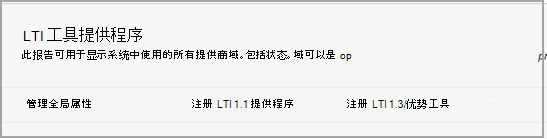

# 将Microsoft Teams类与管理Use Microsoft Teams classes with Blackboard

> [!IMPORTANT]
> 某些信息与预发布的产品有关，在商业发布之前可能有重大修改。Some information relates to prereleased product which may be substantially modified before it's commercially released. Microsoft 对此处所提供的信息不作任何明示或默示的保证。Microsoft makes no warranties, express or implied, with respect to the information provided here.

Microsoft Teams课程是 Learning Tools Interoperability (LTI) 应用，可帮助教师和学生轻松地在 Learning Management System (LMS) 和 Teams 之间导航。Microsoft Teams classes is a Learning Tools Interoperability (LTI) app that helps educators and students easily navigate between their Learning Management System (LMS) and Teams. 用户可以直接从 LMS 中访问与其课程关联的课堂团队。Users can access their class teams associated with their course directly from within their LMS.

## 在租户中批准Microsoft Azure应用程序Approve the app in the Microsoft Azure tenant

以下任务由应用管理员和 Microsoft Office 365 Learn 超管理员完成。The following tasks are completed by the Microsoft Office 365 admin and the Blackboard Learn Ultra admin.

在管理在Microsoft Office 365 Learn 超 中的集成之前，Microsoft Office 365管理员必须批准适用于机构 Microsoft Azure 租户的适用于 **Learn 超 Azure** 应用的适用于 Learn 超 Azure Teams。Before managing the integration within Blackboard Learn Ultra, the Microsoft Office 365 admin must approve the Blackboard **MSFT Teams for Learn Ultra Azure** app for the institution’s Microsoft Azure tenant.

1. 查找你的 Microsoft 租户 ID。Find your Microsoft Tenant ID. 请参阅 [如何查找租户](/azure/active-directory/fundamentals/active-directory-how-to-find-tenant)。See [how to find the tenant](/azure/active-directory/fundamentals/active-directory-how-to-find-tenant).

2. 根据以下示例重定向 Microsoft Identity Platform Admin Consent 终结点：Redirect the Microsoft Identity Platform Admin Consent Endpoint according to the following example:

   `https://login.microsoftonline.com/{tenant}/adminconsent?client_id=2d94989f-457a-47c1-a637-e75acdb11568`

   > [!NOTE]
   > 将 {tenant} 替换为组织的 Microsoft 租户 ID。Replace {tenant} with your organization’s Microsoft tenant ID.

## 注册集成应用Register the integration apps

作为一名 Learn 超管理员，你需要在测试环境中注册 2 个 LTI 1.3 集成应用：As a Blackboard Learn Ultra admin, you'll need to register 2 LTI 1.3 integration apps within your Test environment:

- 为支持名单Teams进行集成The Blackboard Learn Class Teams integration to support the roster sync

- Microsoft Teams课堂团队 LTI 应用The Microsoft Teams class team LTI app

1. 记下这两个应用的以下 LTI 客户端 ID：Make a note of the following LTI Client IDs for both Apps:

    - 美洲 - f1561daa-1b21-4693-ba90-6c55f1a0eb41Blackboard - f1561daa-1b21-4693-ba90-6c55f1a0eb41

    - Microsoft - 027328b7-c2e3-4c9e-aaa1-07802dae6c89Microsoft - 027328b7-c2e3-4c9e-aaa1-07802dae6c89

2. 访问管理面板，在 **"集成"下** 找到 LTI 工具提供程序。Access the Admin Panel, and under **Integrations**, locate the LTI Tool Providers.

   

3. 选择 **"注册 LTI1.3/优势工具"。**Select **Register LTI1.3/Advantage Tool**.

4. 输入提供的第一个客户端 ID (或 Microsoft) ，**然后选择提交。**Enter the first of the Client IDs provided (either Blackboard or Microsoft), and select **Submit**.

5. 查看预填充的设置，并确保工具状态标记为已批准。Review the pre-populated settings and ensure that the tool status is marked as approved.

6. 滚动到底部，然后选择"提交 **"。**Scroll to the bottom, and then select **Submit**.

7. 重复上述步骤，在环境中注册第二个 LTI 应用。Repeat the previous steps to register the second of the LTI apps within your environment.

## 设置 REST 应用程序和跨源资源共享Set up the REST Application and Cross Origin Resource Sharing

The 部署学习超管理员还需要配置 REST 应用程序和跨源资源共享配置。The Blackboard Learn Ultra admin will also need to configure the REST Application and the Cross Origin Resource Sharing configuration.

完成以下操作以设置 REST 应用程序Complete the following to set up the REST Application

1. 访问"了解管理工具"，然后从"集成" **部分选择"REST API** **集成** "。Access the Learn Administration Tools, and then select **REST API Integrations** from the **Integrations** section.

2. 选择 **"创建集成"，** 然后输入与为"适用于集成 LTI"工具的"Teams/客户端 ID 相同的应用程序/客户端 ID。Select **Create integrations** and enter the same Application/Client ID that you entered for the Blackboard Learn Class Teams Integration LTI tool.

3. 输入"了解用户 (这可能是你自己的学习管理员用户名) ， **或选择"** 浏览"查找。Enter the Learn User (this could be your own learn admin username), or select **Browse** to locate.

4. 为 **"\*\*\*\*最终用户访问"选择"是"。**Select **Yes** for **End User Access**.

5. 选择 **"是\*\*\*\*"以授权充当用户**Select **Yes** for **Authorized to Act as User**

6. 选择 **"完成后** 提交"。Select **Submit** once complete.

## 设置跨源资源共享Set up Cross-Origin Resource Sharing

1. 访问"了解管理工具"， **然后从** "集成"部分选择"跨 **源资源共享** "。Access the Learn Administration Tools, and select **Cross-Origin Resource Sharing** from the **Integrations** section.

2. 选择 **"创建配置"。**Select **Create Configuration**.

3. 在 `https://bb-ms-teams-ultra-ext.api.blackboard.com` 源中输入。Enter `https://bb-ms-teams-ultra-ext.api.blackboard.com` in the origin.

4. 在允许的标头中添加 **单词** **Authorization。**Add the word **Authorization** in the **Allowed Headers**.

5. 设置为 **"可用**"**为"是"。**Set **Available** to **Yes**.

6. 选择 **"完成后** 提交"。Select **Submit** once complete.

## 在"Teams中启用课堂学习"Enable Class Teams in Blackboard Learn

启用 LTI 工具后，下一步是从你自己的 Teams 租户设置 Microsoft 类Microsoft Office 365集成。Once you've enabled the LTI tools, your next step will be to set up the Microsoft Class Teams integration from your own Microsoft Office 365 tenant. 为此，你可以按照以下步骤操作，作为"完成""学习""超"管理员。You can do this by following these steps as the Blackboard Learn Ultra admin.

1. 在 **"了解**  >  **管理工具和实用程序"中**，Microsoft Teams **集成管理员"。**In **Learn Admin** > **Tools and Utilities**, select **Microsoft Teams Integration Admin**.

   

2. 选中"启用"复选框 **Microsoft Teams。**Select the checkbox for **Enable Microsoft Teams**.

3. 输入 Microsoft O365 管理员下部分中引用的租户 IDEnter your tenant ID as referenced in the section under Microsoft O365 Admin

 > [!NOTE]
 > 在 O365 管理员批准应用之前，无法保存设置。请参阅[批准租户中的Microsoft Azure。](#approve-the-app-in-the-microsoft-azure-tenant)You won't be able to save the settings until the app has been approved by the O365 admin. See [Approve the app in Microsoft Azure tenant](#approve-the-app-in-the-microsoft-azure-tenant).

4. 当全局 O365 管理员批准 Microsoft 租户中的"Teams应用程序"后，选择"提交 **"。**When the global O365 admin has approved the Blackboard Teams application in your Microsoft Tenant, select **Submit**.
