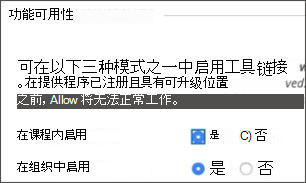

# 将Microsoft Teams类与管理学习超

团队合作是每个现代组织的核心。 通过促进协作，这是每个成功机构的定义特征。 通过将它们与一些类配对，可以增强一切 Capabiliting Learn 超Microsoft Teams功能。

你的课程可能包括实时对话、视频会议或异步交互。 可以在一个地方为学生添加文件共享和共同创建体验。 Microsoft Teams超学习课程重新定义了教学的动态性以及有效的学习方式。

> [!IMPORTANT]
> 确保你已成功在学生信息系统和 SIS 中设置 ([电子邮件) ](https://help.blackboard.com/Learn/Administrator/SaaS/Integrations/Student_Information_System/SIS_Planning)
>
>the Microsoft Teams classes integration relies on the institution email field in your SIS to map to the correct Microsoft Azure Active Directory's (AAD) [User Principle Name (UPN) ](/azure/active-directory/hybrid/howto-troubleshoot-upn-changes). 如果未设置机构电子邮件，这将默认为现有电子邮件。 建议为每个用户设置此字段，以确保其数据正确同步，并且 AAD 和用户学习超之间的电子邮件数据没有冲突。
>
> 如果未在 SIS 映射中正确设置此字段，则集成将继续工作，但用户可能不会显示在创建的 Teams 类中，并且可能会发生错误。

## 支持机构数据映射 – 机构电子邮件 SIS 字段

作为云提供商集成演变的一部分，在学生信息系统框架集成和公共 REST  API 中，为学生信息系统框架集成和公共 REST API 创建了一个新的机构电子邮件字段，让机构可以有效地在"完成学习"和 AAD 之间管理数据同步过程。

### 机构电子邮件意味着什么，它支持什么？

" **机构电子邮件** "字段允许在客户端的外部支持的数据源和用户学习超之间的自定义字段映射。 如果数据源是云提供商（如 Microsoft），则用户原则名称 (UPN) 是每个用户的主要唯一标识符，其中包括 UPN 前缀 (以及用户的帐户名称) 和 UPN 后缀 (DNS 域名) 与 @ 符号联接在一起。 这将为用户内每个特定用户创建一个唯一Microsoft Azure Active Directory。

若要确保数据准确无误，并且正确实现在"完成学习超"和 Microsoft Teams 类之间的注册或成员身份，用户的电子邮件地址必须在这两个系统之间匹配。 在"完成学习"中，用户可以在用户界面中更改或替代其现有电子邮件地址，这可能会导致发生同步错误，并且用户未正确添加到课堂团队。 机构 **电子邮件** 字段映射可确保正确管理此级别的安全和验证检查，而无论用户是否更改了在将用户的电子邮件发送到了一台具有该级别"Learn 超"功能的电子邮件。

 当两个电子邮件地址不同时，可以是：

- 必须决定哪个来源具有优先级，并且将被同时作为个人电子邮件和机构电子邮件。
  或
- 机构可以在机构电子邮件中设置自定义字段映射，从而解决潜在冲突。

机构 **电子邮件** 字段映射现在可用于高级配置和用户了解对象类型字段 **映射** 设置所有现有 SIS  >    >  **集成类型**。

> [!NOTE]
> 值得注意的是，默认情况下，机构电子邮件设置为所有 SIS格式的"个人电子邮件"，并且对于每个人必须是唯一的。  设置并运行的所有现有集成都将具有此数据映射，因为如果用户的电子邮件被复制，SIS 将无法导入用户。 如果机构需要能够将机构电子邮件 **更改为** 自定义，他们将需要通过 SIS 中的高级配置设置管理。

## 要求

超Microsoft Teams课程集成仅适用于 **超课程视图课程**。 你的机构需要完成这些要求以使用它：

- 启用超基本导航后，让用户了解超极学习 SaaS

  

- 启用 LTI 以用于课程。

  a. 转到管理员 **面板**  >  **LTI 工具提供程序**  >  **管理全局属性**。

  b. 在 **"课程"中选择"已启用 LTI"，** 并选择"在 **组织中启用"。**

  c. 选择“**提交**”。

- 必须配置 LTI

- 添加具有超强Teams课程 LTI 集成

- 添加Microsoft Teams类 LTI 1.3 工具

- 添加 REST API 工具和跨源资源共享

- 配置和批准Microsoft Teams类集成

## 添加"百分百学习Teams LTI 1.3 类工具

1. 从管理员 **面板中，** 选择 **LTI 工具提供程序**。

2. 选择 **注册 LTI 1.3 工具**。

3. 在" **客户端 ID"** 字段中，键入或复制并粘贴此 ID：

   `f1561daa-1b21-4693-ba90-6c55f1a0eb41`

4. 查看已预先填充的所有设置，然后在"工具状态"中选择"已启用 **"。**

5. 在 **"机构策略"** 中，在 **"课程、** 名称和电子邮件地址"中选择"角色"，然后为两者选择 **"是**"。

6. 选择 **"允许成绩服务访问"****和"允许成员身份服务访问"。**

## 添加Microsoft Teams类 LTI 1.3 工具

1. 从管理员 **面板中，** 选择 **LTI 工具提供程序**。

2. 选择 **注册 LTI 1.3 工具**。

3. 在" **客户端 ID"** 字段中，键入或复制并粘贴此 ID：

   `027328b7-c2e3-4c9e-aaa1-07802dae6c89`

4. 查看已预先填充的所有设置，在"工具状态 *"* 中选择"已启用 *"。*

5. 在 **"机构策略"** 中，选择 **"课程、名称和****电子邮件地址"中的"角色"。** 为 **两者选择"是** "。

6. 选择 **"允许成绩服务访问"****和"允许成员身份服务访问"。**

## 添加 REST API 工具

1. 从管理员 **面板中**，导航到 **"集成"，** 然后选择 **"Rest API 集成"。**

2. 选择 **"创建集成"。**

3. 在" **应用程序 ID"** 字段中，键入或复制并粘贴此 ID：

   `f1561daa-1b21-4693-ba90-6c55f1a0eb41`

4. 为此集成键入用户。

   此用户将具有与应用程序关联的家庭 API 访问权限。

5. 选择“**提交**”。

## 添加跨源资源共享

1. 从"**管理员"面板** 中，导航 **到"集成"，** 然后选择"**跨源资源共享"。*

2. 选择 **"创建配置"。**

3. 在" **源** "字段中，键入复制并粘贴此 URL：

   `https://bb-ms-teams-ultra-ext.api.blackboard.com`

4. 在" **允许的标题"** 字段中，键入 **Authorization**。

5. 设置为 **"可用****"为"是"。**

6. 选择“**提交**”。

## 配置和批准Microsoft Teams类集成

若要成功将你的"你的Microsoft Teams超"实例与一些类集成，你将需要确保批准在 Microsoft Azure 租户中访问的"完成"Learn 超应用程序。 这一过程将需要由你的机构的全局管理员Microsoft 365完成。

此过程可以在你在你的"你的"学习超实例"中配置 LTI 应用程序之前或之后完成。

### 配置 LTI 应用程序之前

如果你在配置 LTI 集成之前选择批准"完成学习超极Teams类 Azure"应用，则需要重定向到 Microsoft Identity Platform Admin **Consent Endpoint**。 将显示 URL：

`https://login.microsoftonline.com/{tenant}/adminconsent?client\_id=2d94989f-457a-47c1-a637-e75acdb11568`

> [!NOTE]
> 将 **{Tenant}** 替换为特定机构Microsoft Azure租户 ID。

你将看到一个权限窗口，说明你正在向用户授予访问 Microsoft Teams。

### 配置 LTI 应用程序后

1. 在管理员 **面板上**，导航到"**工具和** 实用程序"，然后选择 **"Microsoft Teams集成管理员"。**

2. 选择 **"启用Microsoft Teams"。**

3. 将 **Microsoft 租户 ID** 添加到可用文本字段中。

4. 选择下列选项之一：

   - 如果应用已预先同意，将显示一个小的选中标记。 如果显示选中标记，请选择"提交 **"。**

   - 如果同意尚未获得批准，请按照所述的步骤生成许可 URL 并将其发送给全局管理员Microsoft 365进行审批。

5. 确认批准后，选择"**重试** 以确认"，然后选择"提交 **"。**
