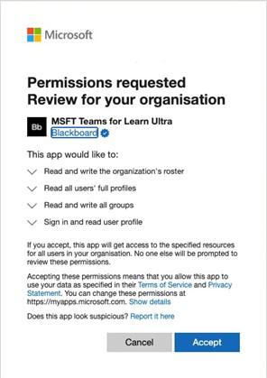

# 将Microsoft Teams类与具有"Learn 超"的类一同使用Use Microsoft Teams classes with Blackboard Learn Ultra

团队合作是每个现代组织的核心。Teamwork is at the core of every modern organization. 通过促进协作，这是每个成功机构的定义特征。By fostering collaboration, it’s a defining characteristic of every successful institution. 通过将它们与一些类配对，可以增强功能与Microsoft Teams功能。You can enhance all the capabilities and features of Blackboard Learn Ultra by pairing them up with Microsoft Teams classes.

你的课程可能包括实时对话、视频会议或异步交互。Your classes might include real-time conversations, video meetings, or asynchronous interactions. 可以在一个地方为学生添加文件共享和共同创建体验。You can add file sharing and cocreation experiences for your students, all in one place. Microsoft Teams超学习课程重新定义了教学的动态性以及有效的学习方式。Microsoft Teams classes with Learn Ultra redefine the dynamics of teaching and what effective learning means.

> [!IMPORTANT]
> 确保你已成功在学生信息系统和 SIS 中设置 ([电子邮件) ](https://help.blackboard.com/Learn/Administrator/SaaS/Integrations/Student_Information_System/SIS_Planning)Ensure that you have successfully set up the Institution Email field in your [Student Information System (SIS)](https://help.blackboard.com/Learn/Administrator/SaaS/Integrations/Student_Information_System/SIS_Planning)
>
>the Microsoft Teams classes integration relies on the institution email field in your SIS to map to the correct Microsoft Azure Active Directory's (AAD) [User Principle Name (UPN) ](/azure/active-directory/hybrid/howto-troubleshoot-upn-changes).The Microsoft Teams classes integration relies on the institution email field in your SIS to map to the correct Microsoft Azure Active Directory’s (AAD) [User Principle Name (UPN)](/azure/active-directory/hybrid/howto-troubleshoot-upn-changes). 如果未设置机构电子邮件，这将默认为现有电子邮件。If no institution email has been provisioned, this will default to the existing email. 建议为每个用户设置此字段，以确保其数据正确同步，并且 AAD 和用户 Learn 超 之间不存在电子邮件数据冲突。It’s recommended that this field be set for every user to ensure their data is synchronized correctly and that there is no conflict of email data between AAD and Blackboard Learn Ultra.
>
> 如果未在 SIS 映射中正确设置此字段，则集成将继续工作，但用户可能不会显示在创建的 Teams 类中，并且可能会发生错误。If you haven’t set this field appropriately in your SIS mapping, the integration will continue to work, but users might not appear in the Teams classes created, and errors could occur.

## 支持机构数据映射 – 机构电子邮件 SIS 字段Supporting Institutional Data Mapping – Institution Email SIS Field

作为云提供商集成演变的一部分，在学生信息系统框架集成和公共 REST  API 中，为学生信息系统框架集成和公共 REST API 创建了一个新的机构电子邮件字段，让机构可以有效地在"完成学习"和 AAD 之间管理数据同步过程。As part of the evolution with Cloud provider integrations, Blackboard Learn Ultra has created a new **Institution Email** field, in both the Student Information System Framework integration and public REST APIs, allowing institutions to manage the data synchronization process effectively between Blackboard Learn Ultra and AAD.

### 机构电子邮件意味着什么，它支持什么？What does the Institution Email mean and what does it support?

" **机构电子邮件** "字段允许在客户端的外部支持的数据源和用户学习超之间的自定义字段映射。The **Institution Email** field allows customized field mappings between a client’s externally supported data sources and Blackboard Learn Ultra. 如果数据源是云提供商（如 Microsoft），则用户原则名称 (UPN) 是每个用户的主要唯一标识符，其中包括 UPN 前缀 (用户帐户名) 和 UPN 后缀 (DNS 域名) 与 @ 符号联接在一起。If data sources are cloud providers, such as Microsoft, the User Principle Name (UPN) is a primary unique identifier for each user consisting of a UPN prefix (the user’s account name) and a UPN suffix (a DNS domain name) joined together with an @ symbol. 这将为用户内每个特定用户创建一个唯一Microsoft Azure Active Directory。This creates a unique email address for each specific user within the Microsoft Azure Active Directory.

为了确保数据准确无误，并确保正确实现在"完成学习超"和"Microsoft Teams"类之间的注册或成员身份，用户的电子邮件地址必须在这两个系统之间匹配。To ensure data is accurate and enrollments or memberships between Blackboard Learn Ultra and Microsoft Teams classes are correctly achieved, a user’s email address must match between both systems. 在"完成学习"中，用户可以在用户界面中更改或替代其现有电子邮件地址，这可能会导致发生同步错误，并且用户未正确添加到课堂团队。In Blackboard Learn Ultra, users can change or override their existing email address in the user interface, which could result in sync errors occurring and the user not being correctly added to a Class Team. 机构 **电子邮件** 字段映射可确保正确管理此级别的安全和验证检查，而无论用户是否更改了在将用户的电子邮件发送到了使用"功能超"功能的用户。The **Institution Email** field mapping ensures this level of security and validation checking can be correctly managed, regardless if users have changed their email within Blackboard Learn Ultra or not.

 当两个电子邮件地址不同时，可以是：When two email addresses are different, either:

- 必须决定哪个来源具有优先级，并且将被同时作为个人电子邮件和机构电子邮件。A decision must be made as to which source has precedence and will be taken as both the Person and Institution Emails.
  或Or
- 机构可以在机构电子邮件中设置自定义字段映射，从而解决潜在冲突。An institution can set a custom field mapping in its Institution Email, which can resolve a potential conflict.

机构 **电子邮件** 字段映射现在可用于高级配置和用户了解对象类型字段映射设置所有现有 SIS  >    >  **集成类型**。The **Institution Email** field mapping is now available for all existing SIS integration types at **Advanced Configuration Settings** > **Users Learn Object Type** > **Field Mapping**.

> [!NOTE]
> 值得注意的是，默认情况下，机构电子邮件设置为所有 SIS格式的"个人电子邮件"，并且对于每个人必须是唯一的。 It’s important to note that, by default, the **Institution Email** is set to the **Person Email** for all SIS formats and must be unique for each person. 设置并运行的所有现有集成都将具有此数据映射，因为如果用户的电子邮件被复制，SIS 将无法导入用户。All existing integrations that are set up and running will have this data mapping in place, as SIS will fail to import users if their email is duplicated. 如果机构需要能够将机构电子邮件更改为自定义，他们将需要通过 SIS **中的** 高级配置设置管理。If an institution requires the ability to change the Institution Email to **custom**, they'll need to manage this through the **Advanced Configuration Settings** in the SIS.

## RequirementsRequirements

该Microsoft Teams课程集成仅适用于 **超课程视图课程**。The Microsoft Teams classes integration is available for **Ultra Course View courses only**. 你的机构需要完成这些要求以使用它：Your institution needs to complete these requirements to use it:

- 启用超基本导航后，让用户了解超极学习 SaaSHave Blackboard Learn Ultra Learn SaaS with Ultra Base Navigation enabled

  

- 启用 LTI 以用于课程。Enable LTI for use in courses.

  a.a. 转到管理员 **面板**  >  **LTI 工具提供程序**  >  **管理全局属性**。Go to the **Administrator Panel** > **LTI Tool Providers** > **Manage Global Properties**.

  b.b. 在 **"课程"中选择"已启用 LTI"，** 并选择"在 **组织中启用"。**Select **LTI Enabled in Courses**, and optionally, select **Enabled in Organizations**.

  c.c. 选择“**提交**”。Select **Submit**.

- 必须配置 LTIMust have LTI configured

- 添加具有超强Teams课程 LTI 集成Add Blackboard Learn Ultra Teams Classes LTI Integration

- 添加Microsoft Teams类 LTI 1.3 工具Add Microsoft Teams Classes LTI 1.3 Tool

- 添加 REST API 工具和跨源资源共享Add the REST API Tool and Cross-Origin Resource Sharing

- 配置和批准Microsoft Teams类集成Configure and approve Microsoft Teams classes Integration

## 添加"为"Teams学习"LTI 1.3 类工具Add the Blackboard Learn Ultra Teams Classes LTI 1.3 Tool

1. 从管理员 **面板中，** 选择 **LTI 工具提供程序**。From the **Administrator Panel**, select **LTI Tool Providers**.

2. 选择 **注册 LTI 1.3 工具**。Select **register LTI 1.3 Tool**.

3. 在" **客户端 ID"** 字段中，键入或复制并粘贴此 ID：In the **Client ID** field, type or copy and paste this ID:

   `f1561daa-1b21-4693-ba90-6c55f1a0eb41`

4. 查看已预先填充的所有设置，然后在"工具状态"中选择"已启用 **"。**Review all settings that have been pre-populated and in **Tool Status**, and then select **Enabled**.

5. 在 **"机构策略"** 中，在 **"课程、** 名称和电子邮件地址"中选择"角色"，然后为两者选择 **"是**"。In **Institution Policies**, select **Role in Course, Name,** and **Email Address**, and then select **Yes** for both.

6. 选择 **"允许成绩服务访问"\*\*\*\*和"允许成员身份服务访问"。**Select **Allow grade service access** and **Allow Membership Service Access**.

## 添加Microsoft Teams类 LTI 1.3 工具Add the Microsoft Teams Classes LTI 1.3 Tool

1. 从管理员 **面板中，** 选择 **LTI 工具提供程序**。From the **Administrator Panel**, select **LTI Tool Providers**.

2. 选择 **注册 LTI 1.3 工具**。Select **register LTI 1.3 Tool**.

3. 在" **客户端 ID"** 字段中，键入或复制并粘贴此 ID：In the **Client ID** field, type or copy and paste this ID:

   `027328b7-c2e3-4c9e-aaa1-07802dae6c89`

4. 查看已预先填充的所有设置，在"工具状态 *"中选择* "已启用 *"。*Review all settings that have been pre-populated and in *Tool Status* and select *Enabled.*

5. 在 **"机构策略"** 中，选择 **"课程、名称和\*\*\*\*电子邮件地址"中的"角色"。**In **Institution Policies**, select **Role in Course, Name,** and **Email Address**. 为 **两者选择"** 是"。Select **Yes** for both.

6. 选择 **"允许成绩服务访问"\*\*\*\*和"允许成员身份服务访问"。**Select **Allow grade service access** and **Allow Membership Service Access**.

## 添加 REST API 工具Add the REST API tool

1. 从管理员 **面板中**，导航到 **"集成"，** 然后选择 **"Rest API 集成"。**From the **Administrator Panel**, navigate to **Integrations** and select **Rest API Integrations**.

2. 选择 **"创建集成"。**Select **Create Integration**.

3. 在" **应用程序 ID"** 字段中，键入或复制并粘贴此 ID：In the **Application ID** field, type or copy and paste this ID:

   `f1561daa-1b21-4693-ba90-6c55f1a0eb41`

4. 为此集成键入用户。Type a user for this integration.

   此用户将具有与应用程序关联的家庭 API 访问权限。This user will be the one with home API access from which the application is associated.

5. 选择“**提交**”。Select **Submit**.

## 添加跨源资源共享Add the Cross-Origin Resource Sharing

1. 从"**管理员"面板** 中，导航 **到"集成"，** 然后选择"\**跨源资源共享"。*From the **Administrator panel**, navigate to **Integrations** and select \**Cross-origin Resource Sharing*.

2. 选择 **"创建配置"。**Select **Create Configuration**.

3. 在" **源** "字段中，键入复制并粘贴此 URL：In the **Origin** field, type of copy and paste this URL:

   `https://bb-ms-teams-ultra-ext.api.blackboard.com`

4. 在" **允许的标题"** 字段中，键入 **Authorization**。In the **Allowed Headers** field, type **Authorization**.

5. 设置为 **"可用**"**为"是"。**Set **Available** to **Yes**.

6. 选择“**提交**”。Select **Submit**.

## 配置和批准Microsoft Teams类集成Configure and Approve Microsoft Teams classes Integration

若要成功将你的"完成学习超"实例与Microsoft Teams类集成，你需要确保批准使用"完成"功能租户中访问的"Microsoft Azure应用程序"。To successfully integrate your Blackboard Learn Ultra instance with Microsoft Teams classes, you'll need to make sure the Blackboard Learn Ultra application is approved for access within your Microsoft Azure tenant. 这一过程将需要由你的机构的全局管理员Microsoft 365完成。This is a process that will need to be completed by your institution’s Microsoft 365 Global Admin.

此过程可以在你在你的"你的"学习超实例"中配置 LTI 应用程序之前或之后完成。This process can be done either before or after you have configured the LTI applications in your Blackboard Learn Ultra Instance.

### 配置 LTI 应用程序之前Before Configuring the LTI Applications

如果你在配置 LTI 集成之前选择批准"完成学习超极Teams类 Azure"应用，则需要重定向到 Microsoft Identity Platform Admin **Consent Endpoint**。If you choose to approve the Blackboard Learn Ultra Teams Classes Azure app before configuring the LTI integrations, you'll need to redirect to the **Microsoft Identity Platform Admin Consent Endpoint**. 将显示 URL：The URL is shown:

`https://login.microsoftonline.com/{tenant}/adminconsent?client\_id=2d94989f-457a-47c1-a637-e75acdb11568`

> [!NOTE]
> 将 **{Tenant}** 替换为特定机构Microsoft Azure租户 ID。You’ll replace **{Tenant}** with your specific institutional Microsoft Azure tenant ID.

你将看到一个权限窗口，说明你正在授予为用户授予访问 Microsoft Teams 的权限。You'll see a permissions window that explains you're giving permission to Blackboard Learn Ultra to access Microsoft Teams.

### 配置 LTI 应用程序后After Configuring the LTI Applications

1. 在管理员 **面板上**，导航到"**工具和** 实用程序"，然后选择 **"Microsoft Teams管理员"。**On the **Administrator Panel**, navigate to **Tools and Utilities** and select **Microsoft Teams Integration Admin**.

2. 选择 **"启用Microsoft Teams"。**Select **Enable Microsoft Teams**.

3. 将 **Microsoft 租户 ID** 添加到可用文本字段中。Add your **Microsoft Tenant ID** into the available text field.

4. 选择下列选项之一：Choose one of the following options:

   - 如果应用已预先同意，将显示一个小的选中标记。If the app has pre-consent, it will show a small checkmark. 如果显示选中标记，请选择"提交 **"。**If the checkmark appears, select **Submit**.

   - 如果同意尚未获得批准，请按照所述的步骤生成许可 URL 并将其发送给全局管理员Microsoft 365进行审批。If consent hasn’t been approved, follow the steps described to generate the URL for consent and send it to the Microsoft 365 Global Admin for approval.

5. 确认审批后，选择"**重试** 以确认"，然后选择"提交 **"。**Once you've confirmation of approval, select **Retry** to confirm, and then select **Submit**.

   