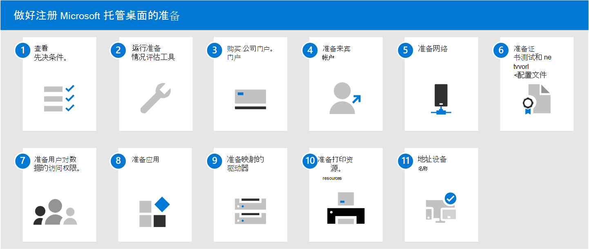

# 做好注册 Microsoft 托管桌面的准备

这些主题介绍了在组织中进行注册准备所需执行的步骤，包括检查环境是否满足关键先决条件、配置网络、设置证书，以及准备要包含在该服务中的应用。 运行准备情况评估工具后，可以按任意顺序或并行完成其他步骤。 根据你的环境，某些步骤可能并不相关。

1. 查看 [托管桌面应用](prerequisites.md)。
2. 运行 [准备情况评估工具](readiness-assessment-tool.md)。
1. 购买 [公司门户](../get-started/company-portal.md)。
1. 查看 [来宾帐户的先决条件](guest-accounts.md)。
1. 检查 [网络配置](network.md)。
1. [准备证书和网络配置文件](certs-wifi-lan.md)。
1. [准备用户对数据的访问权限](authentication.md)。
1. [准备应用](apps.md)。
1. [准备映射的驱动器](mapped-drives.md)。
1. [准备打印资源](printing.md)。
1. 地址 [设备名称](address-device-names.md)。
