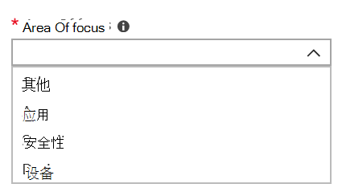

# 在管理门户中添加和验证管理员联系人

有多种方式可以Microsoft 托管桌面与客户通信。 为了简化通信并确保我们正在与合适的人员联系，你必须提供一组管理员联系人。 Microsoft 托管桌面 IT 运营部门将联系这些人员，以寻求解决问题的帮助。

> [!IMPORTANT]
> 你可能已经在管理门户中添加了这些联系人。 如果是这样，请立即仔细检查联系人列表是否准确，因为Microsoft 托管桌面发生严重事件时必须能够联系他们。 

## 管理员重点关注的联系人区域

管理员联系人应该是可以回答问题并针对不同关注领域做出决策的最佳人员或组。 **Microsoft 托管桌面操作将联系这些管理员联系人，询问客户提出的支持请求。** 这些管理员联系人将收到支持请求更新和新邮件的通知。 这些方面包括：

| 焦点区域 | 有关 |
| ----- | ----- |
| 应用打包 | 应用打包疑难解答。 |
| 设备 | 设备运行状况，使用Microsoft 托管桌面疑难解答。 |
| 安全性 | 解决设备Microsoft 托管桌面问题。 |
| IT 技术支持 | 如果支持人员在支持区域外Microsoft 托管桌面票证。 |
| 其他 | 对于其他方面未涵盖的问题。 |

> [!IMPORTANT]
> **无论为这些联系人选择谁，都必须有知识和权威来为Microsoft 托管桌面决策。**

当你载入你的Microsoft 托管桌面环境时，系统将提示你为本地支持人员和安全添加联系人。

提交支持请求时需要 [管理员联系人](../service-description/support.md)。 你必须有一个管理员联系人来联系支持请求的重点关注区域。

**添加管理员联系人：**

1. 登录到 [Microsoft Endpoint Manager。](https://endpoint.microsoft.com)
1. 在 **"租户管理**"**下的"Microsoft 托管桌面** 部分，选择 **"管理员联系人"**。
1. 选择“**添加**”。
1. 选择 **一个焦点区域** ，然后输入联系人的信息。

    

1. 对每个焦点区域重复上述步骤。

## 开始使用 Microsoft 托管桌面

1. 访问 [管理员门户](access-admin-portal.md)。
1. 在管理门户中添加和验证管理员 (本文) 。
1. [注册后调整设置](conditional-access.md)。
1. 部署并分配 [Intune 公司门户](company-portal.md)。
1. [分配许可证](assign-licenses.md)。
1. [部署应用](deploy-apps.md)。
1. [设置设备](set-up-devices.md)。
1. 设置 [使用 Autopilot 和注册状态页的首次运行体验](esp-first-run.md)。
1. [启用用户支持功能](enable-support.md)。
1. [让用户做好使用设备的准备](get-started-devices.md)。
1. [开始使用应用控制](get-started-app-control.md)。
