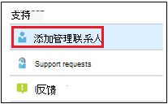

# 在管理门户中添加和验证管理员联系人Add and verify admin contacts in the Admin portal

Microsoft 托管桌面服务可以多种方式与客户进行通信。There are several ways that Microsoft Managed Desktop service communicates with customers. 为了简化通信并确保我们正在与合适的人员联系，你需要提供一组管理员联系人。To streamline communication and ensure we’re checking with the right people, you need to provide a set of admin contacts. Microsoft 托管桌面 IT 运营部门将联系这些人员，帮助解决租户的问题。Microsoft Managed Desktop IT Operations will contact these people for assistance troubleshooting issues for your tenant.

> [!IMPORTANT]
> 你可能已经在管理门户中添加了这些联系人。You might have already added these contacts in the Admin portal. 如果是这样，请立即仔细检查联系人列表是否准确，因为发生严重事件时，Microsoft 托管桌面必须能够联系他们。 If so, take a moment now to double-check that the contact list is accurate, since Microsoft Managed Desktop **must** be able to reach them if a severe incident occurs.

## Microsoft 托管桌面管理门户的 Azure Active Directory 访问权限Azure Active Directory access for Microsoft Managed Desktop Admin portal

Microsoft 托管桌面管理门户要求访问该门户的用户具有以下 Azure Active Directory (AD) 角色之一：Microsoft Managed Desktop Admin portal requires that people accessing the portal have one of these Azure Active Directory (AD) roles:
- 全局管理员Global Administrator
- Intune 服务管理员Intune Service Administrator
- 全局读取者Global Reader
- 服务支持管理员Service Support Administrator

全局管理员必须是在 Microsoft 托管桌面中注册组织的人。The Global Administrator must be the one to enroll your organization in Microsoft Managed Desktop. 这五个角色在管理门户中具有相同的访问权限，可以启动和查看任务。All five roles have the same access within the Admin portal to initiate and view tasks. 有关在 Azure AD 中分配这些角色的信息，请参阅 [Azure Active Directory](/azure/active-directory/users-groups-roles/directory-assign-admin-roles)中的管理员角色权限。For more information on assigning these roles in Azure AD, see [Administrator role permissions in Azure Active Directory](/azure/active-directory/users-groups-roles/directory-assign-admin-roles). 

## 管理员重点关注的联系人区域Admin contact areas of focus

管理员联系人应该是可以回答问题并针对不同关注领域做出决策的最佳人员或组。Admin contacts should be the best person or group that can answer questions and make decisions for different areas of focus. **对于涉及客户提交的支持请求的问题，Microsoft 托管桌面操作将联系这些管理员联系人。****Microsoft Managed Desktop Operations will contact these Admin contacts for questions involving support requests filed by the customer.** 这些管理员联系人将收到支持请求更新和新邮件的通知。These Admin contacts will receive notifications for support request updates and new messages. 这些方面包括：These areas include:

焦点区域Area of focus | 有关For questions about
--- | ---
应用打包App packaging | 应用打包疑难解答Troubleshooting app packaging
设备Devices | 设备运行状况，Microsoft 托管桌面设备疑难解答Device health, troubleshooting with Microsoft Managed Desktop devices
安全性Security | Microsoft 托管桌面设备的安全问题疑难解答Troubleshooting security issues with Microsoft Managed Desktop devices
IT 技术支持IT help desk | 如果支持人员在 Microsoft 托管桌面支持区域之外接管用户票证in cases where our Support staff hands over user tickets outside of Microsoft Managed Desktop support areas 
其他Other | 对于其他方面未涵盖的问题For issues not covered by other areas

**为这些联系人选择的任何人都需要具备针对 Microsoft 托管桌面环境做出决策的知识和权威。****Whoever you choose for these contacts needs to have the knowledge and authority to make decisions for your Microsoft Managed Desktop environment.** 当你载入 Microsoft 托管桌面环境时，系统将提示你为本地支持人员和安全添加联系人。When you onboard your Microsoft Managed Desktop environment, you’re prompted to add contacts for your local Helpdesk and Security. 

提交支持请求时 [需要管理员联系人](../service-description/support.md)。Admin contacts are required when you [submit a Support request](../service-description/support.md). 你需要有一个管理员联系人来联系支持请求的重点关注区域。You’ll need to have an admin contact for the focus area of the Support request. 

**添加管理员联系人****To add admin contacts**

1.  登录到 [Microsoft 托管桌面管理门户](https://aka.ms/mwaasportal)。Sign in to [Microsoft Managed Desktop admin portal](https://aka.ms/mwaasportal). 

2.  在 **"支持"** 下，**选择"管理员联系人"。**Under **Support**, select **Admin contacts**. 

    

3. 选择“**添加**”。Select **Add**.

    

4.  选择 **一个焦点区域** ，然后输入联系人的信息。Select an **Area of focus** and enter the info for the contact. 

    

5. 对每个焦点区域重复上述步骤。Repeat for each area of focus. 

## Microsoft 托管桌面入门步骤Steps to get started with Microsoft Managed Desktop

1. 在管理门户中添加和验证管理员 (本主题) Add and verify admin contacts in the Admin portal (this topic)
2. [调整条件访问Adjust conditional access](conditional-access.md)
3. [分配许可证Assign licenses](assign-licenses.md)
4. [在设备上安装 Intune 公司门户Install Intune Company Portal on on devices](company-portal.md)
5. [启用企业状态漫游Enable Enterprise State Roaming](enterprise-state-roaming.md)
6. [设置 Microsoft 托管桌面设备Set up Microsoft Managed Desktop devices](set-up-devices.md)
7. [为用户做好使用设备的准备Get your users ready to use devices](get-started-devices.md)
8. [将应用部署到设备Deploy apps to devices](deploy-apps.md)