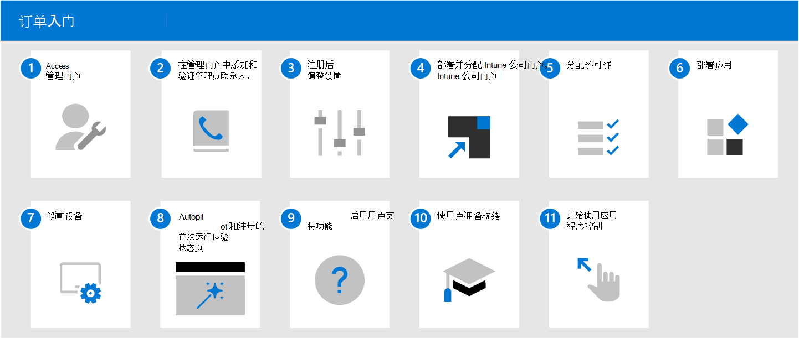

# Microsoft 托管桌面入门

既然已准备好注册，请打开“[Microsoft Endpoint Manager](https://endpoint.microsoft.com/)”，并导航到“**租户管理**”。 在“**Microsoft 托管桌面**”子节下选择“**租户注册**”，然后按照向导在 Microsoft 托管桌面注册租户。

> [!NOTE]
> 必须以全局管理员身份登录才能完成注册。 有关详细信息，请参阅 [访问管理员门户](access-admin-portal.md) 部分以获取详细信息。

注册完成后，请按照以下步骤配置服务。 这是推荐的执行顺序，但你也可以进行一些灵活调整。

 

1. 访问 [管理员门户](access-admin-portal.md)。
1. [在管理门户中添加和验证管理员联系人](add-admin-contacts.md)。
1. [注册后调整设置](conditional-access.md)。
1. 部署并分配 [Intune 公司门户](company-portal.md)。
1. [分配许可证](assign-licenses.md)。
1. [部署应用](deploy-apps.md)。
1. [设置设备](set-up-devices.md)。
1. 设置 [使用 Autopilot 和注册状态页的首次运行体验](esp-first-run.md)。
1. [启用用户支持功能](enable-support.md)。
1. [让用户做好使用设备的准备](get-started-devices.md)。
1. [开始使用应用控制](get-started-app-control.md)。