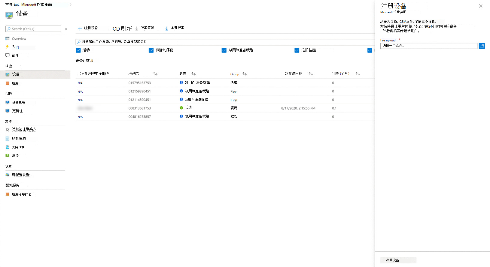

# 自行注册新设备

Microsoft 托管桌面全新的设备，或者你可以重复使用你可能已有的设备。 如果你重复使用设备，则必须重新映像处理它们。 可以在应用门户中向Microsoft 托管桌面注册Microsoft Endpoint Manager设备。

> [!NOTE]
> 与合作伙伴合作获取设备 如果是这样，你无需担心获取硬件哈希;他们会负责你。 请确保你的合作伙伴在合作伙伴中心与你 [建立关系](https://partner.microsoft.com/dashboard)。 你的合作伙伴可以在合作伙伴中心 [帮助中了解更多信息](/partner-center/request-a-relationship-with-a-customer)。 建立此关系后，你的合作伙伴将仅代表你注册设备，无需你执行任何进一步的操作。 如果你希望查看详细信息，或者你的合作伙伴有疑问，请参阅合作伙伴 [注册设备的步骤](register-devices-partner.md)。 注册设备后，你可以继续 [检查](#check-the-image) 映像，将设备 [传送](#deliver-the-device) 给用户。

## 准备注册全新的设备

拥有新设备后，你将按照以下步骤操作：

1. [获取每台设备的硬件哈希。](#obtain-the-hardware-hash)
2. [合并哈希数据](#merge-hash-data)。
3. [在设备上注册Microsoft 托管桌面](#register-devices-by-using-the-admin-portal)。
4. [仔细检查图像是否正确。](#check-the-image)
5. [交付设备](#deliver-the-device)。

### 获取硬件哈希

Microsoft 托管桌面通过引用其硬件哈希来唯一标识每台设备。 有三个选项可获取此信息。

**若要获取硬件哈希：：**

- 请你的 OEM 供应商提供 AutoPilot 注册文件，该文件将包含硬件哈希。
- 在每个[Windows PowerShell运行](#powershell-script-method)一个脚本，并收集文件中的结果。
- 启动每台设备，但不完成Windows安装体验，并收集可移动闪存[驱动器上的哈希](#flash-drive-method)。

#### PowerShell 脚本方法

可以使用 PowerShell [ 库Get-WindowsAutoPilotInfo.ps1](https://www.powershellgallery.com/packages/Get-WindowsAutoPilotInfo) 上的 PowerShell 脚本。 有关设备标识和硬件哈希的信息，请参阅[向 Autopilot Windows设备](/mem/autopilot/add-devices#device-identification)。

**若要使用 Powershell 脚本方法：**

1. 使用管理权限打开 PowerShell 提示符。
2. 运行 `Install-Script -Name Get-WindowsAutoPilotInfo`。
3. 运行 `powershell -ExecutionPolicy Unrestricted Get-WindowsAutoPilotInfo -OutputFile <path>\hardwarehash.csv`。
4. 运行 `powershell -ExecutionPolicy restricted` 以防止后续不受限制的脚本运行。

#### Flash drive 方法

**若要使用闪存驱动器方法，请执行以下操作：**

1. 在注册设备外的其他设备上，插入 USB 驱动器。
2. 使用管理权限打开 PowerShell 提示符。
3. 运行 `Save-Script -Name Get-WindowsAutoPilotInfo -Path <pathToUsb>`
4. 打开你要注册的设备，但不 *启动设置体验*。 如果意外启动设置体验，必须重置或重置设备映像。
5. 插入 USB 驱动器，然后按 Shift + F10。
6. 使用管理权限打开 PowerShell 提示符，然后运行 `cd <pathToUsb>`。
7. 运行 `Set-ExecutionPolicy -ExecutionPolicy Unrestricted`
8. 运行 `.\Get-WindowsAutoPilotInfo -OutputFile <path>\hardwarehash.csv`
9. 删除 USB 驱动器，然后通过运行来关闭设备 `shutdown -s -t 0`

> [!IMPORTANT]
> 完成注册之前，请勿再次打开要注册的设备。

### 合并哈希数据

你需要将 CSV 文件中的数据合并到单个文件中才能完成注册。 下面是一个简单易行的示例 PowerShell 脚本：

`Import-CSV -Path (Get-ChildItem -Filter *.csv) | ConvertTo-Csv -NoTypeInformation | % {$_.Replace('"', '')} | Out-File .\aggregatedDevices.csv`

> [!NOTE]
> 不支持其他列。 不支持引号。 只有 ANSI 格式的文本文件才能 (Unicode) 。 标头区分大小写。 由于这些要求，Excel文件并另存为 CSV 文件不会生成可用文件。 请确保在设备序列号中保留任何前导零。

### 使用管理门户注册设备

In [Microsoft Endpoint Manager](https://endpoint.microsoft.com/)， select **Devices** in the left navigation pane. 在"Microsoft 托管桌面部分中，选择 **"设备"**。 在Microsoft 托管桌面设备"工作区中，选择 **" +** 注册设备"，这将打开一个飞入以注册新设备。

<!--  -->

<!--Registering any existing devices with Managed Desktop will completely re-image them; make sure you've backed up any important data prior to starting the registration process.-->

**若要使用管理门户注册设备：**

1. 在 **"文件** 上载"中，提供之前创建的 CSV 文件的路径。
2. 在 [下拉菜单中选择](../service-description/profiles.md) 设备配置文件。
3. 选择 **注册设备**。 系统将设备添加到设备上标记为"正在 **注册"****的设备列表**。 注册通常少于 10 分钟，并且成功后，设备将显示为"为用户准备就绪"，这意味着它已准备好并等待用户开始使用。

> [!NOTE]
> 如果手动更改Azure Active Directory (AAD) 组成员身份，系统会自动将其重新分配给设备配置文件的组，并删除任何冲突组。

你可以监视主页上的设备注册进度。 报告的可能状态包括：

| 状态 | 说明 |
| -----|-----|
| Registration Pending | 注册尚未完成。 请稍后再查看。 |
| 注册失败 | 无法完成注册。 有关详细信息，请参阅 [设备注册疑难解答](#troubleshooting-device-registration)。 |
| 为用户准备就绪 | 注册成功。 设备现在已准备好传递给用户。 Microsoft 托管桌面指导用户完成首次设置，因此无需执行任何进一步准备。 |
| 活动 | 设备已传递给用户，并且已在租户中注册。 此状态还指示他们定期使用设备。 |
| 非活动 | 设备已传递给用户，并且已在租户中注册。 但是，他们最近七天内 (使用过该设备) 。  |

#### 设备注册疑难解答

| 错误消息 | 详细信息 |
|-----| ----- |
| 未找到设备 | 我们无法注册此设备，因为找不到提供的制造商、型号或序列号的匹配项。 与设备供应商确认这些值。 |
| 硬件哈希无效 | 你为此设备提供的硬件哈希格式不正确。 仔细检查硬件哈希，然后重新提交。 |
| 设备已注册 | 此设备已注册到你的组织。 无需执行其他操作。 |
| 由另一个组织声明的设备 | 此设备已被另一个组织声明。 请与设备供应商联系。 |
| 意外错误 | 无法自动处理你的请求。 联系支持人员并提供请求 ID： `<requestId>` |

### 检查图像

如果你的设备来自合作伙伴Microsoft 托管桌面，则映像应该正确。

如果愿意，也欢迎您自行应用该图像。 To get started， contact the Microsoft representative you're working with. 代表将向您提供应用图像的位置和步骤。

### Autopilot 组标记

当你使用管理门户注册设备时，我们会自动分配与使用合作伙伴中心注册设备中列出的设备配置文件相关联的 Autopilot [组标记](register-devices-partner.md)。
该服务每天监视Microsoft 托管桌面设备，并将组标记分配给任何尚未拥有该组标记的设备。

### 交付设备

> [!IMPORTANT]
> 在将设备交还给用户之前，请确保你已获取并应用了 [该用户的适当许可证](../get-ready/prerequisites.md) 。

如果应用所有许可证，你可以 [让用户准备好使用设备](get-started-devices.md)。 然后，你的用户可以启动设备并继续执行Windows设置体验。
