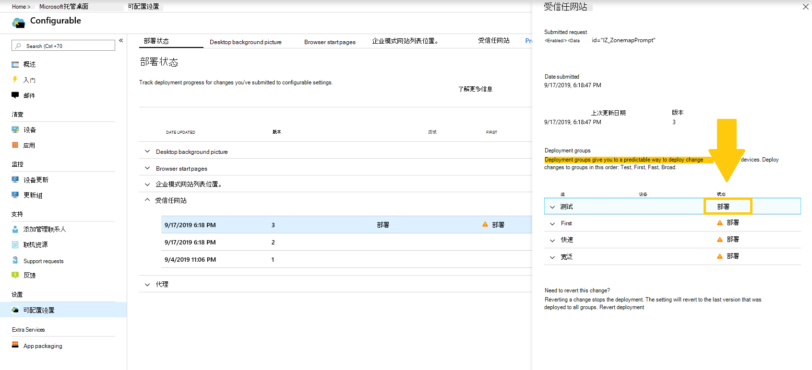
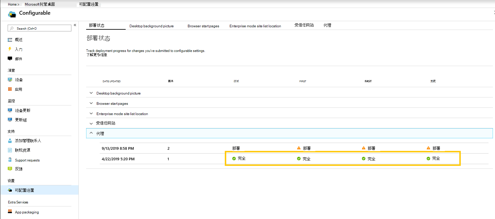
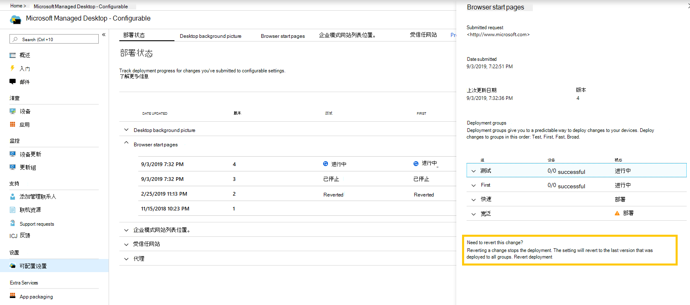

# 部署和跟踪可配置设置 - Microsoft 托管桌面

对设置类别进行更改并部署后，"部署状态"页允许您开始将设置部署到组。 此页面显示每个可配置设置的摘要。 打开设置类别时，可以将设置部署到组并跟踪这些部署的进度。

## 部署状态

以下是你将看到的每个部署的状态。

状态 | 说明
--- | ---
部署 | 您的更改正在等待部署到此组。
正在进行 | 更改将应用于此组的活动设备。
完成 | 此组中所有活动设备上完成更改。
已失败 | 更改在组中 10% 的活动设备上失败。 部署已停止。   将自动打开支持请求，Microsoft 托管桌面操作对部署进行疑难解答。
已还原 | 更改已还原为已成功部署到所有部署组的最后一个更改。

## 部署更改

例如，在这些说明中，我们将使用桌面背景图片。 在部署阶段后，从"部署状态"页部署更改。

**部署更改：**

1. 登录到"[Microsoft Endpoint Manager](https://endpoint.microsoft.com/)并导航到 **"设备"** 菜单。
2. 在"Microsoft 托管桌面部分中，选择"设置 **"**。
3. 在 **"部署状态** "工作区中，选择要部署的设置。 然后，选择要部署的分步部署。
4. 选择 **"** 部署"将更改部署到其中一个部署组。

> [!NOTE]
> 橙色警告图标表示有上一个组可供部署，建议按顺序排列。

<!-- Needs picture updated to show MEM  -->

我们建议按此顺序部署到部署组：Test、First、Fast 和 Broad。

在每个组中完成更改后，状态将更改为 **"完成"**。

<!-- Needs picture updated to show MEM  -->

## 还原部署

部署更改后，可以恢复部署 **状态**。 当还原为"正在进行"或"已完成 **"** 更改 **时，当前** 部署将停止。 该设置将恢复为部署到所有组的上一版本。

例如，我们将还原桌面背景图片。

**还原更改：**

1. 登录到"[Microsoft Endpoint Manager](https://endpoint.microsoft.com/)并导航到 **"设备"** 菜单。
2. 在"Microsoft 托管桌面部分中，选择"设置 **"**。
3. 在 **"部署状态** "工作区中，选择要还原的设置。 然后，选择要还原的分步部署。
4. 在 **"需要还原此更改？"下，** 选择" **还原部署"**。

<!-- Needs picture updated to show MEM  -->

## 其他资源

- [可配置的设置概述](config-setting-overview.md)
- [可配置设置参考](config-setting-ref.md)
