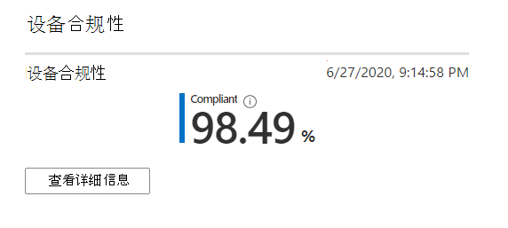
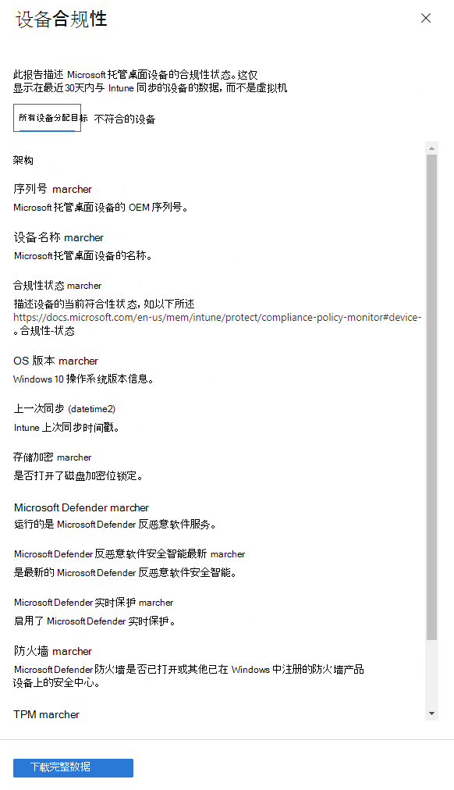

# 设备合规性报告Device compliance report

此视图显示符合 Microsoft Intune 中设置的合规性策略的 Microsoft 托管桌面设备的百分比。This view shows the percentage of your Microsoft Managed Desktop devices that conform to compliance policies set in Microsoft Intune.

选择 "**查看详细信息**" 以查看所有 Microsoft 托管桌面设备或不符合合规性策略的设备的特定信息。Select **View details** to view specific information for either all of your Microsoft Managed Desktop devices or only devices that do not conform to compliance policies. 使用下拉菜单在这些视图之间切换。Use the pulldown menu to switch between these views. 若要在此视图中显示，设备必须是物理计算机，并且已在最近30天内与 Intune 同步。To appear in this view, a device must be a physical machine and have synced with Intune in the last 30 days.

在此视图中，选择 "**下载完整数据**" 以导出具有相同信息的逗号分隔文件。From this view, select **Download full data** to export a comma-delimited file with the same information. 在导出文件中，作为**架构**显示的区域将显示为列。In the export file, the areas displayed as **Schema** appear as columns.