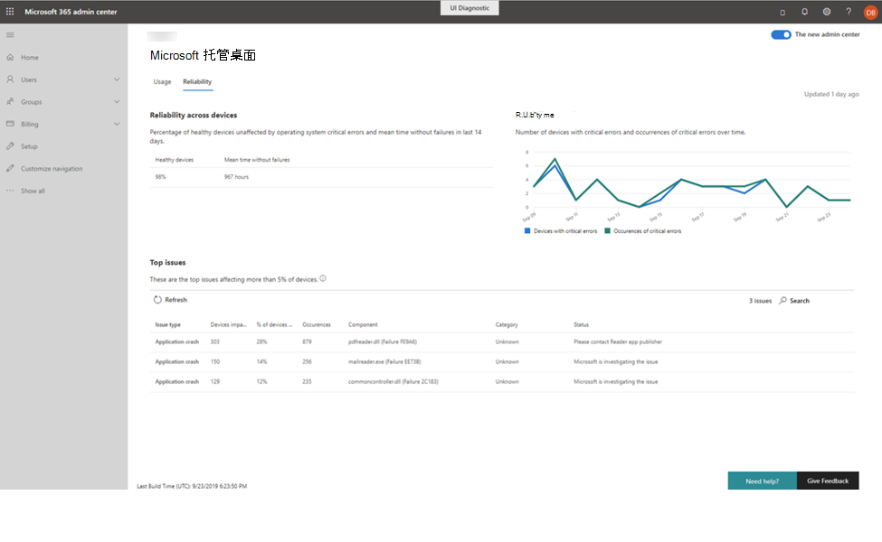

# 可靠性见解

此视图为你提供托管设备的运行状况摘要。 若要查看可靠性数据，请选择 "**可靠性**" 选项卡。

"**跨设备的可靠性**" 部分通过报告被视为 "正常" 的设备的百分比以及自上次报告失败后观测到的平均时间，在最近14天中提供了部署的快速运行状况摘要。 

 
根据时间，右侧的**可靠性**图表将报告发生严重错误的设备数以及观测到的严重错误总数。

"**热门问题**" 部分详细介绍了影响至少5% 托管设备的特定检测到的问题。 报告的详细信息包括：

- 问题的类型
    - 应用程序崩溃，应用程序在其中停止运行或意外停止
    - 应用程序挂起，应用程序在其中停止对输入的响应
    - 严重错误，在 Windows 遇到无法恢复的问题时发生
- 受同一问题影响的设备数量
- 该数字代表的受管理设备的百分比
- 特定问题的总次数
- 似乎是问题源的软件组件
- 检测到的问题的类别：
    - 浏览器（边缘、Chrome、IE）
    - 未知（非 Microsoft 组件）
    - 驱动程序（音频、图形或其他驱动程序）
    - 生产率（可宽延时间、G 套件、Microsoft Office 及其加载项或扩展、团队）
    - 媒体（图像、音乐或视频应用程序
    - 安全性（Windows 安全组件）
- 当前状态为 Microsoft 托管桌面操作调查和 remediates 问题

