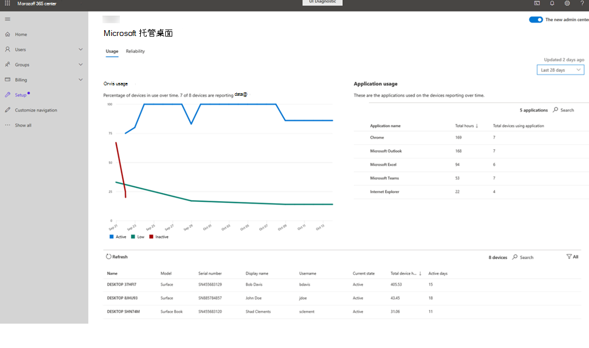

# 使用情况见解
此视图提供设备使用情况Microsoft 托管桌面指标。 出于这些目的，如果应用正在运行且具有焦点，则该应用将被视为"使用中"。

若要查看使用率数据，请选择"使用率 **"** 选项卡。

## 设备使用情况

在 **"设备使用情况** "区域中，我们显示一段时间的报告设备的使用情况级别，以及报告数据的已注册设备数。 对于此页上显示的所有数据，可以使用右上角的下拉菜单更改查看过去 14 天或 28 天内报告的数据的间隔。

我们使用以下术语对使用级别进行分类：

- **活动：** 使用时间至少为 55 小时
- **低：** 使用时间介于 8 到 55 小时之间
- **非活动** ：使用时间少于 8 小时

## 应用程序使用情况

**"应用程序** 使用"区域详细介绍了应用程序的使用顺序以及托管设备的使用时间。 它还显示使用给定应用程序的托管设备的总数。 选择 **"** 搜索"以查找尚未列出的特定应用程序。

## 设备详细信息
详细信息区域提供有关特定设备的信息，包括设备总小时数和一段时间的活动天数。 使用筛选器将视图限制为具有"活动"、"非活动"或"低"使用模式的设备或"非报告"设备。 
