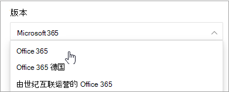

# Microsoft 365 文档导航指南Microsoft 365 docs navigation guide

本主题提供有关导航 Microsoft 365 技术文档空间的一些提示和技巧。This topic provides some tips and tricks for navigating the Microsoft 365 technical documentation space.  

## 中心页面Hub page

可在以下位置找到 Microsoft 365 中心页面，它是查找相关 [https://aka.ms/microsoft365docs](https://aka.ms/microsoft365docs) Microsoft 365 内容的入口点。The Microsoft 365 hub page can be found at [https://aka.ms/microsoft365docs](https://aka.ms/microsoft365docs) and is the entry point for finding relevant Microsoft 365 content.

始终可以通过从 **Microsoft 365** 技术文档集内每个页面顶部的标头中选择 Microsoft 365，导航回此页面：You can always navigate back to this page by selecting **Microsoft 365** from the header at the top of every page within the Microsoft 365 technical documentation set:

## 脱机文档Offline documentation

如果你想要在脱机系统上查看 Microsoft 365 文档，可以在 Microsoft 365 技术文档中的何处创建 PDF。If you would like to view the Microsoft 365 documentation on an offline system, you can create a PDF wherever you are in the Microsoft 365 technical documentation.

如果要创建 PDF，请选择每个目录底部的"下载 **PDF"** 链接。If you'd like to create a PDF, select the **Download PDF** link found at the bottom of every table of contents.

## TOC 搜索TOC search 
在docs.microsoft.com，您可以使用顶部的筛选器搜索框搜索目录内容：On docs.microsoft.com, you can search the content in the table of contents by using the filter search box at the top:

## 版本筛选器Version filter
Microsoft 365 技术文档提供了其他产品的内容，包括 Office 365 Germany 和由中国世纪 (运营的 Office 365) 。The Microsoft 365 technical documentation provides content for additional products, including Office 365 Germany and Office 365 operated by 21 Vianet (China). 这些版本之间的功能可能会有所不同，因此，有时内容本身可能会有所不同。Features can vary between these versions, and as such, sometimes the content itself can vary.

可以使用版本筛选器来确保看到适用于相应版本的 Microsoft 365 的内容：You can use the version filter to ensure that you are seeing content for the appropriate version of Microsoft 365:

## 痕迹导航Breadcrumbs

痕迹导航可在目录的标题下方和上方找到，并指示当前文章在目录下的位置。Breadcrumbs can be found below the header and above the table of contents, and indicate where the current article is located in the table of contents.  这不仅有助于将上下文设置为您读取的内容类型，还允许您导航到目录树的备份：Not only does this help set the context to what type of content you're reading, but it also allows you to navigate back up the table of contents tree:

## 文章节导航Article section navigation

借助右侧导航窗格，您可以快速导航到文章中的各个部分，并标识在文章中的位置。The right-hand navigation pane allows you to quickly navigate to sections within an article, as well as identify your location within the article.  

## 提交文档反馈Submit docs feedback

如果在文章中发现错误，可以通过向下滚动到页面底部并选择内容反馈，将反馈提交给该文章的 SQL 内容 **团队**。If you find something wrong within an article, you can submit feedback to the SQL Content team for that article by scrolling down to the bottom of the page and selecting **Content feedback**.

## 参与 Microsoft 365 文档Contribute to Microsoft 365 documentation

你是否知道可以自己编辑docs.microsoft.com内容？Did you know that you could edit the content on docs.microsoft.com yourself? 如果你这样做，我们的文档不仅会改进，而且你还将作为页面参与者进行信用额度。If you do so, not only will our documentation improve, but you'll also be credited as a contributor to the page. 若要开始，请参阅：To get started, see:

- [Microsoft Docs 参与者指南Microsoft Docs contributor guide](https://docs.microsoft.com/contribute/)

## 后续步骤Next steps

- Microsoft [365 技术文档入门](index.yml)。Get started with the [Microsoft 365 technical documentation](index.yml).
